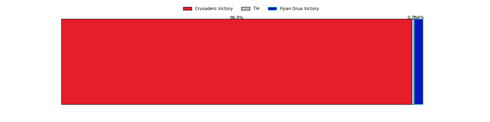
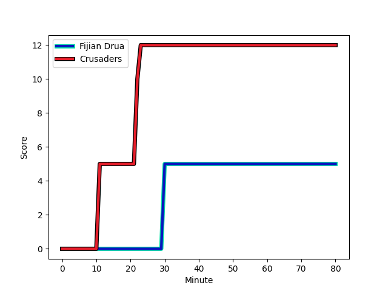
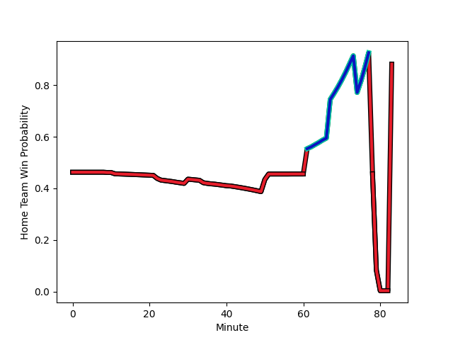

---  
layout: page  
title: Crusaders at Fijian Drua; 12.0-5.0  
date: 2023-03-10 22:35:00 18:00:00 -0500  
categories: match review  
---
# Crusaders at Fijian Drua; 12.0-5.0

# Club Level Predictions

The first set of predictions treats a club as the smallest object, as the club develops its members, organizes a gameplan, and deploys its players as needed for each match. This club model has a prediction of 0.169, which translates to predicting Crusaders to win by 14.5.

Each club has a rating and a rating deviation (simiar to a Glicko system), and expected performances can be generated. This allows for simulated matches and spreads like the ones below.
## Projected Performances

## Projected Spreads

## Projected Results

# Player Level Predictions

Treating teams instead as an entity made up of the currently active players, I have ratings for each player in an altogether different system. These can be combined to form team ratings once teamsheets are announced, weighting starters a bit higher than the reserves. After the match is played, players can be weighted by their minutes on the field, allowing for an accurate measure of the team's composition. With these compiled team ratings, we can make predictions, measure inaccuracy, and update the individual player ratings.
## Prediction with Player Minutes: Crusaders by 2.2

Crusaders by 6.2 on a neutral field
## Scores over Time

## Win Probability over Time

There were 5 large changes in win probability in this match
## Prediction without Player Minutes: Crusaders by 1.2

Crusaders by 5.2 on a neutral pitch

|   Away Minutes | Away Player                                                               |   Away elo |   Away Percentile |   Number |   Home Percentile |   Home elo | Home Player                                                                  |   Home Minutes |
|---------------:|:--------------------------------------------------------------------------|-----------:|------------------:|---------:|------------------:|-----------:|:-----------------------------------------------------------------------------|---------------:|
|             80 | [George Bower](..//playerfiles//GeorgeBower_cleaned.md)                   |      95.29 |               nan |        1 |               nan |      95    | [Meli Tuni](..//playerfiles//MeliTuni_cleaned.md)                            |             41 |
|             80 | [Quentin MacDonald](..//playerfiles//QuentinMacDonald_cleaned.md)         |      95    |               nan |        2 |                47 |      93.29 | [Tevita Ikanivere](..//playerfiles//TevitaIkanivere_cleaned.md)              |             80 |
|             80 | [Tamaiti Williams](..//playerfiles//TamaitiWilliams_cleaned.md)           |      97.9  |                62 |        3 |                64 |      98.65 | [Jone Koroiduadua](..//playerfiles//JoneKoroiduadua_cleaned.md)              |             34 |
|             80 | [Scott Barrett](..//playerfiles//ScottBarrett_cleaned.md)                 |      96.82 |                56 |        4 |                30 |      89.08 | [Isoa Nasilasila](..//playerfiles//IsoaNasilasila_cleaned.md)                |             80 |
|             80 | [Sam Whitelock](..//playerfiles//SamWhitelock_cleaned.md)                 |     102.73 |                71 |        5 |                46 |      93.65 | [Ratu Rotuisolia](..//playerfiles//RatuRotuisolia_cleaned.md)                |             41 |
|             80 | [Sione Havili](..//playerfiles//SioneHavili_cleaned.md)                   |      97.22 |               nan |        6 |                41 |      91.67 | [Joseva Tamani](..//playerfiles//JosevaTamani_cleaned.md)                    |             80 |
|             80 | [Tom Christie](..//playerfiles//TomChristie_cleaned.md)                   |      95.77 |                53 |        7 |                35 |      90.06 | [Kitione Salawa](..//playerfiles//KitioneSalawa_cleaned.md)                  |             80 |
|             70 | [Christian Lio-Willie](..//playerfiles//ChristianLio-Willie_cleaned.md)   |      94.33 |                45 |        8 |               nan |      92.87 | [Elia Canakaivata](..//playerfiles//EliaCanakaivata_cleaned.md)              |             80 |
|             80 | [Willi Heinz](..//playerfiles//WilliHeinz_cleaned.md)                     |      92.22 |               nan |        9 |                38 |      90.81 | [Frank Lomani](..//playerfiles//FrankLomani_cleaned.md)                      |             80 |
|             80 | [Fergus Burke](..//playerfiles//FergusBurke_cleaned.md)                   |     101.68 |                68 |       10 |                61 |      94.74 | [Teti Tela](..//playerfiles//TetiTela_cleaned.md)                            |             80 |
|             22 | [Macca Springer](..//playerfiles//MaccaSpringer_cleaned.md)               |      96.37 |               nan |       11 |               nan |      95    | [Eroni Sau](..//playerfiles//EroniSau_cleaned.md)                            |             80 |
|              9 | [David Havili](..//playerfiles//DavidHavili_cleaned.md)                   |      93.36 |                43 |       12 |               nan |      95    | [Apisalome Vota](..//playerfiles//ApisalomeVota_cleaned.md)                  |             80 |
|             80 | [Braydon Ennor](..//playerfiles//BraydonEnnor_cleaned.md)                 |      95.46 |                29 |       13 |                32 |      89.66 | [Iosefo Masi](..//playerfiles//IosefoMasi_cleaned.md)                        |             80 |
|             80 | [Sevu Reece](..//playerfiles//SevuReece_cleaned.md)                       |      95.77 |                52 |       14 |                34 |      90.06 | [Selestino Ravutaumada](..//playerfiles//SelestinoRavutaumada_cleaned.md)    |             80 |
|             80 | [Chay Fihaki](..//playerfiles//ChayFihaki_cleaned.md)                     |      95    |               nan |       15 |                39 |      90.06 | [Ilaisa Droasese](..//playerfiles//IlaisaDroasese_cleaned.md)                |             80 |
|              0 | [Ioane Moananu](..//playerfiles//IoaneMoananu_cleaned.md)                 |      95    |               nan |       16 |               nan |      95    | [Mesulame Dolokoto](..//playerfiles//MesulameDolokoto_cleaned.md)            |              0 |
|              0 | [Kershawl Sykes-Martin](..//playerfiles//KershawlSykes-Martin_cleaned.md) |      95    |               nan |       17 |                60 |      97.67 | [Emosi Tuqiri](..//playerfiles//EmosiTuqiri_cleaned.md)                      |             39 |
|              0 | [Seb Calder](..//playerfiles//SebCalder_cleaned.md)                       |      97.22 |               nan |       18 |                21 |      86.41 | [Samuela Tawake](..//playerfiles//SamuelaTawake_cleaned.md)                  |             46 |
|              0 | [Zach Gallagher](..//playerfiles//ZachGallagher_cleaned.md)               |      95.57 |               nan |       19 |                42 |      93.05 | [Te Ahiwaru Cirikidaveta](..//playerfiles//TeAhiwaruCirikidaveta_cleaned.md) |             39 |
|             10 | [Corey Kellow](..//playerfiles//CoreyKellow_cleaned.md)                   |      95    |               nan |       20 |               nan |      95    | [Ratu Meli Derenalagi](..//playerfiles//RatuMeliDerenalagi_cleaned.md)       |              0 |
|              0 | [Noah Hotham](..//playerfiles//NoahHotham_cleaned.md)                     |      97.9  |               nan |       21 |               nan |      94.24 | [Peni Matawalu](..//playerfiles//PeniMatawalu_cleaned.md)                    |              0 |
|             58 | [Taha Kemara](..//playerfiles//TahaKemara_cleaned.md)                     |      95    |               nan |       22 |               nan |      95    | [Kemu Valentini](..//playerfiles//KemuValentini_cleaned.md)                  |              0 |
|             71 | [Dallas McLeod](..//playerfiles//DallasMcLeod_cleaned.md)                 |      95    |               nan |       23 |                45 |      93.77 | [Kalaveti Ravouvou](..//playerfiles//KalavetiRavouvou_cleaned.md)            |              0 |

