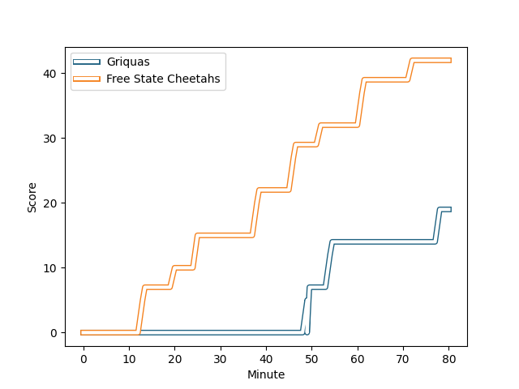
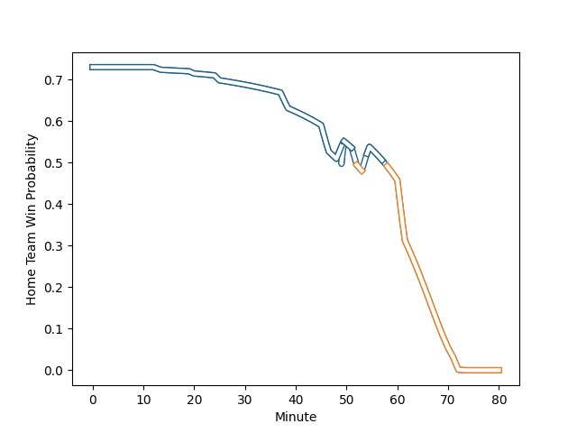

---  
layout: page  
title: Free State Cheetahs at Griquas; 42-19  
date: 2023-03-10 15:00:00 18:00:00 -0500  
categories: match review  
---
# Free State Cheetahs at Griquas; 42-19

# Club Level Predictions

The first set of predictions treats a club as the smallest object, as the club develops its members, organizes a gameplan, and deploys its players as needed for each match. This club model has a prediction of 0.557, which translates to predicting Griquas to win by 2.1.

Each club has a rating and a rating deviation (simiar to a Glicko system), and expected performances can be generated. This allows for simulated matches and spreads like the ones below.
## Projected Performances

## Projected Spreads

## Projected Results

# Player Level Predictions

Treating teams instead as an entity made up of the currently active players, I have ratings for each player in an altogether different system. These can be combined to form team ratings once teamsheets are announced, weighting starters a bit higher than the reserves. After the match is played, players can be weighted by their minutes on the field, allowing for an accurate measure of the team's composition. With these compiled team ratings, we can make predictions, measure inaccuracy, and update the individual player ratings.
## Prediction with Player Minutes: Griquas by 14.4

Griquas by 10.4 on a neutral field
## Scores over Time

## Win Probability over Time

There were 7 large changes in win probability in this match
## Prediction without Player Minutes: Griquas by 14.4

Griquas by 10.4 on a neutral pitch

|   Away Minutes | Away Player                                                                    |   Away elo |   Away Percentile |   Number |   Home Percentile |   Home elo | Home Player                                                                |   Home Minutes |
|---------------:|:-------------------------------------------------------------------------------|-----------:|------------------:|---------:|------------------:|-----------:|:---------------------------------------------------------------------------|---------------:|
|             80 | [Schalk Ferreira](..//playerfiles//SchalkFerreira_cleaned.md)                  |      89.79 |                31 |        1 |                67 |      99.65 | [Kudzwai Dube](..//playerfiles//KudzwaiDube_cleaned.md)                    |             80 |
|             80 | [Marnus van der Merwe](..//playerfiles//MarnusvanderMerwe_cleaned.md)          |      94.89 |                50 |        2 |                43 |      92.35 | [Janco Uys](..//playerfiles//JancoUys_cleaned.md)                          |             80 |
|             80 | [Hencus van Wyk](..//playerfiles//HencusvanWyk_cleaned.md)                     |      95.7  |               nan |        3 |                68 |      99.81 | [Janu Botha](..//playerfiles//JanuBotha_cleaned.md)                        |             80 |
|             80 | [Rynier Mark Bernardo](..//playerfiles//RynierMarkBernardo_cleaned.md)         |      89.81 |                32 |        4 |               nan |      95    | [Albert Liebenberg](..//playerfiles//AlbertLiebenberg_cleaned.md)          |             80 |
|             80 | [Victor Kutlwano Sekekete](..//playerfiles//VictorKutlwanoSekekete_cleaned.md) |      86.17 |                23 |        5 |                35 |      90.66 | [Derrick Pretorius](..//playerfiles//DerrickPretorius_cleaned.md)          |             80 |
|             80 | [Gideon van der Merwe](..//playerfiles//GideonvanderMerwe_cleaned.md)          |     111.39 |                87 |        6 |                93 |     120.06 | [Niel Otto](..//playerfiles//NielOtto_cleaned.md)                          |             80 |
|             80 | [Friedle Olivier](..//playerfiles//FriedleOlivier_cleaned.md)                  |     126.26 |                96 |        7 |               nan |      96.02 | [Stephan Smit](..//playerfiles//StephanSmit_cleaned.md)                    |             80 |
|             80 | [Jeandre Rudolph](..//playerfiles//JeandreRudolph_cleaned.md)                  |      88.51 |                26 |        8 |               nan |      95    | [Janco Venter](..//playerfiles//JancoVenter_cleaned.md)                    |             80 |
|             80 | [Ruan Pienaar](..//playerfiles//RuanPienaar_cleaned.md)                        |      88.33 |                30 |        9 |                60 |      95.49 | [Johan Mulder](..//playerfiles//JohanMulder_cleaned.md)                    |             80 |
|             80 | [Reinhardt Fortuin](..//playerfiles//ReinhardtFortuin_cleaned.md)              |      85.3  |                20 |       10 |               nan |      95    | [Lubabalo Dobela](..//playerfiles//LubabaloDobela_cleaned.md)              |             80 |
|             80 | [Munier Hartzenberg](..//playerfiles//MunierHartzenberg_cleaned.md)            |      93.27 |                46 |       11 |               nan |      95    | [Luther Obi](..//playerfiles//LutherObi_cleaned.md)                        |             80 |
|             80 | [Francois Steyn](..//playerfiles//FrancoisSteyn_cleaned.md)                    |      95    |               nan |       12 |                64 |      99.74 | [Zander du Plessis](..//playerfiles//ZanderduPlessis_cleaned.md)           |             80 |
|             80 | [Robert Thompson Ebersohn](..//playerfiles//RobertThompsonEbersohn_cleaned.md) |      91.48 |                39 |       13 |                83 |     107.89 | [Sango (Saida) Xamlashe](..//playerfiles//Sango(Saida)Xamlashe_cleaned.md) |             80 |
|             80 | [Daniel Kasende Kalepula](..//playerfiles//DanielKasendeKalepula_cleaned.md)   |      79.02 |                12 |       14 |               nan |      95    | [Rosco Shane Specman](..//playerfiles//RoscoShaneSpecman_cleaned.md)       |             80 |
|             80 | [Tapiwa Lloyd Mafura](..//playerfiles//TapiwaLloydMafura_cleaned.md)           |      78.87 |                14 |       15 |               nan |     120.78 | [Jay Cee Nel](..//playerfiles//JayCeeNel_cleaned.md)                       |             80 |

