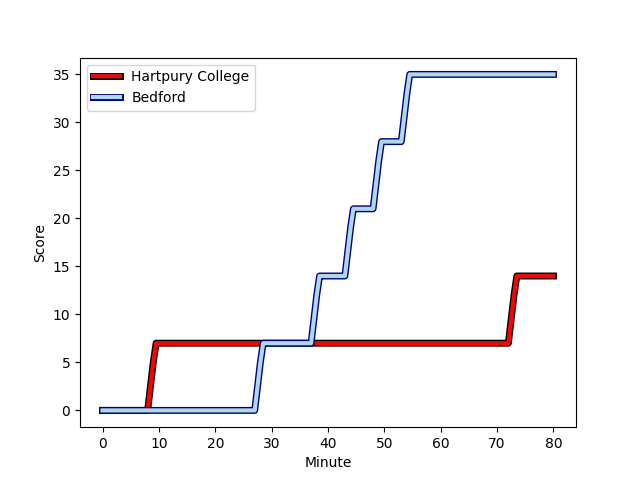
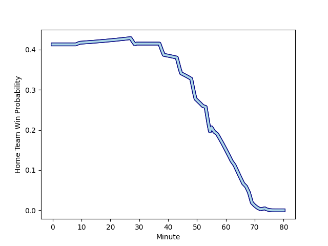

---  
layout: page  
title: Bedford at Hartpury College; 35-14  
date: 2023-03-10 20:45:00 18:00:00 -0500  
categories: match review  
---
# Bedford at Hartpury College; 35-14

# Club Level Predictions

The first set of predictions treats a club as the smallest object, as the club develops its members, organizes a gameplan, and deploys its players as needed for each match. This club model has a prediction of 0.635, which translates to predicting Hartpury College to win by 5.0.

Each club has a rating and a rating deviation (simiar to a Glicko system), and expected performances can be generated. This allows for simulated matches and spreads like the ones below.
## Projected Performances

## Projected Spreads

## Projected Results

# Player Level Predictions

Treating teams instead as an entity made up of the currently active players, I have ratings for each player in an altogether different system. These can be combined to form team ratings once teamsheets are announced, weighting starters a bit higher than the reserves. After the match is played, players can be weighted by their minutes on the field, allowing for an accurate measure of the team's composition. With these compiled team ratings, we can make predictions, measure inaccuracy, and update the individual player ratings.
## Prediction with Player Minutes: Bedford by 11.3

Bedford by 15.3 on a neutral field
## Scores over Time

## Win Probability over Time

There were 4 large changes in win probability in this match
## Prediction without Player Minutes: Bedford by 14.1

Bedford by 18.1 on a neutral pitch

|   Away Minutes | Away Player                                                   |   Away elo |   Away Percentile |   Number |   Home Percentile |   Home elo | Home Player                                                               |   Home Minutes |
|---------------:|:--------------------------------------------------------------|-----------:|------------------:|---------:|------------------:|-----------:|:--------------------------------------------------------------------------|---------------:|
|             67 | [Joey Conway](..//playerfiles//JoeyConway_cleaned.md)         |      97.85 |                61 |        1 |                55 |      96.32 | [Joe Wrafter](..//playerfiles//JoeWrafter_cleaned.md)                     |             63 |
|             67 | [James Fish](..//playerfiles//JamesFish_cleaned.md)           |      96.79 |               nan |        2 |                28 |      88.27 | [Will Tanner](..//playerfiles//WillTanner_cleaned.md)                     |             55 |
|             67 | [Oisin Heffernan](..//playerfiles//OisinHeffernan_cleaned.md) |      95.94 |                54 |        3 |                19 |      85.04 | [Jonathan Benz-Salomon](..//playerfiles//JonathanBenz-Salomon_cleaned.md) |             69 |
|             67 | [Robin Williams](..//playerfiles//RobinWilliams_cleaned.md)   |     109.85 |                86 |        4 |               nan |      94.18 | [Andrew Davies](..//playerfiles//AndrewDavies_cleaned.md)                 |             80 |
|             80 | [Luke Frost](..//playerfiles//LukeFrost_cleaned.md)           |     115.53 |                91 |        5 |                73 |     103.63 | [Dale Lemon](..//playerfiles//DaleLemon_cleaned.md)                       |             63 |
|             80 | [Kayde Sylvester](..//playerfiles//KaydeSylvester_cleaned.md) |      84.92 |                20 |        6 |                17 |      83.22 | [Sam Lewis](..//playerfiles//SamLewis_cleaned.md)                         |             80 |
|             53 | [Kieran Curran](..//playerfiles//KieranCurran_cleaned.md)     |      98.65 |                54 |        7 |                16 |      83.03 | [Oli Robinson](..//playerfiles//OliRobinson_cleaned.md)                   |             55 |
|             80 | [Tui Uru](..//playerfiles//TuiUru_cleaned.md)                 |      89.06 |                28 |        8 |                13 |      80.84 | [Joe Howard](..//playerfiles//JoeHoward_cleaned.md)                       |             80 |
|             76 | [Alex Day](..//playerfiles//AlexDay_cleaned.md)               |     127.87 |                98 |        9 |                92 |     113.43 | [Matty Jones](..//playerfiles//MattyJones_cleaned.md)                     |             80 |
|             67 | [William Maisey](..//playerfiles//WilliamMaisey_cleaned.md)   |     144.84 |                99 |       10 |                60 |      98.29 | [Tommy Mathews](..//playerfiles//TommyMathews_cleaned.md)                 |             80 |
|             80 | [Dean Adamson](..//playerfiles//DeanAdamson_cleaned.md)       |     103.12 |                73 |       11 |                68 |     101.14 | [Bradley Denty](..//playerfiles//BradleyDenty_cleaned.md)                 |             80 |
|             80 | [Joel Matavesi](..//playerfiles//JoelMatavesi_cleaned.md)     |      95    |               nan |       12 |                31 |      89.54 | [Will Butler](..//playerfiles//WillButler_cleaned.md)                     |             29 |
|             67 | [Ethan Grayson](..//playerfiles//EthanGrayson_cleaned.md)     |     108.42 |                84 |       13 |               nan |      94.29 | [Jack Bates](..//playerfiles//JackBates_cleaned.md)                       |             57 |
|             80 | [Sean French](..//playerfiles//SeanFrench_cleaned.md)         |      91.94 |                41 |       14 |                19 |      84.86 | [Matthew McNab](..//playerfiles//MatthewMcNab_cleaned.md)                 |             80 |
|             80 | [George Hendy](..//playerfiles//GeorgeHendy_cleaned.md)       |     105.13 |                74 |       15 |                12 |      76.03 | [Jacob Morris](..//playerfiles//JacobMorris_cleaned.md)                   |             80 |
|             27 | [Charles Rylands](..//playerfiles//CharlesRylands_cleaned.md) |      84.37 |                33 |       16 |                70 |     100.43 | [Luke Stratford](..//playerfiles//LukeStratford_cleaned.md)               |             25 |
|             13 | [Monty Royston](..//playerfiles//MontyRoyston_cleaned.md)     |      96.72 |               nan |       17 |                92 |     119.54 | [Harry Short](..//playerfiles//HarryShort_cleaned.md)                     |             25 |
|             13 | [Jack Hughes](..//playerfiles//JackHughes_cleaned.md)         |     104.14 |                80 |       18 |                90 |     113.96 | [Sam Smith](..//playerfiles//SamSmith_cleaned.md)                         |             23 |
|             13 | [Ed Prowse](..//playerfiles//EdProwse_cleaned.md)             |     114.26 |                92 |       19 |               nan |      94.39 | [Ben Glynn](..//playerfiles//BenGlynn_cleaned.md)                         |             17 |
|             13 | [Emeka Atuanya](..//playerfiles//EmekaAtuanya_cleaned.md)     |      96.05 |               nan |       20 |                48 |      94.44 | [Matthew Smith](..//playerfiles//MatthewSmith_cleaned.md)                 |             17 |
|              4 | [Owen Randell](..//playerfiles//OwenRandell_cleaned.md)       |      95    |               nan |       21 |               nan |     nan    | nan                                                                       |            nan |
|             13 | [Louis Grimoldby](..//playerfiles//LouisGrimoldby_cleaned.md) |      92.46 |                36 |       22 |                89 |     108.45 | [Sam Rodman](..//playerfiles//SamRodman_cleaned.md)                       |             11 |
|             13 | [Jamie Elliott](..//playerfiles//JamieElliott_cleaned.md)     |      94.19 |                43 |       23 |                45 |      93.99 | [Harry Tarling](..//playerfiles//HarryTarling_cleaned.md)                 |             51 |

