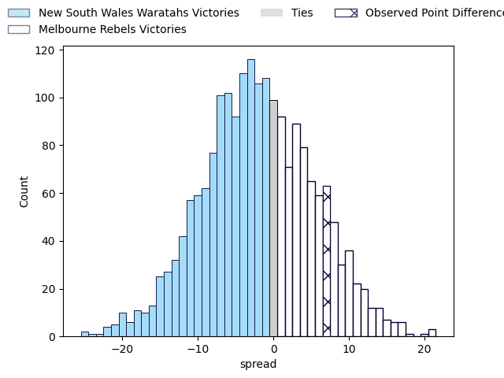
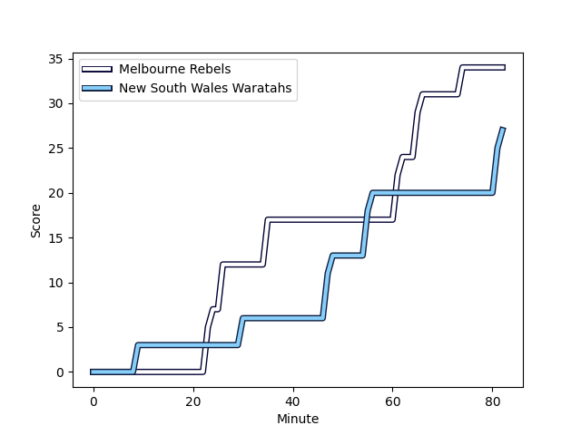
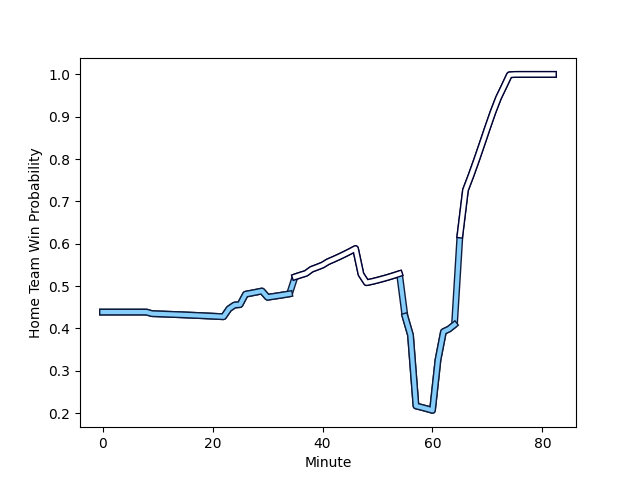

---  
layout: page  
title: New South Wales Waratahs at Melbourne Rebels; 27.0-34.0  
date: 2023-03-10 03:35:00 18:00:00 -0500  
categories: match review  
---
# New South Wales Waratahs at Melbourne Rebels; 27.0-34.0

# Club Level Predictions

The first set of predictions treats a club as the smallest object, as the club develops its members, organizes a gameplan, and deploys its players as needed for each match. This club model has a prediction of 0.447, which translates to predicting New South Wales Waratahs to win by 1.9.

Each club has a rating and a rating deviation (simiar to a Glicko system), and expected performances can be generated. This allows for simulated matches and spreads like the ones below.
## Projected Performances

## Projected Spreads

## Projected Results

# Player Level Predictions

Treating teams instead as an entity made up of the currently active players, I have ratings for each player in an altogether different system. These can be combined to form team ratings once teamsheets are announced, weighting starters a bit higher than the reserves. After the match is played, players can be weighted by their minutes on the field, allowing for an accurate measure of the team's composition. With these compiled team ratings, we can make predictions, measure inaccuracy, and update the individual player ratings.
## Prediction with Player Minutes: New South Wales Waratahs by 6.7

New South Wales Waratahs by 10.7 on a neutral field
## Scores over Time

## Win Probability over Time

There were 17 large changes in win probability in this match
## Prediction without Player Minutes: New South Wales Waratahs by 1.6

New South Wales Waratahs by 5.6 on a neutral pitch

|   Away Minutes | Away Player                                                             |   Away elo |   Away Percentile |   Number |   Home Percentile |   Home elo | Home Player                                                          |   Home Minutes |
|---------------:|:------------------------------------------------------------------------|-----------:|------------------:|---------:|------------------:|-----------:|:---------------------------------------------------------------------|---------------:|
|             75 | [Tom Lambert](..//playerfiles//TomLambert_cleaned.md)                   |      99.37 |                66 |        1 |                48 |      94.35 | [Matt Gibbon](..//playerfiles//MattGibbon_cleaned.md)                |             78 |
|             82 | [Dave Porecki](..//playerfiles//DavePorecki_cleaned.md)                 |      97.79 |                62 |        2 |                50 |      93.91 | [Alex Mafi](..//playerfiles//AlexMafi_cleaned.md)                    |             62 |
|             41 | [Archer Holz](..//playerfiles//ArcherHolz_cleaned.md)                   |      97.06 |                58 |        3 |               nan |      95    | [Cabous Eloff](..//playerfiles//CabousEloff_cleaned.md)              |             49 |
|             82 | [Jed Holloway](..//playerfiles//JedHolloway_cleaned.md)                 |      99.11 |                62 |        4 |                48 |      94.54 | [Josh Canham](..//playerfiles//JoshCanham_cleaned.md)                |             67 |
|             38 | [Hugh Sinclair](..//playerfiles//HughSinclair_cleaned.md)               |      99.48 |                63 |        5 |                45 |      93.44 | [Trevor Hosea](..//playerfiles//TrevorHosea_cleaned.md)              |             65 |
|             48 | [Lachlan Swinton](..//playerfiles//LachlanSwinton_cleaned.md)           |      98.6  |                62 |        6 |                61 |      96.13 | [Josh Kemeny](..//playerfiles//JoshKemeny_cleaned.md)                |             82 |
|             82 | [Michael Hooper](..//playerfiles//MichaelHooper_cleaned.md)             |      99.11 |                64 |        7 |                46 |      93.06 | [Brad Wilkin](..//playerfiles//BradWilkin_cleaned.md)                |             57 |
|             67 | [Langi Gleeson](..//playerfiles//LangiGleeson_cleaned.md)               |     100.6  |                66 |        8 |                48 |      95.22 | [Richard Hardwick](..//playerfiles//RichardHardwick_cleaned.md)      |             82 |
|             82 | [Jake Gordon](..//playerfiles//JakeGordon_cleaned.md)                   |      97.75 |                59 |        9 |                49 |      94.47 | [Ryan Louwrens](..//playerfiles//RyanLouwrens_cleaned.md)            |             70 |
|             82 | [Tane Edmed](..//playerfiles//TaneEdmed_cleaned.md)                     |      98    |                59 |       10 |                48 |      94.54 | [Carter Gordon](..//playerfiles//CarterGordon_cleaned.md)            |             82 |
|             82 | [Max Jorgensen](..//playerfiles//MaxJorgensen_cleaned.md)               |      99.11 |                62 |       11 |                51 |      95.45 | [Monty Ioane](..//playerfiles//MontyIoane_cleaned.md)                |             82 |
|             82 | [Lalakai Foketi](..//playerfiles//LalakaiFoketi_cleaned.md)             |      99.11 |                62 |       12 |                47 |      94.54 | [Stacey Ili](..//playerfiles//StaceyIli_cleaned.md)                  |             79 |
|             82 | [Izaia Perese](..//playerfiles//IzaiaPerese_cleaned.md)                 |     100.88 |                68 |       13 |                47 |      94.54 | [Reece Hodge](..//playerfiles//ReeceHodge_cleaned.md)                |             82 |
|             82 | [Mark Nawaqanitawase](..//playerfiles//MarkNawaqanitawase_cleaned.md)   |      99.11 |                62 |       14 |                49 |      94.54 | [Lachie Anderson](..//playerfiles//LachieAnderson_cleaned.md)        |             82 |
|             82 | [Ben Donaldson](..//playerfiles//BenDonaldson_cleaned.md)               |      99.11 |                61 |       15 |                61 |      98.64 | [Nick Jooste](..//playerfiles//NickJooste_cleaned.md)                |             63 |
|             25 | [Tolu Latu](..//playerfiles//ToluLatu_cleaned.md)                       |      98.1  |               nan |       16 |               nan |      95.63 | [Jordan Uelese](..//playerfiles//JordanUelese_cleaned.md)            |             20 |
|              7 | [Tetera Faulkner](..//playerfiles//TeteraFaulkner_cleaned.md)           |      97.06 |               nan |       17 |               nan |      93.86 | [Cameron Orr](..//playerfiles//CameronOrr_cleaned.md)                |             11 |
|             41 | [Harry Johnson-Holmes](..//playerfiles//HarryJohnson-Holmes_cleaned.md) |      95    |               nan |       18 |               nan |      94.64 | [Pone Fa'amausili](..//playerfiles//PoneFa'amausili_cleaned.md)      |             33 |
|             44 | [Taleni Seu](..//playerfiles//TaleniSeu_cleaned.md)                     |      94.63 |                39 |       19 |                46 |      93.19 | [Tuaina Taii Tualima](..//playerfiles//TuainaTaiiTualima_cleaned.md) |             25 |
|             15 | [Will Harris](..//playerfiles//WillHarris_cleaned.md)                   |      95.21 |               nan |       20 |               nan |      95.97 | [Vaiolini Ekuasi](..//playerfiles//VaioliniEkuasi_cleaned.md)        |             25 |
|             34 | [Charlie Gamble](..//playerfiles//CharlieGamble_cleaned.md)             |      93.82 |                33 |       21 |               nan |      95.07 | [James Tuttle](..//playerfiles//JamesTuttle_cleaned.md)              |             12 |
|              0 | [Teddy Wilson](..//playerfiles//TeddyWilson_cleaned.md)                 |      95    |               nan |       22 |               nan |      94.09 | [Lukas Ripley](..//playerfiles//LukasRipley_cleaned.md)              |             19 |
|             19 | [Ben Dowling](..//playerfiles//BenDowling_cleaned.md)                   |      96.11 |               nan |       23 |               nan |      95    | [David Feliuai](..//playerfiles//DavidFeliuai_cleaned.md)            |              3 |

