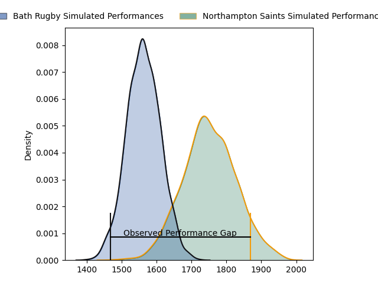
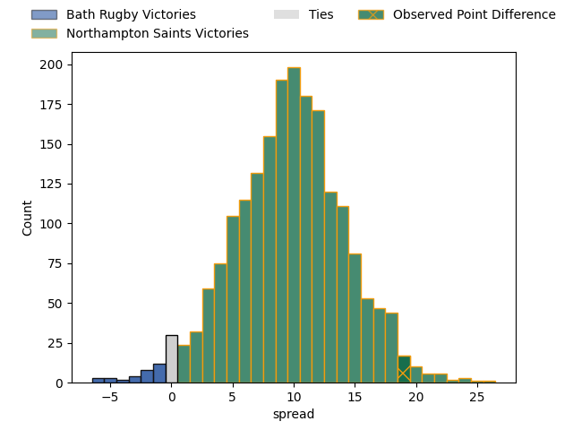
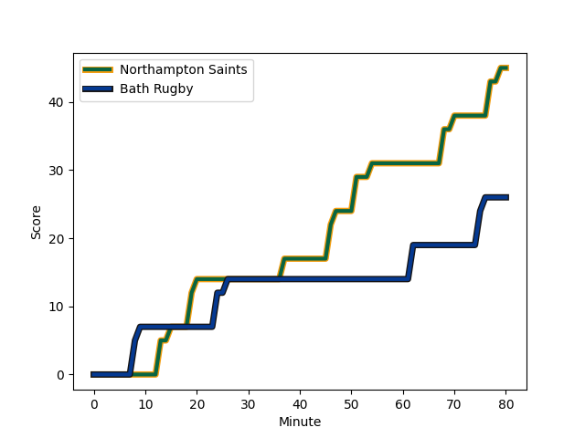
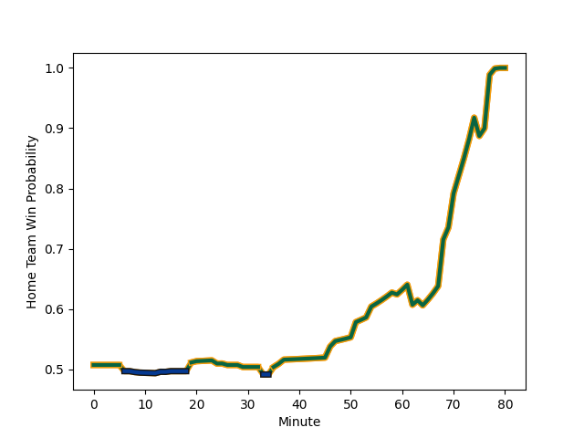

---  
layout: page  
title: Bath Rugby at Northampton Saints; 26.0-45.0  
date: 2023-03-10 14:45:00 18:00:00 -0500  
categories: match review  
---
# Bath Rugby at Northampton Saints; 26.0-45.0

# Club Level Predictions

The first set of predictions treats a club as the smallest object, as the club develops its members, organizes a gameplan, and deploys its players as needed for each match. This club model has a prediction of 0.746, which translates to predicting Northampton Saints to win by 9.5.

Each club has a rating and a rating deviation (simiar to a Glicko system), and expected performances can be generated. This allows for simulated matches and spreads like the ones below.
## Projected Performances

## Projected Spreads

## Projected Results

# Player Level Predictions

Treating teams instead as an entity made up of the currently active players, I have ratings for each player in an altogether different system. These can be combined to form team ratings once teamsheets are announced, weighting starters a bit higher than the reserves. After the match is played, players can be weighted by their minutes on the field, allowing for an accurate measure of the team's composition. With these compiled team ratings, we can make predictions, measure inaccuracy, and update the individual player ratings.
## Prediction with Player Minutes: Northampton Saints by 9.3

Northampton Saints by 5.3 on a neutral field
## Scores over Time

## Win Probability over Time

There were 6 large changes in win probability in this match
## Prediction without Player Minutes: Northampton Saints by 9.2

Northampton Saints by 5.2 on a neutral pitch

|   Away Minutes | Away Player                                                              |   Away elo |   Away Percentile |   Number |   Home Percentile |   Home elo | Home Player                                                             |   Home Minutes |
|---------------:|:-------------------------------------------------------------------------|-----------:|------------------:|---------:|------------------:|-----------:|:------------------------------------------------------------------------|---------------:|
|             59 | [Beno Obano](..//playerfiles//BenoObano_cleaned.md)                      |     107.58 |                86 |        1 |                99 |     128.31 | [Alex Waller](..//playerfiles//AlexWaller_cleaned.md)                   |             64 |
|             70 | [Tom Dunn](..//playerfiles//TomDunn_cleaned.md)                          |     124.57 |                97 |        2 |                12 |      81.18 | [Robbie Smith](..//playerfiles//RobbieSmith_cleaned.md)                 |             70 |
|             59 | [D'Arcy Rae](..//playerfiles//D'ArcyRae_cleaned.md)                      |      39.98 |                 0 |        3 |                82 |     104.77 | [Paul Hill](..//playerfiles//PaulHill_cleaned.md)                       |             64 |
|             54 | [Dave Attwood](..//playerfiles//DaveAttwood_cleaned.md)                  |     104.53 |                75 |        4 |                15 |      81.33 | [Lukhan Salakaia-Loto](..//playerfiles//LukhanSalakaia-Loto_cleaned.md) |             71 |
|             62 | [GJ van Velze](..//playerfiles//GJvanVelze_cleaned.md)                   |      89.26 |                30 |        5 |                90 |     115.02 | [Alex Moon](..//playerfiles//AlexMoon_cleaned.md)                       |             80 |
|             80 | [Josh Bayliss](..//playerfiles//JoshBayliss_cleaned.md)                  |      96.25 |                55 |        6 |                85 |     110.06 | [Angus Scott-Young](..//playerfiles//AngusScott-Young_cleaned.md)       |             80 |
|             74 | [Chris Cloete](..//playerfiles//ChrisCloete_cleaned.md)                  |     121.31 |                95 |        7 |                89 |     114.43 | [Sam Graham](..//playerfiles//SamGraham_cleaned.md)                     |             80 |
|             80 | [Miles Reid](..//playerfiles//MilesReid_cleaned.md)                      |     113.61 |                90 |        8 |                32 |      90.18 | [Juarno Augustus](..//playerfiles//JuarnoAugustus_cleaned.md)           |             70 |
|             54 | [Louis Schreuder](..//playerfiles//LouisSchreuder_cleaned.md)            |      99.29 |                66 |        9 |                48 |      94    | [Tom James](..//playerfiles//TomJames_cleaned.md)                       |             76 |
|             67 | [Orlando Bailey](..//playerfiles//OrlandoBailey_cleaned.md)              |      73.61 |                 6 |       10 |                19 |      83.99 | [Fin Smith](..//playerfiles//FinSmith_cleaned.md)                       |             80 |
|             80 | [Matt Gallagher](..//playerfiles//MattGallagher_cleaned.md)              |     113.83 |                90 |       11 |                86 |     109.73 | [Tommy Freeman](..//playerfiles//TommyFreeman_cleaned.md)               |             80 |
|             80 | [Max Ojomoh](..//playerfiles//MaxOjomoh_cleaned.md)                      |      77.64 |                10 |       12 |                 6 |      72.42 | [Fraser Dingwall](..//playerfiles//FraserDingwall_cleaned.md)           |             76 |
|             36 | [Jonathan Joseph](..//playerfiles//JonathanJoseph_cleaned.md)            |     114.75 |                90 |       13 |                69 |     101.16 | [Matt Proctor](..//playerfiles//MattProctor_cleaned.md)                 |             29 |
|             80 | [Gabriel Hamer-Webb](..//playerfiles//GabrielHamer-Webb_cleaned.md)      |      95    |               nan |       14 |                87 |     111.7  | [Tom Collins](..//playerfiles//TomCollins_cleaned.md)                   |             78 |
|             80 | [Tom de Glanville](..//playerfiles//TomdeGlanville_cleaned.md)           |      81.97 |                20 |       15 |                94 |     124.74 | [James Ramm](..//playerfiles//JamesRamm_cleaned.md)                     |             80 |
|             10 | [Tom Doughty](..//playerfiles//TomDoughty_cleaned.md)                    |      95    |               nan |       16 |               nan |      96.12 | [Tom Cruse](..//playerfiles//TomCruse_cleaned.md)                       |             10 |
|             21 | [Juan Schoeman](..//playerfiles//JuanSchoeman_cleaned.md)                |      93.65 |               nan |       17 |                72 |     100.96 | [Ethan Waller](..//playerfiles//EthanWaller_cleaned.md)                 |             16 |
|             21 | [Johannes Jonker](..//playerfiles//JohannesJonker_cleaned.md)            |      94.62 |               nan |       18 |                 3 |      66.89 | [Alfie Petch](..//playerfiles//AlfiePetch_cleaned.md)                   |             18 |
|             26 | [Josh McNally](..//playerfiles//JoshMcNally_cleaned.md)                  |      82.13 |                16 |       19 |               nan |      95    | [Brandon Nansen](..//playerfiles//BrandonNansen_cleaned.md)             |              9 |
|             18 | [Will Spencer](..//playerfiles//WillSpencer_cleaned.md)                  |      93.29 |                49 |       20 |                12 |      81.53 | [Sam Matavesi](..//playerfiles//SamMatavesi_cleaned.md)                 |             10 |
|             39 | [Ben Spencer](..//playerfiles//BenSpencer_cleaned.md)                    |     111.71 |                89 |       21 |                43 |      92.46 | [Callum Braley](..//playerfiles//CallumBraley_cleaned.md)               |              4 |
|             44 | [Will Butt](..//playerfiles//WillButt_cleaned.md)                        |      95    |               nan |       22 |                61 |      97.7  | [James Grayson](..//playerfiles//JamesGrayson_cleaned.md)               |              4 |
|              6 | [Richard de Carpentier](..//playerfiles//RicharddeCarpentier_cleaned.md) |      95    |               nan |       23 |                29 |      88.75 | [Rory Hutchinson](..//playerfiles//RoryHutchinson_cleaned.md)           |             51 |

