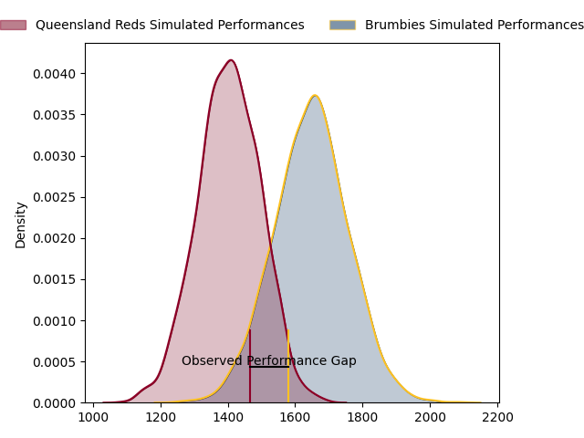
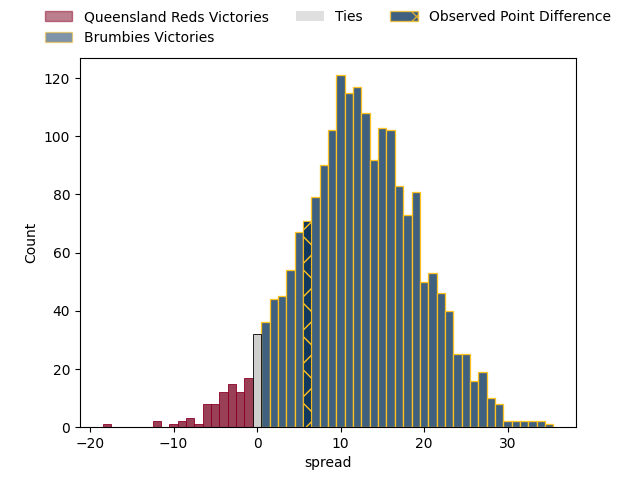
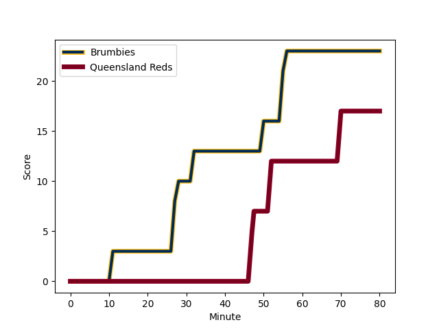
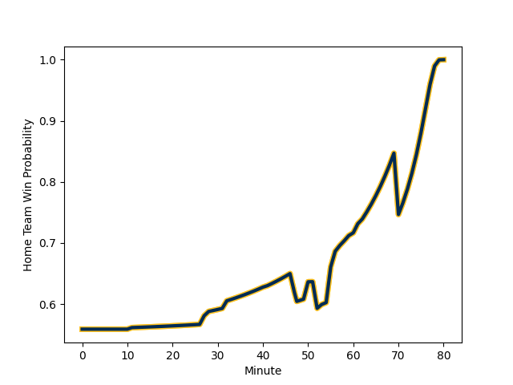

---  
layout: page  
title: Queensland Reds at Brumbies; 17.0-23.0  
date: 2023-03-11 03:35:00 18:00:00 -0500  
categories: match review  
---
# Queensland Reds at Brumbies; 17.0-23.0

# Club Level Predictions

The first set of predictions treats a club as the smallest object, as the club develops its members, organizes a gameplan, and deploys its players as needed for each match. This club model has a prediction of 0.797, which translates to predicting Brumbies to win by 12.4.

Each club has a rating and a rating deviation (simiar to a Glicko system), and expected performances can be generated. This allows for simulated matches and spreads like the ones below.
## Projected Performances

## Projected Spreads

## Projected Results

# Player Level Predictions

Treating teams instead as an entity made up of the currently active players, I have ratings for each player in an altogether different system. These can be combined to form team ratings once teamsheets are announced, weighting starters a bit higher than the reserves. After the match is played, players can be weighted by their minutes on the field, allowing for an accurate measure of the team's composition. With these compiled team ratings, we can make predictions, measure inaccuracy, and update the individual player ratings.
## Prediction with Player Minutes: Brumbies by 14.1

Brumbies by 10.1 on a neutral field
## Scores over Time

## Win Probability over Time

There were 11 large changes in win probability in this match
## Prediction without Player Minutes: Brumbies by 13.9

Brumbies by 9.9 on a neutral pitch

|   Away Minutes | Away Player                                                     |   Away elo |   Away Percentile |   Number |   Home Percentile |   Home elo | Home Player                                                     |   Home Minutes |
|---------------:|:----------------------------------------------------------------|-----------:|------------------:|---------:|------------------:|-----------:|:----------------------------------------------------------------|---------------:|
|             61 | [Dane Zander](..//playerfiles//DaneZander_cleaned.md)           |      97.52 |                60 |        1 |                77 |     102.99 | [James Slipper](..//playerfiles//JamesSlipper_cleaned.md)       |             51 |
|             57 | [Matt Faessler](..//playerfiles//MattFaessler_cleaned.md)       |      96.43 |                57 |        2 |                73 |     101.72 | [Lachlan Lonergan](..//playerfiles//LachlanLonergan_cleaned.md) |             62 |
|             61 | [Zane Nonggorr](..//playerfiles//ZaneNonggorr_cleaned.md)       |      96.27 |                55 |        3 |               nan |     102.51 | [Rhys Van Nek](..//playerfiles//RhysVanNek_cleaned.md)          |             51 |
|             68 | [Ryan Smith](..//playerfiles//RyanSmith_cleaned.md)             |      94.37 |                48 |        4 |                82 |     107.76 | [Nick Frost](..//playerfiles//NickFrost_cleaned.md)             |             80 |
|             54 | [Seru Uru](..//playerfiles//SeruUru_cleaned.md)                 |      96.53 |                55 |        5 |                74 |     103.87 | [Cadeyrn Neville](..//playerfiles//CadeyrnNeville_cleaned.md)   |             56 |
|             80 | [Liam Wright](..//playerfiles//LiamWright_cleaned.md)           |     105.22 |                77 |        6 |                82 |     107.76 | [Rob Valetini](..//playerfiles//RobValetini_cleaned.md)         |             60 |
|             80 | [Fraser McReight](..//playerfiles//FraserMcReight_cleaned.md)   |      96.53 |                56 |        7 |                76 |     104.63 | [Rory Scott](..//playerfiles//RoryScott_cleaned.md)             |             80 |
|             80 | [Harry Wilson](..//playerfiles//HarryWilson_cleaned.md)         |      96.53 |                52 |        8 |                81 |     107.76 | [Pete Samu](..//playerfiles//PeteSamu_cleaned.md)               |             80 |
|             78 | [Tate McDermott](..//playerfiles//TateMcDermott_cleaned.md)     |      95.16 |                51 |        9 |               nan |      99.78 | [Nic White](..//playerfiles//NicWhite_cleaned.md)               |             51 |
|             41 | [Tom Lynagh](..//playerfiles//TomLynagh_cleaned.md)             |      94.99 |                47 |       10 |               nan |      99.78 | [Noah Lolesio](..//playerfiles//NoahLolesio_cleaned.md)         |             80 |
|             80 | [Filipo Daugunu](..//playerfiles//FilipoDaugunu_cleaned.md)     |      95.84 |                52 |       11 |                84 |     107.76 | [Corey Toole](..//playerfiles//CoreyToole_cleaned.md)           |             80 |
|             70 | [Hunter Paisami](..//playerfiles//HunterPaisami_cleaned.md)     |      96.53 |                53 |       12 |               nan |      97.57 | [Ollie Sapsford](..//playerfiles//OllieSapsford_cleaned.md)     |             68 |
|             80 | [Josh Flook](..//playerfiles//JoshFlook_cleaned.md)             |      96.53 |                53 |       13 |                78 |     105.19 | [Len Ikitau](..//playerfiles//LenIkitau_cleaned.md)             |             80 |
|             63 | [Suliasi Vunivalu](..//playerfiles//SuliasiVunivalu_cleaned.md) |     102.54 |                72 |       14 |                84 |     107.76 | [Andy Muirhead](..//playerfiles//AndyMuirhead_cleaned.md)       |             80 |
|             80 | [Jordan Petaia](..//playerfiles//JordanPetaia_cleaned.md)       |      95.51 |                52 |       15 |                80 |     107.76 | [Tom Wright](..//playerfiles//TomWright_cleaned.md)             |             80 |
|             23 | [Richie Asiata](..//playerfiles//RichieAsiata_cleaned.md)       |      95.09 |               nan |       16 |                54 |      95.37 | [Connal McInerney](..//playerfiles//ConnalMcInerney_cleaned.md) |             18 |
|             19 | [Sef Fa'agase](..//playerfiles//SefFa'agase_cleaned.md)         |      94.01 |               nan |       17 |                62 |      99.77 | [Blake Schoupp](..//playerfiles//BlakeSchoupp_cleaned.md)       |             29 |
|             19 | [Peni Ravai](..//playerfiles//PeniRavai_cleaned.md)             |      95.26 |               nan |       18 |               nan |      95    | [Tom Ross](..//playerfiles//TomRoss_cleaned.md)                 |             29 |
|             26 | [Connor Vest](..//playerfiles//ConnorVest_cleaned.md)           |      95    |               nan |       19 |               nan |      98.89 | [Darcy Swain](..//playerfiles//DarcySwain_cleaned.md)           |             24 |
|             12 | [Jake Upfield](..//playerfiles//JakeUpfield_cleaned.md)         |      95.09 |               nan |       20 |               nan |      98.13 | [Luke Reimer](..//playerfiles//LukeReimer_cleaned.md)           |             20 |
|              2 | [Kalani Thomas](..//playerfiles//KalaniThomas_cleaned.md)       |      96.37 |               nan |       21 |                74 |     102.98 | [Ryan Lonergan](..//playerfiles//RyanLonergan_cleaned.md)       |             29 |
|             39 | [James O'Connor](..//playerfiles//JamesO'Connor_cleaned.md)     |      98.19 |               nan |       22 |                73 |     102.98 | [Jack Debreczeni](..//playerfiles//JackDebreczeni_cleaned.md)   |              0 |
|             27 | [Jock Campbell](..//playerfiles//JockCampbell_cleaned.md)       |      98.19 |               nan |       23 |               nan |      95    | [Ben O'Donnell](..//playerfiles//BenO'Donnell_cleaned.md)       |             12 |

