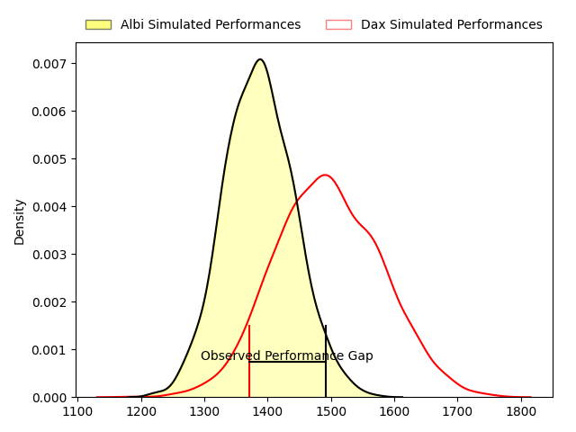
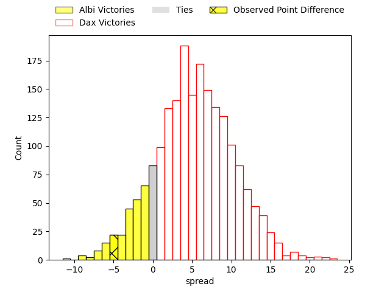
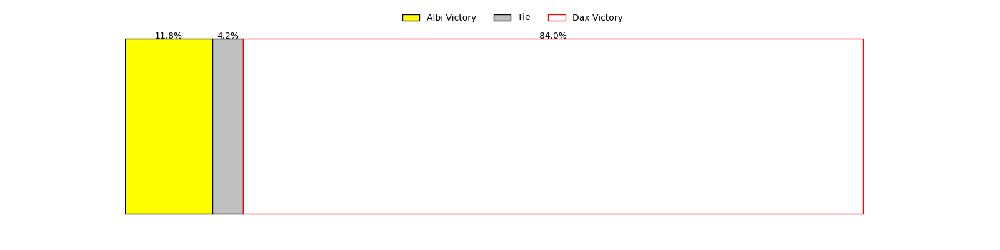
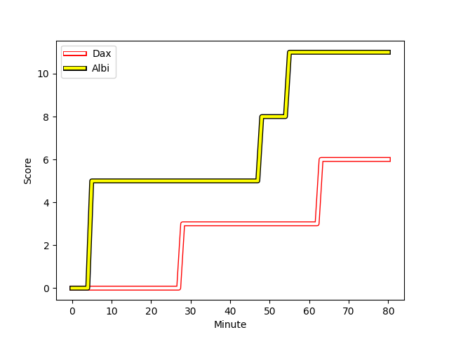
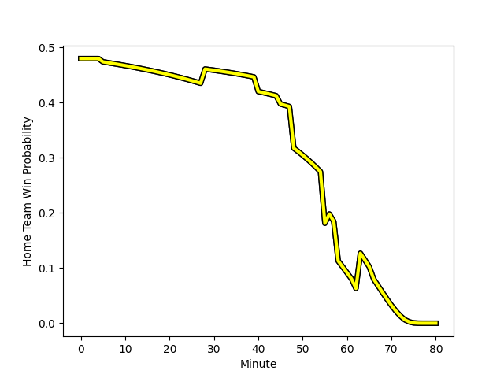

---  
layout: page  
title: Albi at Dax; 11-6  
date: 2023-03-11 15:00:00 18:00:00 -0500  
categories: match review  
---
# Albi at Dax; 11-6

# Club Level Predictions

The first set of predictions treats a club as the smallest object, as the club develops its members, organizes a gameplan, and deploys its players as needed for each match. This club model has a prediction of 0.648, which translates to predicting Dax to win by 5.4.

Each club has a rating and a rating deviation (simiar to a Glicko system), and expected performances can be generated. This allows for simulated matches and spreads like the ones below.
## Projected Performances

## Projected Spreads

## Projected Results

# Player Level Predictions

Treating teams instead as an entity made up of the currently active players, I have ratings for each player in an altogether different system. These can be combined to form team ratings once teamsheets are announced, weighting starters a bit higher than the reserves. After the match is played, players can be weighted by their minutes on the field, allowing for an accurate measure of the team's composition. With these compiled team ratings, we can make predictions, measure inaccuracy, and update the individual player ratings.
## Prediction with Player Minutes: Dax by 0.4

Albi by 3.6 on a neutral field
## Scores over Time

## Win Probability over Time

There were 6 large changes in win probability in this match
## Prediction without Player Minutes: Dax by 0.2

Albi by 3.8 on a neutral pitch

|   Away Minutes | Away Player                                                                          |   Away elo |   Away Percentile |   Number |   Home Percentile |   Home elo | Home Player                                                            |   Home Minutes |
|---------------:|:-------------------------------------------------------------------------------------|-----------:|------------------:|---------:|------------------:|-----------:|:-----------------------------------------------------------------------|---------------:|
|             56 | [Antoine Soave](..//playerfiles//AntoineSoave_cleaned.md)                            |     123.06 |                97 |        1 |                94 |     117.48 | [Asa Faitotoa](..//playerfiles//AsaFaitotoa_cleaned.md)                |             58 |
|             56 | [Antoine Soave](..//playerfiles//AntoineSoave_cleaned.md)                            |     123.06 |                95 |        1 |                94 |     117.48 | [Asa Faitotoa](..//playerfiles//AsaFaitotoa_cleaned.md)                |             58 |
|             56 | [Reinach Venter](..//playerfiles//ReinachVenter_cleaned.md)                          |      95.54 |                54 |        2 |                98 |     132.36 | [Elvis Levi](..//playerfiles//ElvisLevi_cleaned.md)                    |             58 |
|             56 | [Reinach Venter](..//playerfiles//ReinachVenter_cleaned.md)                          |      95.54 |                32 |        2 |                98 |     132.36 | [Elvis Levi](..//playerfiles//ElvisLevi_cleaned.md)                    |             58 |
|             56 | [Jean-Baptiste De Clercq](..//playerfiles//Jean-BaptisteDeClercq_cleaned.md)         |     101.69 |                68 |        3 |                53 |      93.62 | [Diogo Hasse Ferreira](..//playerfiles//DiogoHasseFerreira_cleaned.md) |             58 |
|             56 | [Jean-Baptiste De Clercq](..//playerfiles//Jean-BaptisteDeClercq_cleaned.md)         |     101.69 |                68 |        3 |                30 |      93.62 | [Diogo Hasse Ferreira](..//playerfiles//DiogoHasseFerreira_cleaned.md) |             58 |
|             45 | [John Henry Heath Backhouse](..//playerfiles//JohnHenryHeathBackhouse_cleaned.md)    |      96.11 |                47 |        4 |                61 |      98.6  | [Étienne Loiret](..//playerfiles//ÉtienneLoiret_cleaned.md)            |             80 |
|             45 | [John Henry Heath Backhouse](..//playerfiles//JohnHenryHeathBackhouse_cleaned.md)    |      96.11 |                47 |        4 |                50 |      98.6  | [Étienne Loiret](..//playerfiles//ÉtienneLoiret_cleaned.md)            |             80 |
|             80 | [Jacques Jacobus Engelbrecht](..//playerfiles//JacquesJacobusEngelbrecht_cleaned.md) |     113.32 |                82 |        5 |                50 |      95.28 | [Matt Luamanu](..//playerfiles//MattLuamanu_cleaned.md)                |             62 |
|             80 | [Jacques Jacobus Engelbrecht](..//playerfiles//JacquesJacobusEngelbrecht_cleaned.md) |     113.32 |                89 |        5 |                50 |      95.28 | [Matt Luamanu](..//playerfiles//MattLuamanu_cleaned.md)                |             62 |
|             80 | [Jacques Jacobus Engelbrecht](..//playerfiles//JacquesJacobusEngelbrecht_cleaned.md) |     113.32 |                82 |        5 |                39 |      95.28 | [Matt Luamanu](..//playerfiles//MattLuamanu_cleaned.md)                |             62 |
|             80 | [Jacques Jacobus Engelbrecht](..//playerfiles//JacquesJacobusEngelbrecht_cleaned.md) |     113.32 |                89 |        5 |                39 |      95.28 | [Matt Luamanu](..//playerfiles//MattLuamanu_cleaned.md)                |             62 |
|             66 | [Vincent Calas](..//playerfiles//VincentCalas_cleaned.md)                            |      89.71 |                33 |        6 |                71 |     102.2  | [Arnaud Aletti](..//playerfiles//ArnaudAletti_cleaned.md)              |             80 |
|             80 | [Lucas Guillaume](..//playerfiles//LucasGuillaume_cleaned.md)                        |     119    |                92 |        7 |                56 |      96.9  | [Théo Tremeau](..//playerfiles//ThéoTremeau_cleaned.md)                |             58 |
|             80 | [Sandrick Maciotta](..//playerfiles//SandrickMaciotta_cleaned.md)                    |     119.73 |                93 |        8 |                12 |      80.52 | [Brice Ferrer](..//playerfiles//BriceFerrer_cleaned.md)                |             80 |
|             76 | [Gilen Queheille](..//playerfiles//GilenQueheille_cleaned.md)                        |      93.33 |                37 |        9 |                76 |     104.24 | [Sylvère Reteau](..//playerfiles//SylvèreReteau_cleaned.md)            |             62 |
|             80 | [Théo Vidal](..//playerfiles//ThéoVidal_cleaned.md)                                  |      96    |                44 |       10 |                49 |      95.2  | [Hugo Cerisier](..//playerfiles//HugoCerisier_cleaned.md)              |             80 |
|             40 | [Avenisi Vasuinubu](..//playerfiles//AvenisiVasuinubu_cleaned.md)                    |      95    |               nan |       11 |                54 |      96.39 | [Julien Dechavanne](..//playerfiles//JulienDechavanne_cleaned.md)      |             80 |
|             40 | [Avenisi Vasuinubu](..//playerfiles//AvenisiVasuinubu_cleaned.md)                    |      95    |               nan |       11 |                43 |      96.39 | [Julien Dechavanne](..//playerfiles//JulienDechavanne_cleaned.md)      |             80 |
|             73 | [Simon Andreu](..//playerfiles//SimonAndreu_cleaned.md)                              |      96.7  |                54 |       12 |                68 |     100.91 | [Ilikena Bolakoro](..//playerfiles//IlikenaBolakoro_cleaned.md)        |             80 |
|             73 | [Simon Andreu](..//playerfiles//SimonAndreu_cleaned.md)                              |      96.7  |                54 |       12 |                53 |     100.91 | [Ilikena Bolakoro](..//playerfiles//IlikenaBolakoro_cleaned.md)        |             80 |
|             80 | [Wandile Gabada  Mjekevu](..//playerfiles//WandileGabadaMjekevu_cleaned.md)          |      93.5  |               nan |       13 |                64 |      99.6  | [Rodrigo Marta](..//playerfiles//RodrigoMarta_cleaned.md)              |             80 |
|             80 | [Charly Vicenzo Trussardi](..//playerfiles//CharlyVicenzoTrussardi_cleaned.md)       |     108.12 |                84 |       14 |                89 |     114.3  | [Guillaume Bouche](..//playerfiles//GuillaumeBouche_cleaned.md)        |             62 |
|             80 | [Téo Dospital](..//playerfiles//TéoDospital_cleaned.md)                              |     108.18 |                76 |       15 |                85 |     110    | [Théo Duprat](..//playerfiles//ThéoDuprat_cleaned.md)                  |             80 |
|             24 | [Maxime Escur](..//playerfiles//MaximeEscur_cleaned.md)                              |      81.18 |                13 |       16 |                78 |     103.09 | [Louis Mary](..//playerfiles//LouisMary_cleaned.md)                    |             22 |
|             24 | [Arthur Castant](..//playerfiles//ArthurCastant_cleaned.md)                          |     109.51 |                85 |       17 |                45 |      93.59 | [Louis Barrere](..//playerfiles//LouisBarrere_cleaned.md)              |             22 |
|             24 | [Dimitri Tchapnga](..//playerfiles//DimitriTchapnga_cleaned.md)                      |     105.97 |                83 |       18 |                 8 |      77.74 | [Thibaud Dréan](..//playerfiles//ThibaudDréan_cleaned.md)              |             22 |
|             24 | [Dimitri Tchapnga](..//playerfiles//DimitriTchapnga_cleaned.md)                      |     105.97 |                75 |       18 |                 8 |      77.74 | [Thibaud Dréan](..//playerfiles//ThibaudDréan_cleaned.md)              |             22 |
|             24 | [Dimitri Tchapnga](..//playerfiles//DimitriTchapnga_cleaned.md)                      |     105.97 |                83 |       18 |                 6 |      77.74 | [Thibaud Dréan](..//playerfiles//ThibaudDréan_cleaned.md)              |             22 |
|             24 | [Dimitri Tchapnga](..//playerfiles//DimitriTchapnga_cleaned.md)                      |     105.97 |                75 |       18 |                 6 |      77.74 | [Thibaud Dréan](..//playerfiles//ThibaudDréan_cleaned.md)              |             22 |
|             35 | [Luke Joseph Stringer](..//playerfiles//LukeJosephStringer_cleaned.md)               |     103.48 |                75 |       19 |                86 |     111.39 | [Yoan Gaune](..//playerfiles//YoanGaune_cleaned.md)                    |             18 |
|             35 | [Luke Joseph Stringer](..//playerfiles//LukeJosephStringer_cleaned.md)               |     103.48 |                65 |       19 |                86 |     111.39 | [Yoan Gaune](..//playerfiles//YoanGaune_cleaned.md)                    |             18 |
|             14 | [Camille Jarreau](..//playerfiles//CamilleJarreau_cleaned.md)                        |     103.32 |                73 |       20 |                79 |     108.24 | [Paul Arnaud Ausset](..//playerfiles//PaulArnaudAusset_cleaned.md)     |             22 |
|              4 | [Titouan Pouzoullic](..//playerfiles//TitouanPouzoullic_cleaned.md)                  |      91.24 |                22 |       21 |                16 |      80.52 | [Adrien Ayestaran](..//playerfiles//AdrienAyestaran_cleaned.md)        |             18 |
|              4 | [Titouan Pouzoullic](..//playerfiles//TitouanPouzoullic_cleaned.md)                  |      91.24 |                40 |       21 |                16 |      80.52 | [Adrien Ayestaran](..//playerfiles//AdrienAyestaran_cleaned.md)        |             18 |
|             40 | [Paul Clergue](..//playerfiles//PaulClergue_cleaned.md)                              |     108.94 |                83 |       22 |                87 |     110.63 | [Théo Gatelier](..//playerfiles//ThéoGatelier_cleaned.md)              |             18 |
|              7 | [François Fontaine](..//playerfiles//FrançoisFontaine_cleaned.md)                    |     101.29 |                57 |       23 |               nan |     nan    | nan                                                                    |            nan |
|              7 | [François Fontaine](..//playerfiles//FrançoisFontaine_cleaned.md)                    |     101.29 |                69 |       23 |               nan |     nan    | nan                                                                    |            nan |

