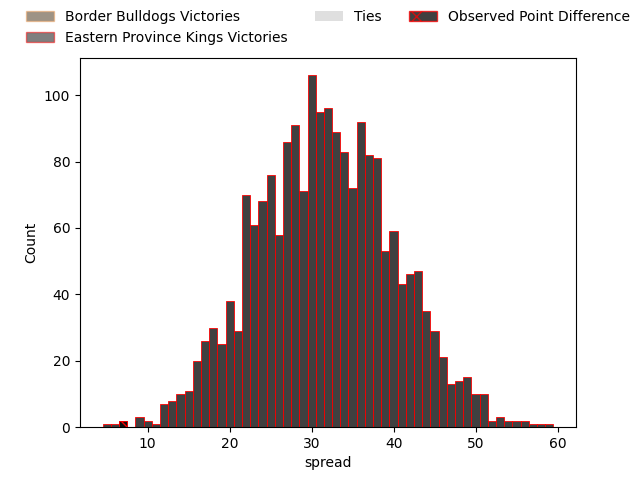
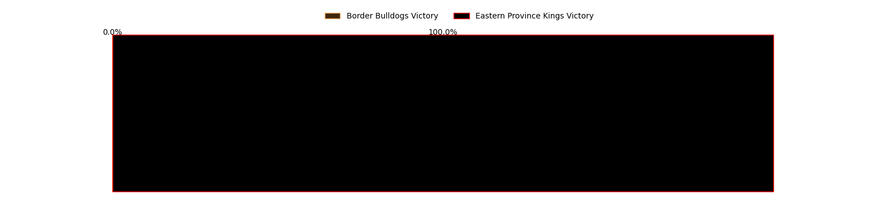

---  
layout: page  
title: Border Bulldogs at Eastern Province Kings; 15-22  
date: 2023-03-11 15:00:00 18:00:00 -0500  
categories: match review  
---
# Border Bulldogs at Eastern Province Kings; 15-22

# Club Level Predictions

The first set of predictions treats a club as the smallest object, as the club develops its members, organizes a gameplan, and deploys its players as needed for each match. This club model has a prediction of 0.969, which translates to predicting Eastern Province Kings to win by 31.9.

Each club has a rating and a rating deviation (simiar to a Glicko system), and expected performances can be generated. This allows for simulated matches and spreads like the ones below.
## Projected Performances

## Projected Spreads

## Projected Results

# Player Level Predictions

Treating teams instead as an entity made up of the currently active players, I have ratings for each player in an altogether different system. These can be combined to form team ratings once teamsheets are announced, weighting starters a bit higher than the reserves. After the match is played, players can be weighted by their minutes on the field, allowing for an accurate measure of the team's composition. With these compiled team ratings, we can make predictions, measure inaccuracy, and update the individual player ratings.
## Prediction with Player Minutes: Border Bulldogs by 7.0

Border Bulldogs by 11.0 on a neutral field

There were 3 large changes in win probability in this match
## Prediction without Player Minutes: Border Bulldogs by 7.0

Border Bulldogs by 11.0 on a neutral pitch

|   Away Minutes | Away Player                                                               |   Away elo |   Away Percentile |   Number |   Home Percentile |   Home elo | Home Player                                                                         |   Home Minutes |
|---------------:|:--------------------------------------------------------------------------|-----------:|------------------:|---------:|------------------:|-----------:|:------------------------------------------------------------------------------------|---------------:|
|             80 | [Edwin Nxumalo](..//playerfiles//EdwinNxumalo_cleaned.md)                 |      88.52 |                34 |        1 |                 6 |      74.36 | [Zukisa Sali](..//playerfiles//ZukisaSali_cleaned.md)                               |             80 |
|             80 | [Vuyisani Mavuso](..//playerfiles//VuyisaniMavuso_cleaned.md)             |      72.84 |                 6 |        2 |                 2 |      66.49 | [Duan du Plessis](..//playerfiles//DuanduPlessis_cleaned.md)                        |             80 |
|             80 | [Siba Mnkani](..//playerfiles//SibaMnkani_cleaned.md)                     |      81.28 |                13 |        3 |               nan |      95    | [Andile Ngonyama](..//playerfiles//AndileNgonyama_cleaned.md)                       |             80 |
|             80 | [Camagu Dlisani](..//playerfiles//CamaguDlisani_cleaned.md)               |      95    |               nan |        4 |                 9 |      74.36 | [Stefan Willemse](..//playerfiles//StefanWillemse_cleaned.md)                       |             80 |
|             80 | [Azola Mati](..//playerfiles//AzolaMati_cleaned.md)                       |      95    |               nan |        5 |               nan |     106.68 | [Lindokuhle Welemu](..//playerfiles//LindokuhleWelemu_cleaned.md)                   |             80 |
|             80 | [Rodney Chikamhi](..//playerfiles//RodneyChikamhi_cleaned.md)             |      95    |               nan |        6 |                16 |      83.35 | [Diego Nuran Virgol Williams](..//playerfiles//DiegoNuranVirgolWilliams_cleaned.md) |             80 |
|             80 | [Hlomla Payi](..//playerfiles//HlomlaPayi_cleaned.md)                     |      95.56 |               nan |        7 |                 0 |      45.68 | [Gerrit Huisamen](..//playerfiles//GerritHuisamen_cleaned.md)                       |             80 |
|             80 | [Onke Sydwell Dubase](..//playerfiles//OnkeSydwellDubase_cleaned.md)      |      56.93 |                 2 |        8 |                 1 |      60.6  | [Athenkosi Manentsa](..//playerfiles//AthenkosiManentsa_cleaned.md)                 |             80 |
|             80 | [Anele (Bee) Zweni](..//playerfiles//Anele(Bee)Zweni_cleaned.md)          |      73.78 |                 8 |        9 |                 9 |      75.49 | [Andur-Rageem Ismail](..//playerfiles//Andur-RageemIsmail_cleaned.md)               |             80 |
|             80 | [Aphiwe Stemele](..//playerfiles//AphiweStemele_cleaned.md)               |     102.27 |                71 |       10 |               nan |      95.93 | [Keagan September](..//playerfiles//KeaganSeptember_cleaned.md)                     |             80 |
|             80 | [Siphosenkosi Nofemele](..//playerfiles//SiphosenkosiNofemele_cleaned.md) |      65.97 |                 6 |       11 |               nan |      95    | [Charles Goeda](..//playerfiles//CharlesGoeda_cleaned.md)                           |             80 |
|             80 | [Migcobo Bovu](..//playerfiles//MigcoboBovu_cleaned.md)                   |      95    |               nan |       12 |                16 |      82.37 | [Sherwyn Slater](..//playerfiles//SherwynSlater_cleaned.md)                         |             80 |
|             80 | [Lelethu Gcilitshane](..//playerfiles//LelethuGcilitshane_cleaned.md)     |      95    |               nan |       13 |                15 |      81.7  | [Riaan Arendse](..//playerfiles//RiaanArendse_cleaned.md)                           |             80 |
|             80 | [Sakhe Dingile](..//playerfiles//SakheDingile_cleaned.md)                 |      94.66 |                49 |       14 |                 2 |      60.09 | [Rodney Damons](..//playerfiles//RodneyDamons_cleaned.md)                           |             80 |
|             80 | [Blake Diedericks](..//playerfiles//BlakeDiedericks_cleaned.md)           |      95    |               nan |       15 |               nan |      95    | [Jayden Bantom](..//playerfiles//JaydenBantom_cleaned.md)                           |             80 |

