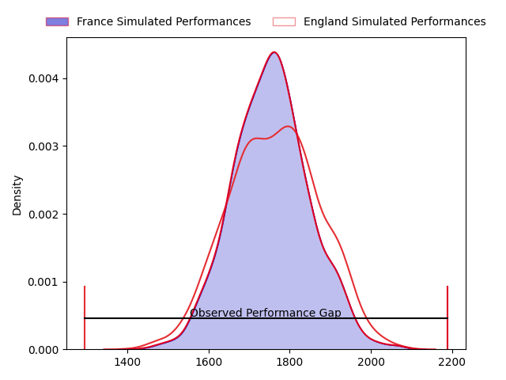
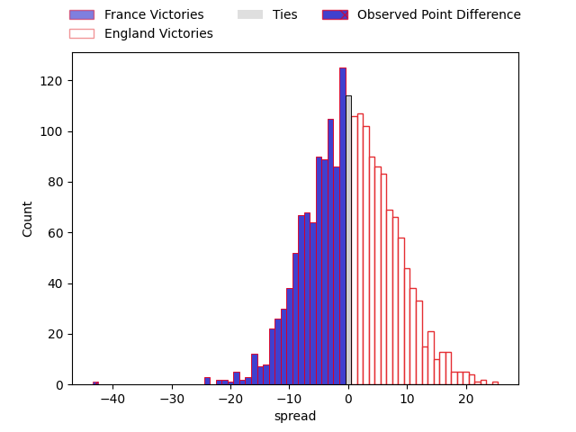
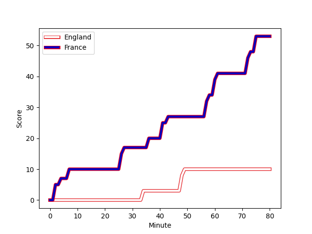
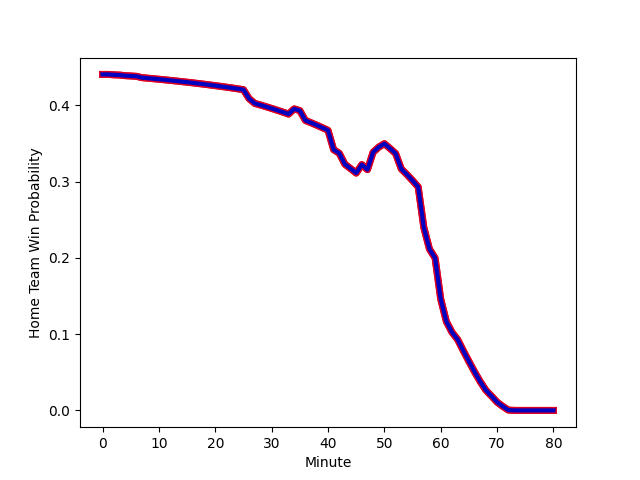

---  
layout: page  
title: France at England; 53.0-10.0  
date: 2023-03-11 11:45:00 18:00:00 -0500  
categories: match review  
---
# France at England; 53.0-10.0

# Club Level Predictions

The first set of predictions treats a club as the smallest object, as the club develops its members, organizes a gameplan, and deploys its players as needed for each match. This club model has a prediction of 0.511, which translates to predicting England to win by 0.4.

Each club has a rating and a rating deviation (simiar to a Glicko system), and expected performances can be generated. This allows for simulated matches and spreads like the ones below.
## Projected Performances

## Projected Spreads

## Projected Results

# Player Level Predictions

Treating teams instead as an entity made up of the currently active players, I have ratings for each player in an altogether different system. These can be combined to form team ratings once teamsheets are announced, weighting starters a bit higher than the reserves. After the match is played, players can be weighted by their minutes on the field, allowing for an accurate measure of the team's composition. With these compiled team ratings, we can make predictions, measure inaccuracy, and update the individual player ratings.
## Prediction with Player Minutes: France by 6.3

France by 10.3 on a neutral field
## Scores over Time

## Win Probability over Time

There were 5 large changes in win probability in this match
## Prediction without Player Minutes: France by 7.8

France by 11.8 on a neutral pitch

|   Away Minutes | Away Player                                                       |   Away elo |   Away Percentile |   Number |   Home Percentile |   Home elo | Home Player                                                          |   Home Minutes |
|---------------:|:------------------------------------------------------------------|-----------:|------------------:|---------:|------------------:|-----------:|:---------------------------------------------------------------------|---------------:|
|             61 | [Cyril Baille](..//playerfiles//CyrilBaille_cleaned.md)           |     101.93 |                74 |        1 |                58 |      97.33 | [Ellis Genge](..//playerfiles//EllisGenge_cleaned.md)                |             65 |
|             61 | [Julien Marchand](..//playerfiles//JulienMarchand_cleaned.md)     |     104.72 |                82 |        2 |               100 |     164.41 | [Jamie George](..//playerfiles//JamieGeorge_cleaned.md)              |             80 |
|             50 | [Dorian Aldegheri](..//playerfiles//DorianAldegheri_cleaned.md)   |     102.03 |                75 |        3 |                91 |     113.69 | [Kyle Sinckler](..//playerfiles//KyleSinckler_cleaned.md)            |             65 |
|             80 | [Thibaud Flament](..//playerfiles//ThibaudFlament_cleaned.md)     |     113.71 |                89 |        4 |                86 |     110.81 | [Maro Itoje](..//playerfiles//MaroItoje_cleaned.md)                  |             80 |
|             50 | [Paul Willemse](..//playerfiles//PaulWillemse_cleaned.md)         |     140.98 |                99 |        5 |                94 |     120.84 | [Ollie Chessum](..//playerfiles//OllieChessum_cleaned.md)            |             80 |
|             80 | [Francois Cros](..//playerfiles//FrancoisCros_cleaned.md)         |     167.85 |                99 |        6 |                56 |      96.73 | [Lewis Ludlam](..//playerfiles//LewisLudlam_cleaned.md)              |             80 |
|             63 | [Charles Ollivon](..//playerfiles//CharlesOllivon_cleaned.md)     |     140.3  |                98 |        7 |                95 |     124.61 | [Jack Willis](..//playerfiles//JackWillis_cleaned.md)                |             53 |
|             80 | [Gregory Alldritt](..//playerfiles//GregoryAlldritt_cleaned.md)   |     115.23 |                90 |        8 |                99 |     140.81 | [Alex Dombrandt](..//playerfiles//AlexDombrandt_cleaned.md)          |             76 |
|             69 | [Antoine Dupont](..//playerfiles//AntoineDupont_cleaned.md)       |     129.96 |                98 |        9 |                44 |      92.78 | [Jack van Poortvliet](..//playerfiles//JackvanPoortvliet_cleaned.md) |             46 |
|             74 | [Romain Ntamack](..//playerfiles//RomainNtamack_cleaned.md)       |     128.42 |                96 |       10 |                98 |     134.28 | [Marcus Smith](..//playerfiles//MarcusSmith_cleaned.md)              |             80 |
|             80 | [Ethan Dumortier](..//playerfiles//EthanDumortier_cleaned.md)     |     103.99 |                75 |       11 |                33 |      89.85 | [Anthony Watson](..//playerfiles//AnthonyWatson_cleaned.md)          |             80 |
|             65 | [Jonathan Danty](..//playerfiles//JonathanDanty_cleaned.md)       |     101.36 |                69 |       12 |                30 |      88.68 | [Ollie Lawrence](..//playerfiles//OllieLawrence_cleaned.md)          |             61 |
|             80 | [Gael Fickou](..//playerfiles//GaelFickou_cleaned.md)             |     108.47 |                84 |       13 |                64 |      99.72 | [Henry Slade](..//playerfiles//HenrySlade_cleaned.md)                |             46 |
|             80 | [Damian Penaud](..//playerfiles//DamianPenaud_cleaned.md)         |     116.16 |                92 |       14 |                40 |      91.86 | [Max Malins](..//playerfiles//MaxMalins_cleaned.md)                  |             59 |
|             80 | [Thomas Ramos](..//playerfiles//ThomasRamos_cleaned.md)           |     122.94 |                94 |       15 |                67 |     101.18 | [Freddie Steward](..//playerfiles//FreddieSteward_cleaned.md)        |             80 |
|             19 | [Peato Mauvaka](..//playerfiles//PeatoMauvaka_cleaned.md)         |      95    |               nan |       16 |                19 |      85.23 | [Jack Walker](..//playerfiles//JackWalker_cleaned.md)                |             19 |
|             19 | [Reda Wardi](..//playerfiles//RedaWardi_cleaned.md)               |     112.64 |               nan |       17 |                97 |     125.9  | [Mako Vunipola](..//playerfiles//MakoVunipola_cleaned.md)            |             15 |
|             30 | [Sipili Falatea](..//playerfiles//SipiliFalatea_cleaned.md)       |     111.9  |               nan |       18 |                19 |      84.69 | [Dan Cole](..//playerfiles//DanCole_cleaned.md)                      |             15 |
|             30 | [Romain Taofifenua](..//playerfiles//RomainTaofifenua_cleaned.md) |     106.49 |               nan |       19 |                55 |      96.62 | [David Ribbans](..//playerfiles//DavidRibbans_cleaned.md)            |              4 |
|             17 | [Sekou Macalou](..//playerfiles//SekouMacalou_cleaned.md)         |     114.52 |               nan |       20 |                42 |      92.72 | [Ben Curry](..//playerfiles//BenCurry_cleaned.md)                    |             27 |
|             11 | [Maxime Lucu](..//playerfiles//MaximeLucu_cleaned.md)             |      95    |               nan |       21 |                84 |     106.96 | [Alex Mitchell](..//playerfiles//AlexMitchell_cleaned.md)            |             34 |
|             15 | [Yoram Moefana](..//playerfiles//YoramMoefana_cleaned.md)         |      98.93 |                61 |       22 |                96 |     128.31 | [Owen Farrell](..//playerfiles//OwenFarrell_cleaned.md)              |             34 |
|              6 | [Melvyn Jaminet](..//playerfiles//MelvynJaminet_cleaned.md)       |      95    |               nan |       23 |                51 |      94.04 | [Henry Arundell](..//playerfiles//HenryArundell_cleaned.md)          |             21 |

