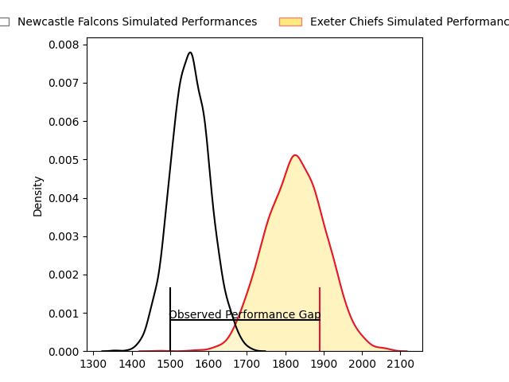
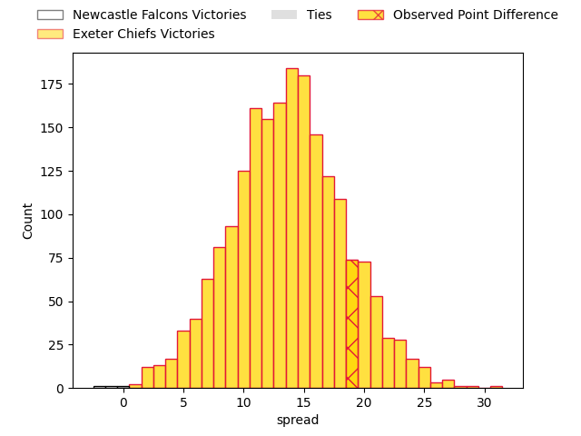

---  
layout: page  
title: Newcastle Falcons at Exeter Chiefs; 5.0-24.0  
date: 2023-03-11 09:30:00 18:00:00 -0500  
categories: match review  
---
# Newcastle Falcons at Exeter Chiefs; 5.0-24.0

# Club Level Predictions

The first set of predictions treats a club as the smallest object, as the club develops its members, organizes a gameplan, and deploys its players as needed for each match. This club model has a prediction of 0.825, which translates to predicting Exeter Chiefs to win by 13.6.

Each club has a rating and a rating deviation (simiar to a Glicko system), and expected performances can be generated. This allows for simulated matches and spreads like the ones below.
## Projected Performances

## Projected Spreads

## Projected Results

# Player Level Predictions

Treating teams instead as an entity made up of the currently active players, I have ratings for each player in an altogether different system. These can be combined to form team ratings once teamsheets are announced, weighting starters a bit higher than the reserves. After the match is played, players can be weighted by their minutes on the field, allowing for an accurate measure of the team's composition. With these compiled team ratings, we can make predictions, measure inaccuracy, and update the individual player ratings.
## Prediction with Player Minutes: Exeter Chiefs by 8.4

Exeter Chiefs by 4.4 on a neutral field

There were 5 large changes in win probability in this match
## Prediction without Player Minutes: Exeter Chiefs by 7.8

Exeter Chiefs by 3.8 on a neutral pitch

|   Away Minutes | Away Player                                                          |   Away elo |   Away Percentile |   Number |   Home Percentile |   Home elo | Home Player                                                             |   Home Minutes |
|---------------:|:---------------------------------------------------------------------|-----------:|------------------:|---------:|------------------:|-----------:|:------------------------------------------------------------------------|---------------:|
|             59 | [Adam Brocklebank](..//playerfiles//AdamBrocklebank_cleaned.md)      |      97.81 |                60 |        1 |                61 |      98.11 | [Scott Sio](..//playerfiles//ScottSio_cleaned.md)                       |             73 |
|             74 | [Jamie Blamire](..//playerfiles//JamieBlamire_cleaned.md)            |      89.94 |                31 |        2 |                99 |     136.99 | [Dan Frost](..//playerfiles//DanFrost_cleaned.md)                       |             59 |
|             61 | [Richard Palframan](..//playerfiles//RichardPalframan_cleaned.md)    |      96.25 |                53 |        3 |                23 |      82.09 | [Marcus Street](..//playerfiles//MarcusStreet_cleaned.md)               |             65 |
|             80 | [Pedro Rubiolo](..//playerfiles//PedroRubiolo_cleaned.md)            |      90.85 |                38 |        4 |                90 |     115.9  | [Jannes Kirsten](..//playerfiles//JannesKirsten_cleaned.md)             |             63 |
|             80 | [Sebastian de Chaves](..//playerfiles//SebastiandeChaves_cleaned.md) |      70.18 |                 6 |        5 |                65 |      98.51 | [Jack Dunne](..//playerfiles//JackDunne_cleaned.md)                     |             80 |
|             65 | [Freddie Lockwood](..//playerfiles//FreddieLockwood_cleaned.md)      |     102.59 |                74 |        6 |                98 |     134.73 | [Dave Ewers](..//playerfiles//DaveEwers_cleaned.md)                     |             80 |
|             80 | [Callum Chick](..//playerfiles//CallumChick_cleaned.md)              |     102.59 |                72 |        7 |                60 |      98.47 | [Jacques Vermeulen](..//playerfiles//JacquesVermeulen_cleaned.md)       |             38 |
|             65 | [Carl Fearns](..//playerfiles//CarlFearns_cleaned.md)                |     120.42 |                93 |        8 |                94 |     121.58 | [Sam Simmonds](..//playerfiles//SamSimmonds_cleaned.md)                 |             80 |
|             55 | [Michael Young](..//playerfiles//MichaelYoung_cleaned.md)            |     109.43 |                86 |        9 |                 1 |      60.72 | [Sam Maunder](..//playerfiles//SamMaunder_cleaned.md)                   |             61 |
|             80 | [Brett Connon](..//playerfiles//BrettConnon_cleaned.md)              |      91.04 |                36 |       10 |                28 |      88.77 | [Harvey Skinner](..//playerfiles//HarveySkinner_cleaned.md)             |             80 |
|             80 | [Mateo Carreras](..//playerfiles//MateoCarreras_cleaned.md)          |      93.14 |                44 |       11 |                94 |     121.84 | [Olly Woodburn](..//playerfiles//OllyWoodburn_cleaned.md)               |             80 |
|             74 | [Matias Orlando](..//playerfiles//MatiasOrlando_cleaned.md)          |      79.85 |                12 |       12 |                93 |     119.23 | [Solomone Kata](..//playerfiles//SolomoneKata_cleaned.md)               |             68 |
|             80 | [Matias Moroni](..//playerfiles//MatiasMoroni_cleaned.md)            |     121    |                94 |       13 |                45 |      93.81 | [Ian Whitten](..//playerfiles//IanWhitten_cleaned.md)                   |             80 |
|             80 | [Adam Radwan](..//playerfiles//AdamRadwan_cleaned.md)                |     131.12 |                97 |       14 |                12 |      78.77 | [Jack Nowell](..//playerfiles//JackNowell_cleaned.md)                   |             80 |
|             65 | [Elliott Obatoyinbo](..//playerfiles//ElliottObatoyinbo_cleaned.md)  |      91.61 |                42 |       15 |                 6 |      67.73 | [Josh Hodge](..//playerfiles//JoshHodge_cleaned.md)                     |             61 |
|              6 | [Ollie Fletcher](..//playerfiles//OllieFletcher_cleaned.md)          |      94.23 |               nan |       16 |                95 |     116.08 | [Jack Yeandle](..//playerfiles//JackYeandle_cleaned.md)                 |             21 |
|             21 | [Logovi'i Mulipola](..//playerfiles//Logovi'iMulipola_cleaned.md)    |     103.7  |                78 |       17 |               nan |      89.4  | [Danny Southworth](..//playerfiles//DannySouthworth_cleaned.md)         |              7 |
|             19 | [Mark Tampin](..//playerfiles//MarkTampin_cleaned.md)                |      93.49 |               nan |       18 |                73 |     104.32 | [Patrick Schickerling](..//playerfiles//PatrickSchickerling_cleaned.md) |             15 |
|             15 | [Matthew Dalton](..//playerfiles//MatthewDalton_cleaned.md)          |      77.7  |                11 |       19 |                13 |      75.96 | [Mike Williams](..//playerfiles//MikeWilliams_cleaned.md)               |             17 |
|             15 | [Tom Marshall](..//playerfiles//TomMarshall_cleaned.md)              |      85.52 |               nan |       20 |                 8 |      76.63 | [Aidon Davis](..//playerfiles//AidonDavis_cleaned.md)                   |             42 |
|             25 | [Sam Stuart](..//playerfiles//SamStuart_cleaned.md)                  |      62.39 |                 2 |       21 |                16 |      81.75 | [Jack Maunder](..//playerfiles//JackMaunder_cleaned.md)                 |             19 |
|              6 | [Pete Lucock](..//playerfiles//PeteLucock_cleaned.md)                |      92.59 |                50 |       22 |                94 |     120.96 | [Joe Simmonds](..//playerfiles//JoeSimmonds_cleaned.md)                 |             19 |
|             15 | [Iwan Stephens](..//playerfiles//IwanStephens_cleaned.md)            |      95    |               nan |       23 |               nan |      91.17 | [Rory O'Loughlin](..//playerfiles//RoryO'Loughlin_cleaned.md)           |             12 |

