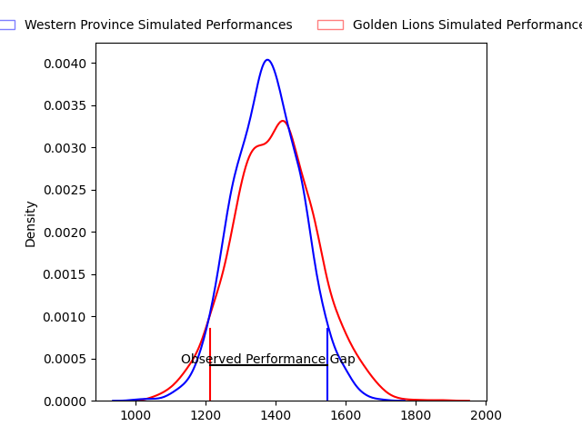
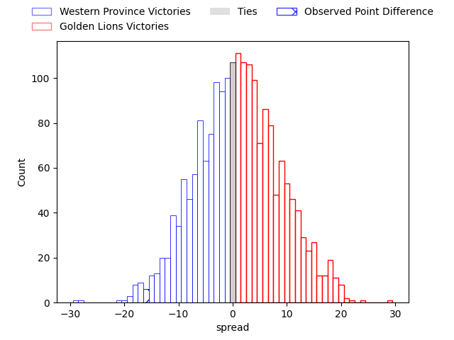
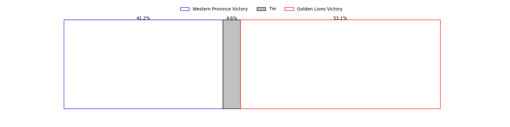

---  
layout: page  
title: Western Province at Golden Lions; 44-28  
date: 2023-03-11 15:30:00 18:00:00 -0500  
categories: match review  
---
# Western Province at Golden Lions; 44-28

# Club Level Predictions

The first set of predictions treats a club as the smallest object, as the club develops its members, organizes a gameplan, and deploys its players as needed for each match. This club model has a prediction of 0.536, which translates to predicting Golden Lions to win by 1.3.

Each club has a rating and a rating deviation (simiar to a Glicko system), and expected performances can be generated. This allows for simulated matches and spreads like the ones below.
## Projected Performances

## Projected Spreads

## Projected Results

# Player Level Predictions

Treating teams instead as an entity made up of the currently active players, I have ratings for each player in an altogether different system. These can be combined to form team ratings once teamsheets are announced, weighting starters a bit higher than the reserves. After the match is played, players can be weighted by their minutes on the field, allowing for an accurate measure of the team's composition. With these compiled team ratings, we can make predictions, measure inaccuracy, and update the individual player ratings.
## Prediction with Player Minutes: Western Province by 14.0

Western Province by 18.0 on a neutral field

There were 1 large changes in win probability in this match
## Prediction without Player Minutes: Western Province by 12.2

Western Province by 16.2 on a neutral pitch

|   Away Minutes | Away Player                                                                                     |   Away elo |   Away Percentile |   Number |   Home Percentile |   Home elo | Home Player                                                                     |   Home Minutes |
|---------------:|:------------------------------------------------------------------------------------------------|-----------:|------------------:|---------:|------------------:|-----------:|:--------------------------------------------------------------------------------|---------------:|
|             56 | [Kwenzokuhle Ndumiso Blose](..//playerfiles//KwenzokuhleNdumisoBlose_cleaned.md)                |      96.27 |                60 |        1 |               nan |      93.37 | [Sithembiso Sithole](..//playerfiles//SithembisoSithole_cleaned.md)             |             56 |
|             47 | [Siyabonga Ntubeni](..//playerfiles//SiyabongaNtubeni_cleaned.md)                               |      88.78 |                29 |        2 |               nan |      89    | [Gerrit Jacobus Visagie](..//playerfiles//GerritJacobusVisagie_cleaned.md)      |             64 |
|             47 | [Lee-Marvin Lofty Siyanda Mazibuko](..//playerfiles//Lee-MarvinLoftySiyandaMazibuko_cleaned.md) |     116.51 |                93 |        3 |               nan |      96.67 | [Ruan-Henry Smith](..//playerfiles//Ruan-HenrySmith_cleaned.md)                 |             62 |
|             80 | [Ernst van Rhyn](..//playerfiles//ErnstvanRhyn_cleaned.md)                                      |      99    |                61 |        4 |                28 |      87.77 | [Pieter Jansen van Vuuren](..//playerfiles//PieterJansenvanVuuren_cleaned.md)   |             43 |
|             64 | [Connor Evans](..//playerfiles//ConnorEvans_cleaned.md)                                         |     102.82 |                74 |        5 |                73 |     103.64 | [Darrien-Lane Landsberg](..//playerfiles//Darrien-LaneLandsberg_cleaned.md)     |             80 |
|             80 | [Marcel Theunissen](..//playerfiles//MarcelTheunissen_cleaned.md)                               |      88.15 |                27 |        6 |                26 |      85.54 | [Sibusiso Sangweni](..//playerfiles//SibusisoSangweni_cleaned.md)               |             51 |
|             43 | [Ben-Jason Dixon](..//playerfiles//Ben-JasonDixon_cleaned.md)                                   |     109.32 |                78 |        7 |                63 |     101.74 | [Ruan Delport](..//playerfiles//RuanDelport_cleaned.md)                         |             56 |
|             43 | [Ben-Jason Dixon](..//playerfiles//Ben-JasonDixon_cleaned.md)                                   |     109.32 |                83 |        7 |                63 |     101.74 | [Ruan Delport](..//playerfiles//RuanDelport_cleaned.md)                         |             56 |
|             80 | [Keke Morabe](..//playerfiles//KekeMorabe_cleaned.md)                                           |     105.92 |                77 |        8 |               nan |      77.52 | [Travis Gordon](..//playerfiles//TravisGordon_cleaned.md)                       |             80 |
|             47 | [Godlen Herschelle Derrick Masimla](..//playerfiles//GodlenHerschelleDerrickMasimla_cleaned.md) |      95.09 |               nan |        9 |               nan |      95    | [Morne van der Berg](..//playerfiles//MornevanderBerg_cleaned.md)               |             64 |
|             80 | [Kade Wolhuter](..//playerfiles//KadeWolhuter_cleaned.md)                                       |      96.44 |                52 |       10 |                16 |      80.09 | [Vaughen Isaacs](..//playerfiles//VaughenIsaacs_cleaned.md)                     |             80 |
|             80 | [Angelo Davids](..//playerfiles//AngeloDavids_cleaned.md)                                       |     122.16 |                93 |       11 |                11 |      77.99 | [Boldwin Hansen](..//playerfiles//BoldwinHansen_cleaned.md)                     |             80 |
|             80 | [Angelo Davids](..//playerfiles//AngeloDavids_cleaned.md)                                       |     122.16 |                94 |       11 |                11 |      77.99 | [Boldwin Hansen](..//playerfiles//BoldwinHansen_cleaned.md)                     |             80 |
|             64 | [Jean-Luc du Plessis](..//playerfiles//Jean-LucduPlessis_cleaned.md)                            |      89.82 |                33 |       12 |                10 |      78.19 | [Tyler Bocks](..//playerfiles//TylerBocks_cleaned.md)                           |             80 |
|             80 | [Juan de Jongh](..//playerfiles//JuandeJongh_cleaned.md)                                        |      89.29 |               nan |       13 |               nan |      95    | [Matt More](..//playerfiles//MattMore_cleaned.md)                               |             25 |
|             11 | [Duncan Rowan Saal](..//playerfiles//DuncanRowanSaal_cleaned.md)                                |      98.34 |               nan |       14 |                18 |      83.65 | [Stean Pienaar](..//playerfiles//SteanPienaar_cleaned.md)                       |             80 |
|             80 | [Clayton Blommetjies](..//playerfiles//ClaytonBlommetjies_cleaned.md)                           |     104.3  |                73 |       15 |               nan |      95    | [Tiaan Henk Swanepoel](..//playerfiles//TiaanHenkSwanepoel_cleaned.md)          |             80 |
|             69 | [Suleiman  Hartzenberg](..//playerfiles//SuleimanHartzenberg_cleaned.md)                        |     101.5  |                65 |       16 |                62 |      99.22 | [Raynard Roets](..//playerfiles//RaynardRoets_cleaned.md)                       |             37 |
|             33 | [Andre-Hugo Venter](..//playerfiles//Andre-HugoVenter_cleaned.md)                               |     112.51 |                88 |       17 |                10 |      77.5  | [Zeilinga Strydom](..//playerfiles//ZeilingaStrydom_cleaned.md)                 |             55 |
|             37 | [Albertus Horn](..//playerfiles//AlbertusHorn_cleaned.md)                                       |      95    |               nan |       18 |                 4 |      70.6  | [Jarod Cairns](..//playerfiles//JarodCairns_cleaned.md)                         |             29 |
|             33 | [Albertus Paul de Wet](..//playerfiles//AlbertusPauldeWet_cleaned.md)                           |     116.19 |                89 |       19 |               nan |     102.56 | [Morgan Naude](..//playerfiles//MorganNaude_cleaned.md)                         |             24 |
|             33 | [Albertus Paul de Wet](..//playerfiles//AlbertusPauldeWet_cleaned.md)                           |     116.19 |                93 |       19 |               nan |     102.56 | [Morgan Naude](..//playerfiles//MorganNaude_cleaned.md)                         |             24 |
|             33 | [Sazi Sandi](..//playerfiles//SaziSandi_cleaned.md)                                             |      99.25 |               nan |       20 |                36 |      96.06 | [Ruhan Straeuli](..//playerfiles//RuhanStraeuli_cleaned.md)                     |             24 |
|             24 | [Leon Lyons](..//playerfiles//LeonLyons_cleaned.md)                                             |      95    |               nan |       21 |               nan |      91.35 | [Kabous Bezuidenhout](..//playerfiles//KabousBezuidenhout_cleaned.md)           |             18 |
|             16 | [Dylan De Leeuw](..//playerfiles//DylanDeLeeuw_cleaned.md)                                      |      95    |               nan |       22 |                73 |      96.98 | [Michael Thomas van Vuuren](..//playerfiles//MichaelThomasvanVuuren_cleaned.md) |             16 |
|             16 | [Bruce Sherwood](..//playerfiles//BruceSherwood_cleaned.md)                                     |      95    |               nan |       23 |               nan |      89.71 | [Nico Steyn](..//playerfiles//NicoSteyn_cleaned.md)                             |             16 |

