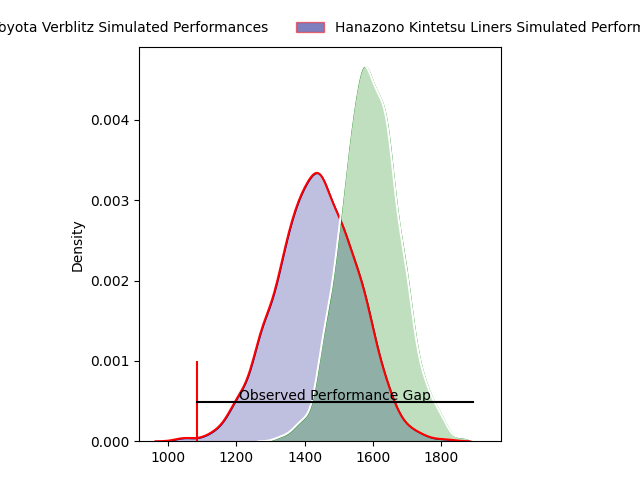
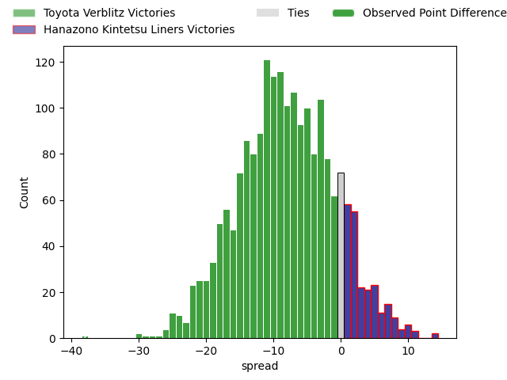
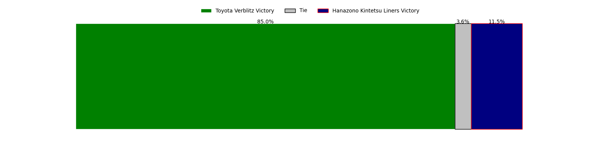

---  
layout: page  
title: Toyota Verblitz at Hanazono Kintetsu Liners; 62-24  
date: 2023-03-11 06:30:00 18:00:00 -0500  
categories: match review  
---
# Toyota Verblitz at Hanazono Kintetsu Liners; 62-24

# Club Level Predictions

The first set of predictions treats a club as the smallest object, as the club develops its members, organizes a gameplan, and deploys its players as needed for each match. This club model has a prediction of 0.289, which translates to predicting Toyota Verblitz to win by 8.1.

Each club has a rating and a rating deviation (simiar to a Glicko system), and expected performances can be generated. This allows for simulated matches and spreads like the ones below.
## Projected Performances

## Projected Spreads

## Projected Results

# Player Level Predictions

Treating teams instead as an entity made up of the currently active players, I have ratings for each player in an altogether different system. These can be combined to form team ratings once teamsheets are announced, weighting starters a bit higher than the reserves. After the match is played, players can be weighted by their minutes on the field, allowing for an accurate measure of the team's composition. With these compiled team ratings, we can make predictions, measure inaccuracy, and update the individual player ratings.
## Prediction with Player Minutes: Toyota Verblitz by 21.0

Toyota Verblitz by 25.0 on a neutral field

There were 4 large changes in win probability in this match
## Prediction without Player Minutes: Toyota Verblitz by 21.5

Toyota Verblitz by 25.5 on a neutral pitch

|   Away Minutes | Away Player                                                                   |   Away elo |   Away Percentile |   Number |   Home Percentile |   Home elo | Home Player                                                               |   Home Minutes |
|---------------:|:------------------------------------------------------------------------------|-----------:|------------------:|---------:|------------------:|-----------:|:--------------------------------------------------------------------------|---------------:|
|             58 | [Shogo Miura](..//playerfiles//ShogoMiura_cleaned.md)                         |      97.07 |                57 |        1 |                19 |      81.78 | [Kenta Tanaka](..//playerfiles//KentaTanaka_cleaned.md)                   |             54 |
|             58 | [Yoshikatsu Hikosaka](..//playerfiles//YoshikatsuHikosaka_cleaned.md)         |     121.41 |                96 |        2 |                82 |     105.8  | [Atsushi Kashimoto](..//playerfiles//AtsushiKashimoto_cleaned.md)         |             47 |
|             56 | [Runya Choi](..//playerfiles//RunyaChoi_cleaned.md)                           |      91.75 |                38 |        3 |                19 |      83.72 | [Kota Mitake](..//playerfiles//KotaMitake_cleaned.md)                     |             54 |
|             80 | [Daichi Akiyama](..//playerfiles//DaichiAkiyama_cleaned.md)                   |      93.96 |                47 |        4 |                34 |      90.04 | [Hayato Yokoi](..//playerfiles//HayatoYokoi_cleaned.md)                   |             80 |
|             57 | [Isaiah Mapusua](..//playerfiles//IsaiahMapusua_cleaned.md)                   |     104.27 |                74 |        5 |                13 |      79.18 | [Takahito Sugahara](..//playerfiles//TakahitoSugahara_cleaned.md)         |             80 |
|             49 | [Pieter Stephanus du Toit](..//playerfiles//PieterStephanusduToit_cleaned.md) |      95.21 |                51 |        6 |                 2 |      59.99 | [Daiki Miyashita](..//playerfiles//DaikiMiyashita_cleaned.md)             |             58 |
|             80 | [Kazuki Himeno](..//playerfiles//KazukiHimeno_cleaned.md)                     |      89.84 |                34 |        7 |                77 |     105.19 | [Shohei Nonaka](..//playerfiles//ShoheiNonaka_cleaned.md)                 |             80 |
|             80 | [Lautaimi Fetuani](..//playerfiles//LautaimiFetuani_cleaned.md)               |      79.95 |                12 |        8 |                19 |      84.57 | [Waimana Kapa](..//playerfiles//WaimanaKapa_cleaned.md)                   |             72 |
|             54 | [Kaito Shigeno](..//playerfiles//KaitoShigeno_cleaned.md)                     |      92.23 |                42 |        9 |                 0 |      41.61 | [William Genia](..//playerfiles//WilliamGenia_cleaned.md)                 |             58 |
|             62 | [Willem Jacobus Le Roux](..//playerfiles//WillemJacobusLeRoux_cleaned.md)     |      73.53 |                 6 |       10 |                 1 |      50.78 | [Jackson Garden-Bachop](..//playerfiles//JacksonGarden-Bachop_cleaned.md) |             80 |
|             80 | [Viliame Tuidraki](..//playerfiles//ViliameTuidraki_cleaned.md)               |     101.2  |                68 |       11 |                 0 |      44.17 | [Sioasia Fifita](..//playerfiles//SioasiaFifita_cleaned.md)               |             80 |
|             49 | [Charlie Lawrence](..//playerfiles//CharlieLawrence_cleaned.md)               |     113.03 |                88 |       12 |                 7 |      73.64 | [Koji Okamura](..//playerfiles//KojiOkamura_cleaned.md)                   |             80 |
|             80 | [Yuki Okada](..//playerfiles//YukiOkada_cleaned.md)                           |     113.71 |                89 |       13 |                17 |      82.15 | [Akihide Onogi](..//playerfiles//AkihideOnogi_cleaned.md)                 |             62 |
|             80 | [Taichi Takahashi](..//playerfiles//TaichiTakahashi_cleaned.md)               |      85.86 |                21 |       14 |                14 |      81.32 | [Joshua Nohra](..//playerfiles//JoshuaNohra_cleaned.md)                   |             80 |
|             80 | [Tiaan Falcon](..//playerfiles//TiaanFalcon_cleaned.md)                       |      94.74 |                51 |       15 |                81 |     108.27 | [Tatsuma Nanto](..//playerfiles//TatsumaNanto_cleaned.md)                 |             63 |
|             31 | [Will Tupou](..//playerfiles//WillTupou_cleaned.md)                           |      95.09 |                51 |       16 |               nan |      92.58 | [Sho Fukui](..//playerfiles//ShoFukui_cleaned.md)                         |             33 |
|             31 | [Rob Thompson](..//playerfiles//RobThompson_cleaned.md)                       |      75.36 |                 7 |       17 |                 2 |      64.47 | [Lata Tangimana](..//playerfiles//LataTangimana_cleaned.md)               |             26 |
|             26 | [Kenta Fukuda](..//playerfiles//KentaFukuda_cleaned.md)                       |     104.91 |                82 |       18 |               nan |      95    | [Yushi Inoue](..//playerfiles//YushiInoue_cleaned.md)                     |             26 |
|             24 | [Shunsuke Asaoka](..//playerfiles//ShunsukeAsaoka_cleaned.md)                 |      99.49 |                70 |       19 |               nan |      94.91 | [Tomoya Nakamura](..//playerfiles//TomoyaNakamura_cleaned.md)             |             22 |
|             23 | [Kyo Yoshida](..//playerfiles//KyoYoshida_cleaned.md)                         |      90.62 |                30 |       20 |                11 |      79.03 | [Jed Brown](..//playerfiles//JedBrown_cleaned.md)                         |             22 |
|             22 | [Yuji Takei](..//playerfiles//YujiTakei_cleaned.md)                           |      93.93 |               nan |       21 |               nan |      93.44 | [Haruki Kanazawa](..//playerfiles//HarukiKanazawa_cleaned.md)             |             18 |
|             22 | [Ryusei Kato](..//playerfiles//RyuseiKato_cleaned.md)                         |      90.19 |                32 |       22 |                 7 |      71.46 | [Yoshizumi Takeda](..//playerfiles//YoshizumiTakeda_cleaned.md)           |             17 |
|             18 | [Shuhei Yamaguchi](..//playerfiles//ShuheiYamaguchi_cleaned.md)               |      91.27 |                37 |       23 |               nan |      92.63 | [Shu Umemura](..//playerfiles//ShuUmemura_cleaned.md)                     |              8 |

