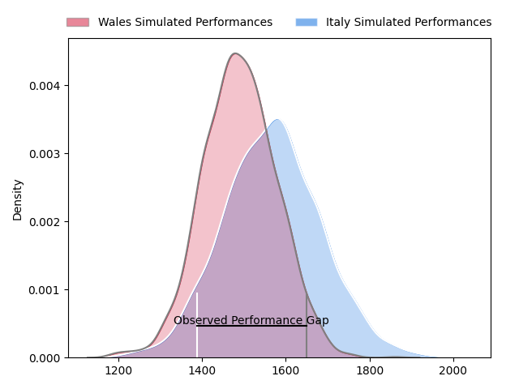
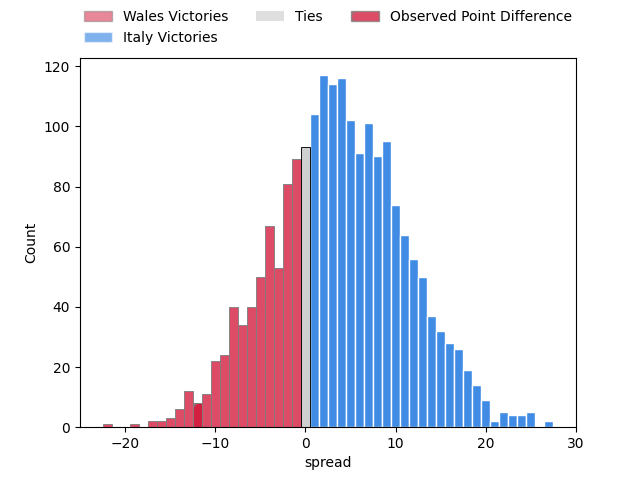
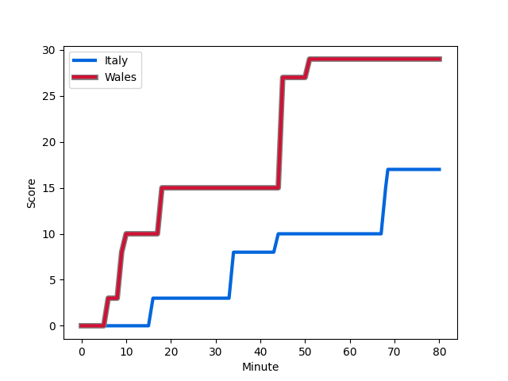
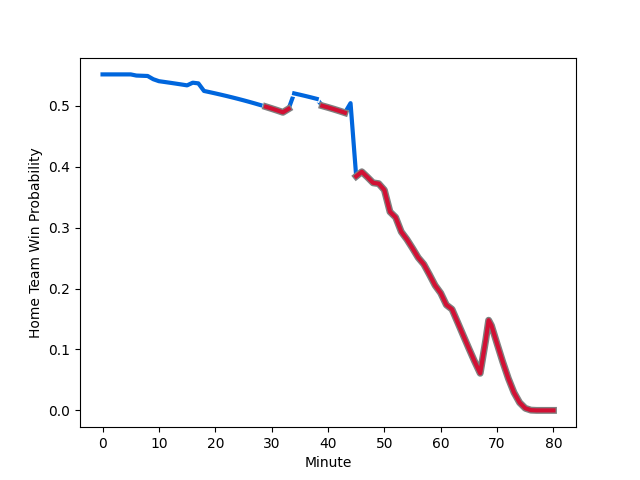

---  
layout: page  
title: Wales at Italy; 29.0-17.0  
date: 2023-03-11 09:15:00 18:00:00 -0500  
categories: match review  
---
# Wales at Italy; 29.0-17.0

# Club Level Predictions

The first set of predictions treats a club as the smallest object, as the club develops its members, organizes a gameplan, and deploys its players as needed for each match. This club model has a prediction of 0.608, which translates to predicting Italy to win by 4.0.

Each club has a rating and a rating deviation (simiar to a Glicko system), and expected performances can be generated. This allows for simulated matches and spreads like the ones below.
## Projected Performances

## Projected Spreads

## Projected Results

# Player Level Predictions

Treating teams instead as an entity made up of the currently active players, I have ratings for each player in an altogether different system. These can be combined to form team ratings once teamsheets are announced, weighting starters a bit higher than the reserves. After the match is played, players can be weighted by their minutes on the field, allowing for an accurate measure of the team's composition. With these compiled team ratings, we can make predictions, measure inaccuracy, and update the individual player ratings.
## Prediction with Player Minutes: Italy by 12.9

Italy by 8.9 on a neutral field
## Scores over Time

## Win Probability over Time

There were 8 large changes in win probability in this match
## Prediction without Player Minutes: Italy by 10.7

Italy by 6.7 on a neutral pitch

|   Away Minutes | Away Player                                                       |   Away elo |   Away Percentile |   Number |   Home Percentile |   Home elo | Home Player                                                           |   Home Minutes |
|---------------:|:------------------------------------------------------------------|-----------:|------------------:|---------:|------------------:|-----------:|:----------------------------------------------------------------------|---------------:|
|             46 | [Wyn Jones](..//playerfiles//WynJones_cleaned.md)                 |      94.27 |                48 |        1 |                70 |     100.56 | [Danilo Fischetti](..//playerfiles//DaniloFischetti_cleaned.md)       |             62 |
|             75 | [Ken Owens](..//playerfiles//KenOwens_cleaned.md)                 |      93.03 |                46 |        2 |                98 |     128.44 | [Giacomo Nicotera](..//playerfiles//GiacomoNicotera_cleaned.md)       |             53 |
|             53 | [Tomas Francis](..//playerfiles//TomasFrancis_cleaned.md)         |     123.72 |                97 |        3 |                45 |      93.34 | [Simone Ferrari](..//playerfiles//SimoneFerrari_cleaned.md)           |             43 |
|             80 | [Adam Beard](..//playerfiles//AdamBeard_cleaned.md)               |      88.09 |                27 |        4 |                 3 |      62.4  | [Niccolo Cannone](..//playerfiles//NiccoloCannone_cleaned.md)         |             60 |
|             69 | [Dafydd Jenkins](..//playerfiles//DafyddJenkins_cleaned.md)       |     110.06 |                86 |        5 |                88 |     112.17 | [Federico Ruzza](..//playerfiles//FedericoRuzza_cleaned.md)           |             80 |
|             60 | [Jac Morgan](..//playerfiles//JacMorgan_cleaned.md)               |      96.7  |                53 |        6 |                36 |      90.5  | [Sebastian Negri](..//playerfiles//SebastianNegri_cleaned.md)         |             53 |
|             80 | [Justin Tipuric](..//playerfiles//JustinTipuric_cleaned.md)       |     113.56 |                88 |        7 |                91 |     116.36 | [Michele Lamaro](..//playerfiles//MicheleLamaro_cleaned.md)           |             77 |
|             80 | [Taulupe Faletau](..//playerfiles//TaulupeFaletau_cleaned.md)     |      89.49 |                29 |        8 |                72 |     102.89 | [Lorenzo Cannone](..//playerfiles//LorenzoCannone_cleaned.md)         |             80 |
|             54 | [Rhys Webb](..//playerfiles//RhysWebb_cleaned.md)                 |     110.86 |                90 |        9 |                13 |      79.02 | [Stephen Varney](..//playerfiles//StephenVarney_cleaned.md)           |             57 |
|             80 | [Owen Williams](..//playerfiles//OwenWilliams_cleaned.md)         |     109.46 |                83 |       10 |                52 |      96.32 | [Paolo Garbisi](..//playerfiles//PaoloGarbisi_cleaned.md)             |             80 |
|             80 | [Rio Dyer](..//playerfiles//RioDyer_cleaned.md)                   |      61.08 |                 3 |       11 |                83 |     107.47 | [Pierre Bruno](..//playerfiles//PierreBruno_cleaned.md)               |             80 |
|             80 | [Joe Hawkins](..//playerfiles//JoeHawkins_cleaned.md)             |      71.52 |                 5 |       12 |                97 |     129.12 | [Tommaso Menoncello](..//playerfiles//TommasoMenoncello_cleaned.md)   |             60 |
|             80 | [Mason Grady](..//playerfiles//MasonGrady_cleaned.md)             |      91.67 |                39 |       13 |                86 |     110.09 | [Juan Ignacio Brex](..//playerfiles//JuanIgnacioBrex_cleaned.md)      |             80 |
|             52 | [Josh Adams](..//playerfiles//JoshAdams_cleaned.md)               |      89.79 |                32 |       14 |                88 |     111.89 | [Edoardo Padovani](..//playerfiles//EdoardoPadovani_cleaned.md)       |             80 |
|             62 | [Liam Williams](..//playerfiles//LiamWilliams_cleaned.md)         |     135.2  |                98 |       15 |                72 |     102.54 | [Tommaso Allan](..//playerfiles//TommasoAllan_cleaned.md)             |             80 |
|              5 | [Scott Baldwin](..//playerfiles//ScottBaldwin_cleaned.md)         |      95.35 |               nan |       16 |               nan |      79.43 | [Luca Bigi](..//playerfiles//LucaBigi_cleaned.md)                     |             27 |
|             34 | [Gareth Thomas](..//playerfiles//GarethThomas_cleaned.md)         |      73.53 |                 5 |       17 |               nan |      99.14 | [Federico Zani](..//playerfiles//FedericoZani_cleaned.md)             |             18 |
|             27 | [Dillon Lewis](..//playerfiles//DillonLewis_cleaned.md)           |      97.56 |                59 |       18 |                83 |     104.62 | [Marco Riccioni](..//playerfiles//MarcoRiccioni_cleaned.md)           |             37 |
|             11 | [Rhys Davies](..//playerfiles//RhysDavies_cleaned.md)             |      94.64 |               nan |       19 |               nan |     102.43 | [Edoardo Iachizzi](..//playerfiles//EdoardoIachizzi_cleaned.md)       |             20 |
|             20 | [Tommy Reffell](..//playerfiles//TommyReffell_cleaned.md)         |     108.55 |                83 |       20 |               nan |     132.08 | [Giovanni Pettinelli](..//playerfiles//GiovanniPettinelli_cleaned.md) |              3 |
|             26 | [Tomos Williams](..//playerfiles//TomosWilliams_cleaned.md)       |     108.94 |                86 |       21 |               nan |      98.36 | [Manuel Zuliani](..//playerfiles//ManuelZuliani_cleaned.md)           |             27 |
|             18 | [George North](..//playerfiles//GeorgeNorth_cleaned.md)           |     107.44 |                82 |       22 |               nan |      87.13 | [Alessandro Fusco](..//playerfiles//AlessandroFusco_cleaned.md)       |             23 |
|             28 | [Louis Rees-Zammit](..//playerfiles//LouisRees-Zammit_cleaned.md) |      84.75 |                20 |       23 |                87 |     111.32 | [Luca Morisi](..//playerfiles//LucaMorisi_cleaned.md)                 |             20 |

