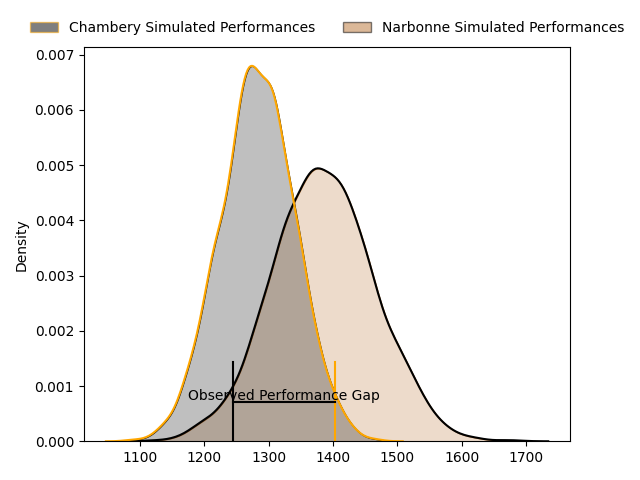
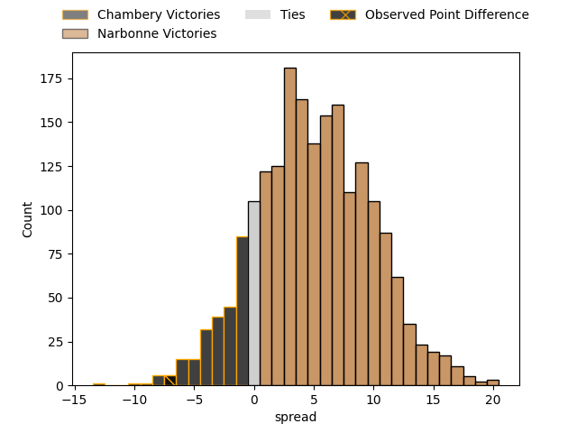
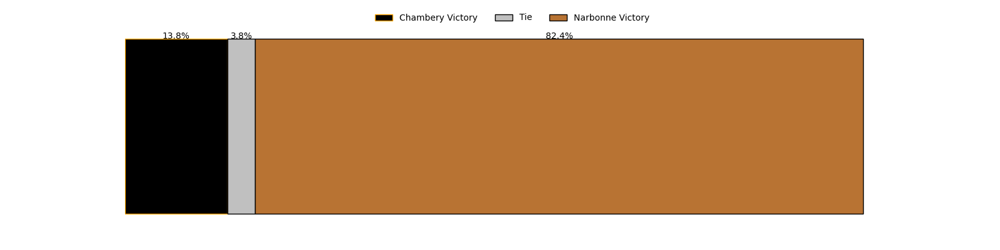

---  
layout: page  
title: Chambery at Narbonne; 24-17  
date: 2023-03-11 15:00:00 18:00:00 -0500  
categories: match review  
---
# Chambery at Narbonne; 24-17

# Club Level Predictions

The first set of predictions treats a club as the smallest object, as the club develops its members, organizes a gameplan, and deploys its players as needed for each match. This club model has a prediction of 0.639, which translates to predicting Narbonne to win by 5.1.

Each club has a rating and a rating deviation (simiar to a Glicko system), and expected performances can be generated. This allows for simulated matches and spreads like the ones below.
## Projected Performances

## Projected Spreads

## Projected Results

# Player Level Predictions

Treating teams instead as an entity made up of the currently active players, I have ratings for each player in an altogether different system. These can be combined to form team ratings once teamsheets are announced, weighting starters a bit higher than the reserves. After the match is played, players can be weighted by their minutes on the field, allowing for an accurate measure of the team's composition. With these compiled team ratings, we can make predictions, measure inaccuracy, and update the individual player ratings.
## Prediction with Player Minutes: Chambery by 4.5

Chambery by 8.5 on a neutral field

There were 6 large changes in win probability in this match
## Prediction without Player Minutes: Chambery by 3.1

Chambery by 7.1 on a neutral pitch

|   Away Minutes | Away Player                                                                     |   Away elo |   Away Percentile |   Number |   Home Percentile |   Home elo | Home Player                                                         |   Home Minutes |
|---------------:|:--------------------------------------------------------------------------------|-----------:|------------------:|---------:|------------------:|-----------:|:--------------------------------------------------------------------|---------------:|
|             63 | [Géraud Clermont](..//playerfiles//GéraudClermont_cleaned.md)                   |     107.65 |                64 |        1 |                62 |      94    | [Sylvain Abadie](..//playerfiles//SylvainAbadie_cleaned.md)         |             59 |
|             63 | [Géraud Clermont](..//playerfiles//GéraudClermont_cleaned.md)                   |     107.65 |                84 |        1 |                62 |      94    | [Sylvain Abadie](..//playerfiles//SylvainAbadie_cleaned.md)         |             59 |
|             53 | [Gauthier Brute de Remur](..//playerfiles//GauthierBrutedeRemur_cleaned.md)     |     102.73 |                49 |        2 |                33 |      83.57 | [Christophe David](..//playerfiles//ChristopheDavid_cleaned.md)     |             44 |
|             53 | [Gauthier Brute de Remur](..//playerfiles//GauthierBrutedeRemur_cleaned.md)     |     102.73 |                75 |        2 |                33 |      83.57 | [Christophe David](..//playerfiles//ChristopheDavid_cleaned.md)     |             44 |
|             53 | [Gauthier Brute de Remur](..//playerfiles//GauthierBrutedeRemur_cleaned.md)     |     102.73 |                49 |        2 |                16 |      83.57 | [Christophe David](..//playerfiles//ChristopheDavid_cleaned.md)     |             44 |
|             53 | [Gauthier Brute de Remur](..//playerfiles//GauthierBrutedeRemur_cleaned.md)     |     102.73 |                75 |        2 |                16 |      83.57 | [Christophe David](..//playerfiles//ChristopheDavid_cleaned.md)     |             44 |
|             70 | [Giorgi Pertaia](..//playerfiles//GiorgiPertaia_cleaned.md)                     |     109.73 |                71 |        3 |                94 |     115.74 | [Théo Castinel](..//playerfiles//ThéoCastinel_cleaned.md)           |             31 |
|             70 | [Giorgi Pertaia](..//playerfiles//GiorgiPertaia_cleaned.md)                     |     109.73 |                87 |        3 |                94 |     115.74 | [Théo Castinel](..//playerfiles//ThéoCastinel_cleaned.md)           |             31 |
|             70 | [Steevy Cerqueira](..//playerfiles//SteevyCerqueira_cleaned.md)                 |      98.66 |                58 |        4 |                45 |      93.45 | [Valentin Sese](..//playerfiles//ValentinSese_cleaned.md)           |             80 |
|             78 | [Romain Guyot](..//playerfiles//RomainGuyot_cleaned.md)                         |      80.31 |                 7 |        5 |                94 |     116.88 | [Mauro Rebussone](..//playerfiles//MauroRebussone_cleaned.md)       |             40 |
|             78 | [Romain Guyot](..//playerfiles//RomainGuyot_cleaned.md)                         |      80.31 |                15 |        5 |                94 |     116.88 | [Mauro Rebussone](..//playerfiles//MauroRebussone_cleaned.md)       |             40 |
|             80 | [Jean-Baptiste Grenod](..//playerfiles//Jean-BaptisteGrenod_cleaned.md)         |     110.99 |                86 |        6 |                37 |      91.85 | [Thibault Clauzade](..//playerfiles//ThibaultClauzade_cleaned.md)   |             49 |
|             80 | [Colin Lebian](..//playerfiles//ColinLebian_cleaned.md)                         |      89.68 |                25 |        7 |                38 |      90.91 | [Paul Belzons](..//playerfiles//PaulBelzons_cleaned.md)             |             80 |
|             80 | [Thomas Coignat](..//playerfiles//ThomasCoignat_cleaned.md)                     |     104.79 |                75 |        8 |                86 |     109.49 | [Luke Nakobukobua](..//playerfiles//LukeNakobukobua_cleaned.md)     |             80 |
|             74 | [Thibault Dufau](..//playerfiles//ThibaultDufau_cleaned.md)                     |     118.76 |                89 |        9 |                 5 |      69.62 | [Pierrick Nova](..//playerfiles//PierrickNova_cleaned.md)           |             57 |
|             74 | [Thibault Dufau](..//playerfiles//ThibaultDufau_cleaned.md)                     |     118.76 |                96 |        9 |                 5 |      69.62 | [Pierrick Nova](..//playerfiles//PierrickNova_cleaned.md)           |             57 |
|             74 | [Thibault Dufau](..//playerfiles//ThibaultDufau_cleaned.md)                     |     118.76 |                96 |        9 |                11 |      69.62 | [Pierrick Nova](..//playerfiles//PierrickNova_cleaned.md)           |             57 |
|             74 | [Thibault Dufau](..//playerfiles//ThibaultDufau_cleaned.md)                     |     118.76 |                89 |        9 |                11 |      69.62 | [Pierrick Nova](..//playerfiles//PierrickNova_cleaned.md)           |             57 |
|             74 | [Thibault Moreno](..//playerfiles//ThibaultMoreno_cleaned.md)                   |      92.88 |                41 |       10 |                11 |      78.26 | [Tom Chauvet](..//playerfiles//TomChauvet_cleaned.md)               |             80 |
|             74 | [Thibault Moreno](..//playerfiles//ThibaultMoreno_cleaned.md)                   |      92.88 |                41 |       10 |                20 |      78.26 | [Tom Chauvet](..//playerfiles//TomChauvet_cleaned.md)               |             80 |
|             80 | [Maewen Sao](..//playerfiles//MaewenSao_cleaned.md)                             |      82.08 |                16 |       11 |                38 |      91.68 | [Sébastien Giorgis](..//playerfiles//SébastienGiorgis_cleaned.md)   |             80 |
|             80 | [Mickael Blanc](..//playerfiles//MickaelBlanc_cleaned.md)                       |      88.22 |                29 |       12 |                95 |     121.92 | [José Lima](..//playerfiles//JoséLima_cleaned.md)                   |             80 |
|             53 | [Vereniki Goneva](..//playerfiles//VerenikiGoneva_cleaned.md)                   |     108.82 |                83 |       13 |                40 |      91.69 | [Pierre Nueno](..//playerfiles//PierreNueno_cleaned.md)             |             49 |
|             53 | [Vereniki Goneva](..//playerfiles//VerenikiGoneva_cleaned.md)                   |     108.82 |                83 |       13 |                59 |      91.69 | [Pierre Nueno](..//playerfiles//PierreNueno_cleaned.md)             |             49 |
|             80 | [Arthur Nennig](..//playerfiles//ArthurNennig_cleaned.md)                       |     113.67 |                89 |       14 |                43 |      92.91 | [Pierre-Hugo Ducom](..//playerfiles//Pierre-HugoDucom_cleaned.md)   |             57 |
|             80 | [Arthur Nennig](..//playerfiles//ArthurNennig_cleaned.md)                       |     113.67 |                80 |       14 |                43 |      92.91 | [Pierre-Hugo Ducom](..//playerfiles//Pierre-HugoDucom_cleaned.md)   |             57 |
|             80 | [Thomas Hecquet](..//playerfiles//ThomasHecquet_cleaned.md)                     |     105.3  |                75 |       15 |                69 |     102.2  | [James Kane](..//playerfiles//JamesKane_cleaned.md)                 |             80 |
|             17 | [Florent Lorenzon](..//playerfiles//FlorentLorenzon_cleaned.md)                 |      79.94 |                11 |       16 |               nan |      89.78 | [Avto Gogiashvili](..//playerfiles//AvtoGogiashvili_cleaned.md)     |             21 |
|             27 | [Julien Primault](..//playerfiles//JulienPrimault_cleaned.md)                   |      94.63 |                55 |       17 |                66 |      97.09 | [Jordan Rochier](..//playerfiles//JordanRochier_cleaned.md)         |             36 |
|             10 | [Pierre-Mathieu Fernandes](..//playerfiles//Pierre-MathieuFernandes_cleaned.md) |     102.09 |                69 |       18 |                12 |      80.72 | [Matthieu Loudet](..//playerfiles//MatthieuLoudet_cleaned.md)       |             49 |
|             10 | [Pierre-Mathieu Fernandes](..//playerfiles//Pierre-MathieuFernandes_cleaned.md) |     102.09 |                69 |       18 |                24 |      80.72 | [Matthieu Loudet](..//playerfiles//MatthieuLoudet_cleaned.md)       |             49 |
|             10 | [Corentin Astier](..//playerfiles//CorentinAstier_cleaned.md)                   |     117.53 |                92 |       19 |                27 |      80.9  | [Mohamed Kbaier](..//playerfiles//MohamedKbaier_cleaned.md)         |             40 |
|             10 | [Corentin Astier](..//playerfiles//CorentinAstier_cleaned.md)                   |     117.53 |                92 |       19 |                15 |      80.9  | [Mohamed Kbaier](..//playerfiles//MohamedKbaier_cleaned.md)         |             40 |
|              2 | [Revan Gautier](..//playerfiles//RevanGautier_cleaned.md)                       |      91.56 |                46 |       20 |                22 |      79.41 | [Arthur Christienne](..//playerfiles//ArthurChristienne_cleaned.md) |             31 |
|              2 | [Revan Gautier](..//playerfiles//RevanGautier_cleaned.md)                       |      91.56 |                46 |       20 |                10 |      79.41 | [Arthur Christienne](..//playerfiles//ArthurChristienne_cleaned.md) |             31 |
|              6 | [Dylan Nocete](..//playerfiles//DylanNocete_cleaned.md)                         |      87.73 |                30 |       21 |                55 |      94.13 | [Pablo Barbaste](..//playerfiles//PabloBarbaste_cleaned.md)         |             23 |
|              6 | [Jules Dorrival](..//playerfiles//JulesDorrival_cleaned.md)                     |      86.52 |                29 |       22 |               nan |      95.92 | [Gauthier Wolf](..//playerfiles//GauthierWolf_cleaned.md)           |             31 |
|             27 | [Victor Pisano](..//playerfiles//VictorPisano_cleaned.md)                       |      88.44 |                29 |       23 |                39 |      89.74 | [Étienne Ducom](..//playerfiles//ÉtienneDucom_cleaned.md)           |             23 |

