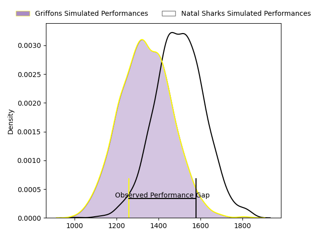
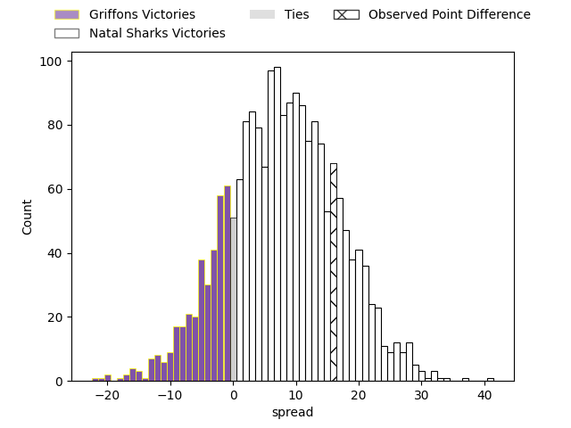
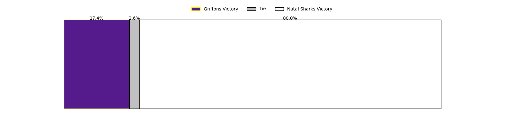
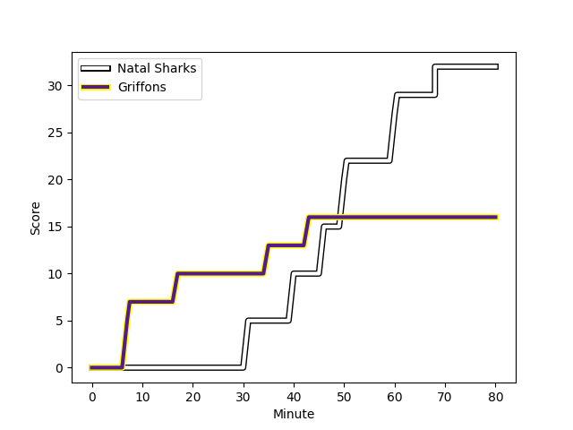
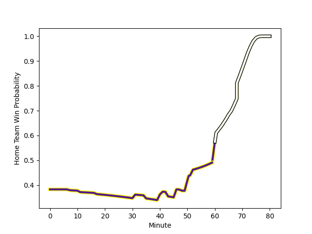

---  
layout: page  
title: Griffons at Natal Sharks; 16-32  
date: 2023-03-11 13:30:00 18:00:00 -0500  
categories: match review  
---
# Griffons at Natal Sharks; 16-32

# Club Level Predictions

The first set of predictions treats a club as the smallest object, as the club develops its members, organizes a gameplan, and deploys its players as needed for each match. This club model has a prediction of 0.702, which translates to predicting Natal Sharks to win by 8.0.

Each club has a rating and a rating deviation (simiar to a Glicko system), and expected performances can be generated. This allows for simulated matches and spreads like the ones below.
## Projected Performances

## Projected Spreads

## Projected Results

# Player Level Predictions

Treating teams instead as an entity made up of the currently active players, I have ratings for each player in an altogether different system. These can be combined to form team ratings once teamsheets are announced, weighting starters a bit higher than the reserves. After the match is played, players can be weighted by their minutes on the field, allowing for an accurate measure of the team's composition. With these compiled team ratings, we can make predictions, measure inaccuracy, and update the individual player ratings.
## Prediction with Player Minutes: Griffons by 16.8

Griffons by 20.8 on a neutral field
## Scores over Time

## Win Probability over Time

There were 11 large changes in win probability in this match
## Prediction without Player Minutes: Griffons by 8.2

Griffons by 12.2 on a neutral pitch

|   Away Minutes | Away Player                                                                          |   Away elo |   Away Percentile |   Number |   Home Percentile |   Home elo | Home Player                                                                                   |   Home Minutes |
|---------------:|:-------------------------------------------------------------------------------------|-----------:|------------------:|---------:|------------------:|-----------:|:----------------------------------------------------------------------------------------------|---------------:|
|             80 | [Stephan de Jager](..//playerfiles//StephandeJager_cleaned.md)                       |     107.55 |                85 |        1 |               nan |      94.3  | [Khwezi Jongamazizi Mona](..//playerfiles//KhweziJongamaziziMona_cleaned.md)                  |             48 |
|             80 | [Dandré Delport](..//playerfiles//DandréDelport_cleaned.md)                          |     104.64 |                81 |        2 |                16 |      84.18 | [Fezokuhle Mbatha](..//playerfiles//FezokuhleMbatha_cleaned.md)                               |             72 |
|             80 | [Dandré Delport](..//playerfiles//DandréDelport_cleaned.md)                          |     104.64 |                81 |        2 |                29 |      84.18 | [Fezokuhle Mbatha](..//playerfiles//FezokuhleMbatha_cleaned.md)                               |             72 |
|             60 | [Doctor Booysen](..//playerfiles//DoctorBooysen_cleaned.md)                          |      99.95 |               nan |        3 |                32 |      88.02 | [Carlu Johann Sadie](..//playerfiles//CarluJohannSadie_cleaned.md)                            |             52 |
|             80 | [Jaco Willemse](..//playerfiles//JacoWillemse_cleaned.md)                            |     112.1  |                88 |        4 |                29 |      88.76 | [Thembelani Bholi](..//playerfiles//ThembelaniBholi_cleaned.md)                               |             66 |
|             11 | [Michael Benadie](..//playerfiles//MichaelBenadie_cleaned.md)                        |      95    |               nan |        5 |               nan |      95    | [Conrad Barnard](..//playerfiles//ConradBarnard_cleaned.md)                                   |             80 |
|             80 | [Thato Siward Mavundla](..//playerfiles//ThatoSiwardMavundla_cleaned.md)             |     119.57 |                93 |        6 |               nan |      95    | [Tinotenda Blithe Mavesere](..//playerfiles//TinotendaBlitheMavesere_cleaned.md)              |             80 |
|             80 | [Jean-Jacques Pretorius](..//playerfiles//Jean-JacquesPretorius_cleaned.md)          |     110.22 |                85 |        7 |               nan |      95    | [Siya Ningiza](..//playerfiles//SiyaNingiza_cleaned.md)                                       |             45 |
|             52 | [Sokuphumla (Soso) Xakalashe](..//playerfiles//Sokuphumla(Soso)Xakalashe_cleaned.md) |     100.04 |                63 |        8 |                22 |      86.72 | [Celimpilo Gumede](..//playerfiles//CelimpiloGumede_cleaned.md)                               |             80 |
|             80 | [Jaywinn Juries](..//playerfiles//JaywinnJuries_cleaned.md)                          |     107.62 |                84 |        9 |               nan |      95    | [Zee Mkhabela](..//playerfiles//ZeeMkhabela_cleaned.md)                                       |             43 |
|             80 | [Duan Pretorius](..//playerfiles//DuanPretorius_cleaned.md)                          |     130.72 |                97 |       10 |               nan |      90.23 | [Lionel Cronje](..//playerfiles//LionelCronje_cleaned.md)                                     |             80 |
|             80 | [Granwill Matthys](..//playerfiles//GranwillMatthys_cleaned.md)                      |     105.66 |                80 |       11 |                43 |      91.8  | [Anthony Alfred Volmink](..//playerfiles//AnthonyAlfredVolmink_cleaned.md)                    |             80 |
|             52 | [Marquit Virgil September](..//playerfiles//MarquitVirgilSeptember_cleaned.md)       |      75.31 |                 8 |       12 |                30 |      88.76 | [Murray Koster](..//playerfiles//MurrayKoster_cleaned.md)                                     |             80 |
|             80 | [Carel-Jan Coetzee](..//playerfiles//Carel-JanCoetzee_cleaned.md)                    |      72.39 |               nan |       13 |                10 |      78.23 | [Marnus Potgieter](..//playerfiles//MarnusPotgieter_cleaned.md)                               |             80 |
|             80 | [Duren Hoffman](..//playerfiles//DurenHoffman_cleaned.md)                            |     107.3  |                79 |       14 |                31 |      83.09 | [Yaw Osei Penxe](..//playerfiles//YawOseiPenxe_cleaned.md)                                    |             80 |
|             80 | [Domenic Smit](..//playerfiles//DomenicSmit_cleaned.md)                              |     106.35 |                78 |       15 |                16 |      81.48 | [Nevaldo Fleurs](..//playerfiles//NevaldoFleurs_cleaned.md)                                   |             41 |
|             69 | [Wikus Nieuwenhuis](..//playerfiles//WikusNieuwenhuis_cleaned.md)                    |     105.15 |                72 |       16 |                73 |     104.36 | [Alwayno Visagie](..//playerfiles//AlwaynoVisagie_cleaned.md)                                 |             39 |
|             28 | [Ludio Fernando Williams](..//playerfiles//LudioFernandoWilliams_cleaned.md)         |      93.7  |                46 |       17 |               nan |      95.23 | [Bradley Davids](..//playerfiles//BradleyDavids_cleaned.md)                                   |             37 |
|             28 | [Robbie Petzer](..//playerfiles//RobbiePetzer_cleaned.md)                            |      49.44 |               nan |       18 |               nan |      95    | [Damon Royle](..//playerfiles//DamonRoyle_cleaned.md)                                         |             35 |
|             20 | [Xolani Jacobs](..//playerfiles//XolaniJacobs_cleaned.md)                            |      98.62 |               nan |       19 |                26 |      85.89 | [Dian Bleuler](..//playerfiles//DianBleuler_cleaned.md)                                       |             32 |
|             20 | [Xolani Jacobs](..//playerfiles//XolaniJacobs_cleaned.md)                            |      98.62 |               nan |       19 |                21 |      85.89 | [Dian Bleuler](..//playerfiles//DianBleuler_cleaned.md)                                       |             32 |
|            nan | nan                                                                                  |     nan    |               nan |       20 |               nan |      92.12 | [Khuthuzani Kingdom Mchunu](..//playerfiles//KhuthuzaniKingdomMchunu_cleaned.md)              |             28 |
|            nan | nan                                                                                  |     nan    |               nan |       21 |                10 |      76.6  | [Athenkosi Ernest (Dave) Khethani](..//playerfiles//AthenkosiErnest(Dave)Khethani_cleaned.md) |             14 |
|            nan | nan                                                                                  |     nan    |               nan |       22 |               nan |      95    | [Masikane Mazwi](..//playerfiles//MasikaneMazwi_cleaned.md)                                   |              8 |

