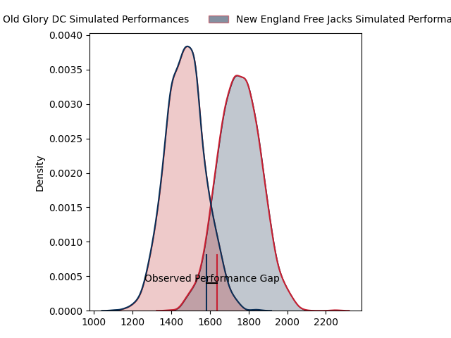
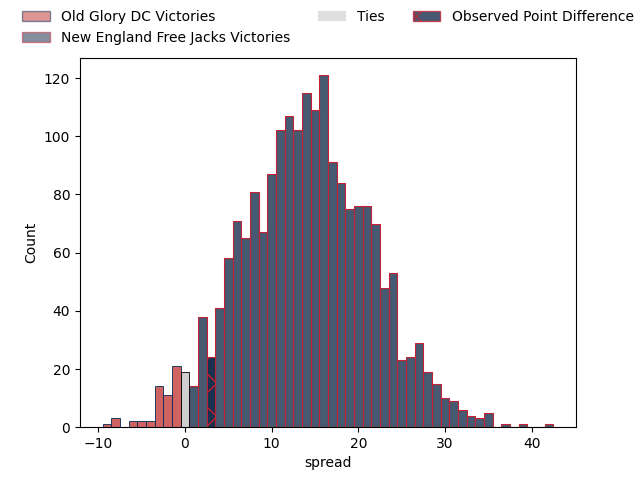
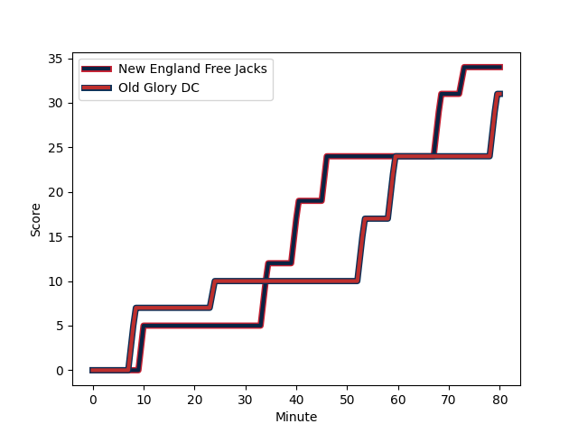
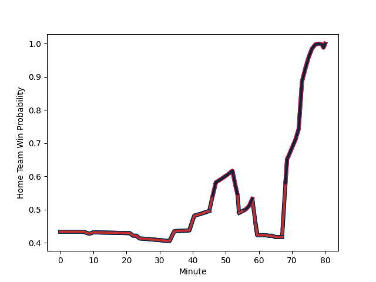

---  
layout: page  
title: Old Glory DC at New England Free Jacks; 31-34  
date: 2023-03-11 21:00:00 18:00:00 -0500  
categories: match review  
---
# Old Glory DC at New England Free Jacks; 31-34

# Club Level Predictions

The first set of predictions treats a club as the smallest object, as the club develops its members, organizes a gameplan, and deploys its players as needed for each match. This club model has a prediction of 0.828, which translates to predicting New England Free Jacks to win by 14.3.

Each club has a rating and a rating deviation (simiar to a Glicko system), and expected performances can be generated. This allows for simulated matches and spreads like the ones below.
## Projected Performances

## Projected Spreads

## Projected Results

# Player Level Predictions

Treating teams instead as an entity made up of the currently active players, I have ratings for each player in an altogether different system. These can be combined to form team ratings once teamsheets are announced, weighting starters a bit higher than the reserves. After the match is played, players can be weighted by their minutes on the field, allowing for an accurate measure of the team's composition. With these compiled team ratings, we can make predictions, measure inaccuracy, and update the individual player ratings.
## Prediction with Player Minutes: Old Glory DC by 7.7

Old Glory DC by 11.7 on a neutral field
## Scores over Time

## Win Probability over Time

There were 14 large changes in win probability in this match
## Prediction without Player Minutes: Old Glory DC by 11.4

Old Glory DC by 15.4 on a neutral pitch

|   Away Minutes | Away Player                                                                    |   Away elo |   Away Percentile |   Number |   Home Percentile |   Home elo | Home Player                                                         |   Home Minutes |
|---------------:|:-------------------------------------------------------------------------------|-----------:|------------------:|---------:|------------------:|-----------:|:--------------------------------------------------------------------|---------------:|
|             47 | [Quentin Newcomer](..//playerfiles//QuentinNewcomer_cleaned.md)                |      63.88 |                21 |        1 |                 9 |      78.08 | [Kyle Ciquera](..//playerfiles//KyleCiquera_cleaned.md)             |             57 |
|             47 | [Quentin Newcomer](..//playerfiles//QuentinNewcomer_cleaned.md)                |      63.88 |                 2 |        1 |                 9 |      78.08 | [Kyle Ciquera](..//playerfiles//KyleCiquera_cleaned.md)             |             57 |
|             69 | [Nic Souchon](..//playerfiles//NicSouchon_cleaned.md)                          |      94.86 |                52 |        2 |               nan |      97.8  | [Andrew Quattrin](..//playerfiles//AndrewQuattrin_cleaned.md)       |             63 |
|             47 | [Kyle Stewart](..//playerfiles//KyleStewart_cleaned.md)                        |      99.91 |                68 |        3 |                94 |     117.89 | [Cole Keith](..//playerfiles//ColeKeith_cleaned.md)                 |             57 |
|             78 | [Colin Grosse](..//playerfiles//ColinGrosse_cleaned.md)                        |      98.35 |                69 |        4 |                80 |     106.67 | [Josh Larsen](..//playerfiles//JoshLarsen_cleaned.md)               |             22 |
|             80 | [Tevita Naqali](..//playerfiles//TevitaNaqali_cleaned.md)                      |      64    |                 4 |        5 |               nan |      95    | [Jesse Parete](..//playerfiles//JesseParete_cleaned.md)             |             80 |
|             80 | [Lautaro Ezequiel Bavaro](..//playerfiles//LautaroEzequielBavaro_cleaned.md)   |     107.99 |                82 |        6 |                88 |     113.16 | [Sam Fischli](..//playerfiles//SamFischli_cleaned.md)               |             54 |
|             74 | [Cory Daniel](..//playerfiles//CoryDaniel_cleaned.md)                          |      97.67 |                59 |        7 |                 0 |       8.6  | [Joe Johnston](..//playerfiles//JoeJohnston_cleaned.md)             |             80 |
|             80 | [Jamason Fa'anana Schultz](..//playerfiles//JamasonFa'ananaSchultz_cleaned.md) |     105.38 |                77 |        8 |                81 |     106.67 | [Wian Conradie](..//playerfiles//WianConradie_cleaned.md)           |             80 |
|             71 | [Danny Joseph Tusitala](..//playerfiles//DannyJosephTusitala_cleaned.md)       |      81.95 |                16 |        9 |                 3 |      66.13 | [John Poland](..//playerfiles//JohnPoland_cleaned.md)               |             80 |
|             80 | [Joaquin Diaz Bonilla](..//playerfiles//JoaquinDiazBonilla_cleaned.md)         |      95.05 |                48 |       10 |                92 |     119.58 | [Jayson Potroz](..//playerfiles//JaysonPotroz_cleaned.md)           |             80 |
|             80 | [William Talataina-Mu](..//playerfiles//WilliamTalataina-Mu_cleaned.md)        |      53.59 |                 1 |       11 |                82 |     106.67 | [Paul Balekana](..//playerfiles//PaulBalekana_cleaned.md)           |             80 |
|             58 | [Thretton Palamo](..//playerfiles//ThrettonPalamo_cleaned.md)                  |      96.23 |                53 |       12 |                 1 |      54.86 | [Wayne van der Bank](..//playerfiles//WaynevanderBank_cleaned.md)   |             80 |
|             80 | [Fermin Martinez](..//playerfiles//FerminMartinez_cleaned.md)                  |     126.53 |                96 |       13 |               nan |      94.12 | [Ben Lesage](..//playerfiles//BenLesage_cleaned.md)                 |             80 |
|             65 | [Marcos Young](..//playerfiles//MarcosYoung_cleaned.md)                        |     100.03 |                65 |       14 |                 0 |      11.18 | [Mitchell Wilson](..//playerfiles//MitchellWilson_cleaned.md)       |             80 |
|             80 | [Kurt Baker](..//playerfiles//KurtBaker_cleaned.md)                            |      95.13 |                51 |       15 |               nan |      96.11 | [Reece MacDonald](..//playerfiles//ReeceMacDonald_cleaned.md)       |             80 |
|             33 | [Jack Iscaro](..//playerfiles//JackIscaro_cleaned.md)                          |      14.39 |                 0 |       16 |                80 |     107.31 | [Tevita Sole](..//playerfiles//TevitaSole_cleaned.md)               |             23 |
|             11 | [Facundo Gattas](..//playerfiles//FacundoGattas_cleaned.md)                    |      95.27 |               nan |       17 |               nan |      95    | [Joel Hintz](..//playerfiles//JoelHintz_cleaned.md)                 |             23 |
|             33 | [Ramiro Herrera](..//playerfiles//RamiroHerrera_cleaned.md)                    |      90.98 |                35 |       18 |               nan |      95    | [Kianu Kereru-Symes](..//playerfiles//KianuKereru-Symes_cleaned.md) |             17 |
|              2 | [Alejandro Daireaux](..//playerfiles//AlejandroDaireaux_cleaned.md)            |     102.75 |                72 |       19 |                49 |      94.93 | [Conor Keys](..//playerfiles//ConorKeys_cleaned.md)                 |             58 |
|              6 | [Fintan Coleman](..//playerfiles//FintanColeman_cleaned.md)                    |      93.73 |                43 |       20 |                 0 |      18.45 | [Cam Davidowicz](..//playerfiles//CamDavidowicz_cleaned.md)         |             26 |
|              6 | [Fintan Coleman](..//playerfiles//FintanColeman_cleaned.md)                    |      93.73 |                43 |       20 |                 0 |      18.45 | [Cam Davidowicz](..//playerfiles//CamDavidowicz_cleaned.md)         |             26 |
|              9 | [John LeFevre](..//playerfiles//JohnLeFevre_cleaned.md)                        |      91.09 |               nan |       21 |               nan |     nan    | nan                                                                 |            nan |
|             22 | [Owen Sheehy](..//playerfiles//OwenSheehy_cleaned.md)                          |      71.42 |                 9 |       22 |               nan |     nan    | nan                                                                 |            nan |
|             15 | [Mike Dabulas](..//playerfiles//MikeDabulas_cleaned.md)                        |     106.52 |                86 |       23 |               nan |     nan    | nan                                                                 |            nan |

