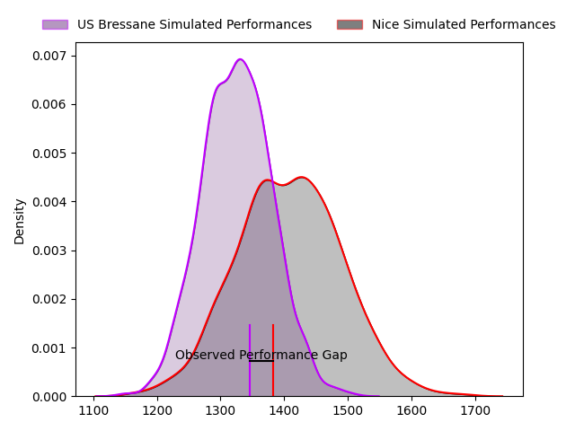
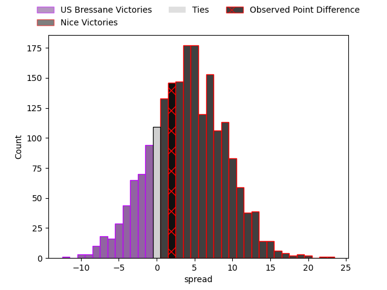
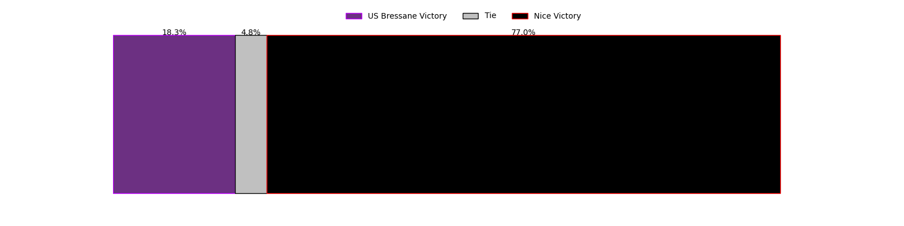

---  
layout: page  
title: US Bressane at Nice; 12-14  
date: 2023-03-11 15:00:00 18:00:00 -0500  
categories: match review  
---
# US Bressane at Nice; 12-14

# Club Level Predictions

The first set of predictions treats a club as the smallest object, as the club develops its members, organizes a gameplan, and deploys its players as needed for each match. This club model has a prediction of 0.613, which translates to predicting Nice to win by 4.1.

Each club has a rating and a rating deviation (simiar to a Glicko system), and expected performances can be generated. This allows for simulated matches and spreads like the ones below.
## Projected Performances

## Projected Spreads

## Projected Results

# Player Level Predictions

Treating teams instead as an entity made up of the currently active players, I have ratings for each player in an altogether different system. These can be combined to form team ratings once teamsheets are announced, weighting starters a bit higher than the reserves. After the match is played, players can be weighted by their minutes on the field, allowing for an accurate measure of the team's composition. With these compiled team ratings, we can make predictions, measure inaccuracy, and update the individual player ratings.
## Prediction with Player Minutes: US Bressane by 2.1

US Bressane by 6.1 on a neutral field

There were 14 large changes in win probability in this match
## Prediction without Player Minutes: US Bressane by 1.7

US Bressane by 5.7 on a neutral pitch

|   Away Minutes | Away Player                                                                       |   Away elo |   Away Percentile |   Number |   Home Percentile |   Home elo | Home Player                                                             |   Home Minutes |
|---------------:|:----------------------------------------------------------------------------------|-----------:|------------------:|---------:|------------------:|-----------:|:------------------------------------------------------------------------|---------------:|
|             66 | [Vazha Kapanadze](..//playerfiles//VazhaKapanadze_cleaned.md)                     |      87.65 |                14 |        1 |                59 |      91.77 | [Sunia Vola](..//playerfiles//SuniaVola_cleaned.md)                     |             51 |
|             66 | [Vazha Kapanadze](..//playerfiles//VazhaKapanadze_cleaned.md)                     |      87.65 |                24 |        1 |                59 |      91.77 | [Sunia Vola](..//playerfiles//SuniaVola_cleaned.md)                     |             51 |
|             66 | [Vazha Kapanadze](..//playerfiles//VazhaKapanadze_cleaned.md)                     |      87.65 |                14 |        1 |                38 |      91.77 | [Sunia Vola](..//playerfiles//SuniaVola_cleaned.md)                     |             51 |
|             66 | [Vazha Kapanadze](..//playerfiles//VazhaKapanadze_cleaned.md)                     |      87.65 |                24 |        1 |                38 |      91.77 | [Sunia Vola](..//playerfiles//SuniaVola_cleaned.md)                     |             51 |
|             66 | [Sione Anga'aelangi](..//playerfiles//SioneAnga'aelangi_cleaned.md)               |      93.37 |                35 |        2 |                83 |     103.74 | [Badri Alkhazashvili](..//playerfiles//BadriAlkhazashvili_cleaned.md)   |             56 |
|             48 | [Willem Johannes Harmse](..//playerfiles//WillemJohannesHarmse_cleaned.md)        |      91.82 |                38 |        3 |               nan |      93.15 | [Nicolas Ciancio](..//playerfiles//NicolasCiancio_cleaned.md)           |             56 |
|             48 | [Willem Johannes Harmse](..//playerfiles//WillemJohannesHarmse_cleaned.md)        |      91.82 |                30 |        3 |               nan |      93.15 | [Nicolas Ciancio](..//playerfiles//NicolasCiancio_cleaned.md)           |             56 |
|             80 | [Koen Bloemen](..//playerfiles//KoenBloemen_cleaned.md)                           |     106.68 |                79 |        4 |                40 |      85.83 | [Thibaud Rey](..//playerfiles//ThibaudRey_cleaned.md)                   |             80 |
|             80 | [Koen Bloemen](..//playerfiles//KoenBloemen_cleaned.md)                           |     106.68 |                79 |        4 |                23 |      85.83 | [Thibaud Rey](..//playerfiles//ThibaudRey_cleaned.md)                   |             80 |
|             62 | [Monty Leverstein](..//playerfiles//MontyLeverstein_cleaned.md)                   |      93.08 |                43 |        5 |                34 |      90.29 | [Marvin Woki](..//playerfiles//MarvinWoki_cleaned.md)                   |             80 |
|             62 | [Monty Leverstein](..//playerfiles//MontyLeverstein_cleaned.md)                   |      93.08 |                37 |        5 |                34 |      90.29 | [Marvin Woki](..//playerfiles//MarvinWoki_cleaned.md)                   |             80 |
|             60 | [TJ Ioane](..//playerfiles//TJIoane_cleaned.md)                                   |      98.8  |                52 |        6 |                62 |     100.32 | [Steffon Armitage](..//playerfiles//SteffonArmitage_cleaned.md)         |             49 |
|             80 | [Loïc Baradel](..//playerfiles//LoïcBaradel_cleaned.md)                           |      95.55 |                52 |        7 |                33 |      89.62 | [Louis Suaud](..//playerfiles//LouisSuaud_cleaned.md)                   |             80 |
|             80 | [Loïc Baradel](..//playerfiles//LoïcBaradel_cleaned.md)                           |      95.55 |                38 |        7 |                33 |      89.62 | [Louis Suaud](..//playerfiles//LouisSuaud_cleaned.md)                   |             80 |
|             80 | [Loïc Baradel](..//playerfiles//LoïcBaradel_cleaned.md)                           |      95.55 |                52 |        7 |                52 |      89.62 | [Louis Suaud](..//playerfiles//LouisSuaud_cleaned.md)                   |             80 |
|             80 | [Loïc Baradel](..//playerfiles//LoïcBaradel_cleaned.md)                           |      95.55 |                38 |        7 |                52 |      89.62 | [Louis Suaud](..//playerfiles//LouisSuaud_cleaned.md)                   |             80 |
|             80 | [Wael May](..//playerfiles//WaelMay_cleaned.md)                                   |     114.23 |                80 |        8 |                11 |      74.56 | [Martin Freytes](..//playerfiles//MartinFreytes_cleaned.md)             |             50 |
|             80 | [Wael May](..//playerfiles//WaelMay_cleaned.md)                                   |     114.23 |                89 |        8 |                11 |      74.56 | [Martin Freytes](..//playerfiles//MartinFreytes_cleaned.md)             |             50 |
|             59 | [Robin Graulle](..//playerfiles//RobinGraulle_cleaned.md)                         |      92.52 |                24 |        9 |                60 |      98.41 | [Mathieu Lorée](..//playerfiles//MathieuLorée_cleaned.md)               |             80 |
|             59 | [Robin Graulle](..//playerfiles//RobinGraulle_cleaned.md)                         |      92.52 |                43 |        9 |                60 |      98.41 | [Mathieu Lorée](..//playerfiles//MathieuLorée_cleaned.md)               |             80 |
|             59 | [Christian Lacombe](..//playerfiles//ChristianLacombe_cleaned.md)                 |      89.48 |                31 |       10 |                55 |      97.2  | [Mathis Viard](..//playerfiles//MathisViard_cleaned.md)                 |             40 |
|             80 | [Kavekini Tabu](..//playerfiles//KavekiniTabu_cleaned.md)                         |      86.02 |                21 |       11 |                57 |      95.97 | [Baptiste Delage](..//playerfiles//BaptisteDelage_cleaned.md)           |             80 |
|             80 | [Parataiso Silafai-Lea'ana](..//playerfiles//ParataisoSilafai-Lea'ana_cleaned.md) |     121.85 |                93 |       12 |                66 |     100.32 | [Luca Cutayar](..//playerfiles//LucaCutayar_cleaned.md)                 |             80 |
|             80 | [Benjamin Doy](..//playerfiles//BenjaminDoy_cleaned.md)                           |      86.13 |                24 |       13 |                58 |      98    | [Julien Fritz](..//playerfiles//JulienFritz_cleaned.md)                 |             63 |
|             80 | [Élie De Fleurian](..//playerfiles//ÉlieDeFleurian_cleaned.md)                    |     101.55 |                49 |       14 |                57 |      98.21 | [Augustin Slowik](..//playerfiles//AugustinSlowik_cleaned.md)           |             80 |
|             80 | [Élie De Fleurian](..//playerfiles//ÉlieDeFleurian_cleaned.md)                    |     101.55 |                69 |       14 |                57 |      98.21 | [Augustin Slowik](..//playerfiles//AugustinSlowik_cleaned.md)           |             80 |
|             80 | [Audric Sanlaville](..//playerfiles//AudricSanlaville_cleaned.md)                 |      90.9  |                41 |       15 |                45 |      93.53 | [David Odiete](..//playerfiles//DavidOdiete_cleaned.md)                 |             80 |
|             32 | [Zauri Tevdorashvili](..//playerfiles//ZauriTevdorashvili_cleaned.md)             |      70.37 |                 4 |       16 |                18 |      84.01 | [Agustin Ormaechea](..//playerfiles//AgustinOrmaechea_cleaned.md)       |             40 |
|             32 | [Zauri Tevdorashvili](..//playerfiles//ZauriTevdorashvili_cleaned.md)             |      70.37 |                 4 |       16 |                35 |      84.01 | [Agustin Ormaechea](..//playerfiles//AgustinOrmaechea_cleaned.md)       |             40 |
|             21 | [Nicolas Faure](..//playerfiles//NicolasFaure_cleaned.md)                         |     118.43 |                95 |       17 |                15 |      82.47 | [Arthur Vignolles](..//playerfiles//ArthurVignolles_cleaned.md)         |             31 |
|             21 | [Nicolas Faure](..//playerfiles//NicolasFaure_cleaned.md)                         |     118.43 |                95 |       17 |                28 |      82.47 | [Arthur Vignolles](..//playerfiles//ArthurVignolles_cleaned.md)         |             31 |
|             21 | [Sebastian Poet](..//playerfiles//SebastianPoet_cleaned.md)                       |     110.58 |                85 |       18 |                95 |     123.12 | [Laijiasa Bolenaivalu](..//playerfiles//LaijiasaBolenaivalu_cleaned.md) |             30 |
|             20 | [Thomas Déliance](..//playerfiles//ThomasDéliance_cleaned.md)                     |     108.15 |                81 |       19 |                34 |      88.16 | [Nicolas Lemaire](..//playerfiles//NicolasLemaire_cleaned.md)           |             29 |
|             18 | [Cyril Veyret](..//playerfiles//CyrilVeyret_cleaned.md)                           |     129.13 |                97 |       20 |                77 |     103.61 | [James Johnston](..//playerfiles//JamesJohnston_cleaned.md)             |             24 |
|             14 | [Quentin Drancourt](..//playerfiles//QuentinDrancourt_cleaned.md)                 |     112.68 |                87 |       21 |                22 |      86.8  | [Kurt Stanley Haupt](..//playerfiles//KurtStanleyHaupt_cleaned.md)      |             24 |
|             14 | [Louis Dasalmartini](..//playerfiles//LouisDasalmartini_cleaned.md)               |      91.43 |               nan |       22 |                 3 |      71.96 | [Hugo Martin](..//playerfiles//HugoMartin_cleaned.md)                   |             17 |

