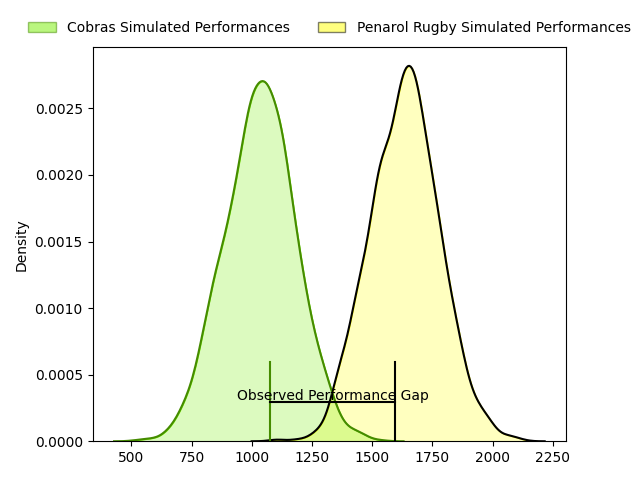
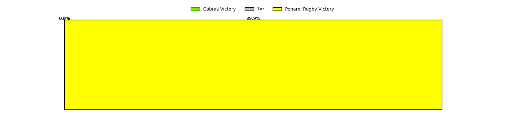
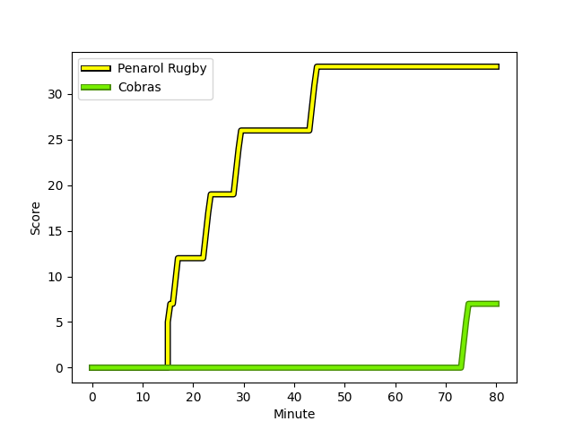

---  
layout: page  
title: Cobras at Penarol Rugby; 7-33  
date: 2023-03-11 22:00:00 18:00:00 -0500  
categories: match review  
---
# Cobras at Penarol Rugby; 7-33

# Club Level Predictions

The first set of predictions treats a club as the smallest object, as the club develops its members, organizes a gameplan, and deploys its players as needed for each match. This club model has a prediction of 0.959, which translates to predicting Penarol Rugby to win by 30.1.

Each club has a rating and a rating deviation (simiar to a Glicko system), and expected performances can be generated. This allows for simulated matches and spreads like the ones below.
## Projected Performances

## Projected Spreads

## Projected Results

# Player Level Predictions

Treating teams instead as an entity made up of the currently active players, I have ratings for each player in an altogether different system. These can be combined to form team ratings once teamsheets are announced, weighting starters a bit higher than the reserves. After the match is played, players can be weighted by their minutes on the field, allowing for an accurate measure of the team's composition. With these compiled team ratings, we can make predictions, measure inaccuracy, and update the individual player ratings.
## Prediction with Player Minutes: Penarol Rugby by 23.8

Penarol Rugby by 19.8 on a neutral field
## Scores over Time

## Win Probability over Time

There were 1 large changes in win probability in this match
## Prediction without Player Minutes: Penarol Rugby by 25.8

Penarol Rugby by 21.8 on a neutral pitch

|   Away Minutes | Away Player                                                                              |   Away elo |   Away Percentile |   Number |   Home Percentile |   Home elo | Home Player                                                                                     |   Home Minutes |
|---------------:|:-----------------------------------------------------------------------------------------|-----------:|------------------:|---------:|------------------:|-----------:|:------------------------------------------------------------------------------------------------|---------------:|
|             58 | [Levy Marinho](..//playerfiles//LevyMarinho_cleaned.md)                                  |      54.16 |                 1 |        1 |                61 |      97.89 | [Mateo Perillo](..//playerfiles//MateoPerillo_cleaned.md)                                       |             53 |
|             58 | [Levy Marinho](..//playerfiles//LevyMarinho_cleaned.md)                                  |      54.16 |                 6 |        1 |                61 |      97.89 | [Mateo Perillo](..//playerfiles//MateoPerillo_cleaned.md)                                       |             53 |
|             64 | [Endy Willian](..//playerfiles//EndyWillian_cleaned.md)                                  |      70.02 |                 4 |        2 |                77 |     101.85 | [Emiliano Faccennini](..//playerfiles//EmilianoFaccennini_cleaned.md)                           |             53 |
|             47 | [Joel Ramirez](..//playerfiles//JoelRamirez_cleaned.md)                                  |      88.07 |                30 |        3 |               nan |      94.38 | [Diego Arbelo](..//playerfiles//DiegoArbelo_cleaned.md)                                         |             53 |
|             80 | [Lucio Anconetani](..//playerfiles//LucioAnconetani_cleaned.md)                          |      76.16 |                 6 |        4 |                49 |      95.07 | [Felipe Aliaga](..//playerfiles//FelipeAliaga_cleaned.md)                                       |             58 |
|             40 | [Gabriel Paganini](..//playerfiles//GabrielPaganini_cleaned.md)                          |      65.01 |                 4 |        5 |               nan |      98.11 | [Eric Dosantos](..//playerfiles//EricDosantos_cleaned.md)                                       |             80 |
|             80 | [Cleber Dias](..//playerfiles//CleberDias_cleaned.md)                                    |      70.42 |                 5 |        6 |                44 |      92.68 | [Manuel Ardao](..//playerfiles//ManuelArdao_cleaned.md)                                         |             53 |
|             80 | [Cleber Dias](..//playerfiles//CleberDias_cleaned.md)                                    |      70.42 |                 3 |        6 |                44 |      92.68 | [Manuel Ardao](..//playerfiles//ManuelArdao_cleaned.md)                                         |             53 |
|             53 | [Diver Ceballos](..//playerfiles//DiverCeballos_cleaned.md)                              |      68.12 |                 3 |        7 |                20 |      84.27 | [Carlos Manuel Deus Lopes de Amorin](..//playerfiles//CarlosManuelDeusLopesdeAmorin_cleaned.md) |             80 |
|             80 | [Andre Arruda](..//playerfiles//AndreArruda_cleaned.md)                                  |      81.84 |                15 |        8 |                40 |      92.68 | [Manuel Diana](..//playerfiles//ManuelDiana_cleaned.md)                                         |             80 |
|             40 | [Felipe Goncalves Cunha](..//playerfiles//FelipeGoncalvesCunha_cleaned.md)               |      90.56 |               nan |        9 |                51 |      95.51 | [Santiago Álvarez Viera Da Cunha](..//playerfiles//SantiagoÁlvarezVieraDaCunha_cleaned.md)      |             64 |
|             80 | [Lucas Ferrer Spago](..//playerfiles//LucasFerrerSpago_cleaned.md)                       |     104.04 |                64 |       10 |                86 |     110.22 | [Juan Zuccarino](..//playerfiles//JuanZuccarino_cleaned.md)                                     |             80 |
|             80 | [Alain Andres Altahona Fulleda](..//playerfiles//AlainAndresAltahonaFulleda_cleaned.md)  |      78.28 |                12 |       11 |                43 |      92.68 | [Juan Manuel Alonso](..//playerfiles//JuanManuelAlonso_cleaned.md)                              |             80 |
|             80 | [Robert Tenorio](..//playerfiles//RobertTenorio_cleaned.md)                              |      76.37 |                 9 |       12 |                67 |     100.26 | [Guillermo Storace](..//playerfiles//GuillermoStorace_cleaned.md)                               |             80 |
|             80 | [Robson Alves de Morais](..//playerfiles//RobsonAlvesdeMorais_cleaned.md)                |      95.81 |               nan |       13 |                16 |      82.59 | [Tomas Inciarte Rachetti](..//playerfiles//TomasInciarteRachetti_cleaned.md)                    |             65 |
|             70 | [Ariel Rodrigues](..//playerfiles//ArielRodrigues_cleaned.md)                            |      88.47 |                28 |       14 |               nan |      95    | [Gaston Mieres Valente](..//playerfiles//GastonMieresValente_cleaned.md)                        |             55 |
|             48 | [Nicolas Cantarutti](..//playerfiles//NicolasCantarutti_cleaned.md)                      |      75.71 |                 9 |       15 |                46 |      92.68 | [Rodrigo Silva](..//playerfiles//RodrigoSilva_cleaned.md)                                       |             80 |
|             40 | [Douglas Rauth](..//playerfiles//DouglasRauth_cleaned.md)                                |      84.85 |                23 |       16 |                63 |      98.22 | [Edgardo Matias Benitez Santin](..//playerfiles//EdgardoMatiasBenitezSantin_cleaned.md)         |             27 |
|             40 | [Ben Donald](..//playerfiles//BenDonald_cleaned.md)                                      |     100.79 |                66 |       17 |                18 |      84.92 | [Guillermo Pujadas Leon](..//playerfiles//GuillermoPujadasLeon_cleaned.md)                      |             27 |
|             33 | [Bautista Vidal](..//playerfiles//BautistaVidal_cleaned.md)                              |      88.3  |                29 |       18 |                51 |      94.47 | [Mathias Franco](..//playerfiles//MathiasFranco_cleaned.md)                                     |             27 |
|             32 | [Guilherme Coghetto](..//playerfiles//GuilhermeCoghetto_cleaned.md)                      |      70.14 |                 7 |       19 |                35 |      90.17 | [Lucas Bianchi](..//playerfiles//LucasBianchi_cleaned.md)                                       |             27 |
|             27 | [Donnacha Byrne](..//playerfiles//DonnachaByrne_cleaned.md)                              |     100.11 |                67 |       20 |                21 |      85.17 | [Alfonso Silva](..//playerfiles//AlfonsoSilva_cleaned.md)                                       |             25 |
|             22 | [Alexandre Alves](..//playerfiles//AlexandreAlves_cleaned.md)                            |      82.55 |                14 |       21 |               nan |      95    | [Juan Manuel Rodriguez](..//playerfiles//JuanManuelRodriguez_cleaned.md)                        |             22 |
|             16 | [Diego Vidal](..//playerfiles//DiegoVidal_cleaned.md)                                    |      96.01 |               nan |       22 |               nan |      95.94 | [Juan Francisco Torres Burwood](..//playerfiles//JuanFranciscoTorresBurwood_cleaned.md)         |             16 |
|             10 | [Sergio Manoel Silveira De Luna](..//playerfiles//SergioManoelSilveiraDeLuna_cleaned.md) |      90.06 |               nan |       23 |                41 |      92.68 | [Felipe Etcheverry](..//playerfiles//FelipeEtcheverry_cleaned.md)                               |             15 |

