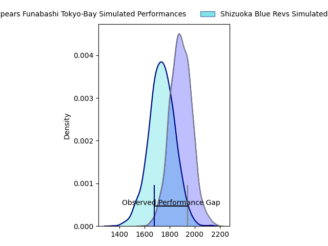
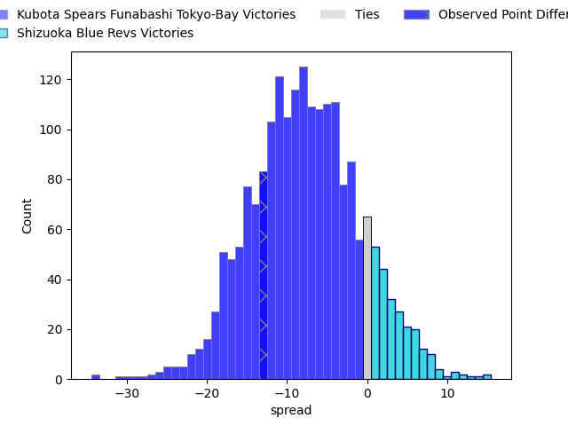
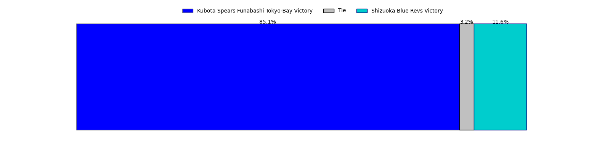

---  
layout: page  
title: Kubota Spears Funabashi Tokyo-Bay at Shizuoka Blue Revs; 40-27  
date: 2023-03-11 06:30:00 18:00:00 -0500  
categories: match review  
---
# Kubota Spears Funabashi Tokyo-Bay at Shizuoka Blue Revs; 40-27

# Club Level Predictions

The first set of predictions treats a club as the smallest object, as the club develops its members, organizes a gameplan, and deploys its players as needed for each match. This club model has a prediction of 0.298, which translates to predicting Kubota Spears Funabashi Tokyo-Bay to win by 7.7.

Each club has a rating and a rating deviation (simiar to a Glicko system), and expected performances can be generated. This allows for simulated matches and spreads like the ones below.
## Projected Performances

## Projected Spreads

## Projected Results

# Player Level Predictions

Treating teams instead as an entity made up of the currently active players, I have ratings for each player in an altogether different system. These can be combined to form team ratings once teamsheets are announced, weighting starters a bit higher than the reserves. After the match is played, players can be weighted by their minutes on the field, allowing for an accurate measure of the team's composition. With these compiled team ratings, we can make predictions, measure inaccuracy, and update the individual player ratings.
## Prediction with Player Minutes: Kubota Spears Funabashi Tokyo-Bay by 2.5

Kubota Spears Funabashi Tokyo-Bay by 6.5 on a neutral field

There were 7 large changes in win probability in this match
## Prediction without Player Minutes: Kubota Spears Funabashi Tokyo-Bay by 3.6

Kubota Spears Funabashi Tokyo-Bay by 7.6 on a neutral pitch

|   Away Minutes | Away Player                                                                                                              |   Away elo |   Away Percentile |   Number |   Home Percentile |   Home elo | Home Player                                                                                     |   Home Minutes |
|---------------:|:-------------------------------------------------------------------------------------------------------------------------|-----------:|------------------:|---------:|------------------:|-----------:|:------------------------------------------------------------------------------------------------|---------------:|
|             51 | [Kota Kaishi](..//playerfiles//KotaKaishi_cleaned.md)                                                                    |     116.73 |                93 |        1 |                80 |     104.81 | [Kazuhiro Kawata](..//playerfiles//KazuhiroKawata_cleaned.md)                                   |             75 |
|             58 | [Malcolm Justin Marx](..//playerfiles//MalcolmJustinMarx_cleaned.md)                                                     |     102.94 |                76 |        2 |                74 |     102.58 | [Takeshi Hino](..//playerfiles//TakeshiHino_cleaned.md)                                         |             75 |
|             51 | [Shoya Matsunami](..//playerfiles//ShoyaMatsunami_cleaned.md)                                                            |      86.27 |                21 |        3 |                85 |     108.06 | [Heiichiro Ito](..//playerfiles//HeiichiroIto_cleaned.md)                                       |             75 |
|             58 | [Yuki Aoki](..//playerfiles//YukiAoki_cleaned.md)                                                                        |     103.92 |                75 |        4 |                89 |     114.55 | [Yuya Odo](..//playerfiles//YuyaOdo_cleaned.md)                                                 |             80 |
|             80 | [David James Bulbring](..//playerfiles//DavidJamesBulbring_cleaned.md)                                                   |     110.31 |                85 |        5 |                70 |     102.6  | [Murray Douglas](..//playerfiles//MurrayDouglas_cleaned.md)                                     |             75 |
|             80 | [Pieter Hermias Cornelius (Lappies) Labuschagne](..//playerfiles//PieterHermiasCornelius(Lappies)Labuschagne_cleaned.md) |     109.83 |                84 |        6 |                64 |      99.64 | [Malgene Ilaua](..//playerfiles//MalgeneIlaua_cleaned.md)                                       |             80 |
|             31 | [Takeo Suenaga](..//playerfiles//TakeoSuenaga_cleaned.md)                                                                |     126.42 |                95 |        7 |                79 |     106.87 | [Richard Goh Jones](..//playerfiles//RichardGohJones_cleaned.md)                                |             64 |
|             80 | [Faulua Makisi](..//playerfiles//FauluaMakisi_cleaned.md)                                                                |     113.77 |                89 |        8 |                71 |     103.41 | [Albertus Stephanus (Kwagga) Smith](..//playerfiles//AlbertusStephanus(Kwagga)Smith_cleaned.md) |             40 |
|             52 | [Kazuhiro Taniguchi](..//playerfiles//KazuhiroTaniguchi_cleaned.md)                                                      |     125.08 |                97 |        9 |                73 |     102.8  | [Bryn Hall](..//playerfiles//BrynHall_cleaned.md)                                               |             80 |
|             80 | [Bernard Foley](..//playerfiles//BernardFoley_cleaned.md)                                                                |     106.93 |                79 |       10 |                54 |      96.9  | [Kenta Iemura](..//playerfiles//KentaIemura_cleaned.md)                                         |             80 |
|             64 | [Haruto Kida](..//playerfiles//HarutoKida_cleaned.md)                                                                    |     124    |                95 |       11 |                60 |      98.6  | [Chikara Ito](..//playerfiles//ChikaraIto_cleaned.md)                                           |             47 |
|             80 | [Harumichi Tatekawa](..//playerfiles//HarumichiTatekawa_cleaned.md)                                                      |     102.66 |                72 |       12 |                86 |     111.29 | [Viliami Tahitu'a](..//playerfiles//ViliamiTahitu'a_cleaned.md)                                 |             80 |
|             46 | [Rikus Pretorius](..//playerfiles//RikusPretorius_cleaned.md)                                                            |     103.89 |                74 |       13 |                98 |     134.58 | [Kenta Shikao](..//playerfiles//KentaShikao_cleaned.md)                                         |             58 |
|             80 | [Halatoa Vailea](..//playerfiles//HalatoaVailea_cleaned.md)                                                              |     102.83 |                73 |       14 |                57 |      97.67 | [Eito Maki](..//playerfiles//EitoMaki_cleaned.md)                                               |             80 |
|             80 | [Gerhard Jacobus van den Heever](..//playerfiles//GerhardJacobusvandenHeever_cleaned.md)                                 |     113.01 |                88 |       15 |                68 |     101.93 | [Keagan Faria](..//playerfiles//KeaganFaria_cleaned.md)                                         |             80 |
|             49 | [Masaya Tamaki](..//playerfiles//MasayaTamaki_cleaned.md)                                                                |      94.95 |               nan |       16 |                25 |      87.45 | [Shoji Takuma](..//playerfiles//ShojiTakuma_cleaned.md)                                         |             40 |
|             34 | [Sione Teaupa](..//playerfiles//SioneTeaupa_cleaned.md)                                                                  |     109.78 |                80 |       17 |                21 |      87.34 | [Sam Greene](..//playerfiles//SamGreene_cleaned.md)                                             |             33 |
|             29 | [Yota Kaminori](..//playerfiles//YotaKaminori_cleaned.md)                                                                |      97.71 |                62 |       18 |                82 |     106.5  | [Minoru Tanoue](..//playerfiles//MinoruTanoue_cleaned.md)                                       |             22 |
|             29 | [Opeti Helu](..//playerfiles//OpetiHelu_cleaned.md)                                                                      |     118.54 |                92 |       19 |                96 |     128.2  | [Eishin Kuwano](..//playerfiles//EishinKuwano_cleaned.md)                                       |             16 |
|             28 | [Shinobu Fujiwara](..//playerfiles//ShinobuFujiwara_cleaned.md)                                                          |     104.15 |                78 |       20 |               nan |      86.4  | [Toshiya Hirakawa](..//playerfiles//ToshiyaHirakawa_cleaned.md)                                 |              5 |
|             22 | [Ruan Botha](..//playerfiles//RuanBotha_cleaned.md)                                                                      |     109.32 |                86 |       21 |                44 |      93.28 | [Joren Fuchi](..//playerfiles//JorenFuchi_cleaned.md)                                           |              5 |
|             22 | [Hiraoki Sugimoto](..//playerfiles//HiraokiSugimoto_cleaned.md)                                                          |     113.35 |                86 |       22 |                29 |      89.02 | [Takayoshi Mohara](..//playerfiles//TakayoshiMohara_cleaned.md)                                 |              5 |
|             16 | [Suryung Kim](..//playerfiles//SuryungKim_cleaned.md)                                                                    |     115.53 |                91 |       23 |                50 |      94.91 | [Riki Sugihara](..//playerfiles//RikiSugihara_cleaned.md)                                       |              5 |

