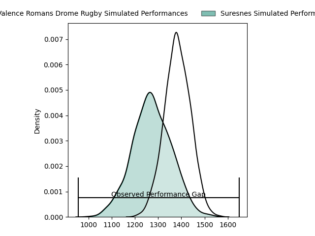
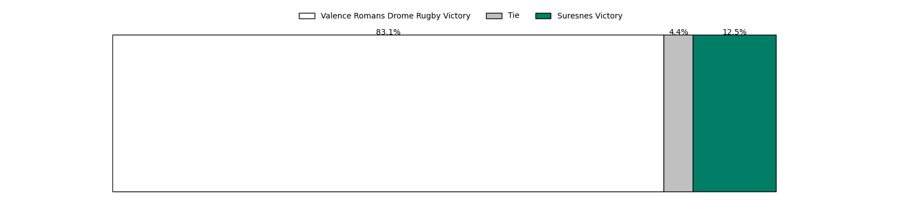

---  
layout: page  
title: Valence Romans Drome Rugby at Suresnes; 47-15  
date: 2023-03-11 16:00:00 18:00:00 -0500  
categories: match review  
---
# Valence Romans Drome Rugby at Suresnes; 47-15

# Club Level Predictions

The first set of predictions treats a club as the smallest object, as the club develops its members, organizes a gameplan, and deploys its players as needed for each match. This club model has a prediction of 0.353, which translates to predicting Valence Romans Drome Rugby to win by 5.3.

Each club has a rating and a rating deviation (simiar to a Glicko system), and expected performances can be generated. This allows for simulated matches and spreads like the ones below.
## Projected Performances

## Projected Spreads

## Projected Results

# Player Level Predictions

Treating teams instead as an entity made up of the currently active players, I have ratings for each player in an altogether different system. These can be combined to form team ratings once teamsheets are announced, weighting starters a bit higher than the reserves. After the match is played, players can be weighted by their minutes on the field, allowing for an accurate measure of the team's composition. With these compiled team ratings, we can make predictions, measure inaccuracy, and update the individual player ratings.
## Prediction with Player Minutes: Valence Romans Drome Rugby by 21.2

Valence Romans Drome Rugby by 25.2 on a neutral field

There were 2 large changes in win probability in this match
## Prediction without Player Minutes: Valence Romans Drome Rugby by 22.8

Valence Romans Drome Rugby by 26.8 on a neutral pitch

|   Away Minutes | Away Player                                                                             |   Away elo |   Away Percentile |   Number |   Home Percentile |   Home elo | Home Player                                                                  |   Home Minutes |
|---------------:|:----------------------------------------------------------------------------------------|-----------:|------------------:|---------:|------------------:|-----------:|:-----------------------------------------------------------------------------|---------------:|
|             44 | [Sami Zouhair](..//playerfiles//SamiZouhair_cleaned.md)                                 |     132.75 |                98 |        1 |                20 |      84.33 | [Lucas Dycke](..//playerfiles//LucasDycke_cleaned.md)                        |             53 |
|             44 | [Dorian Marco Pena](..//playerfiles//DorianMarcoPena_cleaned.md)                        |     107.23 |                85 |        2 |                26 |      87.92 | [Hayam El Bibouji](..//playerfiles//HayamElBibouji_cleaned.md)               |             56 |
|             44 | [John Henry Fincham](..//playerfiles//JohnHenryFincham_cleaned.md)                      |      98.13 |                61 |        3 |                82 |     103.39 | [Victor Damian Arias](..//playerfiles//VictorDamianArias_cleaned.md)         |             56 |
|             80 | [François Uys](..//playerfiles//FrançoisUys_cleaned.md)                                 |      94.84 |                44 |        4 |                 0 |      44.49 | [Sacha Yahi](..//playerfiles//SachaYahi_cleaned.md)                          |             80 |
|             80 | [François Uys](..//playerfiles//FrançoisUys_cleaned.md)                                 |      94.84 |                44 |        4 |                 5 |      44.49 | [Sacha Yahi](..//playerfiles//SachaYahi_cleaned.md)                          |             80 |
|             50 | [Florian Goumat](..//playerfiles//FlorianGoumat_cleaned.md)                             |     100.32 |                64 |        5 |                34 |      90.36 | [Wian Vosloo](..//playerfiles//WianVosloo_cleaned.md)                        |             80 |
|             59 | [Alexis Armary](..//playerfiles//AlexisArmary_cleaned.md)                               |     116.66 |                90 |        6 |                24 |      86.3  | [Florian Desbordes](..//playerfiles//FlorianDesbordes_cleaned.md)            |             60 |
|             80 | [Sven Bernat Girlando](..//playerfiles//SvenBernatGirlando_cleaned.md)                  |     100.2  |                66 |        7 |                69 |     101.64 | [Bastien Berenguel](..//playerfiles//BastienBerenguel_cleaned.md)            |             80 |
|             80 | [Ioane Iashagashvili](..//playerfiles//IoaneIashagashvili_cleaned.md)                   |      97.53 |                53 |        8 |                25 |      87.62 | [Louis-Mathieu Jazeix](..//playerfiles//Louis-MathieuJazeix_cleaned.md)      |             60 |
|             80 | [Ioane Iashagashvili](..//playerfiles//IoaneIashagashvili_cleaned.md)                   |      97.53 |                53 |        8 |                41 |      87.62 | [Louis-Mathieu Jazeix](..//playerfiles//Louis-MathieuJazeix_cleaned.md)      |             60 |
|             59 | [Tim Menzel](..//playerfiles//TimMenzel_cleaned.md)                                     |      77.62 |                11 |        9 |                24 |      84.09 | [Enzo Barbarit](..//playerfiles//EnzoBarbarit_cleaned.md)                    |             60 |
|             59 | [Joris Moura](..//playerfiles//JorisMoura_cleaned.md)                                   |     110.4  |                84 |       10 |                27 |      88.52 | [Ignacio Mieres](..//playerfiles//IgnacioMieres_cleaned.md)                  |             80 |
|             59 | [Joris Moura](..//playerfiles//JorisMoura_cleaned.md)                                   |     110.4  |                84 |       10 |                44 |      88.52 | [Ignacio Mieres](..//playerfiles//IgnacioMieres_cleaned.md)                  |             80 |
|             80 | [Tim Giresse](..//playerfiles//TimGiresse_cleaned.md)                                   |      93.44 |                45 |       11 |                13 |      80.13 | [Thomas Baudy](..//playerfiles//ThomasBaudy_cleaned.md)                      |             80 |
|             80 | [Akuila Joeli Tabualevu](..//playerfiles//AkuilaJoeliTabualevu_cleaned.md)              |      95.08 |                37 |       12 |                12 |      73.5  | [Hugo Detre](..//playerfiles//HugoDetre_cleaned.md)                          |             56 |
|             80 | [Akuila Joeli Tabualevu](..//playerfiles//AkuilaJoeliTabualevu_cleaned.md)              |      95.08 |                37 |       12 |                 7 |      73.5  | [Hugo Detre](..//playerfiles//HugoDetre_cleaned.md)                          |             56 |
|             50 | [Ben Neiceru](..//playerfiles//BenNeiceru_cleaned.md)                                   |     115.13 |                90 |       13 |                58 |      97.99 | [Lilan Savioz Fouillet](..//playerfiles//LilanSaviozFouillet_cleaned.md)     |             80 |
|             80 | [Adam Vargas](..//playerfiles//AdamVargas_cleaned.md)                                   |     101.95 |                70 |       14 |                18 |      83.69 | [Alexis Clement](..//playerfiles//AlexisClement_cleaned.md)                  |             60 |
|             80 | [Charles Bouldoire](..//playerfiles//CharlesBouldoire_cleaned.md)                       |      99.68 |               nan |       15 |                20 |      81.95 | [Goulwen Gueho](..//playerfiles//GoulwenGueho_cleaned.md)                    |             80 |
|             36 | [Anthony Aléo](..//playerfiles//AnthonyAléo_cleaned.md)                                 |      91.01 |                30 |       16 |                37 |      91.37 | [Elias Coulibaly](..//playerfiles//EliasCoulibaly_cleaned.md)                |             27 |
|             36 | [Anthony Aléo](..//playerfiles//AnthonyAléo_cleaned.md)                                 |      91.01 |                30 |       16 |                53 |      91.37 | [Elias Coulibaly](..//playerfiles//EliasCoulibaly_cleaned.md)                |             27 |
|             36 | [Kevin Goze](..//playerfiles//KevinGoze_cleaned.md)                                     |     100.36 |               nan |       17 |                10 |      79.68 | [Thomas Bordes](..//playerfiles//ThomasBordes_cleaned.md)                    |             24 |
|             36 | [Kevin Goze](..//playerfiles//KevinGoze_cleaned.md)                                     |     100.36 |               nan |       17 |                16 |      79.68 | [Thomas Bordes](..//playerfiles//ThomasBordes_cleaned.md)                    |             24 |
|             36 | [Yanis Gimenez](..//playerfiles//YanisGimenez_cleaned.md)                               |     105.5  |                82 |       18 |                18 |      84.75 | [Leandro Mario Assi](..//playerfiles//LeandroMarioAssi_cleaned.md)           |             24 |
|             36 | [Yanis Gimenez](..//playerfiles//YanisGimenez_cleaned.md)                               |     105.5  |                82 |       18 |                26 |      84.75 | [Leandro Mario Assi](..//playerfiles//LeandroMarioAssi_cleaned.md)           |             24 |
|             30 | [John Adriaan (Ian) Groenewald](..//playerfiles//JohnAdriaan(Ian)Groenewald_cleaned.md) |      92.76 |               nan |       19 |                42 |      91.28 | [Pierre Le Huby](..//playerfiles//PierreLeHuby_cleaned.md)                   |             24 |
|             30 | [Jonathan Quinnez](..//playerfiles//JonathanQuinnez_cleaned.md)                         |     116.23 |                91 |       20 |                38 |      89.59 | [Youssouf Yatera](..//playerfiles//YoussoufYatera_cleaned.md)                |             20 |
|             21 | [Matthew Gicquel](..//playerfiles//MatthewGicquel_cleaned.md)                           |      89.8  |                24 |       21 |                17 |      85.63 | [Antonie Delport Claasen](..//playerfiles//AntonieDelportClaasen_cleaned.md) |             20 |
|             21 | [Mickael Thébault](..//playerfiles//MickaelThébault_cleaned.md)                         |      98.72 |               nan |       22 |                11 |      72.23 | [Quentin Dauvergne](..//playerfiles//QuentinDauvergne_cleaned.md)            |             20 |
|             21 | [Mickael Thébault](..//playerfiles//MickaelThébault_cleaned.md)                         |      98.72 |               nan |       22 |                 6 |      72.23 | [Quentin Dauvergne](..//playerfiles//QuentinDauvergne_cleaned.md)            |             20 |
|             21 | [Lucas Méret](..//playerfiles//LucasMéret_cleaned.md)                                   |     101.18 |                62 |       23 |                 0 |      48.33 | [Jean-Baptiste Fuster](..//playerfiles//Jean-BaptisteFuster_cleaned.md)      |             20 |

