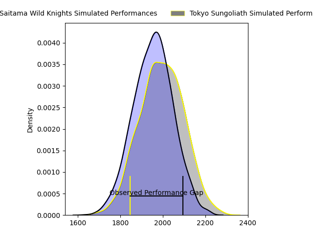
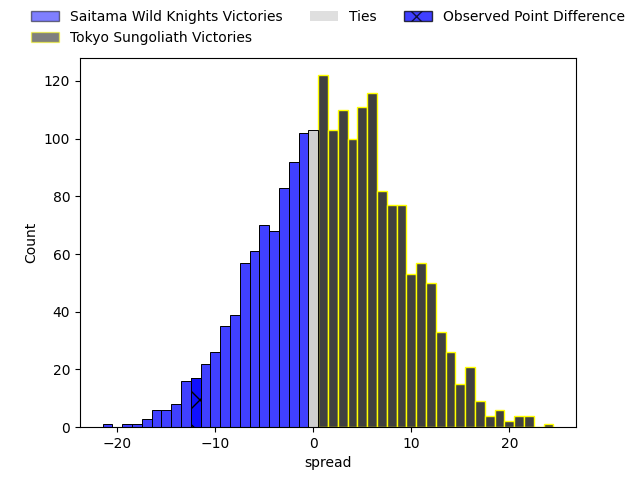
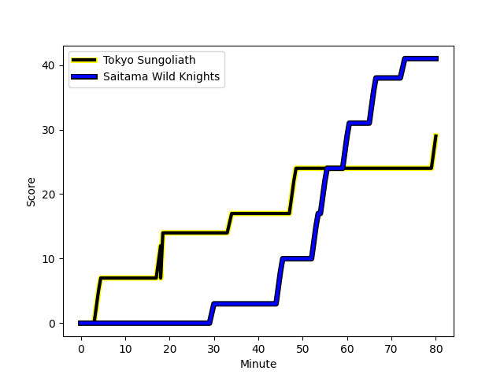
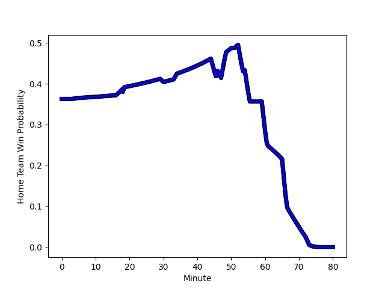

---  
layout: page  
title: Saitama Wild Knights at Tokyo Sungoliath; 41-29  
date: 2023-03-11 06:00:00 18:00:00 -0500  
categories: match review  
---
# Saitama Wild Knights at Tokyo Sungoliath; 41-29

# Club Level Predictions

The first set of predictions treats a club as the smallest object, as the club develops its members, organizes a gameplan, and deploys its players as needed for each match. This club model has a prediction of 0.554, which translates to predicting Tokyo Sungoliath to win by 2.0.

Each club has a rating and a rating deviation (simiar to a Glicko system), and expected performances can be generated. This allows for simulated matches and spreads like the ones below.
## Projected Performances

## Projected Spreads

## Projected Results

# Player Level Predictions

Treating teams instead as an entity made up of the currently active players, I have ratings for each player in an altogether different system. These can be combined to form team ratings once teamsheets are announced, weighting starters a bit higher than the reserves. After the match is played, players can be weighted by their minutes on the field, allowing for an accurate measure of the team's composition. With these compiled team ratings, we can make predictions, measure inaccuracy, and update the individual player ratings.
## Prediction with Player Minutes: Saitama Wild Knights by 20.5

Saitama Wild Knights by 24.5 on a neutral field
## Scores over Time

## Win Probability over Time

There were 8 large changes in win probability in this match
## Prediction without Player Minutes: Saitama Wild Knights by 20.0

Saitama Wild Knights by 24.0 on a neutral pitch

|   Away Minutes | Away Player                                                      |   Away elo |   Away Percentile |   Number |   Home Percentile |   Home elo | Home Player                                                           |   Home Minutes |
|---------------:|:-----------------------------------------------------------------|-----------:|------------------:|---------:|------------------:|-----------:|:----------------------------------------------------------------------|---------------:|
|             46 | [Keita Inagaki](..//playerfiles//KeitaInagaki_cleaned.md)        |     113.91 |                91 |        1 |                49 |      94.43 | [Kenta Kobayashi](..//playerfiles//KentaKobayashi_cleaned.md)         |             17 |
|             46 | [Atsushi Sakate](..//playerfiles//AtsushiSakate_cleaned.md)      |     123.52 |                97 |        2 |                98 |     128.35 | [Shunta Nakamura](..//playerfiles//ShuntaNakamura_cleaned.md)         |             47 |
|             46 | [Shohei Hirano](..//playerfiles//ShoheiHirano_cleaned.md)        |     115.44 |                92 |        3 |                89 |     105.65 | [Shinnosuke Kakinaga](..//playerfiles//ShinnosukeKakinaga_cleaned.md) |             61 |
|             51 | [Liam Mitchell](..//playerfiles//LiamMitchell_cleaned.md)        |     117.93 |                92 |        4 |                60 |      98.51 | [Hendrik Tui](..//playerfiles//HendrikTui_cleaned.md)                 |             54 |
|             73 | [Lodewyk de Jager](..//playerfiles//LodewykdeJager_cleaned.md)   |     114.19 |                89 |        5 |                73 |     103.29 | [Harrison Hockings](..//playerfiles//HarrisonHockings_cleaned.md)     |             80 |
|             80 | [Ben Gunter](..//playerfiles//BenGunter_cleaned.md)              |     109.83 |                85 |        6 |                85 |     110.13 | [Kanji Shimokawa](..//playerfiles//KanjiShimokawa_cleaned.md)         |             67 |
|             80 | [Lachlan Boshier](..//playerfiles//LachlanBoshier_cleaned.md)    |     114.07 |                81 |        7 |                57 |      97.29 | [Kai Yamamoto](..//playerfiles//KaiYamamoto_cleaned.md)               |             80 |
|             80 | [Lachlan Boshier](..//playerfiles//LachlanBoshier_cleaned.md)    |     114.07 |                88 |        7 |                57 |      97.29 | [Kai Yamamoto](..//playerfiles//KaiYamamoto_cleaned.md)               |             80 |
|             80 | [Jack Cornelsen](..//playerfiles//JackCornelsen_cleaned.md)      |     114.68 |                89 |        8 |                83 |     102.53 | [Tevita Tatafu](..//playerfiles//TevitaTatafu_cleaned.md)             |             80 |
|             73 | [Taiki Koyama](..//playerfiles//TaikiKoyama_cleaned.md)          |     151.58 |                99 |        9 |               nan |      98.25 | [Yutaka Nagare](..//playerfiles//YutakaNagare_cleaned.md)             |             61 |
|             80 | [Rikiya Matsuda](..//playerfiles//RikiyaMatsuda_cleaned.md)      |     118.94 |                92 |       10 |                51 |      96.08 | [Aaron Cruden](..//playerfiles//AaronCruden_cleaned.md)               |             61 |
|             80 | [Rikiya Matsuda](..//playerfiles//RikiyaMatsuda_cleaned.md)      |     118.94 |                88 |       10 |                51 |      96.08 | [Aaron Cruden](..//playerfiles//AaronCruden_cleaned.md)               |             61 |
|             80 | [Ryuji Noguchi](..//playerfiles//RyujiNoguchi_cleaned.md)        |     130.4  |                97 |       11 |                54 |      96.38 | [Tevita Li](..//playerfiles//TevitaLi_cleaned.md)                     |             80 |
|             70 | [Damian de Allende](..//playerfiles//DamiandeAllende_cleaned.md) |     111.34 |                88 |       12 |                90 |     115.07 | [Ryoto Nakamura](..//playerfiles//RyotoNakamura_cleaned.md)           |             80 |
|             80 | [Dylan Riley](..//playerfiles//DylanRiley_cleaned.md)            |     121.69 |                95 |       13 |                71 |     102.04 | [Shogo Nakano](..//playerfiles//ShogoNakano_cleaned.md)               |             80 |
|             80 | [Tomoki Osada](..//playerfiles//TomokiOsada_cleaned.md)          |     112.73 |                89 |       14 |                80 |     105.73 | [Seiya Ozaki](..//playerfiles//SeiyaOzaki_cleaned.md)                 |             80 |
|             77 | [Takuya Yamasawa](..//playerfiles//TakuyaYamasawa_cleaned.md)    |     123.21 |                94 |       15 |                47 |      92.95 | [Kotaro Matsushima](..//playerfiles//KotaroMatsushima_cleaned.md)     |             77 |
|             34 | [Shota Horie](..//playerfiles//ShotaHorie_cleaned.md)            |     103.65 |                71 |       16 |                88 |     106.66 | [Shintaro Ishihara](..//playerfiles//ShintaroIshihara_cleaned.md)     |             63 |
|             34 | [Craig Millar](..//playerfiles//CraigMillar_cleaned.md)          |     111.71 |                85 |       17 |                63 |      93.45 | [Kosuke Horikoshi](..//playerfiles//KosukeHorikoshi_cleaned.md)       |             33 |
|             34 | [Taiki Fujii](..//playerfiles//TaikiFujii_cleaned.md)            |     116.75 |                93 |       18 |                72 |      99.7  | [Tom Savage](..//playerfiles//TomSavage_cleaned.md)                   |             26 |
|             34 | [Taiki Fujii](..//playerfiles//TaikiFujii_cleaned.md)            |     116.75 |                88 |       18 |                72 |      99.7  | [Tom Savage](..//playerfiles//TomSavage_cleaned.md)                   |             26 |
|             29 | [Shota Fukui](..//playerfiles//ShotaFukui_cleaned.md)            |     128.68 |                96 |       19 |                63 |      98.39 | [Kan Nakano](..//playerfiles//KanNakano_cleaned.md)                   |             19 |
|             10 | [Vince Aso](..//playerfiles//VinceAso_cleaned.md)                |     104.19 |                73 |       20 |                68 |     100.48 | [Naoto Saito](..//playerfiles//NaotoSaito_cleaned.md)                 |             19 |
|              7 | [Esei Ha'angana](..//playerfiles//EseiHa'angana_cleaned.md)      |     129.5  |                97 |       21 |                49 |      91.15 | [Hikaru Tamura](..//playerfiles//HikaruTamura_cleaned.md)             |             19 |
|              7 | [Esei Ha'angana](..//playerfiles//EseiHa'angana_cleaned.md)      |     129.5  |                97 |       21 |                49 |      91.15 | [Hikaru Tamura](..//playerfiles//HikaruTamura_cleaned.md)             |             19 |
|              7 | [Keisuke Uchida](..//playerfiles//KeisukeUchida_cleaned.md)      |     112.14 |                90 |       22 |                75 |     104.44 | [Koji Iino](..//playerfiles//KojiIino_cleaned.md)                     |             13 |
|              7 | [Keisuke Uchida](..//playerfiles//KeisukeUchida_cleaned.md)      |     112.14 |                82 |       22 |                75 |     104.44 | [Koji Iino](..//playerfiles//KojiIino_cleaned.md)                     |             13 |
|              3 | [Kyohei Yamasawa](..//playerfiles//KyoheiYamasawa_cleaned.md)    |      80.96 |                18 |       23 |                38 |      90.29 | [Taiga Ozaki](..//playerfiles//TaigaOzaki_cleaned.md)                 |              3 |

