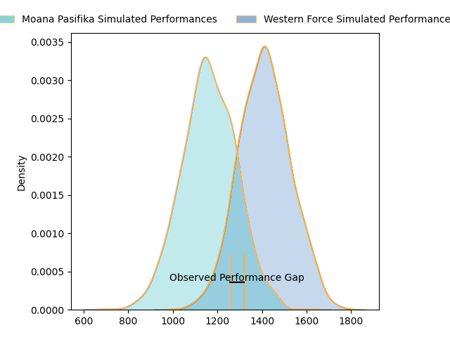
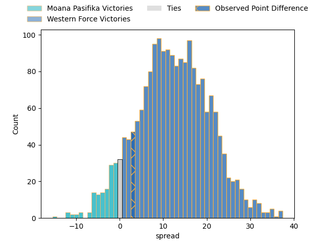

---  
layout: page  
title: Moana Pasifika at Western Force; 18.0-21.0  
date: 2023-03-11 06:00:00 18:00:00 -0500  
categories: match review  
---
# Moana Pasifika at Western Force; 18.0-21.0

# Club Level Predictions

The first set of predictions treats a club as the smallest object, as the club develops its members, organizes a gameplan, and deploys its players as needed for each match. This club model has a prediction of 0.791, which translates to predicting Western Force to win by 12.4.

Each club has a rating and a rating deviation (simiar to a Glicko system), and expected performances can be generated. This allows for simulated matches and spreads like the ones below.
## Projected Performances

## Projected Spreads

## Projected Results

# Player Level Predictions

Treating teams instead as an entity made up of the currently active players, I have ratings for each player in an altogether different system. These can be combined to form team ratings once teamsheets are announced, weighting starters a bit higher than the reserves. After the match is played, players can be weighted by their minutes on the field, allowing for an accurate measure of the team's composition. With these compiled team ratings, we can make predictions, measure inaccuracy, and update the individual player ratings.
## Prediction with Player Minutes: Western Force by 19.2

Western Force by 15.2 on a neutral field

There were 9 large changes in win probability in this match
## Prediction without Player Minutes: Western Force by 20.4

Western Force by 16.4 on a neutral pitch

|   Away Minutes | Away Player                                                             |   Away elo |   Away Percentile |   Number |   Home Percentile |   Home elo | Home Player                                                                   |   Home Minutes |
|---------------:|:------------------------------------------------------------------------|-----------:|------------------:|---------:|------------------:|-----------:|:------------------------------------------------------------------------------|---------------:|
|             57 | [Abraham Pole](..//playerfiles//AbrahamPole_cleaned.md)                 |     102.39 |                78 |        1 |                92 |     116.33 | [Tom Robertson](..//playerfiles//TomRobertson_cleaned.md)                     |             74 |
|             57 | [Samiuela Moli](..//playerfiles//SamiuelaMoli_cleaned.md)               |      77.39 |                 8 |        2 |                98 |     130.88 | [Folau Fainga'a](..//playerfiles//FolauFainga'a_cleaned.md)                   |             46 |
|             69 | [Suetena Asomua](..//playerfiles//SuetenaAsomua_cleaned.md)             |      77.87 |                 9 |        3 |                95 |     119.24 | [Santiago Medrano](..//playerfiles//SantiagoMedrano_cleaned.md)               |             74 |
|             83 | [Alex McRobbie](..//playerfiles//AlexMcRobbie_cleaned.md)               |      64.35 |                 3 |        4 |                 2 |      50.74 | [Felix Kalapu](..//playerfiles//FelixKalapu_cleaned.md)                       |             48 |
|             67 | [Mike McKee](..//playerfiles//MikeMcKee_cleaned.md)                     |      75.15 |                11 |        5 |                87 |     111.92 | [Jeremy Thrush](..//playerfiles//JeremyThrush_cleaned.md)                     |             58 |
|             83 | [Miracle Faiilagi](..//playerfiles//MiracleFaiilagi_cleaned.md)         |      90.83 |                38 |        6 |                 2 |      61.47 | [Tim Anstee](..//playerfiles//TimAnstee_cleaned.md)                           |             83 |
|             83 | [Solomone Funaki](..//playerfiles//SolomoneFunaki_cleaned.md)           |      90.67 |                37 |        7 |                10 |      79.42 | [Ollie Callan](..//playerfiles//OllieCallan_cleaned.md)                       |             83 |
|             52 | [Lotu Inisi](..//playerfiles//LotuInisi_cleaned.md)                     |     100.83 |                67 |        8 |                19 |      83.87 | [Rahboni Warren-Vosayaco](..//playerfiles//RahboniWarren-Vosayaco_cleaned.md) |             73 |
|             69 | [Ere Enari](..//playerfiles//EreEnari_cleaned.md)                       |     101.82 |                72 |        9 |                84 |     106.1  | [Ian Prior](..//playerfiles//IanPrior_cleaned.md)                             |             51 |
|             83 | [Lincoln McClutchie](..//playerfiles//LincolnMcClutchie_cleaned.md)     |      95    |               nan |       10 |                71 |     102.5  | [Bryce Hegarty](..//playerfiles//BryceHegarty_cleaned.md)                     |             83 |
|             49 | [Anzelo Tuitavuki](..//playerfiles//AnzeloTuitavuki_cleaned.md)         |      69.23 |                 5 |       11 |                96 |     127.08 | [Toni Pulu](..//playerfiles//ToniPulu_cleaned.md)                             |             83 |
|             66 | [Danny Toala](..//playerfiles//DannyToala_cleaned.md)                   |     112.63 |                86 |       12 |                97 |     128.95 | [Hamish Stewart](..//playerfiles//HamishStewart_cleaned.md)                   |             83 |
|             83 | [Fine Inisi](..//playerfiles//FineInisi_cleaned.md)                     |      72.9  |                 6 |       13 |                12 |      80.23 | [Bayley Kuenzle](..//playerfiles//BayleyKuenzle_cleaned.md)                   |             68 |
|             83 | [Timoci Tavatavanawai](..//playerfiles//TimociTavatavanawai_cleaned.md) |      85.03 |                20 |       14 |                93 |     119.45 | [Manasa Mataele](..//playerfiles//ManasaMataele_cleaned.md)                   |             56 |
|             83 | [William Havili](..//playerfiles//WilliamHavili_cleaned.md)             |     121.33 |                94 |       15 |                73 |     104.1  | [Chase Tiatia](..//playerfiles//ChaseTiatia_cleaned.md)                       |             83 |
|             26 | [Luteru Tolai](..//playerfiles//LuteruTolai_cleaned.md)                 |     102.45 |                67 |       16 |                76 |     101.7  | [Tom Horton](..//playerfiles//TomHorton_cleaned.md)                           |             37 |
|             26 | [Ezekiel Lindenmuth](..//playerfiles//EzekielLindenmuth_cleaned.md)     |      73.52 |                 5 |       17 |               nan |      86.52 | [Angus Wagner](..//playerfiles//AngusWagner_cleaned.md)                       |              9 |
|             21 | [Isileli Tu'ungafasi](..//playerfiles//IsileliTu'ungafasi_cleaned.md)   |      68.98 |               nan |       18 |               nan |      93.78 | [Siosifa Amone](..//playerfiles//SiosifaAmone_cleaned.md)                     |             19 |
|             16 | [Potu Leavasa](..//playerfiles//PotuLeavasa_cleaned.md)                 |      77.3  |                 8 |       19 |                10 |      76.46 | [Ryan McCauley](..//playerfiles//RyanMcCauley_cleaned.md)                     |             35 |
|             24 | [Jonah Mau'u](..//playerfiles//JonahMau'u_cleaned.md)                   |     101.49 |                67 |       20 |                34 |      88.01 | [Jackson Pugh](..//playerfiles//JacksonPugh_cleaned.md)                       |             25 |
|             14 | [Manu Paea](..//playerfiles//ManuPaea_cleaned.md)                       |      92.83 |                44 |       21 |                53 |      96.07 | [Issak Fines-Leleiwasa](..//playerfiles//IssakFines-Leleiwasa_cleaned.md)     |             32 |
|             17 | [Henry Taefu](..//playerfiles//HenryTaefu_cleaned.md)                   |      83.54 |                18 |       22 |               nan |      95    | [Nikolai Foliaki](..//playerfiles//NikolaiFoliaki_cleaned.md)                 |             15 |
|             34 | [Levi Aumua](..//playerfiles//LeviAumua_cleaned.md)                     |     121.64 |                95 |       23 |               nan |      92.9  | [George Poolman](..//playerfiles//GeorgePoolman_cleaned.md)                   |             27 |

