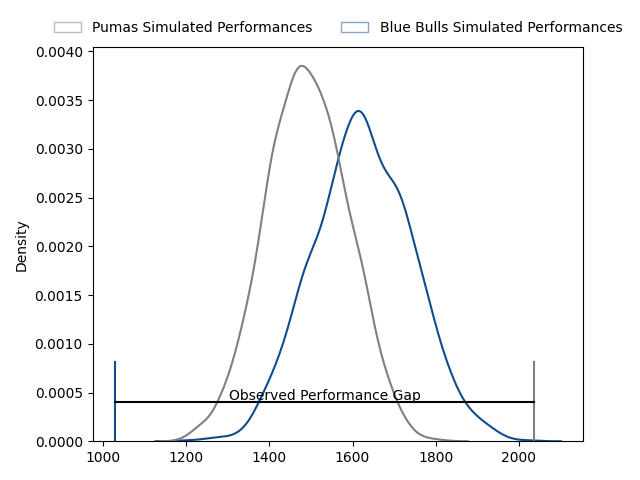
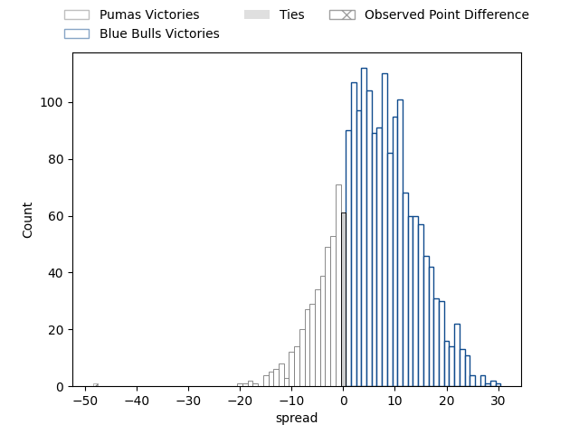
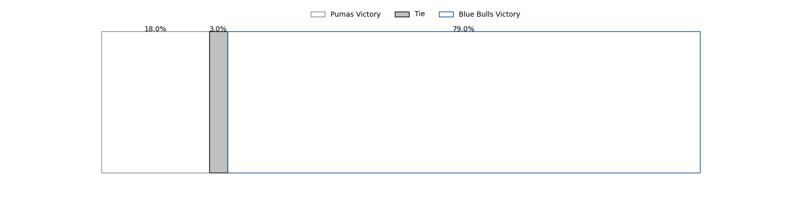

---  
layout: page  
title: Pumas at Blue Bulls; 63-15  
date: 2023-03-12 12:00:00 18:00:00 -0500  
categories: match review  
---
# Pumas at Blue Bulls; 63-15

# Club Level Predictions

The first set of predictions treats a club as the smallest object, as the club develops its members, organizes a gameplan, and deploys its players as needed for each match. This club model has a prediction of 0.67, which translates to predicting Blue Bulls to win by 6.5.

Each club has a rating and a rating deviation (simiar to a Glicko system), and expected performances can be generated. This allows for simulated matches and spreads like the ones below.
## Projected Performances

## Projected Spreads

## Projected Results

# Player Level Predictions

Treating teams instead as an entity made up of the currently active players, I have ratings for each player in an altogether different system. These can be combined to form team ratings once teamsheets are announced, weighting starters a bit higher than the reserves. After the match is played, players can be weighted by their minutes on the field, allowing for an accurate measure of the team's composition. With these compiled team ratings, we can make predictions, measure inaccuracy, and update the individual player ratings.
## Prediction with Player Minutes: Pumas by 20.4

Pumas by 24.4 on a neutral field

There were 4 large changes in win probability in this match
## Prediction without Player Minutes: Pumas by 23.5

Pumas by 27.5 on a neutral pitch

|   Away Minutes | Away Player                                                              |   Away elo |   Away Percentile |   Number |   Home Percentile |   Home elo | Home Player                                                                                    |   Home Minutes |
|---------------:|:-------------------------------------------------------------------------|-----------:|------------------:|---------:|------------------:|-----------:|:-----------------------------------------------------------------------------------------------|---------------:|
|             59 | [Corne Fourie](..//playerfiles//CorneFourie_cleaned.md)                  |      95    |               nan |        1 |                81 |     105.18 | [Gerhardus Cornelis Steenkamp](..//playerfiles//GerhardusCornelisSteenkamp_cleaned.md)         |             57 |
|             59 | [Eduan Swart](..//playerfiles//EduanSwart_cleaned.md)                    |     111.28 |                89 |        2 |                 9 |      77.44 | [Jan Hendrik Wessels](..//playerfiles//JanHendrikWessels_cleaned.md)                           |             69 |
|             59 | [Njabula Juice Gumede](..//playerfiles//NjabulaJuiceGumede_cleaned.md)   |      95    |               nan |        3 |                27 |      87.88 | [Francois Klopper](..//playerfiles//FrancoisKlopper_cleaned.md)                                |             40 |
|             59 | [Njabula Gumede](..//playerfiles//NjabulaGumede_cleaned.md)              |      88.12 |                24 |        3 |                27 |      87.88 | [Francois Klopper](..//playerfiles//FrancoisKlopper_cleaned.md)                                |             40 |
|             80 | [Deon Slabbert](..//playerfiles//DeonSlabbert_cleaned.md)                |     106.71 |                79 |        4 |                17 |      82.62 | [Willem Hendrik Jacques du Plessis](..//playerfiles//WillemHendrikJacquesduPlessis_cleaned.md) |             75 |
|             80 | [Deon Slabbert](..//playerfiles//DeonSlabbert_cleaned.md)                |     106.71 |                79 |        4 |                39 |      82.62 | [Willem Hendrik Jacques du Plessis](..//playerfiles//WillemHendrikJacquesduPlessis_cleaned.md) |             75 |
|             69 | [Shane Monro Kirkwood](..//playerfiles//ShaneMonroKirkwood_cleaned.md)   |     134.59 |                98 |        5 |               nan |      89.14 | [Ruan Vermaak](..//playerfiles//RuanVermaak_cleaned.md)                                        |             80 |
|             80 | [Andre Fouché](..//playerfiles//AndreFouché_cleaned.md)                  |     115.02 |                89 |        6 |                51 |      94.57 | [Phumzile Maqondwana](..//playerfiles//PhumzileMaqondwana_cleaned.md)                          |             46 |
|             80 | [Francois Kleinhans](..//playerfiles//FrancoisKleinhans_cleaned.md)      |      95    |               nan |        7 |               nan |      95    | [Reinhardt Ludwig](..//playerfiles//ReinhardtLudwig_cleaned.md)                                |             80 |
|             69 | [Kwanda Dimaza](..//playerfiles//KwandaDimaza_cleaned.md)                |      98.32 |               nan |        8 |                79 |     106.65 | [Mihlali Langa Mosi](..//playerfiles//MihlaliLangaMosi_cleaned.md)                             |             80 |
|             69 | [Giovanne Snyman](..//playerfiles//GiovanneSnyman_cleaned.md)            |      88.17 |               nan |        9 |                61 |      96.86 | [Bernard van der Linde](..//playerfiles//BernardvanderLinde_cleaned.md)                        |             40 |
|             64 | [Tinus de Beer](..//playerfiles//TinusdeBeer_cleaned.md)                 |     104.26 |                76 |       10 |                29 |      80.03 | [Morne Steyn](..//playerfiles//MorneSteyn_cleaned.md)                                          |             80 |
|             64 | [Tinus de Beer](..//playerfiles//TinusdeBeer_cleaned.md)                 |     104.26 |                76 |       10 |                13 |      80.03 | [Morne Steyn](..//playerfiles//MorneSteyn_cleaned.md)                                          |             80 |
|             80 | [Jade Kyle Stighling](..//playerfiles//JadeKyleStighling_cleaned.md)     |      95    |               nan |       11 |                37 |      91.29 | [S'Busiso Romeo Nkosi](..//playerfiles//S'BusisoRomeoNkosi_cleaned.md)                         |             80 |
|             80 | [Ali Mgijima](..//playerfiles//AliMgijima_cleaned.md)                    |     110.45 |                83 |       12 |                43 |      93.31 | [David Kriel](..//playerfiles//DavidKriel_cleaned.md)                                          |             80 |
|             80 | [Diego Appollis](..//playerfiles//DiegoAppollis_cleaned.md)              |      95.27 |               nan |       13 |                46 |      94.39 | [Lionel Granton Mapoe](..//playerfiles//LionelGrantonMapoe_cleaned.md)                         |             80 |
|             64 | [Sebastian de Klerk](..//playerfiles//SebastiandeKlerk_cleaned.md)       |     130.46 |                97 |       14 |                32 |      89.82 | [Sibongile Vukile Novuka](..//playerfiles//SibongileVukileNovuka_cleaned.md)                   |             40 |
|             80 | [Devon Frank Williams](..//playerfiles//DevonFrankWilliams_cleaned.md)   |      95    |               nan |       15 |                54 |      96.6  | [Wandisile Simelane](..//playerfiles//WandisileSimelane_cleaned.md)                            |             80 |
|             21 | [Etienne Janeke](..//playerfiles//EtienneJaneke_cleaned.md)              |      97.6  |               nan |       16 |                21 |      86.37 | [Mornay Jan Jakobus Smith](..//playerfiles//MornayJanJakobusSmith_cleaned.md)                  |             40 |
|             21 | [Etienne Janeke](..//playerfiles//EtienneJaneke_cleaned.md)              |      97.6  |               nan |       16 |                40 |      86.37 | [Mornay Jan Jakobus Smith](..//playerfiles//MornayJanJakobusSmith_cleaned.md)                  |             40 |
|             21 | [Llewellyn Classen](..//playerfiles//LlewellynClassen_cleaned.md)        |      97.57 |               nan |       17 |                42 |      92.87 | [Keagan Johannes](..//playerfiles//KeaganJohannes_cleaned.md)                                  |             40 |
|             21 | [Simon Raw](..//playerfiles//SimonRaw_cleaned.md)                        |      75.47 |               nan |       18 |               nan |      95    | [Lizo Pumzile Gqoboka](..//playerfiles//LizoPumzileGqoboka_cleaned.md)                         |             23 |
|             16 | [Brandon Terry Thomson](..//playerfiles//BrandonTerryThomson_cleaned.md) |      95    |               nan |       19 |               nan |      87.75 | [Cameron Hanekom](..//playerfiles//CameronHanekom_cleaned.md)                                  |             34 |
|             16 | [Lundi Msenge](..//playerfiles//LundiMsenge_cleaned.md)                  |      95.58 |               nan |       20 |               nan |      95    | [Joe van Zyl](..//playerfiles//JoevanZyl_cleaned.md)                                           |             11 |
|             11 | [Malembe Mpofu](..//playerfiles//MalembeMpofu_cleaned.md)                |      94.88 |                49 |       21 |                40 |      91.67 | [Janko Swanepoel](..//playerfiles//JankoSwanepoel_cleaned.md)                                  |              5 |
|             11 | [Ruwald Van der Merwe](..//playerfiles//RuwaldVanderMerwe_cleaned.md)    |      95    |               nan |       22 |                20 |      84.61 | [Cornal Hendricks](..//playerfiles//CornalHendricks_cleaned.md)                                |             40 |
|             11 | [Chriswill September](..//playerfiles//ChriswillSeptember_cleaned.md)    |     121.65 |                97 |       23 |               nan |     nan    | nan                                                                                            |            nan |

