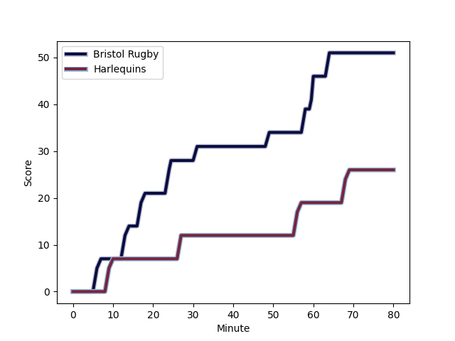
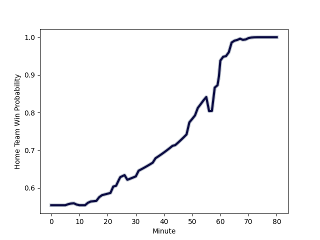

---  
layout: page  
title: Harlequins at Bristol Rugby; 26.0-51.0  
date: 2023-03-12 11:00:00 18:00:00 -0500  
categories: match review  
---
# Harlequins at Bristol Rugby; 26.0-51.0

# Club Level Predictions

The first set of predictions treats a club as the smallest object, as the club develops its members, organizes a gameplan, and deploys its players as needed for each match. This club model has a prediction of 0.602, which translates to predicting Bristol Rugby to win by 3.6.

Each club has a rating and a rating deviation (simiar to a Glicko system), and expected performances can be generated. This allows for simulated matches and spreads like the ones below.
## Projected Performances

## Projected Spreads

## Projected Results

# Player Level Predictions

Treating teams instead as an entity made up of the currently active players, I have ratings for each player in an altogether different system. These can be combined to form team ratings once teamsheets are announced, weighting starters a bit higher than the reserves. After the match is played, players can be weighted by their minutes on the field, allowing for an accurate measure of the team's composition. With these compiled team ratings, we can make predictions, measure inaccuracy, and update the individual player ratings.
## Prediction with Player Minutes: Bristol Rugby by 13.4

Bristol Rugby by 9.4 on a neutral field
## Scores over Time

## Win Probability over Time

There were 5 large changes in win probability in this match
## Prediction without Player Minutes: Bristol Rugby by 12.6

Bristol Rugby by 8.6 on a neutral pitch

|   Away Minutes | Away Player                                                       |   Away elo |   Away Percentile |   Number |   Home Percentile |   Home elo | Home Player                                                   |   Home Minutes |
|---------------:|:------------------------------------------------------------------|-----------:|------------------:|---------:|------------------:|-----------:|:--------------------------------------------------------------|---------------:|
|             44 | [Fin Baxter](..//playerfiles//FinBaxter_cleaned.md)               |      91.54 |                26 |        1 |                73 |     101.69 | [Yann Thomas](..//playerfiles//YannThomas_cleaned.md)         |             57 |
|             80 | [Sam Riley](..//playerfiles//SamRiley_cleaned.md)                 |      96.25 |                32 |        2 |                74 |     101.83 | [Harry Thacker](..//playerfiles//HarryThacker_cleaned.md)     |             55 |
|             52 | [Wilco Louw](..//playerfiles//WilcoLouw_cleaned.md)               |     116.62 |                94 |        3 |                67 |      99.84 | [Max Lahiff](..//playerfiles//MaxLahiff_cleaned.md)           |             57 |
|             80 | [Dino Lamb](..//playerfiles//DinoLamb_cleaned.md)                 |     125.66 |                96 |        4 |                96 |     124.38 | [Joe Batley](..//playerfiles//JoeBatley_cleaned.md)           |             22 |
|             62 | [Stephan Lewies](..//playerfiles//StephanLewies_cleaned.md)       |     102.09 |                70 |        5 |                88 |     112.41 | [Chris Vui](..//playerfiles//ChrisVui_cleaned.md)             |             80 |
|             80 | [Jack Kenningham](..//playerfiles//JackKenningham_cleaned.md)     |      92.11 |                42 |        6 |                97 |     133.71 | [Steven Luatua](..//playerfiles//StevenLuatua_cleaned.md)     |             62 |
|             80 | [James Chisholm](..//playerfiles//JamesChisholm_cleaned.md)       |     104.6  |                77 |        7 |                94 |     120.63 | [Fitz Harding](..//playerfiles//FitzHarding_cleaned.md)       |             66 |
|             66 | [Tom Lawday](..//playerfiles//TomLawday_cleaned.md)               |      92.23 |                39 |        8 |                38 |      92    | [Magnus Bradbury](..//playerfiles//MagnusBradbury_cleaned.md) |             80 |
|             69 | [Danny Care](..//playerfiles//DannyCare_cleaned.md)               |     109.39 |                88 |        9 |                90 |     111.2  | [Harry Randall](..//playerfiles//HarryRandall_cleaned.md)     |             80 |
|             80 | [Will Edwards](..//playerfiles//WillEdwards_cleaned.md)           |     121.83 |                93 |       10 |                85 |     110.58 | [AJ MacGinty](..//playerfiles//AJMacGinty_cleaned.md)         |             37 |
|             80 | [Josh Bassett](..//playerfiles//JoshBassett_cleaned.md)           |     105.36 |                79 |       11 |                95 |     121.89 | [Gabriel Ibitoye](..//playerfiles//GabrielIbitoye_cleaned.md) |             80 |
|             80 | [Andre Esterhuizen](..//playerfiles//AndreEsterhuizen_cleaned.md) |     116.01 |                91 |       12 |                54 |      96.54 | [James Williams](..//playerfiles//JamesWilliams_cleaned.md)   |             80 |
|             72 | [Luke Northmore](..//playerfiles//LukeNorthmore_cleaned.md)       |      99.85 |               nan |       13 |                97 |     129.64 | [Semi Radradra](..//playerfiles//SemiRadradra_cleaned.md)     |             80 |
|             75 | [Cadan Murley](..//playerfiles//CadanMurley_cleaned.md)           |     103.46 |                74 |       14 |                74 |     103.54 | [Ratu Naulago](..//playerfiles//RatuNaulago_cleaned.md)       |             59 |
|             80 | [Nick David](..//playerfiles//NickDavid_cleaned.md)               |     105.11 |                75 |       15 |                69 |     102.17 | [Charles Piutau](..//playerfiles//CharlesPiutau_cleaned.md)   |             80 |
|              4 | [Jack Musk](..//playerfiles//JackMusk_cleaned.md)                 |     107.44 |                86 |       16 |               nan |      97.68 | [Bryan Byrne](..//playerfiles//BryanByrne_cleaned.md)         |             25 |
|             36 | [Joe Marler](..//playerfiles//JoeMarler_cleaned.md)               |      98.86 |                64 |       17 |                97 |     126.44 | [Jake Woolmore](..//playerfiles//JakeWoolmore_cleaned.md)     |             23 |
|             28 | [Will Collier](..//playerfiles//WillCollier_cleaned.md)           |      95    |               nan |       18 |               nan |     100.5  | [George Kloska](..//playerfiles//GeorgeKloska_cleaned.md)     |             23 |
|             18 | [Irne Herbst](..//playerfiles//IrneHerbst_cleaned.md)             |     115.29 |                90 |       19 |                99 |     146.9  | [Joe Joyce](..//playerfiles//JoeJoyce_cleaned.md)             |             58 |
|             10 | [Luke Wallace](..//playerfiles//LukeWallace_cleaned.md)           |      79.58 |                 8 |       20 |                60 |      99.98 | [Jake Heenan](..//playerfiles//JakeHeenan_cleaned.md)         |             18 |
|             11 | [Scott Steele](..//playerfiles//ScottSteele_cleaned.md)           |      96.25 |               nan |       21 |                14 |      82.19 | [Andy Uren](..//playerfiles//AndyUren_cleaned.md)             |             14 |
|              8 | [Oscar Beard](..//playerfiles//OscarBeard_cleaned.md)             |     110.99 |                87 |       22 |                95 |     122.15 | [Sam Bedlow](..//playerfiles//SamBedlow_cleaned.md)           |             43 |
|              5 | [Hayden Hyde](..//playerfiles//HaydenHyde_cleaned.md)             |      94.79 |               nan |       23 |                16 |      89.84 | [Ioan Lloyd](..//playerfiles//IoanLloyd_cleaned.md)           |             21 |

