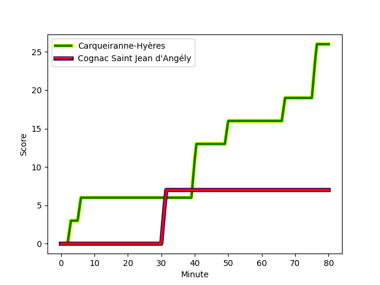
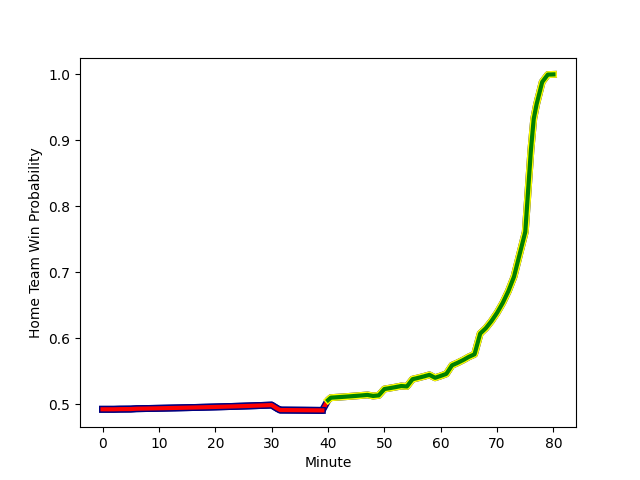

---  
layout: page  
title: Cognac Saint Jean d'Angély at Carqueiranne-Hyères; 7-26  
date: 2023-03-12 15:00:00 18:00:00 -0500  
categories: match review  
---
# Cognac Saint Jean d'Angély at Carqueiranne-Hyères; 7-26

# Club Level Predictions

The first set of predictions treats a club as the smallest object, as the club develops its members, organizes a gameplan, and deploys its players as needed for each match. This club model has a prediction of 0.848, which translates to predicting Carqueiranne-Hyères to win by 15.2.

Each club has a rating and a rating deviation (simiar to a Glicko system), and expected performances can be generated. This allows for simulated matches and spreads like the ones below.
## Projected Performances

## Projected Spreads

## Projected Results

# Player Level Predictions

Treating teams instead as an entity made up of the currently active players, I have ratings for each player in an altogether different system. These can be combined to form team ratings once teamsheets are announced, weighting starters a bit higher than the reserves. After the match is played, players can be weighted by their minutes on the field, allowing for an accurate measure of the team's composition. With these compiled team ratings, we can make predictions, measure inaccuracy, and update the individual player ratings.
## Prediction with Player Minutes: Carqueiranne-Hyères by 2.7

Cognac Saint Jean d'Angély by 1.3 on a neutral field
## Scores over Time

## Win Probability over Time

There were 6 large changes in win probability in this match
## Prediction without Player Minutes: Carqueiranne-Hyères by 4.1

Carqueiranne-Hyères by 0.1 on a neutral pitch

|   Away Minutes | Away Player                                                     |   Away elo |   Away Percentile |   Number |   Home Percentile |   Home elo | Home Player                                                                    |   Home Minutes |
|---------------:|:----------------------------------------------------------------|-----------:|------------------:|---------:|------------------:|-----------:|:-------------------------------------------------------------------------------|---------------:|
|             40 | [Kevin Tougne](..//playerfiles//KevinTougne_cleaned.md)         |     113.74 |                73 |        1 |                68 |      97.92 | [Costel Burtila](..//playerfiles//CostelBurtila_cleaned.md)                    |             54 |
|             40 | [Kevin Tougne](..//playerfiles//KevinTougne_cleaned.md)         |     113.74 |                92 |        1 |                68 |      97.92 | [Costel Burtila](..//playerfiles//CostelBurtila_cleaned.md)                    |             54 |
|             40 | [Maxime Gau](..//playerfiles//MaximeGau_cleaned.md)             |      97.81 |                61 |        2 |                14 |      82.38 | [Michael Tyumenev](..//playerfiles//MichaelTyumenev_cleaned.md)                |             48 |
|             80 | [Martin Augeix](..//playerfiles//MartinAugeix_cleaned.md)       |     111.9  |                90 |        3 |               nan |      92.32 | [Loni Uhila](..//playerfiles//LoniUhila_cleaned.md)                            |             66 |
|             80 | [Thomas Toevalu](..//playerfiles//ThomasToevalu_cleaned.md)     |      65.5  |                 4 |        4 |                 2 |      47.57 | [Lucas Cazac](..//playerfiles//LucasCazac_cleaned.md)                          |             80 |
|             80 | [Thomas Toevalu](..//playerfiles//ThomasToevalu_cleaned.md)     |      65.5  |                 4 |        4 |                 1 |      47.57 | [Lucas Cazac](..//playerfiles//LucasCazac_cleaned.md)                          |             80 |
|             55 | [Filipe Manu](..//playerfiles//FilipeManu_cleaned.md)           |     102.27 |                41 |        5 |                31 |      89.83 | [César Damiani](..//playerfiles//CésarDamiani_cleaned.md)                      |             80 |
|             55 | [Filipe Manu](..//playerfiles//FilipeManu_cleaned.md)           |     102.27 |                71 |        5 |                31 |      89.83 | [César Damiani](..//playerfiles//CésarDamiani_cleaned.md)                      |             80 |
|             80 | [Lucas Gulizzi](..//playerfiles//LucasGulizzi_cleaned.md)       |      81.62 |                13 |        6 |                52 |      94.96 | [Florian Munoz Rivero](..//playerfiles//FlorianMunozRivero_cleaned.md)         |             55 |
|             80 | [Lucas Gulizzi](..//playerfiles//LucasGulizzi_cleaned.md)       |      81.62 |                 4 |        6 |                52 |      94.96 | [Florian Munoz Rivero](..//playerfiles//FlorianMunozRivero_cleaned.md)         |             55 |
|             80 | [Gio Sordia](..//playerfiles//GioSordia_cleaned.md)             |     124.25 |                95 |        7 |                34 |      89.61 | [Alexander Nowicki](..//playerfiles//AlexanderNowicki_cleaned.md)              |             80 |
|             74 | [Matthieu Thomas](..//playerfiles//MatthieuThomas_cleaned.md)   |      95.09 |                48 |        8 |                67 |      98.78 | [André Gorin](..//playerfiles//AndréGorin_cleaned.md)                          |             66 |
|             74 | [Matthieu Thomas](..//playerfiles//MatthieuThomas_cleaned.md)   |      95.09 |                48 |        8 |                59 |      98.78 | [André Gorin](..//playerfiles//AndréGorin_cleaned.md)                          |             66 |
|             62 | [William Beaudon](..//playerfiles//WilliamBeaudon_cleaned.md)   |      96.5  |                46 |        9 |                95 |     113.9  | [Thomas Sonetti](..//playerfiles//ThomasSonetti_cleaned.md)                    |             59 |
|             62 | [Serafin Bordoli](..//playerfiles//SerafinBordoli_cleaned.md)   |     109.87 |                65 |       10 |                16 |      82.48 | [Théo Defrance](..//playerfiles//ThéoDefrance_cleaned.md)                      |             55 |
|             62 | [Serafin Bordoli](..//playerfiles//SerafinBordoli_cleaned.md)   |     109.87 |                84 |       10 |                16 |      82.48 | [Théo Defrance](..//playerfiles//ThéoDefrance_cleaned.md)                      |             55 |
|             80 | [Vincent Pageneau](..//playerfiles//VincentPageneau_cleaned.md) |      71.82 |                 7 |       11 |                96 |     125.4  | [Kalani Robert](..//playerfiles//KalaniRobert_cleaned.md)                      |             80 |
|             80 | [Henry Tuilagi](..//playerfiles//HenryTuilagi_cleaned.md)       |      97.87 |                58 |       12 |                96 |     124.09 | [Romain Leveque](..//playerfiles//RomainLeveque_cleaned.md)                    |             80 |
|             80 | [Isimeli Kuruibua](..//playerfiles//IsimeliKuruibua_cleaned.md) |     106.47 |                81 |       13 |                66 |     100.11 | [Charles Brousse](..//playerfiles//CharlesBrousse_cleaned.md)                  |             68 |
|             80 | [Jone Tuva](..//playerfiles//JoneTuva_cleaned.md)               |      93.13 |                45 |       14 |                55 |      91.73 | [Josselyn Bouchon](..//playerfiles//JosselynBouchon_cleaned.md)                |             80 |
|             80 | [Jone Tuva](..//playerfiles//JoneTuva_cleaned.md)               |      93.13 |                45 |       14 |                40 |      91.73 | [Josselyn Bouchon](..//playerfiles//JosselynBouchon_cleaned.md)                |             80 |
|             55 | [Nils Guyon](..//playerfiles//NilsGuyon_cleaned.md)             |      97.9  |                50 |       15 |                50 |      94.49 | [Ionel Melinte](..//playerfiles//IonelMelinte_cleaned.md)                      |             80 |
|             40 | [Bryan Bruno](..//playerfiles//BryanBruno_cleaned.md)           |      92.06 |               nan |       16 |                44 |      84.72 | [Eli Serra-Miglietti](..//playerfiles//EliSerra-Miglietti_cleaned.md)          |             26 |
|             40 | [Bryan Bruno](..//playerfiles//BryanBruno_cleaned.md)           |      92.06 |               nan |       16 |                17 |      84.72 | [Eli Serra-Miglietti](..//playerfiles//EliSerra-Miglietti_cleaned.md)          |             26 |
|             40 | [Paul Sauzaret](..//playerfiles//PaulSauzaret_cleaned.md)       |      82.24 |                13 |       17 |                 9 |      69.54 | [Yan Tabarot](..//playerfiles//YanTabarot_cleaned.md)                          |             32 |
|             40 | [Paul Sauzaret](..//playerfiles//PaulSauzaret_cleaned.md)       |      82.24 |                13 |       17 |                 4 |      69.54 | [Yan Tabarot](..//playerfiles//YanTabarot_cleaned.md)                          |             32 |
|             25 | [Clément Praud](..//playerfiles//ClémentPraud_cleaned.md)       |      51.67 |                 1 |       18 |                22 |      84.28 | [Jean-Baptiste Reggiardo](..//playerfiles//Jean-BaptisteReggiardo_cleaned.md)  |             14 |
|              6 | [Utu Maninoa](..//playerfiles//UtuManinoa_cleaned.md)           |      48.96 |                 1 |       19 |                31 |      89.17 | [Nicolas Baquer](..//playerfiles//NicolasBaquer_cleaned.md)                    |             25 |
|             18 | [Mathieu Billou](..//playerfiles//MathieuBillou_cleaned.md)     |      97.74 |                22 |       20 |                61 |      98.26 | [Christian Marian Chirica](..//playerfiles//ChristianMarianChirica_cleaned.md) |             14 |
|             18 | [Mathieu Billou](..//playerfiles//MathieuBillou_cleaned.md)     |      97.74 |                60 |       20 |                61 |      98.26 | [Christian Marian Chirica](..//playerfiles//ChristianMarianChirica_cleaned.md) |             14 |
|             18 | [Mathis Garnier](..//playerfiles//MathisGarnier_cleaned.md)     |      55.82 |                 1 |       21 |                15 |      78.12 | [Vincent Alessi](..//playerfiles//VincentAlessi_cleaned.md)                    |             25 |
|             25 | [Dany Antunes](..//playerfiles//DanyAntunes_cleaned.md)         |      87.9  |                25 |       22 |                 9 |      74.88 | [Rémi Dubié](..//playerfiles//RémiDubié_cleaned.md)                            |             21 |
|             25 | [Dany Antunes](..//playerfiles//DanyAntunes_cleaned.md)         |      87.9  |                25 |       22 |                18 |      74.88 | [Rémi Dubié](..//playerfiles//RémiDubié_cleaned.md)                            |             21 |
|             25 | [Dany Antunes](..//playerfiles//DanyAntunes_cleaned.md)         |      87.9  |                31 |       22 |                18 |      74.88 | [Rémi Dubié](..//playerfiles//RémiDubié_cleaned.md)                            |             21 |
|             25 | [Dany Antunes](..//playerfiles//DanyAntunes_cleaned.md)         |      87.9  |                31 |       22 |                 9 |      74.88 | [Rémi Dubié](..//playerfiles//RémiDubié_cleaned.md)                            |             21 |
|            nan | nan                                                             |     nan    |               nan |       23 |                45 |      93.25 | [Dylan Michael Sage](..//playerfiles//DylanMichaelSage_cleaned.md)             |             12 |

