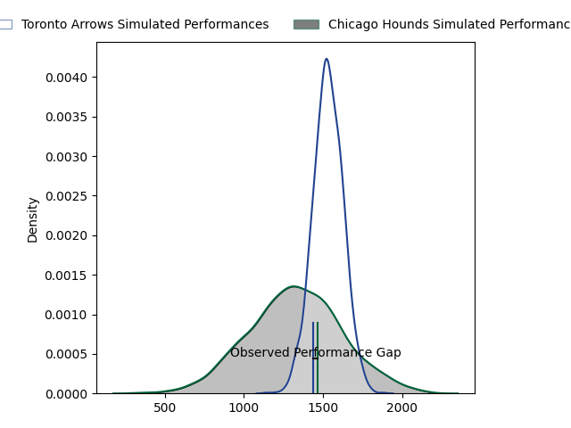
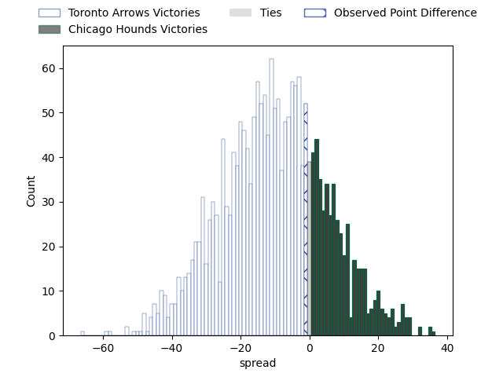
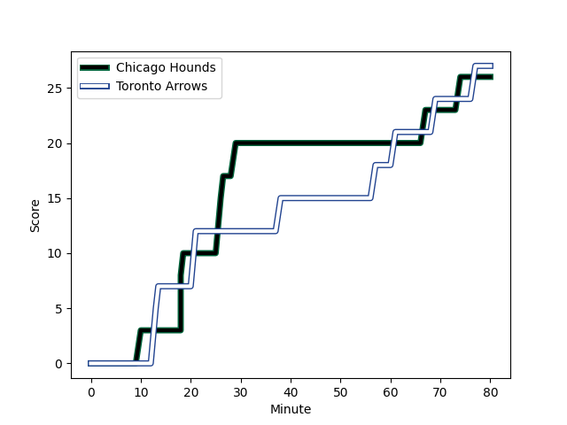
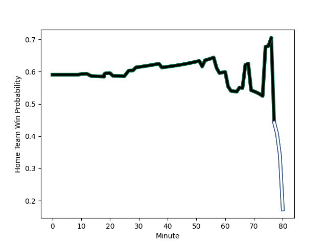

---  
layout: page  
title: Toronto Arrows at Chicago Hounds; 27-26  
date: 2023-03-12 02:00:00 18:00:00 -0500  
categories: match review  
---
# Toronto Arrows at Chicago Hounds; 27-26

# Club Level Predictions

The first set of predictions treats a club as the smallest object, as the club develops its members, organizes a gameplan, and deploys its players as needed for each match. This club model has a prediction of 0.246, which translates to predicting Toronto Arrows to win by 10.1.

Each club has a rating and a rating deviation (simiar to a Glicko system), and expected performances can be generated. This allows for simulated matches and spreads like the ones below.
## Projected Performances

## Projected Spreads

## Projected Results

# Player Level Predictions

Treating teams instead as an entity made up of the currently active players, I have ratings for each player in an altogether different system. These can be combined to form team ratings once teamsheets are announced, weighting starters a bit higher than the reserves. After the match is played, players can be weighted by their minutes on the field, allowing for an accurate measure of the team's composition. With these compiled team ratings, we can make predictions, measure inaccuracy, and update the individual player ratings.
## Prediction with Player Minutes: Chicago Hounds by 19.9

Chicago Hounds by 15.9 on a neutral field
## Scores over Time

## Win Probability over Time

There were 9 large changes in win probability in this match
## Prediction without Player Minutes: Chicago Hounds by 18.9

Chicago Hounds by 14.9 on a neutral pitch

|   Away Minutes | Away Player                                                     |   Away elo |   Away Percentile |   Number |   Home Percentile |   Home elo | Home Player                                                             |   Home Minutes |
|---------------:|:----------------------------------------------------------------|-----------:|------------------:|---------:|------------------:|-----------:|:------------------------------------------------------------------------|---------------:|
|             52 | [Lolani Faleiva](..//playerfiles//LolaniFaleiva_cleaned.md)     |      40.33 |                 0 |        1 |                16 |      83.76 | [George Thornton](..//playerfiles//GeorgeThornton_cleaned.md)           |             53 |
|             75 | [Ramon Ayarza](..//playerfiles//RamonAyarza_cleaned.md)         |      80.85 |                14 |        2 |                41 |      85.36 | [Lindsey Stevens](..//playerfiles//LindseyStevens_cleaned.md)           |             75 |
|             75 | [Tyler Rowland](..//playerfiles//TylerRowland_cleaned.md)       |      90.68 |                35 |        3 |                 2 |      63.05 | [Charles Abel](..//playerfiles//CharlesAbel_cleaned.md)                 |             53 |
|             80 | [Mason Flesch](..//playerfiles//MasonFlesch_cleaned.md)         |       8.98 |                 0 |        4 |                 0 |      -7.57 | [Mike Matarazzo](..//playerfiles//MikeMatarazzo_cleaned.md)             |             80 |
|             58 | [Adrian Wadden](..//playerfiles//AdrianWadden_cleaned.md)       |      58.69 |                 3 |        5 |                94 |     121.57 | [Dineshwaran Krishnan](..//playerfiles//DineshwaranKrishnan_cleaned.md) |             77 |
|             62 | [Travis Larsen](..//playerfiles//TravisLarsen_cleaned.md)       |      83.47 |                17 |        6 |                13 |      81.33 | [Luke Beauchamp](..//playerfiles//LukeBeauchamp_cleaned.md)             |             75 |
|             80 | [Lucas Rumball](..//playerfiles//LucasRumball_cleaned.md)       |      85.79 |                21 |        7 |                13 |      81.33 | [Maclean Jones](..//playerfiles//MacleanJones_cleaned.md)               |             80 |
|             80 | [Mitch Eadie](..//playerfiles//MitchEadie_cleaned.md)           |      91.5  |                35 |        8 |                 0 |      42.82 | [Michael De Waal](..//playerfiles//MichaelDeWaal_cleaned.md)            |             80 |
|             65 | [Ross Braude](..//playerfiles//RossBraude_cleaned.md)           |      85.57 |                22 |        9 |                88 |     110.26 | [Michael Baska](..//playerfiles//MichaelBaska_cleaned.md)               |             75 |
|             80 | [Sam Malcolm](..//playerfiles//SamMalcolm_cleaned.md)           |      82.65 |                31 |       10 |                19 |      83.49 | [Luke Carty](..//playerfiles//LukeCarty_cleaned.md)                     |             80 |
|             80 | [Sam Malcolm](..//playerfiles//SamMalcolm_cleaned.md)           |      82.65 |                17 |       10 |                19 |      83.49 | [Luke Carty](..//playerfiles//LukeCarty_cleaned.md)                     |             80 |
|             80 | [Mitch Richardson](..//playerfiles//MitchRichardson_cleaned.md) |       1.23 |                 0 |       11 |                26 |      87.81 | [Jean-Pierre Eloff](..//playerfiles//Jean-PierreEloff_cleaned.md)       |             80 |
|             80 | [Noel Reid](..//playerfiles//NoelReid_cleaned.md)               |      95    |               nan |       12 |               nan |      95    | [Bill Meakes](..//playerfiles//BillMeakes_cleaned.md)                   |             80 |
|             80 | [Tautalatasi Tasi](..//playerfiles//TautalatasiTasi_cleaned.md) |      84.91 |                20 |       13 |                13 |      81.33 | [Bryce Campbell](..//playerfiles//BryceCampbell_cleaned.md)             |             80 |
|             65 | [Avery Oitomen](..//playerfiles//AveryOitomen_cleaned.md)       |      69.41 |               nan |       14 |                 0 |      41.2  | [Mark O'Keeffe](..//playerfiles//MarkO'Keeffe_cleaned.md)               |             65 |
|             80 | [Ciaran Breen](..//playerfiles//CiaranBreen_cleaned.md)         |      84.91 |                25 |       15 |               100 |     167.48 | [Chris Mattina](..//playerfiles//ChrisMattina_cleaned.md)               |             80 |
|             28 | [Conan O'Donnell](..//playerfiles//ConanO'Donnell_cleaned.md)   |      79.73 |                11 |       16 |               nan |      87.52 | [LaRome White](..//playerfiles//LaRomeWhite_cleaned.md)                 |             27 |
|              5 | [Gene Syminton](..//playerfiles//GeneSyminton_cleaned.md)       |      80.98 |                12 |       17 |                10 |      79.79 | [Mason Koch](..//playerfiles//MasonKoch_cleaned.md)                     |              5 |
|              5 | [Nik Hildebrand](..//playerfiles//NikHildebrand_cleaned.md)     |     114.63 |               nan |       18 |               nan |      92.75 | [Paddy Ryan](..//playerfiles//PaddyRyan_cleaned.md)                     |             27 |
|             22 | [Michael Sheppard](..//playerfiles//MichaelSheppard_cleaned.md) |      92.97 |               nan |       19 |               nan |      99.31 | [Sam Peri](..//playerfiles//SamPeri_cleaned.md)                         |              3 |
|             18 | [James O'Neill](..//playerfiles//JamesO'Neill_cleaned.md)       |     107.64 |                83 |       20 |               nan |      94.2  | [Dacoda Worth](..//playerfiles//DacodaWorth_cleaned.md)                 |              5 |
|             15 | [Will Grant](..//playerfiles//WillGrant_cleaned.md)             |      95    |               nan |       21 |               nan |      93.38 | [Sean Yacoubian](..//playerfiles//SeanYacoubian_cleaned.md)             |              5 |
|             15 | [Kobe Faust](..//playerfiles//KobeFaust_cleaned.md)             |      77.53 |                11 |       22 |                24 |      87.2  | [Caleb Strum](..//playerfiles//CalebStrum_cleaned.md)                   |             15 |

