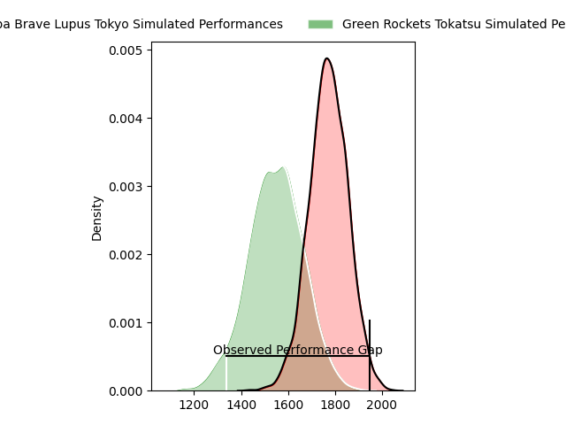
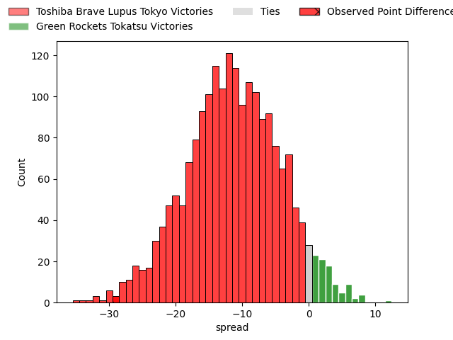
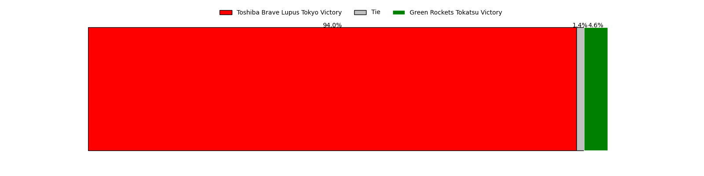

---  
layout: page  
title: Toshiba Brave Lupus Tokyo at Green Rockets Tokatsu; 49-20  
date: 2023-03-12 06:30:00 18:00:00 -0500  
categories: match review  
---
# Toshiba Brave Lupus Tokyo at Green Rockets Tokatsu; 49-20

# Club Level Predictions

The first set of predictions treats a club as the smallest object, as the club develops its members, organizes a gameplan, and deploys its players as needed for each match. This club model has a prediction of 0.218, which translates to predicting Toshiba Brave Lupus Tokyo to win by 11.5.

Each club has a rating and a rating deviation (simiar to a Glicko system), and expected performances can be generated. This allows for simulated matches and spreads like the ones below.
## Projected Performances

## Projected Spreads

## Projected Results

# Player Level Predictions

Treating teams instead as an entity made up of the currently active players, I have ratings for each player in an altogether different system. These can be combined to form team ratings once teamsheets are announced, weighting starters a bit higher than the reserves. After the match is played, players can be weighted by their minutes on the field, allowing for an accurate measure of the team's composition. With these compiled team ratings, we can make predictions, measure inaccuracy, and update the individual player ratings.
## Prediction with Player Minutes: Toshiba Brave Lupus Tokyo by 20.8

Toshiba Brave Lupus Tokyo by 24.8 on a neutral field

There were 4 large changes in win probability in this match
## Prediction without Player Minutes: Toshiba Brave Lupus Tokyo by 20.4

Toshiba Brave Lupus Tokyo by 24.4 on a neutral pitch

|   Away Minutes | Away Player                                                         |   Away elo |   Away Percentile |   Number |   Home Percentile |   Home elo | Home Player                                                              |   Home Minutes |
|---------------:|:--------------------------------------------------------------------|-----------:|------------------:|---------:|------------------:|-----------:|:-------------------------------------------------------------------------|---------------:|
|             58 | [Sena Kimura](..//playerfiles//SenaKimura_cleaned.md)               |     108.5  |                86 |        1 |                39 |      92.05 | [Suguru Kubo](..//playerfiles//SuguruKubo_cleaned.md)                    |             58 |
|             58 | [Daigo Hashimoto](..//playerfiles//DaigoHashimoto_cleaned.md)       |      73.5  |                 6 |        2 |                33 |      86.68 | [Ash Dixon](..//playerfiles//AshDixon_cleaned.md)                        |             58 |
|             80 | [Latu Taufa](..//playerfiles//LatuTaufa_cleaned.md)                 |     102.64 |               nan |        3 |                22 |      92.79 | [Taku Toma](..//playerfiles//TakuToma_cleaned.md)                        |             50 |
|             69 | [Warner Dearns](..//playerfiles//WarnerDearns_cleaned.md)           |     106.06 |                78 |        4 |                12 |      78.91 | [Luke Porter](..//playerfiles//LukePorter_cleaned.md)                    |             80 |
|             65 | [Jacob Pierce](..//playerfiles//JacobPierce_cleaned.md)             |     105.55 |                77 |        5 |                41 |      92.53 | [Jake Ball](..//playerfiles//JakeBall_cleaned.md)                        |             80 |
|             80 | [Yoshitaka Tokunaga](..//playerfiles//YoshitakaTokunaga_cleaned.md) |     105.92 |                78 |        6 |                50 |      92.13 | [Yoshida Hosoda](..//playerfiles//YoshidaHosoda_cleaned.md)              |             69 |
|             11 | [Takeshi Sasaki](..//playerfiles//TakeshiSasaki_cleaned.md)         |     105.17 |               nan |        7 |               nan |      90.88 | [Ren Osawa](..//playerfiles//RenOsawa_cleaned.md)                        |             80 |
|             80 | [Michael Leitch](..//playerfiles//MichaelLeitch_cleaned.md)         |     104.18 |                73 |        8 |                14 |      82.68 | [Wheetu Douglas](..//playerfiles//WheetuDouglas_cleaned.md)              |             77 |
|             65 | [Jack Stratton](..//playerfiles//JackStratton_cleaned.md)           |      94.98 |               nan |        9 |               nan |      92.4  | [Fumiaki Tanaka](..//playerfiles//FumiakiTanaka_cleaned.md)              |             48 |
|             80 | [Tom Taylor](..//playerfiles//TomTaylor_cleaned.md)                 |     107.73 |                81 |       10 |               nan |      95    | [Ko Yoshimmura](..//playerfiles//KoYoshimmura_cleaned.md)                |             80 |
|             59 | [Masaki Hamada](..//playerfiles//MasakiHamada_cleaned.md)           |     120.67 |                94 |       11 |                 2 |      59.11 | [Hiroyuki Miyajima](..//playerfiles//HiroyukiMiyajima_cleaned.md)        |             77 |
|             59 | [Taichi Mano](..//playerfiles//TaichiMano_cleaned.md)               |     102.83 |                72 |       12 |                34 |      90.12 | [Christian Laui](..//playerfiles//ChristianLaui_cleaned.md)              |             80 |
|             80 | [Burger Odendaal](..//playerfiles//BurgerOdendaal_cleaned.md)       |     102.51 |                67 |       13 |                14 |      81.57 | [Tim Bennetts](..//playerfiles//TimBennetts_cleaned.md)                  |             58 |
|             80 | [Shohei Toyoshima](..//playerfiles//ShoheiToyoshima_cleaned.md)     |     112.84 |                88 |       14 |                34 |      90.18 | [Teruya Goto](..//playerfiles//TeruyaGoto_cleaned.md)                    |             80 |
|             80 | [Takuro Matsunaga](..//playerfiles//TakuroMatsunaga_cleaned.md)     |     114.82 |                88 |       15 |                18 |      83.64 | [Lomano Lemeki](..//playerfiles//LomanoLemeki_cleaned.md)                |             80 |
|             69 | [Teruo Makabe](..//playerfiles//TeruoMakabe_cleaned.md)             |     100.47 |               nan |       16 |               nan |     102.42 | [Tatsuya Fujii](..//playerfiles//TatsuyaFujii_cleaned.md)                |             32 |
|             22 | [Masataka Mikami](..//playerfiles//MasatakaMikami_cleaned.md)       |      99.57 |                58 |       17 |                94 |     118.81 | [Satoshi Ueda](..//playerfiles//SatoshiUeda_cleaned.md)                  |             30 |
|             22 | [Mamoru Harada](..//playerfiles//MamoruHarada_cleaned.md)           |     101.86 |                67 |       18 |                18 |      81.41 | [Tom Marshall](..//playerfiles//TomMarshall_cleaned.md)                  |             22 |
|             21 | [Atsuki Kuwayama](..//playerfiles//AtsukiKuwayama_cleaned.md)       |      97.21 |                56 |       19 |               nan |      95    | [Kosei Yamamoto](..//playerfiles//KoseiYamamoto_cleaned.md)              |             22 |
|             21 | [Nicholas McCurran](..//playerfiles//NicholasMcCurran_cleaned.md)   |     106.73 |                79 |       20 |                73 |     103.27 | [Tatsuru Owada](..//playerfiles//TatsuruOwada_cleaned.md)                |             11 |
|             15 | [Kyosuke Kajikawa](..//playerfiles//KyosukeKajikawa_cleaned.md)     |      94.31 |                47 |       21 |               nan |      95    | [Masaki Obata](..//playerfiles//MasakiObata_cleaned.md)                  |              3 |
|             15 | [Takahiro Ogawa](..//playerfiles//TakahiroOgawa_cleaned.md)         |      94.94 |                50 |       22 |               nan |      95    | [Viliami Lutua Ahofono](..//playerfiles//ViliamiLutuaAhofono_cleaned.md) |              3 |
|             11 | [Shin Ito](..//playerfiles//ShinIto_cleaned.md)                     |     110.91 |                83 |       23 |                 5 |      71.08 | [Yo Sato](..//playerfiles//YoSato_cleaned.md)                            |             22 |

