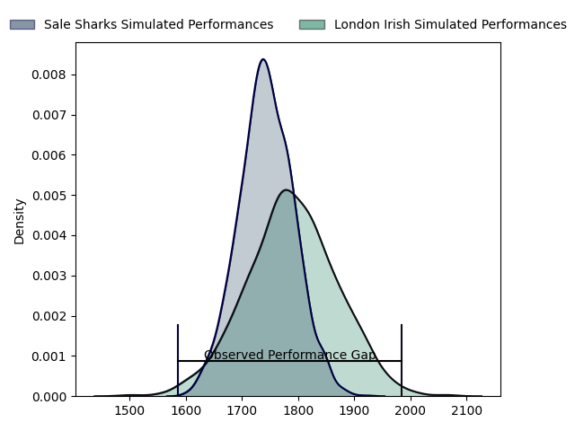
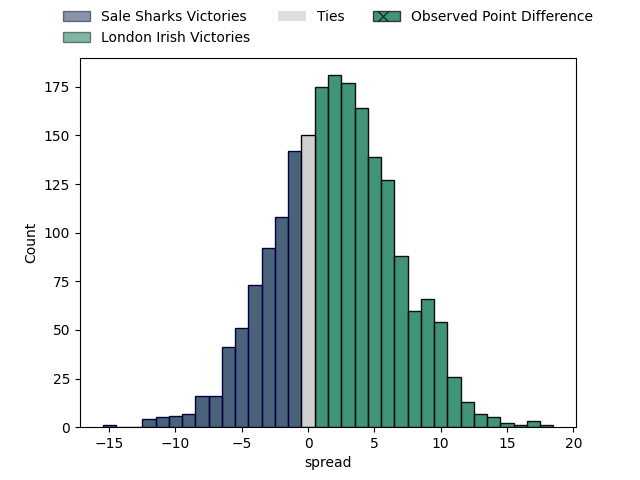

---  
layout: page  
title: Sale Sharks at London Irish; 18.0-36.0  
date: 2023-03-12 09:00:00 18:00:00 -0500  
categories: match review  
---
# Sale Sharks at London Irish; 18.0-36.0

# Club Level Predictions

The first set of predictions treats a club as the smallest object, as the club develops its members, organizes a gameplan, and deploys its players as needed for each match. This club model has a prediction of 0.563, which translates to predicting London Irish to win by 2.2.

Each club has a rating and a rating deviation (simiar to a Glicko system), and expected performances can be generated. This allows for simulated matches and spreads like the ones below.
## Projected Performances

## Projected Spreads

## Projected Results

# Player Level Predictions

Treating teams instead as an entity made up of the currently active players, I have ratings for each player in an altogether different system. These can be combined to form team ratings once teamsheets are announced, weighting starters a bit higher than the reserves. After the match is played, players can be weighted by their minutes on the field, allowing for an accurate measure of the team's composition. With these compiled team ratings, we can make predictions, measure inaccuracy, and update the individual player ratings.
## Prediction with Player Minutes: London Irish by 13.8

London Irish by 9.8 on a neutral field

There were 6 large changes in win probability in this match
## Prediction without Player Minutes: London Irish by 12.6

London Irish by 8.6 on a neutral pitch

|   Away Minutes | Away Player                                                       |   Away elo |   Away Percentile |   Number |   Home Percentile |   Home elo | Home Player                                                                       |   Home Minutes |
|---------------:|:------------------------------------------------------------------|-----------:|------------------:|---------:|------------------:|-----------:|:----------------------------------------------------------------------------------|---------------:|
|             50 | [Bevan Rodd](..//playerfiles//BevanRodd_cleaned.md)               |     112.41 |                90 |        1 |                62 |      98.49 | [Facundo Gigena](..//playerfiles//FacundoGigena_cleaned.md)                       |             56 |
|             50 | [Ewan Ashman](..//playerfiles//EwanAshman_cleaned.md)             |      90.87 |                35 |        2 |                93 |     115.86 | [Agustin Creevy](..//playerfiles//AgustinCreevy_cleaned.md)                       |             53 |
|             50 | [Coenie Oosthuizen](..//playerfiles//CoenieOosthuizen_cleaned.md) |     121.27 |                96 |        3 |                90 |     113.09 | [Oli Hoskins](..//playerfiles//OliHoskins_cleaned.md)                             |             62 |
|             80 | [Cobus Wiese](..//playerfiles//CobusWiese_cleaned.md)             |      94    |                46 |        4 |                53 |      96.23 | [Api Ratuniyarawa](..//playerfiles//ApiRatuniyarawa_cleaned.md)                   |             62 |
|             80 | [Jonny Hill](..//playerfiles//JonnyHill_cleaned.md)               |      98.71 |                60 |        5 |                98 |     135.75 | [Rob Simmons](..//playerfiles//RobSimmons_cleaned.md)                             |             80 |
|             60 | [Jono Ross](..//playerfiles//JonoRoss_cleaned.md)                 |     103.4  |                73 |        6 |                81 |     109.34 | [Matt Rogerson](..//playerfiles//MattRogerson_cleaned.md)                         |             73 |
|             64 | [Sam Dugdale](..//playerfiles//SamDugdale_cleaned.md)             |      90.45 |                36 |        7 |                98 |     136.67 | [Tom Pearson](..//playerfiles//TomPearson_cleaned.md)                             |             80 |
|             73 | [Jean-Luc du Preez](..//playerfiles//Jean-LucduPreez_cleaned.md)  |     111.46 |                86 |        8 |                85 |     111.13 | [So'otala Fa'aso'o](..//playerfiles//So'otalaFa'aso'o_cleaned.md)                 |             47 |
|             53 | [Raffi Quirke](..//playerfiles//RaffiQuirke_cleaned.md)           |     103.34 |                78 |        9 |               nan |      94.47 | [Hugh O'Sullivan](..//playerfiles//HughO'Sullivan_cleaned.md)                     |             53 |
|             80 | [George Ford](..//playerfiles//GeorgeFord_cleaned.md)             |     117.22 |                90 |       10 |                96 |     127.78 | [Paddy Jackson](..//playerfiles//PaddyJackson_cleaned.md)                         |             80 |
|             51 | [Tom O'Flaherty](..//playerfiles//TomO'Flaherty_cleaned.md)       |      91.65 |                39 |       11 |                33 |      90.09 | [Ollie Hassell-Collins](..//playerfiles//OllieHassell-Collins_cleaned.md)         |             80 |
|             80 | [Ryan Mills](..//playerfiles//RyanMills_cleaned.md)               |     103.39 |                73 |       12 |                81 |     107.72 | [Rory Jennings](..//playerfiles//RoryJennings_cleaned.md)                         |             73 |
|             64 | [Robert du Preez](..//playerfiles//RobertduPreez_cleaned.md)      |     109.11 |                82 |       13 |                89 |     114.23 | [Benhard Janse van Rensburg](..//playerfiles//BenhardJansevanRensburg_cleaned.md) |             80 |
|             80 | [Tom Roebuck](..//playerfiles//TomRoebuck_cleaned.md)             |     111.37 |                86 |       14 |                63 |      99.44 | [Lucio Cinti Luna](..//playerfiles//LucioCintiLuna_cleaned.md)                    |             80 |
|             80 | [Joe Carpenter](..//playerfiles//JoeCarpenter_cleaned.md)         |      70.92 |                 8 |       15 |                85 |     111.24 | [Ben Loader](..//playerfiles//BenLoader_cleaned.md)                               |             80 |
|             30 | [Tommy Taylor](..//playerfiles//TommyTaylor_cleaned.md)           |     114.36 |               nan |       16 |                12 |      80.68 | [Mike Willemse](..//playerfiles//MikeWillemse_cleaned.md)                         |             27 |
|             30 | [Simon McIntyre](..//playerfiles//SimonMcIntyre_cleaned.md)       |     109.07 |                88 |       17 |               nan |      92.73 | [Tarek Haffar](..//playerfiles//TarekHaffar_cleaned.md)                           |             27 |
|             30 | [Nic Schonert](..//playerfiles//NicSchonert_cleaned.md)           |      88.64 |                27 |       18 |                 9 |      78.67 | [Lovejoy Chawatama](..//playerfiles//LovejoyChawatama_cleaned.md)                 |             18 |
|             16 | [Josh Beaumont](..//playerfiles//JoshBeaumont_cleaned.md)         |     112.53 |               nan |       19 |               nan |      91.25 | [Josh Caulfield](..//playerfiles//JoshCaulfield_cleaned.md)                       |             18 |
|             27 | [Daniel du Preez](..//playerfiles//DanielduPreez_cleaned.md)      |     101.18 |                66 |       20 |                31 |      89.2  | [Josh Basham](..//playerfiles//JoshBasham_cleaned.md)                             |              7 |
|             27 | [Gus Warr](..//playerfiles//GusWarr_cleaned.md)                   |      82.31 |                16 |       21 |                65 |     100.73 | [Chandler Cunningham-South](..//playerfiles//ChandlerCunningham-South_cleaned.md) |             30 |
|             16 | [Sam James](..//playerfiles//SamJames_cleaned.md)                 |     124.17 |                96 |       22 |                23 |      86.15 | [Joe Powell](..//playerfiles//JoePowell_cleaned.md)                               |             27 |
|             29 | [Arron Reed](..//playerfiles//ArronReed_cleaned.md)               |     111.46 |                86 |       23 |                64 |      99.93 | [James Stokes](..//playerfiles//JamesStokes_cleaned.md)                           |              7 |

