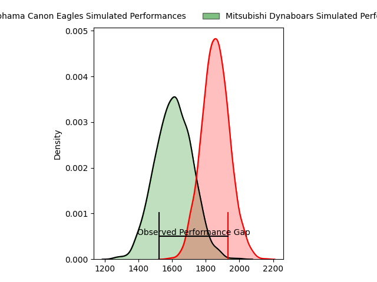
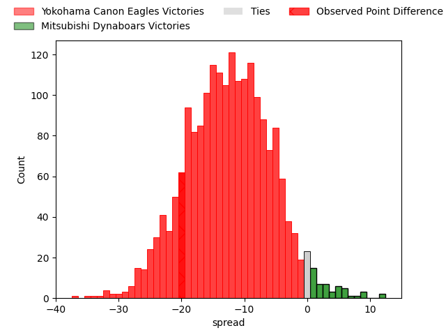
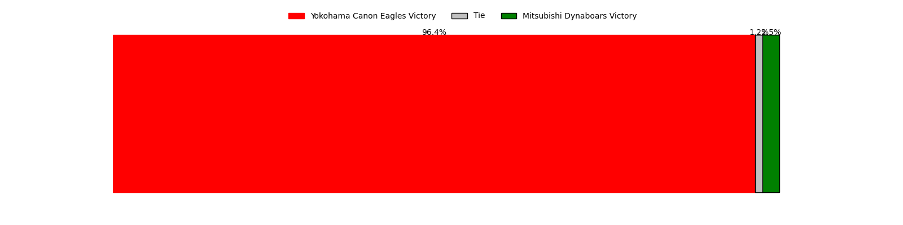

---  
layout: page  
title: Yokohama Canon Eagles at Mitsubishi Dynaboars; 41-21  
date: 2023-03-12 06:30:00 18:00:00 -0500  
categories: match review  
---
# Yokohama Canon Eagles at Mitsubishi Dynaboars; 41-21

# Club Level Predictions

The first set of predictions treats a club as the smallest object, as the club develops its members, organizes a gameplan, and deploys its players as needed for each match. This club model has a prediction of 0.198, which translates to predicting Yokohama Canon Eagles to win by 12.6.

Each club has a rating and a rating deviation (simiar to a Glicko system), and expected performances can be generated. This allows for simulated matches and spreads like the ones below.
## Projected Performances

## Projected Spreads

## Projected Results

# Player Level Predictions

Treating teams instead as an entity made up of the currently active players, I have ratings for each player in an altogether different system. These can be combined to form team ratings once teamsheets are announced, weighting starters a bit higher than the reserves. After the match is played, players can be weighted by their minutes on the field, allowing for an accurate measure of the team's composition. With these compiled team ratings, we can make predictions, measure inaccuracy, and update the individual player ratings.
## Prediction with Player Minutes: Yokohama Canon Eagles by 7.7

Yokohama Canon Eagles by 11.7 on a neutral field

There were 8 large changes in win probability in this match
## Prediction without Player Minutes: Yokohama Canon Eagles by 14.2

Yokohama Canon Eagles by 18.2 on a neutral pitch

|   Away Minutes | Away Player                                                                   |   Away elo |   Away Percentile |   Number |   Home Percentile |   Home elo | Home Player                                                                 |   Home Minutes |
|---------------:|:------------------------------------------------------------------------------|-----------:|------------------:|---------:|------------------:|-----------:|:----------------------------------------------------------------------------|---------------:|
|             60 | [Takato Okabe](..//playerfiles//TakatoOkabe_cleaned.md)                       |     128.76 |                98 |        1 |                10 |      79.15 | [Hayato Hosoda](..//playerfiles//HayatoHosoda_cleaned.md)                   |             75 |
|             60 | [Yusuke Niwai](..//playerfiles//YusukeNiwai_cleaned.md)                       |      91.01 |                36 |        2 |                10 |      79.47 | [Yuki Miyazato](..//playerfiles//YukiMiyazato_cleaned.md)                   |             47 |
|             60 | [Tatsuro Sugimoto](..//playerfiles//TatsuroSugimoto_cleaned.md)               |      66.18 |                 3 |        3 |                99 |     137.95 | [Tomoaki Ishii](..//playerfiles//TomoakiIshii_cleaned.md)                   |             47 |
|             80 | [Cory Hill](..//playerfiles//CoryHill_cleaned.md)                             |      97.27 |                56 |        4 |                21 |      85.25 | [Daniel Linde](..//playerfiles//DanielLinde_cleaned.md)                     |             80 |
|             71 | [Liaki Moli](..//playerfiles//LiakiMoli_cleaned.md)                           |     109.54 |                84 |        5 |                15 |      80.67 | [Walt Steenkamp](..//playerfiles//WaltSteenkamp_cleaned.md)                 |             47 |
|             44 | [Sioeli Vakalahi](..//playerfiles//SioeliVakalahi_cleaned.md)                 |     111.94 |                86 |        6 |                10 |      79.29 | [Koki Sato](..//playerfiles//KokiSato_cleaned.md)                           |             80 |
|             80 | [Naoto Shimada](..//playerfiles//NaotoShimada_cleaned.md)                     |      93.99 |                48 |        7 |                33 |      87.96 | [Shunsuke Sakamoto](..//playerfiles//ShunsukeSakamoto_cleaned.md)           |             80 |
|             80 | [Sione Halasili](..//playerfiles//SioneHalasili_cleaned.md)                   |      96.25 |                50 |        8 |                67 |     100.45 | [Sam Chongkit](..//playerfiles//SamChongkit_cleaned.md)                     |             80 |
|             78 | [Francois (Faf) de Klerk](..//playerfiles//Francois(Faf)deKlerk_cleaned.md)   |      97.42 |                58 |        9 |                61 |      98.31 | [Kota Iwamura](..//playerfiles//KotaIwamura_cleaned.md)                     |             80 |
|             70 | [Yu Tamura](..//playerfiles//YuTamura_cleaned.md)                             |     102.55 |                72 |       10 |                30 |      91.04 | [Matt To'omua](..//playerfiles//MattTo'omua_cleaned.md)                     |             80 |
|             80 | [Masayoshi Takezawa](..//playerfiles//MasayoshiTakezawa_cleaned.md)           |      64.87 |                 4 |       11 |                79 |     106.09 | [Honeti Taumoha'apai](..//playerfiles//HonetiTaumoha'apai_cleaned.md)       |             80 |
|             80 | [Yusuke Kajimura](..//playerfiles//YusukeKajimura_cleaned.md)                 |     107.77 |                81 |       12 |                22 |      85.38 | [Curtis Rona](..//playerfiles//CurtisRona_cleaned.md)                       |             80 |
|             71 | [Jesse Andre Kriel](..//playerfiles//JesseAndreKriel_cleaned.md)              |     108.92 |                83 |       13 |                21 |      85.34 | [Matt Vaega](..//playerfiles//MattVaega_cleaned.md)                         |             80 |
|             80 | [Inoke Burua](..//playerfiles//InokeBurua_cleaned.md)                         |     107.12 |                82 |       14 |                63 |     102.05 | [Nozomi Nara](..//playerfiles//NozomiNara_cleaned.md)                       |             80 |
|             80 | [Sarel Petrus Marais](..//playerfiles//SarelPetrusMarais_cleaned.md)          |     120.4  |                93 |       15 |                42 |      92.27 | [Jonmoon Han](..//playerfiles//JonmoonHan_cleaned.md)                       |             48 |
|             36 | [Ryota Yasui](..//playerfiles//RyotaYasui_cleaned.md)                         |      89.08 |                30 |       16 |                10 |      77.28 | [Brackin Karauria-Henry](..//playerfiles//BrackinKarauria-Henry_cleaned.md) |             32 |
|             20 | [Chang Ho Ahn](..//playerfiles//ChangHoAhn_cleaned.md)                        |      99.07 |               nan |       17 |                48 |      91.57 | [Yoshimitsu Yasue](..//playerfiles//YoshimitsuYasue_cleaned.md)             |             33 |
|             20 | [Shin Kawamura](..//playerfiles//ShinKawamura_cleaned.md)                     |      69.07 |                 4 |       18 |                51 |      95.46 | [Mototsugu Hachiya](..//playerfiles//MototsuguHachiya_cleaned.md)           |             33 |
|             20 | [Rento Tsukayama](..//playerfiles//RentoTsukayama_cleaned.md)                 |     114.59 |                91 |       19 |                28 |      88.59 | [Epineri Uluviti](..//playerfiles//EpineriUluviti_cleaned.md)               |             33 |
|             10 | [Junpei Ogura](..//playerfiles//JunpeiOgura_cleaned.md)                       |      94.21 |                48 |       20 |                16 |      83.68 | [Yusuke Sakamoto](..//playerfiles//YusukeSakamoto_cleaned.md)               |              5 |
|              9 | [Jacobus Johannes van Dyk](..//playerfiles//JacobusJohannesvanDyk_cleaned.md) |     104.53 |                79 |       21 |               nan |     nan    | nan                                                                         |            nan |
|              9 | [Naoya Minamihashi](..//playerfiles//NaoyaMinamihashi_cleaned.md)             |     117.15 |                91 |       22 |               nan |     nan    | nan                                                                         |            nan |
|              2 | [Toshiki Amano](..//playerfiles//ToshikiAmano_cleaned.md)                     |     101.08 |               nan |       23 |               nan |     nan    | nan                                                                         |            nan |

