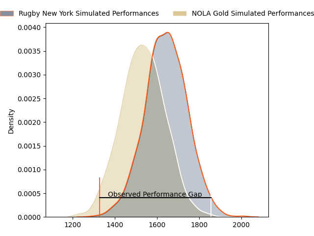
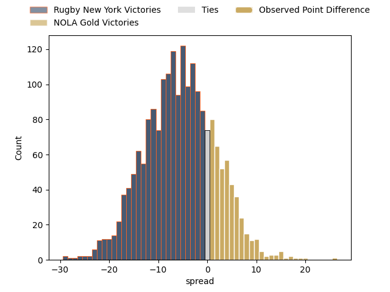
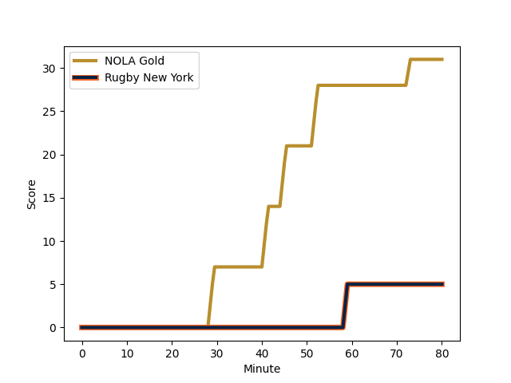
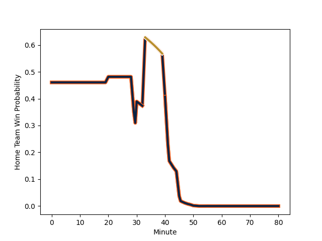

---  
layout: page  
title: Rugby New York at NOLA Gold; 5-31  
date: 2023-03-12 20:00:00 18:00:00 -0500  
categories: match review  
---
# Rugby New York at NOLA Gold; 5-31

# Club Level Predictions

The first set of predictions treats a club as the smallest object, as the club develops its members, organizes a gameplan, and deploys its players as needed for each match. This club model has a prediction of 0.349, which translates to predicting Rugby New York to win by 5.7.

Each club has a rating and a rating deviation (simiar to a Glicko system), and expected performances can be generated. This allows for simulated matches and spreads like the ones below.
## Projected Performances

## Projected Spreads

## Projected Results

# Player Level Predictions

Treating teams instead as an entity made up of the currently active players, I have ratings for each player in an altogether different system. These can be combined to form team ratings once teamsheets are announced, weighting starters a bit higher than the reserves. After the match is played, players can be weighted by their minutes on the field, allowing for an accurate measure of the team's composition. With these compiled team ratings, we can make predictions, measure inaccuracy, and update the individual player ratings.
## Prediction with Player Minutes: Rugby New York by 2.9

Rugby New York by 6.9 on a neutral field
## Scores over Time

## Win Probability over Time

There were 8 large changes in win probability in this match
## Prediction without Player Minutes: NOLA Gold by 0.2

Rugby New York by 3.8 on a neutral pitch

|   Away Minutes | Away Player                                                       |   Away elo |   Away Percentile |   Number |   Home Percentile |   Home elo | Home Player                                                                                                 |   Home Minutes |
|---------------:|:------------------------------------------------------------------|-----------:|------------------:|---------:|------------------:|-----------:|:------------------------------------------------------------------------------------------------------------|---------------:|
|             44 | [Chance Wenglewski](..//playerfiles//ChanceWenglewski_cleaned.md) |      96.47 |                56 |        1 |                15 |      93.1  | [Jarred Adams](..//playerfiles//JarredAdams_cleaned.md)                                                     |             29 |
|             44 | [Chance Wenglewski](..//playerfiles//ChanceWenglewski_cleaned.md) |      96.47 |                56 |        1 |                43 |      93.1  | [Jarred Adams](..//playerfiles//JarredAdams_cleaned.md)                                                     |             29 |
|             55 | [Dylan Fawsitt](..//playerfiles//DylanFawsitt_cleaned.md)         |      96.8  |                58 |        2 |                 6 |      73.57 | [Pat O'Toole](..//playerfiles//PatO'Toole_cleaned.md)                                                       |             50 |
|             55 | [Dylan Fawsitt](..//playerfiles//DylanFawsitt_cleaned.md)         |      96.8  |                58 |        2 |                 2 |      73.57 | [Pat O'Toole](..//playerfiles//PatO'Toole_cleaned.md)                                                       |             50 |
|             20 | [Nic Mayhew](..//playerfiles//NicMayhew_cleaned.md)               |      93.04 |                43 |        3 |                78 |     113.43 | [Sean Bradley Paranihi](..//playerfiles//SeanBradleyParanihi_cleaned.md)                                    |             55 |
|             20 | [Nic Mayhew](..//playerfiles//NicMayhew_cleaned.md)               |      93.04 |                43 |        3 |                91 |     113.43 | [Sean Bradley Paranihi](..//playerfiles//SeanBradleyParanihi_cleaned.md)                                    |             55 |
|             80 | [Nate Brakeley](..//playerfiles//NateBrakeley_cleaned.md)         |      99.59 |                63 |        4 |                52 |      95.89 | [Cameron Dolan](..//playerfiles//CameronDolan_cleaned.md)                                                   |             80 |
|             55 | [Hamish Dalzell](..//playerfiles//HamishDalzell_cleaned.md)       |      95.68 |                51 |        5 |                72 |     102.75 | [Liam Hallam-Eames](..//playerfiles//LiamHallam-Eames_cleaned.md)                                           |             40 |
|             55 | [Hamish Dalzell](..//playerfiles//HamishDalzell_cleaned.md)       |      95.68 |                51 |        5 |                40 |     102.75 | [Liam Hallam-Eames](..//playerfiles//LiamHallam-Eames_cleaned.md)                                           |             40 |
|             80 | [Brad Tucker](..//playerfiles//BradTucker_cleaned.md)             |      94.54 |                50 |        6 |                19 |      84.79 | [Malcolm May](..//playerfiles//MalcolmMay_cleaned.md)                                                       |             30 |
|             80 | [Brad Tucker](..//playerfiles//BradTucker_cleaned.md)             |      94.54 |                50 |        6 |                 6 |      84.79 | [Malcolm May](..//playerfiles//MalcolmMay_cleaned.md)                                                       |             30 |
|             80 | [Brendon O'Connor](..//playerfiles//BrendonO'Connor_cleaned.md)   |      97.09 |                57 |        7 |                15 |      82.75 | [Osaiaisi Tonga’uiha](..//playerfiles//OsaiaisiTonga’uiha_cleaned.md)                                       |             40 |
|             33 | [Kara Pryor](..//playerfiles//KaraPryor_cleaned.md)               |     104.39 |                76 |        8 |                51 |      95.89 | [Tom Florence](..//playerfiles//TomFlorence_cleaned.md)                                                     |             80 |
|             55 | [Connor Buckley](..//playerfiles//ConnorBuckley_cleaned.md)       |      82.93 |                17 |        9 |                71 |     111.19 | [Luke Campbell](..//playerfiles//LukeCampbell_cleaned.md)                                                   |             75 |
|             55 | [Connor Buckley](..//playerfiles//ConnorBuckley_cleaned.md)       |      82.93 |                17 |        9 |                89 |     111.19 | [Luke Campbell](..//playerfiles//LukeCampbell_cleaned.md)                                                   |             75 |
|             80 | [Samuel Windsor](..//playerfiles//SamuelWindsor_cleaned.md)       |      92.98 |                40 |       10 |                75 |     103.42 | [Rodney Iona](..//playerfiles//RodneyIona_cleaned.md)                                                       |             80 |
|             80 | [Samuel Windsor](..//playerfiles//SamuelWindsor_cleaned.md)       |      92.98 |                40 |       10 |                43 |     103.42 | [Rodney Iona](..//playerfiles//RodneyIona_cleaned.md)                                                       |             80 |
|             80 | [Teofilo Ed Fidow](..//playerfiles//TeofiloEdFidow_cleaned.md)    |      99.35 |                63 |       11 |                84 |     118.49 | [Dougie Fife](..//playerfiles//DougieFife_cleaned.md)                                                       |             80 |
|             80 | [Teofilo Ed Fidow](..//playerfiles//TeofiloEdFidow_cleaned.md)    |      99.35 |                63 |       11 |                93 |     118.49 | [Dougie Fife](..//playerfiles//DougieFife_cleaned.md)                                                       |             80 |
|             53 | [Jason Emery](..//playerfiles//JasonEmery_cleaned.md)             |      98.07 |                58 |       12 |                52 |      95.89 | [Jordan Jackson-Hope](..//playerfiles//JordanJackson-Hope_cleaned.md)                                       |             80 |
|             53 | [Teihorangi Walden](..//playerfiles//TeihorangiWalden_cleaned.md) |      95.78 |                52 |       13 |                20 |      84.85 | [Philippus Jacobus Snyman (JP) du Plessis](..//playerfiles//PhilippusJacobusSnyman(JP)duPlessis_cleaned.md) |             80 |
|             80 | [Fa'asiu Fuatai](..//playerfiles//Fa'asiuFuatai_cleaned.md)       |     102.41 |                72 |       14 |                85 |     108.47 | [Harley Wheeler](..//playerfiles//HarleyWheeler_cleaned.md)                                                 |             33 |
|             80 | [Andrew Coe](..//playerfiles//AndrewCoe_cleaned.md)               |      98.19 |                57 |       15 |                46 |      93.55 | [Jordan Trainor](..//playerfiles//JordanTrainor_cleaned.md)                                                 |             80 |
|             36 | [Tevita Langi](..//playerfiles//TevitaLangi_cleaned.md)           |      97.79 |               nan |       16 |                67 |     101.69 | [Kevin Sullivan](..//playerfiles//KevinSullivan_cleaned.md)                                                 |             51 |
|             25 | [Kaleb Geiger](..//playerfiles//KalebGeiger_cleaned.md)           |     158.87 |               100 |       17 |               nan |      97.31 | [Eric Howard](..//playerfiles//EricHoward_cleaned.md)                                                       |             30 |
|             60 | [Sam Davies](..//playerfiles//SamDavies_cleaned.md)               |      98.73 |                64 |       18 |                38 |      91.96 | [Dino Waldren](..//playerfiles//DinoWaldren_cleaned.md)                                                     |             25 |
|             25 | [Charlie Hewitt](..//playerfiles//CharlieHewitt_cleaned.md)       |     155.38 |               100 |       19 |                95 |     124.81 | [Billy Stewart](..//playerfiles//BillyStewart_cleaned.md)                                                   |             40 |
|             47 | [Pago Haini](..//playerfiles//PagoHaini_cleaned.md)               |     112.03 |               nan |       20 |                 2 |      60.4  | [Devin Short](..//playerfiles//DevinShort_cleaned.md)                                                       |             50 |
|             25 | [Eamonn Matthews](..//playerfiles//EamonnMatthews_cleaned.md)     |     103.4  |                71 |       21 |                71 |     101.23 | [Maciu Koroi](..//playerfiles//MaciuKoroi_cleaned.md)                                                       |             40 |
|             27 | [Quinn Ngawati](..//playerfiles//QuinnNgawati_cleaned.md)         |      93.84 |               nan |       22 |               nan |      95.26 | [Sebastiano Villani](..//playerfiles//SebastianoVillani_cleaned.md)                                         |              5 |
|             27 | [John Powers](..//playerfiles//JohnPowers_cleaned.md)             |      97.16 |               nan |       23 |                 0 |      43.33 | [Ross Depperschmidt](..//playerfiles//RossDepperschmidt_cleaned.md)                                         |             47 |

