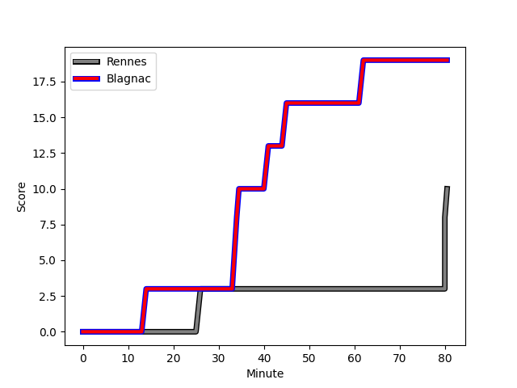
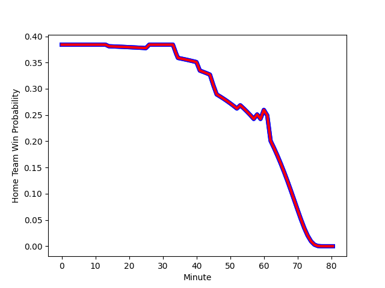

---  
layout: page  
title: Blagnac at Rennes; 19-10  
date: 2023-03-12 15:00:00 18:00:00 -0500  
categories: match review  
---
# Blagnac at Rennes; 19-10

# Club Level Predictions

The first set of predictions treats a club as the smallest object, as the club develops its members, organizes a gameplan, and deploys its players as needed for each match. This club model has a prediction of 0.418, which translates to predicting Blagnac to win by 2.9.

Each club has a rating and a rating deviation (simiar to a Glicko system), and expected performances can be generated. This allows for simulated matches and spreads like the ones below.
## Projected Performances

## Projected Spreads

## Projected Results

# Player Level Predictions

Treating teams instead as an entity made up of the currently active players, I have ratings for each player in an altogether different system. These can be combined to form team ratings once teamsheets are announced, weighting starters a bit higher than the reserves. After the match is played, players can be weighted by their minutes on the field, allowing for an accurate measure of the team's composition. With these compiled team ratings, we can make predictions, measure inaccuracy, and update the individual player ratings.
## Prediction with Player Minutes: Blagnac by 16.5

Blagnac by 20.5 on a neutral field
## Scores over Time

## Win Probability over Time

There were 1 large changes in win probability in this match
## Prediction without Player Minutes: Blagnac by 17.5

Blagnac by 21.5 on a neutral pitch

|   Away Minutes | Away Player                                                           |   Away elo |   Away Percentile |   Number |   Home Percentile |   Home elo | Home Player                                                             |   Home Minutes |
|---------------:|:----------------------------------------------------------------------|-----------:|------------------:|---------:|------------------:|-----------:|:------------------------------------------------------------------------|---------------:|
|             46 | [Cesar Biscioni](..//playerfiles//CesarBiscioni_cleaned.md)           |     104.35 |                83 |        1 |                35 |      85.03 | [Baptiste Le Jallé](..//playerfiles//BaptisteLeJallé_cleaned.md)        |             46 |
|             46 | [Florian Bertrand](..//playerfiles//FlorianBertrand_cleaned.md)       |      89.28 |                38 |        2 |                58 |      97.02 | [Patrick Tu'ugahala](..//playerfiles//PatrickTu'ugahala_cleaned.md)     |             80 |
|             46 | [Marco Trauth](..//playerfiles//MarcoTrauth_cleaned.md)               |      96.71 |                38 |        3 |                32 |      86.44 | [Atonio Ulutuipalelei](..//playerfiles//AtonioUlutuipalelei_cleaned.md) |             46 |
|             46 | [Lucas Lecomte](..//playerfiles//LucasLecomte_cleaned.md)             |      97.56 |               nan |        4 |                 8 |      75.46 | [Alexandre Gueroult](..//playerfiles//AlexandreGueroult_cleaned.md)     |             53 |
|             80 | [Vincent Mutel](..//playerfiles//VincentMutel_cleaned.md)             |     109.56 |                85 |        5 |                23 |      73.36 | [Clément Fontaine](..//playerfiles//ClémentFontaine_cleaned.md)         |             80 |
|             80 | [Vincent Mutel](..//playerfiles//VincentMutel_cleaned.md)             |     109.56 |                85 |        5 |                 7 |      73.36 | [Clément Fontaine](..//playerfiles//ClémentFontaine_cleaned.md)         |             80 |
|             46 | [Lucas Tolofua](..//playerfiles//LucasTolofua_cleaned.md)             |      66.4  |                 5 |        6 |                53 |      82.88 | [Baptiste Beaujouan](..//playerfiles//BaptisteBeaujouan_cleaned.md)     |             46 |
|             46 | [Lucas Tolofua](..//playerfiles//LucasTolofua_cleaned.md)             |      66.4  |                 5 |        6 |                15 |      82.88 | [Baptiste Beaujouan](..//playerfiles//BaptisteBeaujouan_cleaned.md)     |             46 |
|             80 | [Ianis Ponsole](..//playerfiles//IanisPonsole_cleaned.md)             |     105.84 |                83 |        7 |                11 |      80.38 | [Luca Di Salvatore](..//playerfiles//LucaDiSalvatore_cleaned.md)        |             46 |
|             80 | [Mathieu Vachon](..//playerfiles//MathieuVachon_cleaned.md)           |     100.05 |                64 |        8 |                10 |      75.34 | [Victor Fromenteze](..//playerfiles//VictorFromenteze_cleaned.md)       |             80 |
|             53 | [Paul Ravier](..//playerfiles//PaulRavier_cleaned.md)                 |      97.91 |                73 |        9 |                38 |      89.81 | [Lucas Ollion](..//playerfiles//LucasOllion_cleaned.md)                 |             80 |
|             53 | [Paul Ravier](..//playerfiles//PaulRavier_cleaned.md)                 |      97.91 |                60 |        9 |                38 |      89.81 | [Lucas Ollion](..//playerfiles//LucasOllion_cleaned.md)                 |             80 |
|             80 | [Valentin Delpy](..//playerfiles//ValentinDelpy_cleaned.md)           |      98.82 |                61 |       10 |                10 |      77.46 | [Yvan Leroyer](..//playerfiles//YvanLeroyer_cleaned.md)                 |             58 |
|             60 | [Lukas Doyhenard](..//playerfiles//LukasDoyhenard_cleaned.md)         |      82.07 |                16 |       11 |                 4 |      63.71 | [Alexis François](..//playerfiles//AlexisFrançois_cleaned.md)           |             80 |
|             60 | [Lukas Doyhenard](..//playerfiles//LukasDoyhenard_cleaned.md)         |      82.07 |                16 |       11 |                 8 |      63.71 | [Alexis François](..//playerfiles//AlexisFrançois_cleaned.md)           |             80 |
|             80 | [Aurelien Labau](..//playerfiles//AurelienLabau_cleaned.md)           |      97.66 |                57 |       12 |                18 |      84.12 | [Ryan Dubois](..//playerfiles//RyanDubois_cleaned.md)                   |             80 |
|             60 | [Clément Vareilles](..//playerfiles//ClémentVareilles_cleaned.md)     |      90.56 |                35 |       13 |                15 |      81.95 | [Clément Lepresle](..//playerfiles//ClémentLepresle_cleaned.md)         |             80 |
|             80 | [Francois Tardieu](..//playerfiles//FrancoisTardieu_cleaned.md)       |      86.74 |                38 |       14 |                 9 |      70.56 | [Romuald François](..//playerfiles//RomualdFrançois_cleaned.md)         |             60 |
|             80 | [Jean-Andre Vernetti](..//playerfiles//Jean-AndreVernetti_cleaned.md) |     127.36 |                96 |       15 |                63 |      99.17 | [Enzo Salvai](..//playerfiles//EnzoSalvai_cleaned.md)                   |             80 |
|             34 | [Alexis Decaux](..//playerfiles//AlexisDecaux_cleaned.md)             |     102.42 |                76 |       16 |                19 |      85.2  | [Grégory Querin](..//playerfiles//GrégoryQuerin_cleaned.md)             |             34 |
|             34 | [Alexis Decaux](..//playerfiles//AlexisDecaux_cleaned.md)             |     102.42 |                76 |       16 |                60 |      85.2  | [Grégory Querin](..//playerfiles//GrégoryQuerin_cleaned.md)             |             34 |
|             34 | [Gabin Villerouge](..//playerfiles//GabinVillerouge_cleaned.md)       |     103.46 |                84 |       17 |                25 |      75.35 | [Luvuyo Pupuma](..//playerfiles//LuvuyoPupuma_cleaned.md)               |             34 |
|             34 | [Gabin Villerouge](..//playerfiles//GabinVillerouge_cleaned.md)       |     103.46 |                78 |       17 |                25 |      75.35 | [Luvuyo Pupuma](..//playerfiles//LuvuyoPupuma_cleaned.md)               |             34 |
|             34 | [Gabin Villerouge](..//playerfiles//GabinVillerouge_cleaned.md)       |     103.46 |                84 |       17 |                 7 |      75.35 | [Luvuyo Pupuma](..//playerfiles//LuvuyoPupuma_cleaned.md)               |             34 |
|             34 | [Gabin Villerouge](..//playerfiles//GabinVillerouge_cleaned.md)       |     103.46 |                78 |       17 |                 7 |      75.35 | [Luvuyo Pupuma](..//playerfiles//LuvuyoPupuma_cleaned.md)               |             34 |
|             34 | [Fabien Lorenzon](..//playerfiles//FabienLorenzon_cleaned.md)         |      86.43 |                33 |       18 |                70 |     103.1  | [Guillaume Cazette](..//playerfiles//GuillaumeCazette_cleaned.md)       |             27 |
|             34 | [Fabien Lorenzon](..//playerfiles//FabienLorenzon_cleaned.md)         |      86.43 |                22 |       18 |                70 |     103.1  | [Guillaume Cazette](..//playerfiles//GuillaumeCazette_cleaned.md)       |             27 |
|             34 | [Lilian Rousset](..//playerfiles//LilianRousset_cleaned.md)           |      93.23 |                58 |       19 |                12 |      82.87 | [Pedro Ortega](..//playerfiles//PedroOrtega_cleaned.md)                 |             34 |
|             34 | [Lilian Rousset](..//playerfiles//LilianRousset_cleaned.md)           |      93.23 |                43 |       19 |                12 |      82.87 | [Pedro Ortega](..//playerfiles//PedroOrtega_cleaned.md)                 |             34 |
|             34 | [Nikita Bekov](..//playerfiles//NikitaBekov_cleaned.md)               |      94.72 |                55 |       20 |                47 |      86.09 | [Vincent Wenger](..//playerfiles//VincentWenger_cleaned.md)             |             34 |
|             34 | [Nikita Bekov](..//playerfiles//NikitaBekov_cleaned.md)               |      94.72 |                51 |       20 |                47 |      86.09 | [Vincent Wenger](..//playerfiles//VincentWenger_cleaned.md)             |             34 |
|             27 | [Corentin Penc'hoat](..//playerfiles//CorentinPenc'hoat_cleaned.md)   |      97.93 |                42 |       21 |                90 |     117.3  | [Joaquin Diaz Luzzi](..//playerfiles//JoaquinDiazLuzzi_cleaned.md)      |             22 |
|             20 | [Antoine Renaud](..//playerfiles//AntoineRenaud_cleaned.md)           |      61.32 |                 3 |       22 |                65 |     101.76 | [Hypolite Cornu](..//playerfiles//HypoliteCornu_cleaned.md)             |             20 |
|             20 | [Antoine Renaud](..//playerfiles//AntoineRenaud_cleaned.md)           |      61.32 |                 2 |       22 |                65 |     101.76 | [Hypolite Cornu](..//playerfiles//HypoliteCornu_cleaned.md)             |             20 |
|             20 | [Guillaume Piron](..//playerfiles//GuillaumePiron_cleaned.md)         |      77.97 |                21 |       23 |               nan |     nan    | nan                                                                     |            nan |
|             20 | [Guillaume Piron](..//playerfiles//GuillaumePiron_cleaned.md)         |      77.97 |                10 |       23 |               nan |     nan    | nan                                                                     |            nan |

