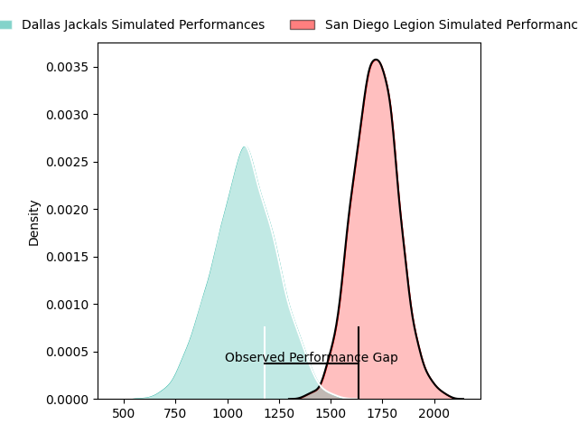
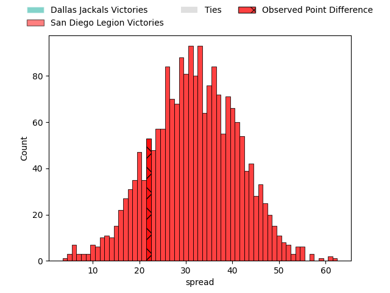
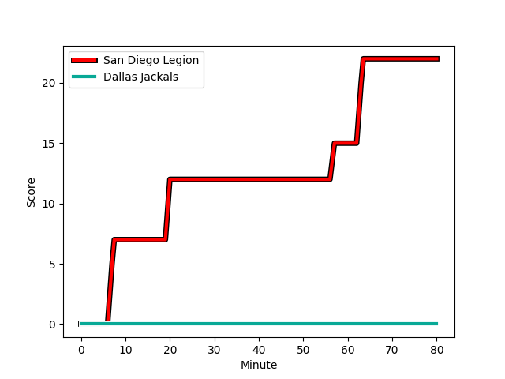
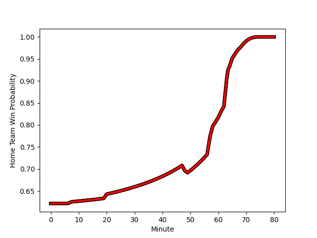

---  
layout: page  
title: Dallas Jackals at San Diego Legion; 0-22  
date: 2023-03-12 02:00:00 18:00:00 -0500  
categories: match review  
---
# Dallas Jackals at San Diego Legion; 0-22

# Club Level Predictions

The first set of predictions treats a club as the smallest object, as the club develops its members, organizes a gameplan, and deploys its players as needed for each match. This club model has a prediction of 0.964, which translates to predicting San Diego Legion to win by 31.4.

Each club has a rating and a rating deviation (simiar to a Glicko system), and expected performances can be generated. This allows for simulated matches and spreads like the ones below.
## Projected Performances

## Projected Spreads

## Projected Results

# Player Level Predictions

Treating teams instead as an entity made up of the currently active players, I have ratings for each player in an altogether different system. These can be combined to form team ratings once teamsheets are announced, weighting starters a bit higher than the reserves. After the match is played, players can be weighted by their minutes on the field, allowing for an accurate measure of the team's composition. With these compiled team ratings, we can make predictions, measure inaccuracy, and update the individual player ratings.
## Prediction with Player Minutes: San Diego Legion by 25.6

San Diego Legion by 21.6 on a neutral field
## Scores over Time

## Win Probability over Time

There were 2 large changes in win probability in this match
## Prediction without Player Minutes: San Diego Legion by 27.2

San Diego Legion by 23.2 on a neutral pitch

|   Away Minutes | Away Player                                                            |   Away elo |   Away Percentile |   Number |   Home Percentile |   Home elo | Home Player                                                                  |   Home Minutes |
|---------------:|:-----------------------------------------------------------------------|-----------:|------------------:|---------:|------------------:|-----------:|:-----------------------------------------------------------------------------|---------------:|
|             58 | [Nicolas Revol](..//playerfiles//NicolasRevol_cleaned.md)              |      90.37 |                33 |        1 |                 1 |      60.66 | [Faka'osi Pifeleti](..//playerfiles//Faka'osiPifeleti_cleaned.md)            |             64 |
|             58 | [Nicolas Revol](..//playerfiles//NicolasRevol_cleaned.md)              |      90.37 |                56 |        1 |                 1 |      60.66 | [Faka'osi Pifeleti](..//playerfiles//Faka'osiPifeleti_cleaned.md)            |             64 |
|             72 | [Dewald Kotze](..//playerfiles//DewaldKotze_cleaned.md)                |      69.14 |                 7 |        2 |                91 |     112.19 | [Sama Malolo](..//playerfiles//SamaMalolo_cleaned.md)                        |             68 |
|             72 | [Dewald Kotze](..//playerfiles//DewaldKotze_cleaned.md)                |      69.14 |                 3 |        2 |                91 |     112.19 | [Sama Malolo](..//playerfiles//SamaMalolo_cleaned.md)                        |             68 |
|             58 | [Juan Pablo Zeiss](..//playerfiles//JuanPabloZeiss_cleaned.md)         |      74.54 |                 6 |        3 |                86 |     108.43 | [Nathan Sylvia](..//playerfiles//NathanSylvia_cleaned.md)                    |             49 |
|             58 | [Juan Pablo Zeiss](..//playerfiles//JuanPabloZeiss_cleaned.md)         |      74.54 |                13 |        3 |                86 |     108.43 | [Nathan Sylvia](..//playerfiles//NathanSylvia_cleaned.md)                    |             49 |
|             80 | [Sam Golla](..//playerfiles//SamGolla_cleaned.md)                      |      73.91 |                16 |        4 |                92 |     117.37 | [Ben Grant](..//playerfiles//BenGrant_cleaned.md)                            |             80 |
|             80 | [Sam Golla](..//playerfiles//SamGolla_cleaned.md)                      |      73.91 |                 8 |        4 |                92 |     117.37 | [Ben Grant](..//playerfiles//BenGrant_cleaned.md)                            |             80 |
|             80 | [Lucas Bur](..//playerfiles//LucasBur_cleaned.md)                      |      90.29 |                33 |        5 |                36 |      90.98 | [Isaac Ross](..//playerfiles//IsaacRoss_cleaned.md)                          |             61 |
|             80 | [Jeronimo Gomez Vara](..//playerfiles//JeronimoGomezVara_cleaned.md)   |      80.78 |                11 |        6 |                56 |      93.82 | [Dan Pryor](..//playerfiles//DanPryor_cleaned.md)                            |             80 |
|             48 | [Jalen Tatum](..//playerfiles//JalenTatum_cleaned.md)                  |      55.53 |                 2 |        7 |                11 |      80.81 | [Christian Poidevin](..//playerfiles//ChristianPoidevin_cleaned.md)          |             72 |
|             48 | [Jalen Tatum](..//playerfiles//JalenTatum_cleaned.md)                  |      55.53 |                 1 |        7 |                11 |      80.81 | [Christian Poidevin](..//playerfiles//ChristianPoidevin_cleaned.md)          |             72 |
|             80 | [Jan Adriaan Booysen](..//playerfiles//JanAdriaanBooysen_cleaned.md)   |      80.68 |                13 |        8 |                46 |      94.51 | [Tupou Afungia](..//playerfiles//TupouAfungia_cleaned.md)                    |             58 |
|             75 | [Nazareno Valentini](..//playerfiles//NazarenoValentini_cleaned.md)    |      89.54 |                33 |        9 |                40 |      91.23 | [Richard Judd](..//playerfiles//RichardJudd_cleaned.md)                      |             68 |
|             80 | [Adriaan John Carelse](..//playerfiles//AdriaanJohnCarelse_cleaned.md) |      81.41 |                19 |       10 |               nan |      91.34 | [Will Hooley](..//playerfiles//WillHooley_cleaned.md)                        |             80 |
|             65 | [James Vaifale](..//playerfiles//JamesVaifale_cleaned.md)              |      93.79 |                71 |       11 |                39 |      91.61 | [Tomas Aoake](..//playerfiles//TomasAoake_cleaned.md)                        |             80 |
|             65 | [James Vaifale](..//playerfiles//JamesVaifale_cleaned.md)              |      93.79 |                46 |       11 |                39 |      91.61 | [Tomas Aoake](..//playerfiles//TomasAoake_cleaned.md)                        |             80 |
|             64 | [Alejandro Torres](..//playerfiles//AlejandroTorres_cleaned.md)        |      63    |                 2 |       12 |                42 |      92.83 | [Ma'a Nonu](..//playerfiles//Ma'aNonu_cleaned.md)                            |             58 |
|             80 | [Tomas Malanos](..//playerfiles//TomasMalanos_cleaned.md)              |     105.87 |                80 |       13 |                39 |      91.61 | [Marcel Brache](..//playerfiles//MarcelBrache_cleaned.md)                    |             80 |
|             75 | [Eric Naposki](..//playerfiles//EricNaposki_cleaned.md)                |      50.14 |                 1 |       14 |               nan |      93.78 | [Ryan Matyas](..//playerfiles//RyanMatyas_cleaned.md)                        |             80 |
|             80 | [Marcos Moroni](..//playerfiles//MarcosMoroni_cleaned.md)              |      87.34 |                24 |       15 |                43 |      91.61 | [Mike Te'o](..//playerfiles//MikeTe'o_cleaned.md)                            |             80 |
|             22 | [Liam Murray](..//playerfiles//LiamMurray_cleaned.md)                  |      44.67 |                 0 |       16 |               nan |      93.57 | [Djustice Sears-Duru](..//playerfiles//DjusticeSears-Duru_cleaned.md)        |             16 |
|              8 | [Connor Robinson](..//playerfiles//ConnorRobinson_cleaned.md)          |      90.79 |               nan |       17 |                10 |      82.41 | [Sean McNulty](..//playerfiles//SeanMcNulty_cleaned.md)                      |             12 |
|             22 | [Kyle Steeves](..//playerfiles//KyleSteeves_cleaned.md)                |      94.39 |               nan |       18 |                32 |      90.21 | [Chris Baumann](..//playerfiles//ChrisBaumann_cleaned.md)                    |             31 |
|             32 | [Carson Shoemaker](..//playerfiles//CarsonShoemaker_cleaned.md)        |      87.96 |                37 |       19 |                60 |      99.04 | [Jale Railala Vakaloloma](..//playerfiles//JaleRailalaVakaloloma_cleaned.md) |             19 |
|              5 | [Danny Christensen](..//playerfiles//DannyChristensen_cleaned.md)      |      64.65 |                 8 |       20 |               nan |      95.24 | [Malakai Latu](..//playerfiles//MalakaiLatu_cleaned.md)                      |              8 |
|             15 | [Aaron Gray](..//playerfiles//AaronGray_cleaned.md)                    |      42.13 |                 0 |       21 |               nan |      95    | [David Tameilau](..//playerfiles//DavidTameilau_cleaned.md)                  |             22 |
|             16 | [Lui Sitama](..//playerfiles//LuiSitama_cleaned.md)                    |      92.53 |                62 |       22 |               nan |      95.38 | [Jason Higgins](..//playerfiles//JasonHiggins_cleaned.md)                    |             12 |
|              5 | [Juan Pablo Aguirre](..//playerfiles//JuanPabloAguirre_cleaned.md)     |      56.14 |                 1 |       23 |                76 |     103.9  | [Tiaan Loots](..//playerfiles//TiaanLoots_cleaned.md)                        |             22 |

