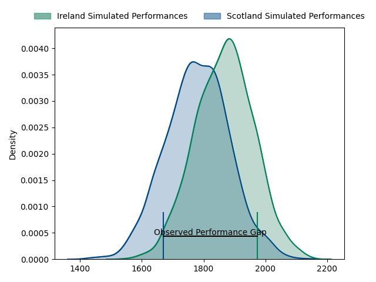
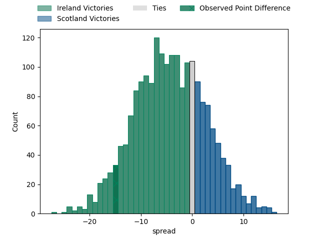
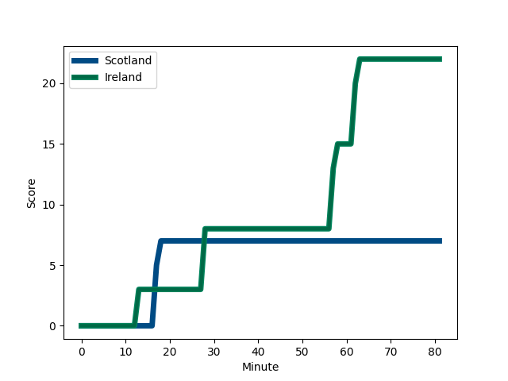
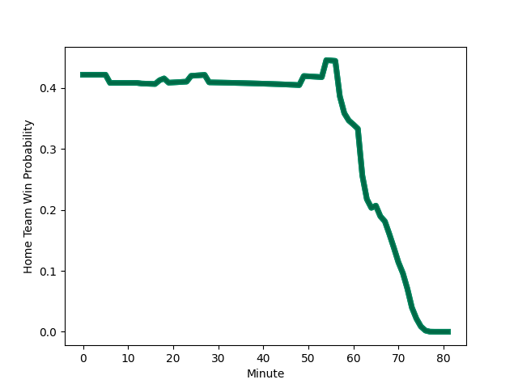

---  
layout: page  
title: Ireland at Scotland; 3.0-7.0  
date: 2023-03-12 11:00:00 18:00:00 -0500  
categories: match review  
---
# Ireland at Scotland; 3.0-7.0

# Club Level Predictions

The first set of predictions treats a club as the smallest object, as the club develops its members, organizes a gameplan, and deploys its players as needed for each match. This club model has a prediction of 0.379, which translates to predicting Ireland to win by 4.5.

Each club has a rating and a rating deviation (simiar to a Glicko system), and expected performances can be generated. This allows for simulated matches and spreads like the ones below.
## Projected Performances

## Projected Spreads

## Projected Results

# Player Level Predictions

Treating teams instead as an entity made up of the currently active players, I have ratings for each player in an altogether different system. These can be combined to form team ratings once teamsheets are announced, weighting starters a bit higher than the reserves. After the match is played, players can be weighted by their minutes on the field, allowing for an accurate measure of the team's composition. With these compiled team ratings, we can make predictions, measure inaccuracy, and update the individual player ratings.
## Prediction with Player Minutes: Ireland by 14.2

Ireland by 18.2 on a neutral field
## Scores over Time

## Win Probability over Time

There were 7 large changes in win probability in this match
## Prediction without Player Minutes: Ireland by 8.9

Ireland by 12.9 on a neutral pitch

|   Away Minutes | Away Player                                                           |   Away elo |   Away Percentile |   Number |   Home Percentile |   Home elo | Home Player                                                         |   Home Minutes |
|---------------:|:----------------------------------------------------------------------|-----------:|------------------:|---------:|------------------:|-----------:|:--------------------------------------------------------------------|---------------:|
|             80 | [Andrew Porter](..//playerfiles//AndrewPorter_cleaned.md)             |      99.83 |                68 |        1 |                30 |      89.72 | [Pierre Schoeman](..//playerfiles//PierreSchoeman_cleaned.md)       |             80 |
|             19 | [Dan Sheehan](..//playerfiles//DanSheehan_cleaned.md)                 |     111.13 |                88 |        2 |                97 |     122.29 | [George Turner](..//playerfiles//GeorgeTurner_cleaned.md)           |             80 |
|             80 | [Tadhg Furlong](..//playerfiles//TadhgFurlong_cleaned.md)             |      95    |               nan |        3 |                93 |     115.19 | [Zander Fagerson](..//playerfiles//ZanderFagerson_cleaned.md)       |             80 |
|             24 | [Iain Henderson](..//playerfiles//IainHenderson_cleaned.md)           |     114.56 |                90 |        4 |                95 |     122.75 | [Richie Gray](..//playerfiles//RichieGray_cleaned.md)               |              6 |
|             80 | [James Ryan](..//playerfiles//JamesRyan_cleaned.md)                   |     111.93 |                87 |        5 |                71 |     102.29 | [Jonny Gray](..//playerfiles//JonnyGray_cleaned.md)                 |             80 |
|             80 | [Peter O'Mahony](..//playerfiles//PeterO'Mahony_cleaned.md)           |      81.46 |                11 |        6 |                73 |     103.67 | [Matt Fagerson](..//playerfiles//MattFagerson_cleaned.md)           |             80 |
|             80 | [Josh van der Flier](..//playerfiles//JoshvanderFlier_cleaned.md)     |     132.15 |                97 |        7 |                97 |     133.12 | [Jamie Ritchie](..//playerfiles//JamieRitchie_cleaned.md)           |             80 |
|             13 | [Caelan Doris](..//playerfiles//CaelanDoris_cleaned.md)               |     127.34 |                96 |        8 |               nan |      85.34 | [Jack Dempsey](..//playerfiles//JackDempsey_cleaned.md)             |             80 |
|             80 | [Conor Murray](..//playerfiles//ConorMurray_cleaned.md)               |     145.74 |                99 |        9 |                85 |     108.03 | [Ben White](..//playerfiles//BenWhite_cleaned.md)                   |             80 |
|             80 | [Johnny Sexton](..//playerfiles//JohnnySexton_cleaned.md)             |     143.89 |                99 |       10 |                98 |     136.79 | [Finn Russell](..//playerfiles//FinnRussell_cleaned.md)             |             80 |
|             80 | [James Lowe](..//playerfiles//JamesLowe_cleaned.md)                   |     146.44 |                99 |       11 |                67 |     100.97 | [Duhan van der Merwe](..//playerfiles//DuhanvanderMerwe_cleaned.md) |             80 |
|             80 | [Bundee Aki](..//playerfiles//BundeeAki_cleaned.md)                   |     139.05 |                98 |       12 |                27 |      88.05 | [Sione Tuipulotu](..//playerfiles//SioneTuipulotu_cleaned.md)       |             80 |
|             80 | [Garry Ringrose](..//playerfiles//GarryRingrose_cleaned.md)           |      80.67 |                13 |       13 |                 8 |      75.65 | [Huw Jones](..//playerfiles//HuwJones_cleaned.md)                   |             80 |
|             80 | [Mack Hansen](..//playerfiles//MackHansen_cleaned.md)                 |      89.61 |                32 |       14 |                86 |     109.74 | [Kyle Steyn](..//playerfiles//KyleSteyn_cleaned.md)                 |             80 |
|             80 | [Hugo Keenan](..//playerfiles//HugoKeenan_cleaned.md)                 |     144.54 |                99 |       15 |                82 |     108.8  | [Stuart Hogg](..//playerfiles//StuartHogg_cleaned.md)               |             80 |
|             61 | [Ronan Kelleher](..//playerfiles//RonanKelleher_cleaned.md)           |     126.34 |                98 |       16 |               nan |     123.45 | [Fraser Brown](..//playerfiles//FraserBrown_cleaned.md)             |              0 |
|              0 | [Cian Healy](..//playerfiles//CianHealy_cleaned.md)                   |      95    |               nan |       17 |               nan |     117.97 | [Jamie Bhatti](..//playerfiles//JamieBhatti_cleaned.md)             |              0 |
|              0 | [Tom O'Toole](..//playerfiles//TomO'Toole_cleaned.md)                 |      86.14 |                21 |       18 |               nan |      94.24 | [Simon Berghan](..//playerfiles//SimonBerghan_cleaned.md)           |              0 |
|             56 | [Ryan Baird](..//playerfiles//RyanBaird_cleaned.md)                   |      95.9  |               nan |       19 |               nan |      95    | [Scott Cummings](..//playerfiles//ScottCummings_cleaned.md)         |             74 |
|             67 | [Jack Conan](..//playerfiles//JackConan_cleaned.md)                   |     123.63 |                96 |       20 |                42 |      92.5  | [Hamish Watson](..//playerfiles//HamishWatson_cleaned.md)           |              0 |
|              0 | [Jamison Gibson-Park](..//playerfiles//JamisonGibson-Park_cleaned.md) |      95    |               nan |       21 |               nan |      93.64 | [Ali Price](..//playerfiles//AliPrice_cleaned.md)                   |              0 |
|              0 | [Ross Byrne](..//playerfiles//RossByrne_cleaned.md)                   |     113.43 |                88 |       22 |               nan |     154.79 | [Blair Kinghorn](..//playerfiles//BlairKinghorn_cleaned.md)         |              0 |
|              0 | [Robbie Henshaw](..//playerfiles//RobbieHenshaw_cleaned.md)           |      95    |               nan |       23 |                85 |     109.04 | [Chris Harris](..//playerfiles//ChrisHarris_cleaned.md)             |              0 |

