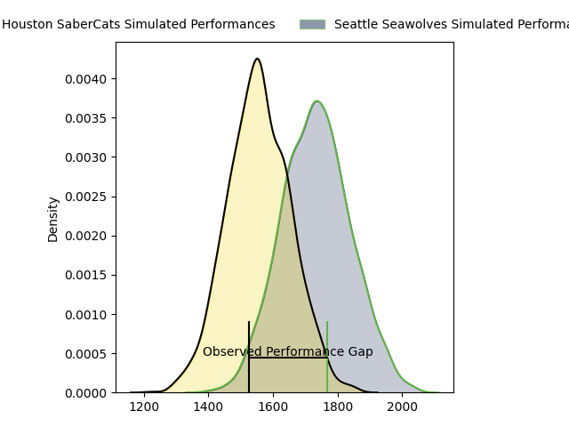
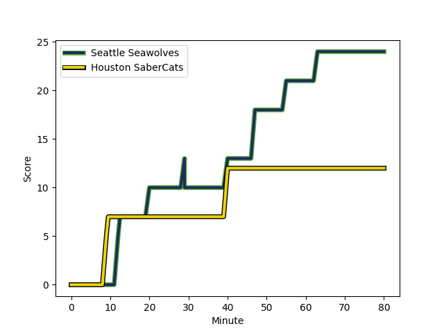
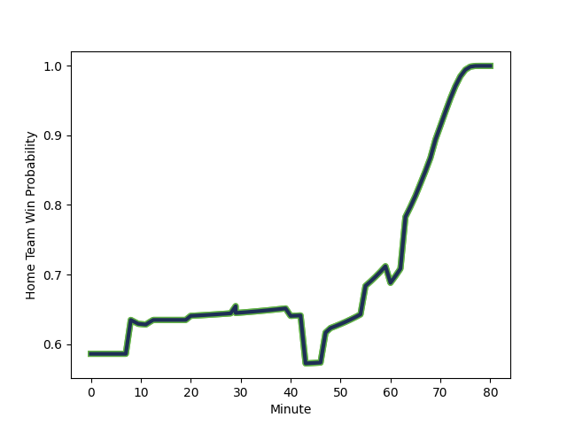

---  
layout: page  
title: Houston SaberCats at Seattle Seawolves; 12-24  
date: 2023-03-12 04:30:00 18:00:00 -0500  
categories: match review  
---
# Houston SaberCats at Seattle Seawolves; 12-24

# Club Level Predictions

The first set of predictions treats a club as the smallest object, as the club develops its members, organizes a gameplan, and deploys its players as needed for each match. This club model has a prediction of 0.727, which translates to predicting Seattle Seawolves to win by 8.9.

Each club has a rating and a rating deviation (simiar to a Glicko system), and expected performances can be generated. This allows for simulated matches and spreads like the ones below.
## Projected Performances

## Projected Spreads

## Projected Results

# Player Level Predictions

Treating teams instead as an entity made up of the currently active players, I have ratings for each player in an altogether different system. These can be combined to form team ratings once teamsheets are announced, weighting starters a bit higher than the reserves. After the match is played, players can be weighted by their minutes on the field, allowing for an accurate measure of the team's composition. With these compiled team ratings, we can make predictions, measure inaccuracy, and update the individual player ratings.
## Prediction with Player Minutes: Seattle Seawolves by 19.1

Seattle Seawolves by 15.1 on a neutral field
## Scores over Time

## Win Probability over Time

There were 6 large changes in win probability in this match
## Prediction without Player Minutes: Seattle Seawolves by 14.5

Seattle Seawolves by 10.5 on a neutral pitch

|   Away Minutes | Away Player                                                                              |   Away elo |   Away Percentile |   Number |   Home Percentile |   Home elo | Home Player                                                                |   Home Minutes |
|---------------:|:-----------------------------------------------------------------------------------------|-----------:|------------------:|---------:|------------------:|-----------:|:---------------------------------------------------------------------------|---------------:|
|             63 | [Rob Cobb](..//playerfiles//RobCobb_cleaned.md)                                          |     103.35 |                78 |        1 |                37 |      88.19 | [Mzamo Majola](..//playerfiles//MzamoMajola_cleaned.md)                    |             63 |
|             63 | [Rob Cobb](..//playerfiles//RobCobb_cleaned.md)                                          |     103.35 |                78 |        1 |                17 |      88.19 | [Mzamo Majola](..//playerfiles//MzamoMajola_cleaned.md)                    |             63 |
|             80 | [Axel Zapata](..//playerfiles//AxelZapata_cleaned.md)                                    |     101.21 |                72 |        2 |                76 |     111.34 | [James Malcolm](..//playerfiles//JamesMalcolm_cleaned.md)                  |             60 |
|             80 | [Axel Zapata](..//playerfiles//AxelZapata_cleaned.md)                                    |     101.21 |                72 |        2 |                90 |     111.34 | [James Malcolm](..//playerfiles//JamesMalcolm_cleaned.md)                  |             60 |
|             63 | [Morgan Mitchell](..//playerfiles//MorganMitchell_cleaned.md)                            |     104.74 |                81 |        3 |                30 |      87.03 | [Sam Matenga](..//playerfiles//SamMatenga_cleaned.md)                      |             60 |
|             63 | [Morgan Mitchell](..//playerfiles//MorganMitchell_cleaned.md)                            |     104.74 |                81 |        3 |                15 |      87.03 | [Sam Matenga](..//playerfiles//SamMatenga_cleaned.md)                      |             60 |
|             66 | [Siaosi Mahoni](..//playerfiles//SiaosiMahoni_cleaned.md)                                |      97.71 |                58 |        4 |                49 |     103.09 | [Ben Landry](..//playerfiles//BenLandry_cleaned.md)                        |             73 |
|             66 | [Siaosi Mahoni](..//playerfiles//SiaosiMahoni_cleaned.md)                                |      97.71 |                58 |        4 |                72 |     103.09 | [Ben Landry](..//playerfiles//BenLandry_cleaned.md)                        |             73 |
|             80 | [Nathan Den Hoedt](..//playerfiles//NathanDenHoedt_cleaned.md)                           |      75.4  |                 8 |        5 |                64 |     109.06 | [Rhyno Herbst](..//playerfiles//RhynoHerbst_cleaned.md)                    |             80 |
|             80 | [Nathan Den Hoedt](..//playerfiles//NathanDenHoedt_cleaned.md)                           |      75.4  |                 8 |        5 |                84 |     109.06 | [Rhyno Herbst](..//playerfiles//RhynoHerbst_cleaned.md)                    |             80 |
|             48 | [Hanco Germishuys](..//playerfiles//HancoGermishuys_cleaned.md)                          |     106.28 |                79 |        6 |                69 |     100.81 | [Charles Elton](..//playerfiles//CharlesElton_cleaned.md)                  |             80 |
|             80 | [Marno Redelinghuys](..//playerfiles//MarnoRedelinghuys_cleaned.md)                      |      84.33 |                15 |        7 |                75 |     104.14 | [Nakai Penny](..//playerfiles//NakaiPenny_cleaned.md)                      |             43 |
|             80 | [Gideon van Wyk](..//playerfiles//GideonvanWyk_cleaned.md)                               |      96.25 |                52 |        8 |                67 |     100.97 | [Riekert Hattingh](..//playerfiles//RiekertHattingh_cleaned.md)            |             80 |
|              8 | [Dillon Smit](..//playerfiles//DillonSmit_cleaned.md)                                    |      95    |               nan |        9 |                88 |     109.98 | [JP Smith](..//playerfiles//JPSmith_cleaned.md)                            |             80 |
|             80 | [David Coetzer](..//playerfiles//DavidCoetzer_cleaned.md)                                |      78.36 |                12 |       10 |                74 |     103.04 | [AJ Alatimu](..//playerfiles//AJAlatimu_cleaned.md)                        |             80 |
|             69 | [Vereniki Tikoisolomone](..//playerfiles//VerenikiTikoisolomone_cleaned.md)              |      99.32 |                63 |       11 |                41 |      94.59 | [Martin Iosefo](..//playerfiles//MartinIosefo_cleaned.md)                  |             60 |
|             80 | [Dominic Akina](..//playerfiles//DominicAkina_cleaned.md)                                |      82.22 |                15 |       12 |                68 |     100.97 | [Daniel David Kriel](..//playerfiles//DanielDavidKriel_cleaned.md)         |             80 |
|             80 | [Christian Dyer](..//playerfiles//ChristianDyer_cleaned.md)                              |     106.28 |                80 |       13 |                41 |      92.29 | [Tevita Lopeti](..//playerfiles//TevitaLopeti_cleaned.md)                  |             80 |
|             80 | [Gherardus Jacobus Labuschagne](..//playerfiles//GherardusJacobusLabuschagne_cleaned.md) |      98.57 |                60 |       14 |                99 |     164.96 | [Lauina Futi](..//playerfiles//LauinaFuti_cleaned.md)                      |             80 |
|             80 | [Gherardus Jacobus Labuschagne](..//playerfiles//GherardusJacobusLabuschagne_cleaned.md) |      98.57 |                60 |       14 |               100 |     164.96 | [Lauina Futi](..//playerfiles//LauinaFuti_cleaned.md)                      |             80 |
|             80 | [Drew Wild](..//playerfiles//DrewWild_cleaned.md)                                        |     106.28 |                78 |       15 |                66 |     100.97 | [Duncan Victor Matthews](..//playerfiles//DuncanVictorMatthews_cleaned.md) |             80 |
|             17 | [Alec McDonnell](..//playerfiles//AlecMcDonnell_cleaned.md)                              |     103.78 |                71 |       16 |                63 |     107.37 | [Jake Turnbull](..//playerfiles//JakeTurnbull_cleaned.md)                  |             17 |
|             17 | [Alec McDonnell](..//playerfiles//AlecMcDonnell_cleaned.md)                              |     103.78 |                71 |       16 |                85 |     107.37 | [Jake Turnbull](..//playerfiles//JakeTurnbull_cleaned.md)                  |             17 |
|             17 | [Pono Davis](..//playerfiles//PonoDavis_cleaned.md)                                      |     103.67 |               nan |       17 |                11 |      83.99 | [Peter Malcolm](..//playerfiles//PeterMalcolm_cleaned.md)                  |             20 |
|             17 | [Pono Davis](..//playerfiles//PonoDavis_cleaned.md)                                      |     103.67 |               nan |       17 |                25 |      83.99 | [Peter Malcolm](..//playerfiles//PeterMalcolm_cleaned.md)                  |             20 |
|             14 | [Emmanuel Albert](..//playerfiles//EmmanuelAlbert_cleaned.md)                            |      96.01 |                40 |       18 |                 9 |      78.02 | [Mason Pedersen](..//playerfiles//MasonPedersen_cleaned.md)                |             20 |
|             14 | [Emmanuel Albert](..//playerfiles//EmmanuelAlbert_cleaned.md)                            |      96.01 |                40 |       18 |                 4 |      78.02 | [Mason Pedersen](..//playerfiles//MasonPedersen_cleaned.md)                |             20 |
|             32 | [Danny Barrett](..//playerfiles//DannyBarrett_cleaned.md)                                |      99.8  |                66 |       19 |                72 |     102.99 | [Taylor Krumrei](..//playerfiles//TaylorKrumrei_cleaned.md)                |              7 |
|             72 | [Nick Boyer](..//playerfiles//NickBoyer_cleaned.md)                                      |      15.2  |                 0 |       20 |                 0 |      -8.97 | [Ben Mitchell](..//playerfiles//BenMitchell_cleaned.md)                    |             37 |
|             72 | [Nick Boyer](..//playerfiles//NickBoyer_cleaned.md)                                      |      15.2  |                 0 |       20 |                 0 |      -8.97 | [Ben Mitchell](..//playerfiles//BenMitchell_cleaned.md)                    |             37 |
|             11 | [Zach Pangeliman](..//playerfiles//ZachPangeliman_cleaned.md)                            |      79.55 |                15 |       21 |                 4 |      72.08 | [Conner Mooneyham](..//playerfiles//ConnerMooneyham_cleaned.md)            |             20 |
|             11 | [Zach Pangeliman](..//playerfiles//ZachPangeliman_cleaned.md)                            |      79.55 |                15 |       21 |                 7 |      72.08 | [Conner Mooneyham](..//playerfiles//ConnerMooneyham_cleaned.md)            |             20 |

