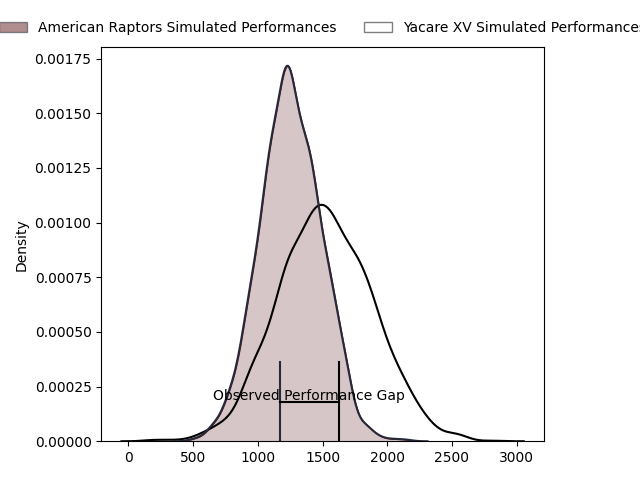
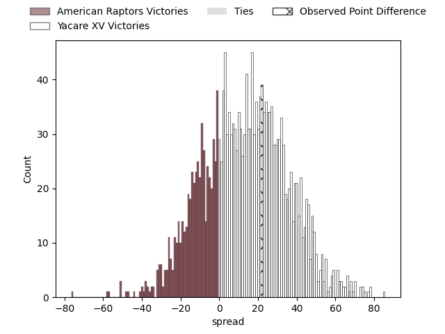
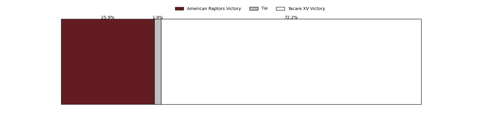

---  
layout: page  
title: American Raptors at Yacare XV; 3-25  
date: 2023-03-12 22:00:00 18:00:00 -0500  
categories: match review  
---
# American Raptors at Yacare XV; 3-25

# Club Level Predictions

The first set of predictions treats a club as the smallest object, as the club develops its members, organizes a gameplan, and deploys its players as needed for each match. This club model has a prediction of 0.77, which translates to predicting Yacare XV to win by 13.2.

Each club has a rating and a rating deviation (simiar to a Glicko system), and expected performances can be generated. This allows for simulated matches and spreads like the ones below.
## Projected Performances

## Projected Spreads

## Projected Results

# Player Level Predictions

Treating teams instead as an entity made up of the currently active players, I have ratings for each player in an altogether different system. These can be combined to form team ratings once teamsheets are announced, weighting starters a bit higher than the reserves. After the match is played, players can be weighted by their minutes on the field, allowing for an accurate measure of the team's composition. With these compiled team ratings, we can make predictions, measure inaccuracy, and update the individual player ratings.
## Prediction with Player Minutes: Yacare XV by 6.7

Yacare XV by 2.7 on a neutral field

There were 3 large changes in win probability in this match
## Prediction without Player Minutes: Yacare XV by 4.4

Yacare XV by 0.4 on a neutral pitch

|   Away Minutes | Away Player                                                                    |   Away elo |   Away Percentile |   Number |   Home Percentile |   Home elo | Home Player                                                              |   Home Minutes |
|---------------:|:-------------------------------------------------------------------------------|-----------:|------------------:|---------:|------------------:|-----------:|:-------------------------------------------------------------------------|---------------:|
|             70 | [Ma'ake Muti](..//playerfiles//Ma'akeMuti_cleaned.md)                          |     103.34 |                66 |        1 |                76 |     103.4  | [Lucas Noguera Paz](..//playerfiles//LucasNogueraPaz_cleaned.md)         |             70 |
|             70 | [Ma'ake Muti](..//playerfiles//Ma'akeMuti_cleaned.md)                          |     103.34 |                82 |        1 |                76 |     103.4  | [Lucas Noguera Paz](..//playerfiles//LucasNogueraPaz_cleaned.md)         |             70 |
|             70 | [Diego Fortuny](..//playerfiles//DiegoFortuny_cleaned.md)                      |      93.61 |                47 |        2 |                50 |      94.42 | [Emilio Gorostiaga](..//playerfiles//EmilioGorostiaga_cleaned.md)        |             70 |
|             70 | [Juan Echeverria](..//playerfiles//JuanEcheverria_cleaned.md)                  |     106.43 |                83 |        3 |                38 |      91.95 | [Facundo Pomponio](..//playerfiles//FacundoPomponio_cleaned.md)          |             80 |
|             70 | [Mikey Grandy](..//playerfiles//MikeyGrandy_cleaned.md)                        |     104.82 |                75 |        4 |                81 |     108.02 | [Ignacio Martinez](..//playerfiles//IgnacioMartinez_cleaned.md)          |             80 |
|             80 | [Diego Magno](..//playerfiles//DiegoMagno_cleaned.md)                          |      92.08 |                40 |        5 |                35 |      90.7  | [Mariano Garcete Elli](..//playerfiles//MarianoGarceteElli_cleaned.md)   |             80 |
|             80 | [Shawn Clark](..//playerfiles//ShawnClark_cleaned.md)                          |     100.67 |                67 |        6 |                60 |      98.61 | [Felipe Villagran](..//playerfiles//FelipeVillagran_cleaned.md)          |             80 |
|             80 | [Ronan Murphy](..//playerfiles//RonanMurphy_cleaned.md)                        |      91.06 |                38 |        7 |                10 |      79.94 | [Felipe Puertas](..//playerfiles//FelipePuertas_cleaned.md)              |             80 |
|             70 | [Siaki Lolohea Vikilani](..//playerfiles//SiakiLoloheaVikilani_cleaned.md)     |      91.81 |                38 |        8 |                79 |     106.5  | [Marcos Riquelme](..//playerfiles//MarcosRiquelme_cleaned.md)            |             80 |
|             70 | [Martin Landajo](..//playerfiles//MartinLandajo_cleaned.md)                    |     103.58 |                78 |        9 |                72 |     101.49 | [Ignacio Inchauspe](..//playerfiles//IgnacioInchauspe_cleaned.md)        |             70 |
|             80 | [Lucas Gonzalez Amorosino](..//playerfiles//LucasGonzalezAmorosino_cleaned.md) |      93.44 |                44 |       10 |               nan |      99.85 | [Federico Cacciabúe](..//playerfiles//FedericoCacciabúe_cleaned.md)      |             70 |
|             80 | [Seimou Smith](..//playerfiles//SeimouSmith_cleaned.md)                        |      83.94 |                18 |       11 |                 4 |      63.54 | [Juan Daniel Gonzalez](..//playerfiles//JuanDanielGonzalez_cleaned.md)   |             80 |
|             80 | [Aki Pulu](..//playerfiles//AkiPulu_cleaned.md)                                |      98.97 |                61 |       12 |                60 |      98.78 | [Ramiro Amarilla](..//playerfiles//RamiroAmarilla_cleaned.md)            |             80 |
|             80 | [Watson Filikitonga](..//playerfiles//WatsonFilikitonga_cleaned.md)            |      91.33 |               nan |       13 |                97 |     128.22 | [Tomas Acosta Pimentel](..//playerfiles//TomasAcostaPimentel_cleaned.md) |             80 |
|             80 | [Ryan James](..//playerfiles//RyanJames_cleaned.md)                            |     100.62 |                67 |       14 |                78 |     105.28 | [Federico Gauna](..//playerfiles//FedericoGauna_cleaned.md)              |             70 |
|             80 | [Line Latu](..//playerfiles//LineLatu_cleaned.md)                              |      97.85 |                57 |       15 |                76 |     105.28 | [Tomas McCall](..//playerfiles//TomasMcCall_cleaned.md)                  |             80 |
|             10 | [Payton Telea-Ilalio](..//playerfiles//PaytonTelea-Ilalio_cleaned.md)          |      88.13 |                25 |       16 |                45 |      93.24 | [Mariano Muntaner](..//playerfiles//MarianoMuntaner_cleaned.md)          |             10 |
|             10 | [Ethan McVeigh](..//playerfiles//EthanMcVeigh_cleaned.md)                      |      99.67 |               nan |       17 |               nan |      98.03 | [Julian Martin](..//playerfiles//JulianMartin_cleaned.md)                |             10 |
|             10 | [Will Crawford](..//playerfiles//WillCrawford_cleaned.md)                      |      61.63 |                 3 |       18 |                38 |      91.35 | [Sebastian Urbieta](..//playerfiles//SebastianUrbieta_cleaned.md)        |             10 |
|             10 | [Tommy Clark](..//playerfiles//TommyClark_cleaned.md)                          |     100.63 |                72 |       19 |               nan |      94.39 | [Diego Miño](..//playerfiles//DiegoMiño_cleaned.md)                      |             10 |
|             10 | [Adagio Lopeti](..//playerfiles//AdagioLopeti_cleaned.md)                      |      95    |               nan |       20 |               nan |      95    | [Facundo Paiva](..//playerfiles//FacundoPaiva_cleaned.md)                |             10 |
|             10 | [Franco Palillo](..//playerfiles//FrancoPalillo_cleaned.md)                    |      92.76 |               nan |       21 |               nan |     nan    | nan                                                                      |            nan |

