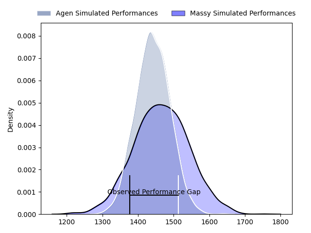
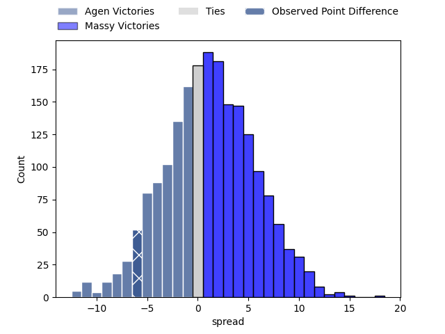
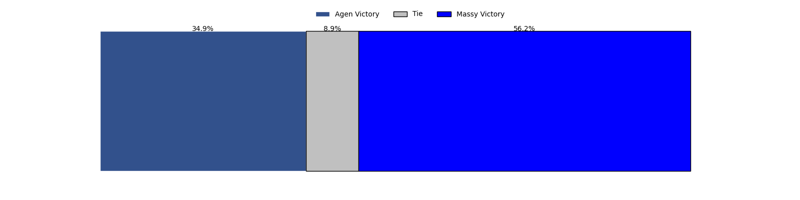

---  
layout: page  
title: Agen at Massy; 22-16  
date: 2023-03-16 21:00:00 18:00:00 -0500  
categories: match review  
---
# Agen at Massy; 22-16

# Club Level Predictions

The first set of predictions treats a club as the smallest object, as the club develops its members, organizes a gameplan, and deploys its players as needed for each match. This club model has a prediction of 0.535, which translates to predicting Massy to win by 1.2.

Each club has a rating and a rating deviation (simiar to a Glicko system), and expected performances can be generated. This allows for simulated matches and spreads like the ones below.
## Projected Performances

## Projected Spreads

## Projected Results

# Player Level Predictions

Treating teams instead as an entity made up of the currently active players, I have ratings for each player in an altogether different system. These can be combined to form team ratings once teamsheets are announced, weighting starters a bit higher than the reserves. After the match is played, players can be weighted by their minutes on the field, allowing for an accurate measure of the team's composition. With these compiled team ratings, we can make predictions, measure inaccuracy, and update the individual player ratings.
## Prediction with Player Minutes: Massy by 24.0

Massy by 20.0 on a neutral field

There were 12 large changes in win probability in this match
## Prediction without Player Minutes: Massy by 25.9

Massy by 21.9 on a neutral pitch

|   Away Minutes | Away Player                                                               |   Away elo |   Away Percentile |   Number |   Home Percentile |   Home elo | Home Player                                                             |   Home Minutes |
|---------------:|:--------------------------------------------------------------------------|-----------:|------------------:|---------:|------------------:|-----------:|:------------------------------------------------------------------------|---------------:|
|             80 | [Hans Lombard-Buret](..//playerfiles//HansLombard-Buret_cleaned.md)       |      87.08 |                17 |        1 |                22 |      87.6  | [Fernandez Correa](..//playerfiles//FernandezCorrea_cleaned.md)         |             49 |
|             58 | [Hans Lombard-Buret](..//playerfiles//HansLombard-Buret_cleaned.md)       |      87.08 |                17 |        1 |                22 |      87.6  | [Fernandez Correa](..//playerfiles//FernandezCorrea_cleaned.md)         |             80 |
|             58 | [Hans Lombard-Buret](..//playerfiles//HansLombard-Buret_cleaned.md)       |      87.08 |                50 |        1 |                22 |      87.6  | [Fernandez Correa](..//playerfiles//FernandezCorrea_cleaned.md)         |             80 |
|             80 | [Hans Lombard-Buret](..//playerfiles//HansLombard-Buret_cleaned.md)       |      87.08 |                50 |        1 |                22 |      87.6  | [Fernandez Correa](..//playerfiles//FernandezCorrea_cleaned.md)         |             49 |
|             58 | [Hans Lombard-Buret](..//playerfiles//HansLombard-Buret_cleaned.md)       |      87.08 |                17 |        1 |                22 |      87.6  | [Fernandez Correa](..//playerfiles//FernandezCorrea_cleaned.md)         |             49 |
|             58 | [Hans Lombard-Buret](..//playerfiles//HansLombard-Buret_cleaned.md)       |      87.08 |                50 |        1 |                22 |      87.6  | [Fernandez Correa](..//playerfiles//FernandezCorrea_cleaned.md)         |             49 |
|             80 | [Hans Lombard-Buret](..//playerfiles//HansLombard-Buret_cleaned.md)       |      87.08 |                50 |        1 |                22 |      87.6  | [Fernandez Correa](..//playerfiles//FernandezCorrea_cleaned.md)         |             80 |
|             80 | [Hans Lombard-Buret](..//playerfiles//HansLombard-Buret_cleaned.md)       |      87.08 |                17 |        1 |                22 |      87.6  | [Fernandez Correa](..//playerfiles//FernandezCorrea_cleaned.md)         |             80 |
|             58 | [Clément Martinez](..//playerfiles//ClémentMartinez_cleaned.md)           |      95.96 |                56 |        2 |                98 |     133.3  | [Pierre Trassoudaine](..//playerfiles//PierreTrassoudaine_cleaned.md)   |             56 |
|             80 | [Clément Martinez](..//playerfiles//ClémentMartinez_cleaned.md)           |      95.96 |                56 |        2 |                98 |     133.3  | [Pierre Trassoudaine](..//playerfiles//PierreTrassoudaine_cleaned.md)   |             56 |
|             80 | [Clément Martinez](..//playerfiles//ClémentMartinez_cleaned.md)           |      95.96 |                56 |        2 |                98 |     133.3  | [Pierre Trassoudaine](..//playerfiles//PierreTrassoudaine_cleaned.md)   |             80 |
|             58 | [Clément Martinez](..//playerfiles//ClémentMartinez_cleaned.md)           |      95.96 |                56 |        2 |                98 |     133.3  | [Pierre Trassoudaine](..//playerfiles//PierreTrassoudaine_cleaned.md)   |             80 |
|             80 | [Alex Burin](..//playerfiles//AlexBurin_cleaned.md)                       |      88.87 |                28 |        3 |                42 |      91.58 | [Tijde Visser](..//playerfiles//TijdeVisser_cleaned.md)                 |             49 |
|             80 | [Alex Burin](..//playerfiles//AlexBurin_cleaned.md)                       |      88.87 |                28 |        3 |                42 |      91.58 | [Tijde Visser](..//playerfiles//TijdeVisser_cleaned.md)                 |             80 |
|             80 | [Joe Maksymiw](..//playerfiles//JoeMaksymiw_cleaned.md)                   |      94.9  |                49 |        4 |                 5 |      69.43 | [Andrew Chauveau](..//playerfiles//AndrewChauveau_cleaned.md)           |             80 |
|             80 | [William Demotte](..//playerfiles//WilliamDemotte_cleaned.md)             |      88.93 |                29 |        5 |                51 |      94.07 | [Marco Fuser](..//playerfiles//MarcoFuser_cleaned.md)                   |             49 |
|             80 | [William Demotte](..//playerfiles//WilliamDemotte_cleaned.md)             |      88.93 |                62 |        5 |                51 |      94.07 | [Marco Fuser](..//playerfiles//MarcoFuser_cleaned.md)                   |             49 |
|             58 | [William Demotte](..//playerfiles//WilliamDemotte_cleaned.md)             |      88.93 |                29 |        5 |                51 |      94.07 | [Marco Fuser](..//playerfiles//MarcoFuser_cleaned.md)                   |             49 |
|             58 | [William Demotte](..//playerfiles//WilliamDemotte_cleaned.md)             |      88.93 |                62 |        5 |                51 |      94.07 | [Marco Fuser](..//playerfiles//MarcoFuser_cleaned.md)                   |             80 |
|             58 | [William Demotte](..//playerfiles//WilliamDemotte_cleaned.md)             |      88.93 |                29 |        5 |                51 |      94.07 | [Marco Fuser](..//playerfiles//MarcoFuser_cleaned.md)                   |             80 |
|             80 | [William Demotte](..//playerfiles//WilliamDemotte_cleaned.md)             |      88.93 |                62 |        5 |                51 |      94.07 | [Marco Fuser](..//playerfiles//MarcoFuser_cleaned.md)                   |             80 |
|             58 | [William Demotte](..//playerfiles//WilliamDemotte_cleaned.md)             |      88.93 |                62 |        5 |                51 |      94.07 | [Marco Fuser](..//playerfiles//MarcoFuser_cleaned.md)                   |             49 |
|             80 | [William Demotte](..//playerfiles//WilliamDemotte_cleaned.md)             |      88.93 |                29 |        5 |                51 |      94.07 | [Marco Fuser](..//playerfiles//MarcoFuser_cleaned.md)                   |             80 |
|             80 | [Julien Lebian](..//playerfiles//JulienLebian_cleaned.md)                 |      95.39 |               nan |        6 |                49 |      94.38 | [Abongile Nonkontwana](..//playerfiles//AbongileNonkontwana_cleaned.md) |             80 |
|             65 | [Julien Lebian](..//playerfiles//JulienLebian_cleaned.md)                 |      95.39 |               nan |        6 |                49 |      94.38 | [Abongile Nonkontwana](..//playerfiles//AbongileNonkontwana_cleaned.md) |             80 |
|             80 | [Vincent Farré](..//playerfiles//VincentFarré_cleaned.md)                 |      77.66 |                 8 |        7 |               nan |      93.52 | [Clément Lanen](..//playerfiles//ClémentLanen_cleaned.md)               |             59 |
|             80 | [Vincent Farré](..//playerfiles//VincentFarré_cleaned.md)                 |      77.66 |                 8 |        7 |               nan |      93.52 | [Clément Lanen](..//playerfiles//ClémentLanen_cleaned.md)               |             80 |
|             80 | [Martin Devergie](..//playerfiles//MartinDevergie_cleaned.md)             |      98.04 |                55 |        8 |                42 |      92.05 | [Andy Timo](..//playerfiles//AndyTimo_cleaned.md)                       |             80 |
|             61 | [Sonatane Takulua](..//playerfiles//SonataneTakulua_cleaned.md)           |      87.7  |                28 |        9 |                94 |     117.46 | [Benjamin Prier](..//playerfiles//BenjaminPrier_cleaned.md)             |             80 |
|             80 | [Sonatane Takulua](..//playerfiles//SonataneTakulua_cleaned.md)           |      87.7  |                28 |        9 |                94 |     117.46 | [Benjamin Prier](..//playerfiles//BenjaminPrier_cleaned.md)             |             80 |
|             61 | [Sonatane Takulua](..//playerfiles//SonataneTakulua_cleaned.md)           |      87.7  |                28 |        9 |                94 |     117.46 | [Benjamin Prier](..//playerfiles//BenjaminPrier_cleaned.md)             |             56 |
|             80 | [Sonatane Takulua](..//playerfiles//SonataneTakulua_cleaned.md)           |      87.7  |                28 |        9 |                94 |     117.46 | [Benjamin Prier](..//playerfiles//BenjaminPrier_cleaned.md)             |             56 |
|             80 | [Thomas Vincent](..//playerfiles//ThomasVincent_cleaned.md)               |     110.07 |                83 |       10 |                43 |      91.38 | [Massimo Ortolan](..//playerfiles//MassimoOrtolan_cleaned.md)           |             80 |
|             80 | [Iban Etcheverry](..//playerfiles//IbanEtcheverry_cleaned.md)             |     102.79 |                72 |       11 |                22 |      86.25 | [Nathan Farissier](..//playerfiles//NathanFarissier_cleaned.md)         |             80 |
|             80 | [Kolinio Ramoka](..//playerfiles//KolinioRamoka_cleaned.md)               |      99.12 |                61 |       12 |                 1 |      51.96 | [Mathieu Guillomot](..//playerfiles//MathieuGuillomot_cleaned.md)       |             49 |
|             80 | [Kolinio Ramoka](..//playerfiles//KolinioRamoka_cleaned.md)               |      99.12 |                61 |       12 |                 1 |      51.96 | [Mathieu Guillomot](..//playerfiles//MathieuGuillomot_cleaned.md)       |             80 |
|             80 | [Harry Sloan](..//playerfiles//HarrySloan_cleaned.md)                     |      93.23 |                49 |       13 |                28 |      88.36 | [Victorien Jacomme](..//playerfiles//VictorienJacomme_cleaned.md)       |             80 |
|             80 | [Jefferson Joseph](..//playerfiles//JeffersonJoseph_cleaned.md)           |      94.9  |                47 |       14 |                75 |     103.87 | [Martin Carré](..//playerfiles//MartinCarré_cleaned.md)                 |             56 |
|             80 | [Jefferson Joseph](..//playerfiles//JeffersonJoseph_cleaned.md)           |      94.9  |                47 |       14 |                75 |     103.87 | [Martin Carré](..//playerfiles//MartinCarré_cleaned.md)                 |             80 |
|             58 | [Jean-Marcellin Buttin](..//playerfiles//Jean-MarcellinButtin_cleaned.md) |     104.83 |                72 |       15 |                35 |      89.11 | [Romain Clouté](..//playerfiles//RomainClouté_cleaned.md)               |             80 |
|             80 | [Jean-Marcellin Buttin](..//playerfiles//Jean-MarcellinButtin_cleaned.md) |     104.83 |                72 |       15 |                35 |      89.11 | [Romain Clouté](..//playerfiles//RomainClouté_cleaned.md)               |             80 |
|             22 | [Elton Thomas Jantjies](..//playerfiles//EltonThomasJantjies_cleaned.md)  |      85.89 |                18 |       16 |                34 |      90.66 | [Robin Poipy](..//playerfiles//RobinPoipy_cleaned.md)                   |             31 |
|             22 | [Evan Olmstead](..//playerfiles//EvanOlmstead_cleaned.md)                 |      98.19 |                59 |       17 |                83 |     104.6  | [Nicolas Ferrer](..//playerfiles//NicolasFerrer_cleaned.md)             |             31 |
|             22 | [Loris Zarantonello](..//playerfiles//LorisZarantonello_cleaned.md)       |      76.73 |                24 |       18 |                52 |      96.06 | [Jamie-Jerry Taulagi](..//playerfiles//Jamie-JerryTaulagi_cleaned.md)   |             31 |
|             22 | [Loris Zarantonello](..//playerfiles//LorisZarantonello_cleaned.md)       |      76.73 |                 7 |       18 |                52 |      96.06 | [Jamie-Jerry Taulagi](..//playerfiles//Jamie-JerryTaulagi_cleaned.md)   |             31 |
|             22 | [Florent Guion](..//playerfiles//FlorentGuion_cleaned.md)                 |      59.61 |                 2 |       19 |                67 |     101.51 | [Evrard Dion Oulai](..//playerfiles//EvrardDionOulai_cleaned.md)        |             31 |
|             19 | [Theo Idjellidaine](..//playerfiles//TheoIdjellidaine_cleaned.md)         |      94.34 |                44 |       20 |                27 |      89.16 | [Gaëtan Pichon](..//playerfiles//GaëtanPichon_cleaned.md)               |             24 |
|             15 | [Valentin Gayraud](..//playerfiles//ValentinGayraud_cleaned.md)           |      99.5  |                64 |       21 |                92 |     113.01 | [Alex Preira](..//playerfiles//AlexPreira_cleaned.md)                   |             24 |
|            nan | nan                                                                       |     nan    |               nan |       22 |                57 |      96.83 | [Randy Grelleaud](..//playerfiles//RandyGrelleaud_cleaned.md)           |             24 |
|            nan | nan                                                                       |     nan    |               nan |       23 |                38 |      91.06 | [Mehdi Tlili](..//playerfiles//MehdiTlili_cleaned.md)                   |             21 |

