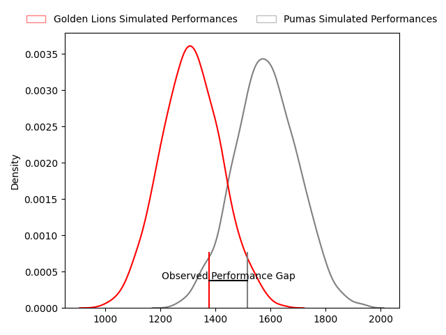
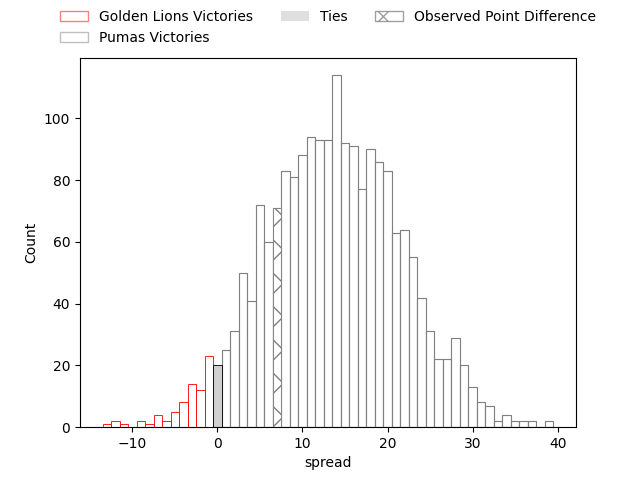
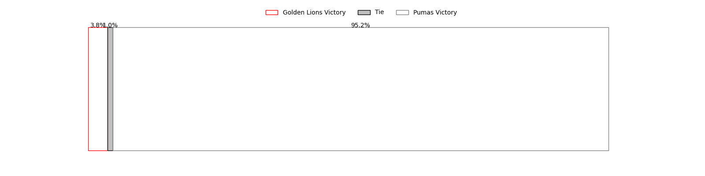

---  
layout: page  
title: Golden Lions at Pumas; 27-34  
date: 2023-03-17 16:00:00 18:00:00 -0500  
categories: match review  
---
# Golden Lions at Pumas; 27-34

# Club Level Predictions

The first set of predictions treats a club as the smallest object, as the club develops its members, organizes a gameplan, and deploys its players as needed for each match. This club model has a prediction of 0.817, which translates to predicting Pumas to win by 13.7.

Each club has a rating and a rating deviation (simiar to a Glicko system), and expected performances can be generated. This allows for simulated matches and spreads like the ones below.
## Projected Performances

## Projected Spreads

## Projected Results

# Player Level Predictions

Treating teams instead as an entity made up of the currently active players, I have ratings for each player in an altogether different system. These can be combined to form team ratings once teamsheets are announced, weighting starters a bit higher than the reserves. After the match is played, players can be weighted by their minutes on the field, allowing for an accurate measure of the team's composition. With these compiled team ratings, we can make predictions, measure inaccuracy, and update the individual player ratings.
## Prediction with Player Minutes: Pumas by 30.4

Pumas by 26.4 on a neutral field

There were 8 large changes in win probability in this match
## Prediction without Player Minutes: Pumas by 30.4

Pumas by 26.4 on a neutral pitch

|   Away Minutes | Away Player                                                                 |   Away elo |   Away Percentile |   Number |   Home Percentile |   Home elo | Home Player                                                              |   Home Minutes |
|---------------:|:----------------------------------------------------------------------------|-----------:|------------------:|---------:|------------------:|-----------:|:-------------------------------------------------------------------------|---------------:|
|             80 | [Rhynardt Rijnsburger](..//playerfiles//RhynardtRijnsburger_cleaned.md)     |      95.99 |               nan |        1 |                65 |      99.29 | [Corne Fourie](..//playerfiles//CorneFourie_cleaned.md)                  |             80 |
|             80 | [Gerrit Jacobus Visagie](..//playerfiles//GerritJacobusVisagie_cleaned.md)  |      86.54 |                21 |        2 |                92 |     115.56 | [Eduan Swart](..//playerfiles//EduanSwart_cleaned.md)                    |             80 |
|             80 | [Ruan-Henry Smith](..//playerfiles//Ruan-HenrySmith_cleaned.md)             |      94.29 |                47 |        3 |                65 |      99.29 | [Njabula Juice Gumede](..//playerfiles//NjabulaJuiceGumede_cleaned.md)   |             80 |
|             80 | [Ruben (Hobo) Schoeman](..//playerfiles//Ruben(Hobo)Schoeman_cleaned.md)    |     106.2  |                78 |        4 |                87 |     112.52 | [Deon Slabbert](..//playerfiles//DeonSlabbert_cleaned.md)                |             80 |
|             80 | [Darrien-Lane Landsberg](..//playerfiles//Darrien-LaneLandsberg_cleaned.md) |     100.57 |                64 |        5 |                99 |     139.61 | [Shane Monro Kirkwood](..//playerfiles//ShaneMonroKirkwood_cleaned.md)   |             80 |
|             80 | [Jarod Cairns](..//playerfiles//JarodCairns_cleaned.md)                     |      69.49 |                 4 |        6 |                93 |     120.83 | [Andre Fouché](..//playerfiles//AndreFouché_cleaned.md)                  |             80 |
|             80 | [Ruan Delport](..//playerfiles//RuanDelport_cleaned.md)                     |      99.59 |                64 |        7 |                68 |     100.81 | [Francois Kleinhans](..//playerfiles//FrancoisKleinhans_cleaned.md)      |             80 |
|             80 | [Travis Gordon](..//playerfiles//TravisGordon_cleaned.md)                   |      74.45 |                 7 |        8 |                71 |     103.33 | [Kwanda Dimaza](..//playerfiles//KwandaDimaza_cleaned.md)                |             80 |
|             80 | [Morne van der Berg](..//playerfiles//MornevanderBerg_cleaned.md)           |      92.55 |                43 |        9 |                45 |      93.18 | [Giovanne Snyman](..//playerfiles//GiovanneSnyman_cleaned.md)            |             80 |
|             80 | [Vaughen Isaacs](..//playerfiles//VaughenIsaacs_cleaned.md)                 |      77.02 |                 9 |       10 |               nan |      96.16 | [Brandon Terry Thomson](..//playerfiles//BrandonTerryThomson_cleaned.md) |             80 |
|             80 | [Boldwin Hansen](..//playerfiles//BoldwinHansen_cleaned.md)                 |      74.93 |                 9 |       11 |               nan |      96.75 | [Lundi Msenge](..//playerfiles//LundiMsenge_cleaned.md)                  |             80 |
|             80 | [Tyler Bocks](..//playerfiles//TylerBocks_cleaned.md)                       |      75.12 |                 8 |       12 |                91 |     116.26 | [Ali Mgijima](..//playerfiles//AliMgijima_cleaned.md)                    |             80 |
|             80 | [Rynardt Jonker](..//playerfiles//RynardtJonker_cleaned.md)                 |      99.09 |                55 |       13 |                68 |     101.08 | [Diego Appollis](..//playerfiles//DiegoAppollis_cleaned.md)              |             80 |
|             80 | [Stean Pienaar](..//playerfiles//SteanPienaar_cleaned.md)                   |      80.59 |                14 |       14 |                67 |     100.81 | [Jade Kyle Stighling](..//playerfiles//JadeKyleStighling_cleaned.md)     |             80 |
|             80 | [Andries Coetzee](..//playerfiles//AndriesCoetzee_cleaned.md)               |     105.62 |                76 |       15 |                66 |     100.81 | [Devon Frank Williams](..//playerfiles//DevonFrankWilliams_cleaned.md)   |             80 |

