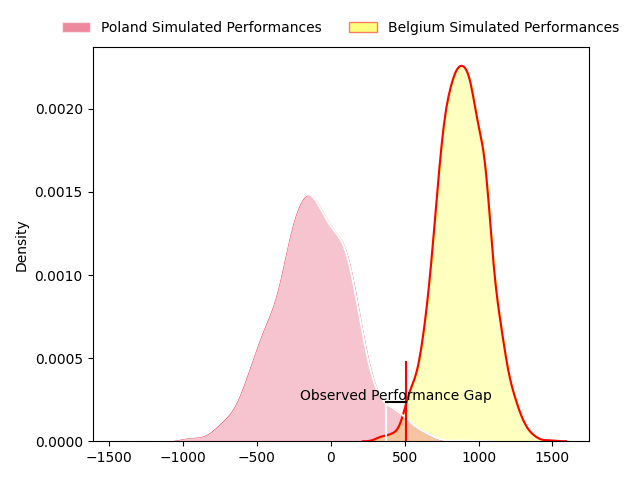
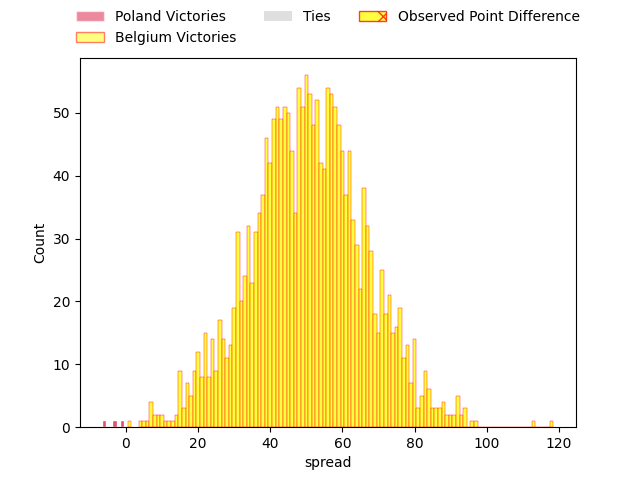
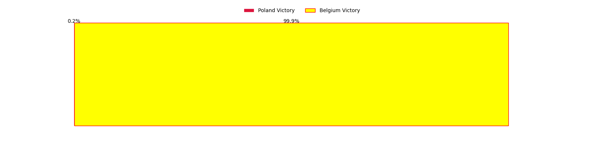

---  
layout: page  
title: Poland at Belgium; 17-18  
date: 2023-03-19 12:30:00 18:00:00 -0500  
categories: match review  
---
# Poland at Belgium; 17-18

# Club Level Predictions

The first set of predictions treats a club as the smallest object, as the club develops its members, organizes a gameplan, and deploys its players as needed for each match. This club model has a prediction of 0.988, which translates to predicting Belgium to win by 51.0.

Each club has a rating and a rating deviation (simiar to a Glicko system), and expected performances can be generated. This allows for simulated matches and spreads like the ones below.
## Projected Performances

## Projected Spreads

## Projected Results

# Player Level Predictions

Treating teams instead as an entity made up of the currently active players, I have ratings for each player in an altogether different system. These can be combined to form team ratings once teamsheets are announced, weighting starters a bit higher than the reserves. After the match is played, players can be weighted by their minutes on the field, allowing for an accurate measure of the team's composition. With these compiled team ratings, we can make predictions, measure inaccuracy, and update the individual player ratings.
## Prediction with Player Minutes: Belgium by 9.2

Belgium by 5.2 on a neutral field
## Prediction without Player Minutes: Belgium by 9.2

Belgium by 5.2 on a neutral pitch

|   Away Minutes | Away Player                                                             |   Away elo |   Away Percentile |   Number |   Home Percentile |   Home elo | Home Player                                                               |   Home Minutes |
|---------------:|:------------------------------------------------------------------------|-----------:|------------------:|---------:|------------------:|-----------:|:--------------------------------------------------------------------------|---------------:|
|             80 | [Tom Fidler](..//playerfiles//TomFidler_cleaned.md)                     |      76.15 |                 7 |        1 |                49 |      91.39 | [Lucas Sotteau](..//playerfiles//LucasSotteau_cleaned.md)                 |             80 |
|             80 | [Grzegorz Buczek](..//playerfiles//GrzegorzBuczek_cleaned.md)           |      76.99 |                 7 |        2 |                25 |      87.66 | [Thomas Dienst](..//playerfiles//ThomasDienst_cleaned.md)                 |             80 |
|             80 | [Zenon Szwagrzak](..//playerfiles//ZenonSzwagrzak_cleaned.md)           |      90.36 |                39 |        3 |                31 |      90.77 | [Samuel Opsomer](..//playerfiles//SamuelOpsomer_cleaned.md)               |             80 |
|             80 | [Michal Kruzycki](..//playerfiles//MichalKruzycki_cleaned.md)           |      72.6  |                 9 |        4 |                49 |      95    | [Dries De Keyser](..//playerfiles//DriesDeKeyser_cleaned.md)              |             80 |
|             80 | [Mateusz Bartoszek](..//playerfiles//MateuszBartoszek_cleaned.md)       |      92.88 |                42 |        5 |                14 |      81.48 | [Chris Salay Baudry](..//playerfiles//ChrisSalayBaudry_cleaned.md)        |             80 |
|             80 | [Siokivaha Taufui](..//playerfiles//SiokivahaTaufui_cleaned.md)         |      77.98 |                 9 |        6 |                 2 |      61.69 | [Hughes Bastin](..//playerfiles//HughesBastin_cleaned.md)                 |             80 |
|             80 | [Alexander Nowicki](..//playerfiles//AlexanderNowicki_cleaned.md)       |      77.61 |                 8 |        7 |                10 |      78.61 | [Toon Deceuninck](..//playerfiles//ToonDeceuninck_cleaned.md)             |             80 |
|             80 | [Piotr Zeszutek](..//playerfiles//PiotrZeszutek_cleaned.md)             |      69.32 |                 3 |        8 |                 6 |      73.09 | [Maximillien Hendrickx](..//playerfiles//MaximillienHendrickx_cleaned.md) |             80 |
|             80 | [Mateuz Plichta](..//playerfiles//MateuzPlichta_cleaned.md)             |      85.98 |                23 |        9 |                31 |      87.53 | [Julien Berger](..//playerfiles//JulienBerger_cleaned.md)                 |             80 |
|             80 | [Jedrzej Nowicki](..//playerfiles//JedrzejNowicki_cleaned.md)           |      86.07 |                21 |       10 |                32 |      88.63 | [Henri Dequenne](..//playerfiles//HenriDequenne_cleaned.md)               |             80 |
|             80 | [Robert Wojtowicz](..//playerfiles//RobertWojtowicz_cleaned.md)         |      75.86 |                 8 |       11 |                13 |      81.21 | [Thomas Wallraf](..//playerfiles//ThomasWallraf_cleaned.md)               |             80 |
|             80 | [Peter Hudson](..//playerfiles//PeterHudson_cleaned.md)                 |      66.96 |                 4 |       12 |                28 |      88.29 | [Guillaume Piron](..//playerfiles//GuillaumePiron_cleaned.md)             |             80 |
|             80 | [Grzegorz Szczepanski](..//playerfiles//GrzegorzSzczepanski_cleaned.md) |      73.32 |                 7 |       13 |                 1 |      56.87 | [Florian Remue](..//playerfiles//FlorianRemue_cleaned.md)                 |             80 |
|             80 | [Ross Cooke](..//playerfiles//RossCooke_cleaned.md)                     |      66.96 |                 4 |       14 |                18 |      82.7  | [Dazzy Cornez](..//playerfiles//DazzyCornez_cleaned.md)                   |             80 |
|             80 | [Wojciak Piotrowicz](..//playerfiles//WojciakPiotrowicz_cleaned.md)     |      72.13 |                 5 |       15 |                 5 |      67.78 | [Hugo De Francq](..//playerfiles//HugoDeFrancq_cleaned.md)                |             80 |

