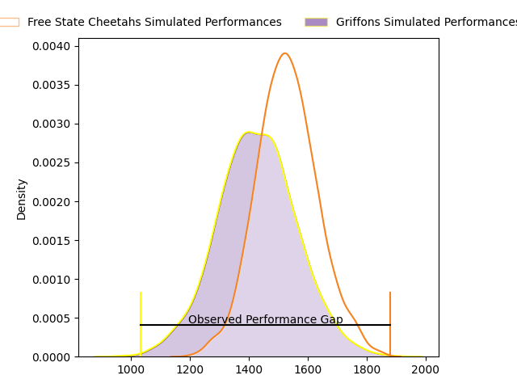
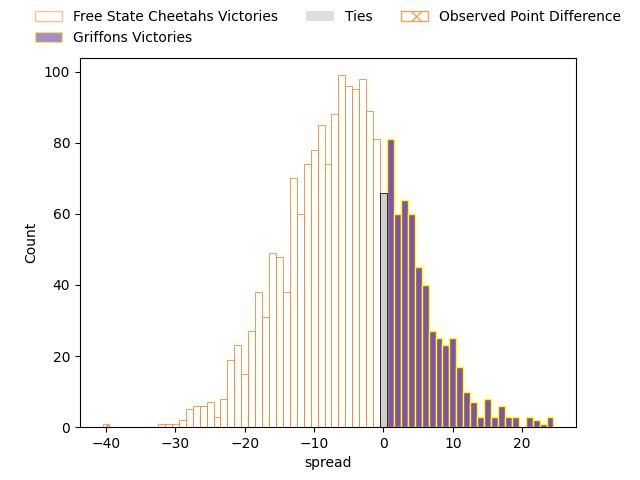
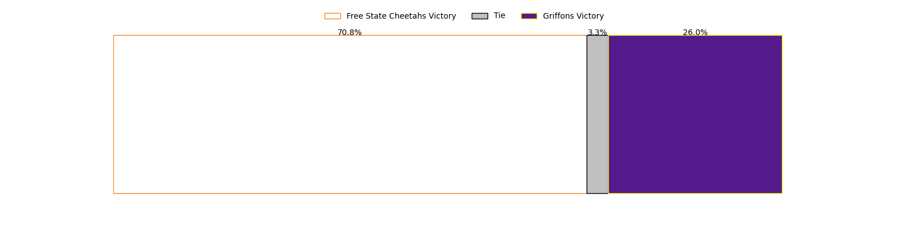

---  
layout: page  
title: Free State Cheetahs at Griffons; 52-12  
date: 2023-03-19 13:00:00 18:00:00 -0500  
categories: match review  
---
# Free State Cheetahs at Griffons; 52-12

# Club Level Predictions

The first set of predictions treats a club as the smallest object, as the club develops its members, organizes a gameplan, and deploys its players as needed for each match. This club model has a prediction of 0.363, which translates to predicting Free State Cheetahs to win by 5.1.

Each club has a rating and a rating deviation (simiar to a Glicko system), and expected performances can be generated. This allows for simulated matches and spreads like the ones below.
## Projected Performances

## Projected Spreads

## Projected Results

# Player Level Predictions

Treating teams instead as an entity made up of the currently active players, I have ratings for each player in an altogether different system. These can be combined to form team ratings once teamsheets are announced, weighting starters a bit higher than the reserves. After the match is played, players can be weighted by their minutes on the field, allowing for an accurate measure of the team's composition. With these compiled team ratings, we can make predictions, measure inaccuracy, and update the individual player ratings.
## Prediction with Player Minutes: Free State Cheetahs by 3.3

Free State Cheetahs by 7.3 on a neutral field

There were 5 large changes in win probability in this match
## Prediction without Player Minutes: Free State Cheetahs by 1.7

Free State Cheetahs by 5.7 on a neutral pitch

|   Away Minutes | Away Player                                                                              |   Away elo |   Away Percentile |   Number |   Home Percentile |   Home elo | Home Player                                                                          |   Home Minutes |
|---------------:|:-----------------------------------------------------------------------------------------|-----------:|------------------:|---------:|------------------:|-----------:|:-------------------------------------------------------------------------------------|---------------:|
|             52 | [Schalk Ferreira](..//playerfiles//SchalkFerreira_cleaned.md)                            |     102.31 |                74 |        1 |                63 |      98.94 | [Stephan de Jager](..//playerfiles//StephandeJager_cleaned.md)                       |             63 |
|             52 | [Marko Louis Janse van Rensburg](..//playerfiles//MarkoLouisJansevanRensburg_cleaned.md) |      76.35 |                 7 |        2 |                53 |      96.03 | [Dandré Delport](..//playerfiles//DandréDelport_cleaned.md)                          |             62 |
|             80 | [Hencus van Wyk](..//playerfiles//HencusvanWyk_cleaned.md)                               |     107.82 |                84 |        3 |                44 |      93.49 | [Doctor Booysen](..//playerfiles//DoctorBooysen_cleaned.md)                          |             64 |
|             80 | [Mzwanele Richman Zito](..//playerfiles//MzwaneleRichmanZito_cleaned.md)                 |      94.83 |               nan |        4 |                72 |     103.49 | [Jaco Willemse](..//playerfiles//JacoWillemse_cleaned.md)                            |             62 |
|             44 | [Victor Kutlwano Sekekete](..//playerfiles//VictorKutlwanoSekekete_cleaned.md)           |      96.77 |                54 |        5 |                45 |      93.82 | [Michael Benadie](..//playerfiles//MichaelBenadie_cleaned.md)                        |             80 |
|             80 | [Gideon van der Merwe](..//playerfiles//GideonvanderMerwe_cleaned.md)                    |     117.51 |                90 |        6 |                88 |     116.85 | [Mitch Carstens](..//playerfiles//MitchCarstens_cleaned.md)                          |             61 |
|             65 | [Friedle Olivier](..//playerfiles//FriedleOlivier_cleaned.md)                            |     136.87 |                98 |        7 |                66 |     101.61 | [Jean-Jacques Pretorius](..//playerfiles//Jean-JacquesPretorius_cleaned.md)          |             80 |
|             52 | [Anidisa Ntsila](..//playerfiles//AnidisaNtsila_cleaned.md)                              |      95    |               nan |        8 |                42 |      94.44 | [Sokuphumla (Soso) Xakalashe](..//playerfiles//Sokuphumla(Soso)Xakalashe_cleaned.md) |             80 |
|             52 | [Ruan Pienaar](..//playerfiles//RuanPienaar_cleaned.md)                                  |     107.24 |                81 |        9 |                61 |      99.01 | [Jaywinn Juries](..//playerfiles//JaywinnJuries_cleaned.md)                          |             80 |
|             80 | [Reinhardt Fortuin](..//playerfiles//ReinhardtFortuin_cleaned.md)                        |      96.72 |                50 |       10 |                91 |     122.11 | [Duan Pretorius](..//playerfiles//DuanPretorius_cleaned.md)                          |             62 |
|             80 | [Munier Hartzenberg](..//playerfiles//MunierHartzenberg_cleaned.md)                      |     103.88 |                72 |       11 |               nan |      95    | [Jamba Isaac Ulengo](..//playerfiles//JambaIsaacUlengo_cleaned.md)                   |             80 |
|             52 | [Francois Steyn](..//playerfiles//FrancoisSteyn_cleaned.md)                              |     104.49 |                72 |       12 |                 5 |      69.71 | [Marquit Virgil September](..//playerfiles//MarquitVirgilSeptember_cleaned.md)       |             68 |
|             80 | [Evardi Boshoff](..//playerfiles//EvardiBoshoff_cleaned.md)                              |      74.42 |               nan |       13 |                 3 |      63.77 | [Carel-Jan Coetzee](..//playerfiles//Carel-JanCoetzee_cleaned.md)                    |             80 |
|             80 | [Daniel Kasende Kalepula](..//playerfiles//DanielKasendeKalepula_cleaned.md)             |      89.62 |                31 |       14 |                59 |      98.69 | [Duren Hoffman](..//playerfiles//DurenHoffman_cleaned.md)                            |             80 |
|             52 | [Tapiwa Lloyd Mafura](..//playerfiles//TapiwaLloydMafura_cleaned.md)                     |      82.13 |                17 |       15 |                52 |      97.74 | [Domenic Smit](..//playerfiles//DomenicSmit_cleaned.md)                              |             61 |
|             36 | [Rynier Mark Bernardo](..//playerfiles//RynierMarkBernardo_cleaned.md)                   |     107.05 |                78 |       16 |                83 |     110.96 | [Thato Siward Mavundla](..//playerfiles//ThatoSiwardMavundla_cleaned.md)             |             19 |
|             28 | [Robert Thompson Ebersohn](..//playerfiles//RobertThompsonEbersohn_cleaned.md)           |     101.85 |                66 |       17 |                25 |      86.68 | [Keanu Armandio Vers](..//playerfiles//KeanuArmandioVers_cleaned.md)                 |             19 |
|             28 | [Rewan Kruger](..//playerfiles//RewanKruger_cleaned.md)                                  |      93.34 |                34 |       18 |                70 |      97.73 | [Wikus Nieuwenhuis](..//playerfiles//WikusNieuwenhuis_cleaned.md)                    |             18 |
|             28 | [Daniel Johannes Maartens](..//playerfiles//DanielJohannesMaartens_cleaned.md)           |     122.39 |                89 |       19 |               nan |      93.08 | [Hendrik Petrus van Schoor](..//playerfiles//HendrikPetrusvanSchoor_cleaned.md)      |             18 |
|             28 | [Ngobisizwe Mxoli](..//playerfiles//NgobisizweMxoli_cleaned.md)                          |      92.15 |               nan |       20 |               nan |      46.42 | [Robbie Petzer](..//playerfiles//RobbiePetzer_cleaned.md)                            |             18 |
|             28 | [Louis van der Westhuizen](..//playerfiles//LouisvanderWesthuizen_cleaned.md)            |     100.17 |                51 |       21 |               nan |      96.47 | [Xolani Jacobs](..//playerfiles//XolaniJacobs_cleaned.md)                            |             17 |
|             28 | [Cohen Jasper](..//playerfiles//CohenJasper_cleaned.md)                                  |     106.28 |                73 |       22 |               nan |      95.97 | [Richman Gora](..//playerfiles//RichmanGora_cleaned.md)                              |             12 |
|             15 | [Laurence Herbert Victor](..//playerfiles//LaurenceHerbertVictor_cleaned.md)             |      95    |               nan |       23 |                72 |     101.92 | [Buhle Nojekwa](..//playerfiles//BuhleNojekwa_cleaned.md)                            |             16 |

