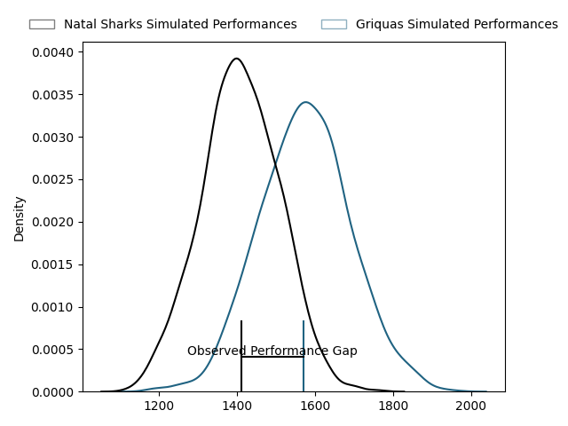
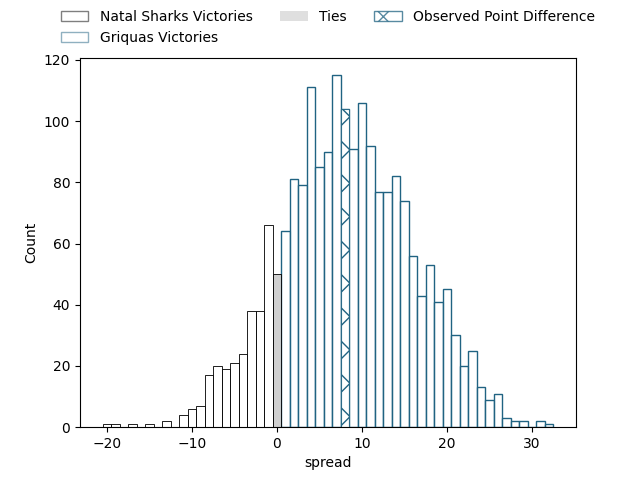
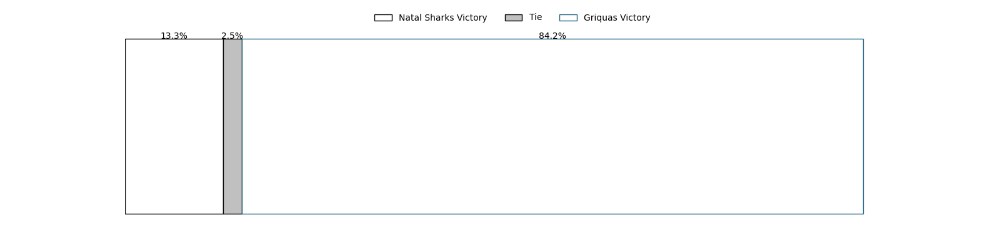

---  
layout: page  
title: Natal Sharks at Griquas; 40-48  
date: 2023-03-19 14:00:00 18:00:00 -0500  
categories: match review  
---
# Natal Sharks at Griquas; 40-48

# Club Level Predictions

The first set of predictions treats a club as the smallest object, as the club develops its members, organizes a gameplan, and deploys its players as needed for each match. This club model has a prediction of 0.71, which translates to predicting Griquas to win by 8.2.

Each club has a rating and a rating deviation (simiar to a Glicko system), and expected performances can be generated. This allows for simulated matches and spreads like the ones below.
## Projected Performances

## Projected Spreads

## Projected Results

# Player Level Predictions

Treating teams instead as an entity made up of the currently active players, I have ratings for each player in an altogether different system. These can be combined to form team ratings once teamsheets are announced, weighting starters a bit higher than the reserves. After the match is played, players can be weighted by their minutes on the field, allowing for an accurate measure of the team's composition. With these compiled team ratings, we can make predictions, measure inaccuracy, and update the individual player ratings.
## Prediction with Player Minutes: Natal Sharks by 3.9

Natal Sharks by 7.9 on a neutral field

There were 11 large changes in win probability in this match
## Prediction without Player Minutes: Natal Sharks by 3.8

Natal Sharks by 7.8 on a neutral pitch

|   Away Minutes | Away Player                                                                                   |   Away elo |   Away Percentile |   Number |   Home Percentile |   Home elo | Home Player                                                                        |   Home Minutes |
|---------------:|:----------------------------------------------------------------------------------------------|-----------:|------------------:|---------:|------------------:|-----------:|:-----------------------------------------------------------------------------------|---------------:|
|             43 | [Khwezi Jongamazizi Mona](..//playerfiles//KhweziJongamaziziMona_cleaned.md)                  |      99.56 |                65 |        1 |                40 |      92.62 | [Kudzwai Dube](..//playerfiles//KudzwaiDube_cleaned.md)                            |             40 |
|             47 | [Fezokuhle Mbatha](..//playerfiles//FezokuhleMbatha_cleaned.md)                               |     104.83 |                80 |        2 |                51 |      96.44 | [Gustav Du Rand](..//playerfiles//GustavDuRand_cleaned.md)                         |             54 |
|             30 | [Hanro Jacobs](..//playerfiles//HanroJacobs_cleaned.md)                                       |      94.94 |                50 |        3 |               nan |      89.8  | [Junior Banda](..//playerfiles//JuniorBanda_cleaned.md)                            |             40 |
|             50 | [Hyron Diego Andrews](..//playerfiles//HyronDiegoAndrews_cleaned.md)                          |      88.47 |                27 |        4 |                13 |      68.33 | [Derrick Pretorius](..//playerfiles//DerrickPretorius_cleaned.md)                  |             80 |
|             59 | [Daniel Pieter (Reniel) Hugo](..//playerfiles//DanielPieter(Reniel)Hugo_cleaned.md)           |      90.4  |                33 |        5 |                16 |      70.52 | [Albert Liebenberg](..//playerfiles//AlbertLiebenberg_cleaned.md)                  |             52 |
|             80 | [James Venter](..//playerfiles//JamesVenter_cleaned.md)                                       |      86.55 |                15 |        6 |                79 |     107.82 | [Niel Otto](..//playerfiles//NielOtto_cleaned.md)                                  |             34 |
|             80 | [Dylan Richardson](..//playerfiles//DylanRichardson_cleaned.md)                               |      92.18 |                41 |        7 |                15 |      83.78 | [Stephan Smit](..//playerfiles//StephanSmit_cleaned.md)                            |             80 |
|             49 | [Hendrik Petrus (Henco) Venter](..//playerfiles//HendrikPetrus(Henco)Venter_cleaned.md)       |      91.14 |                36 |        8 |               nan |      89.01 | [Carl Els](..//playerfiles//CarlEls_cleaned.md)                                    |             80 |
|             59 | [Cameron Robin Wright](..//playerfiles//CameronRobinWright_cleaned.md)                        |      86.2  |                16 |        9 |                22 |      86.46 | [Johan Mulder](..//playerfiles//JohanMulder_cleaned.md)                            |             65 |
|             59 | [Frederik Johannes Zeilinga](..//playerfiles//FrederikJohannesZeilinga_cleaned.md)            |      95    |               nan |       10 |                15 |      82.76 | [Lubabalo Dobela](..//playerfiles//LubabaloDobela_cleaned.md)                      |             80 |
|             80 | [Marnus Potgieter](..//playerfiles//MarnusPotgieter_cleaned.md)                               |     107.56 |                78 |       11 |                15 |      82.76 | [Luther Obi](..//playerfiles//LutherObi_cleaned.md)                                |             80 |
|             80 | [François Venter](..//playerfiles//FrançoisVenter_cleaned.md)                                 |      91.31 |                37 |       12 |                27 |      87.5  | [Zander du Plessis](..//playerfiles//ZanderduPlessis_cleaned.md)                   |             60 |
|             80 | [Murray Koster](..//playerfiles//MurrayKoster_cleaned.md)                                     |      98.23 |                56 |       13 |                83 |     111.14 | [Jay Cee Nel](..//playerfiles//JayCeeNel_cleaned.md)                               |             80 |
|             80 | [Yaw Osei Penxe](..//playerfiles//YawOseiPenxe_cleaned.md)                                    |      98.26 |                57 |       14 |                15 |      82.76 | [Rosco Shane Specman](..//playerfiles//RoscoShaneSpecman_cleaned.md)               |             80 |
|             80 | [Thaakir Abrahams](..//playerfiles//ThaakirAbrahams_cleaned.md)                               |      89.52 |                31 |       15 |               nan |      92.4  | [Malcolm Jaer](..//playerfiles//MalcolmJaer_cleaned.md)                            |             59 |
|             50 | [Khuthuzani Kingdom Mchunu](..//playerfiles//KhuthuzaniKingdomMchunu_cleaned.md)              |      94.34 |               nan |       16 |                74 |     105.47 | [Hanru Sirgel](..//playerfiles//HanruSirgel_cleaned.md)                            |             46 |
|             37 | [Dian Bleuler](..//playerfiles//DianBleuler_cleaned.md)                                       |      95.33 |                36 |       17 |               nan |      89.8  | [Cebolenkosi Dlamini](..//playerfiles//CebolenkosiDlamini_cleaned.md)              |             40 |
|             30 | [Athenkosi Ernest (Dave) Khethani](..//playerfiles//AthenkosiErnest(Dave)Khethani_cleaned.md) |      78.1  |                10 |       18 |                27 |      94.3  | [Edward Davids](..//playerfiles//EdwardDavids_cleaned.md)                          |             40 |
|             31 | [Marco De Witt](..//playerfiles//MarcoDeWitt_cleaned.md)                                      |      95    |               nan |       19 |                26 |      87.96 | [Janco Venter](..//playerfiles//JancoVenter_cleaned.md)                            |             28 |
|             21 | [Lionel Cronje](..//playerfiles//LionelCronje_cleaned.md)                                     |      98.84 |                56 |       20 |                18 |      85.31 | [Janco Uys](..//playerfiles//JancoUys_cleaned.md)                                  |             26 |
|             21 | [Bradley Davids](..//playerfiles//BradleyDavids_cleaned.md)                                   |      99.22 |               nan |       21 |               nan |      93.78 | [George Alexander Whitehead](..//playerfiles//GeorgeAlexanderWhitehead_cleaned.md) |             21 |
|             21 | [Damon Royle](..//playerfiles//DamonRoyle_cleaned.md)                                         |      98.77 |               nan |       22 |               nan |      95.05 | [Bobby Alexander](..//playerfiles//BobbyAlexander_cleaned.md)                      |             15 |
|             33 | [Daniel Viljoen Jooste](..//playerfiles//DanielViljoenJooste_cleaned.md)                      |      92.34 |                40 |       23 |                67 |     102.42 | [Eduard (Eddie) Fouche](..//playerfiles//Eduard(Eddie)Fouche_cleaned.md)           |             20 |

