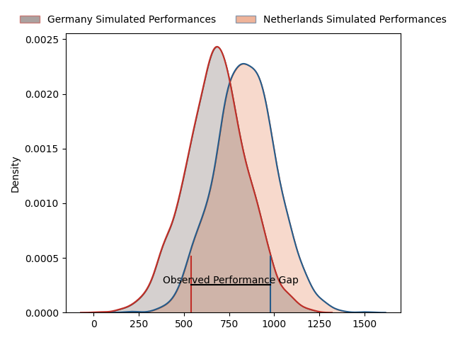
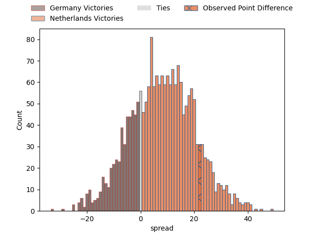

---  
layout: page  
title: Germany at Netherlands; 28-50  
date: 2023-03-19 15:00:00 18:00:00 -0500  
categories: match review  
---
# Germany at Netherlands; 28-50

# Club Level Predictions

The first set of predictions treats a club as the smallest object, as the club develops its members, organizes a gameplan, and deploys its players as needed for each match. This club model has a prediction of 0.692, which translates to predicting Netherlands to win by 8.0.

Each club has a rating and a rating deviation (simiar to a Glicko system), and expected performances can be generated. This allows for simulated matches and spreads like the ones below.
## Projected Performances

## Projected Spreads

## Projected Results

# Player Level Predictions

Treating teams instead as an entity made up of the currently active players, I have ratings for each player in an altogether different system. These can be combined to form team ratings once teamsheets are announced, weighting starters a bit higher than the reserves. After the match is played, players can be weighted by their minutes on the field, allowing for an accurate measure of the team's composition. With these compiled team ratings, we can make predictions, measure inaccuracy, and update the individual player ratings.
## Prediction with Player Minutes: Germany by 4.8

Germany by 8.8 on a neutral field
## Prediction without Player Minutes: Germany by 4.8

Germany by 8.8 on a neutral pitch

|   Away Minutes | Away Player                                                       |   Away elo |   Away Percentile |   Number |   Home Percentile |   Home elo | Home Player                                                           |   Home Minutes |
|---------------:|:------------------------------------------------------------------|-----------:|------------------:|---------:|------------------:|-----------:|:----------------------------------------------------------------------|---------------:|
|             80 | [Daniel Wolf](..//playerfiles//DanielWolf_cleaned.md)             |      88.96 |                24 |        1 |                 3 |      67.68 | [Hugo Langelaan](..//playerfiles//HugoLangelaan_cleaned.md)           |             80 |
|             80 | [Mathis Blume](..//playerfiles//MathisBlume_cleaned.md)           |      91.87 |                36 |        2 |                 8 |      78.19 | [Ross Bennie-Coulson](..//playerfiles//RossBennie-Coulson_cleaned.md) |             80 |
|             80 | [Paul Weiss](..//playerfiles//PaulWeiss_cleaned.md)               |      63    |                 1 |        3 |                 1 |      58.54 | [Andrew Darlington](..//playerfiles//AndrewDarlington_cleaned.md)     |             80 |
|             80 | [Michel Himmer](..//playerfiles//MichelHimmer_cleaned.md)         |      85.92 |                22 |        4 |                35 |      90.96 | [Dennis van Dijken](..//playerfiles//DennisvanDijken_cleaned.md)      |             80 |
|             80 | [Timo Vollenkemper](..//playerfiles//TimoVollenkemper_cleaned.md) |      92.07 |               nan |        5 |                28 |      88.75 | [Koen Bloemen](..//playerfiles//KoenBloemen_cleaned.md)               |             80 |
|             80 | [Jens Listmann](..//playerfiles//JensListmann_cleaned.md)         |      73.26 |               nan |        6 |                47 |      94.25 | [Spike Salman](..//playerfiles//SpikeSalman_cleaned.md)               |             80 |
|             80 | [Justin Renc](..//playerfiles//JustinRenc_cleaned.md)             |      87.28 |                23 |        7 |                10 |      78.97 | [Wolf Van Dijk](..//playerfiles//WolfVanDijk_cleaned.md)              |             80 |
|             80 | [Oliver Stein](..//playerfiles//OliverStein_cleaned.md)           |      84.46 |                16 |        8 |                50 |      97.31 | [Christopher Raymond](..//playerfiles//ChristopherRaymond_cleaned.md) |             80 |
|             80 | [Michael McDonald](..//playerfiles//MichaelMcDonald_cleaned.md)   |      95.53 |               nan |        9 |                12 |      83.05 | [Hugo Scholler](..//playerfiles//HugoScholler_cleaned.md)             |             80 |
|             80 | [Raynor Parkinson](..//playerfiles//RaynorParkinson_cleaned.md)   |      98.01 |                54 |       10 |                36 |      91.5  | [Willie du Plessis](..//playerfiles//WillieduPlessis_cleaned.md)      |             80 |
|             80 | [Felix Lammers](..//playerfiles//FelixLammers_cleaned.md)         |      66.17 |                 4 |       11 |                 2 |      60.27 | [Daan van der Avoird](..//playerfiles//DaanvanderAvoird_cleaned.md)   |             80 |
|             80 | [Leo Wolf](..//playerfiles//LeoWolf_cleaned.md)                   |      89.58 |                32 |       12 |                16 |      83.09 | [Daily Owen Limmen](..//playerfiles//DailyOwenLimmen_cleaned.md)      |             80 |
|             80 | [Luke Wakefield](..//playerfiles//LukeWakefield_cleaned.md)       |      91.98 |               nan |       13 |                10 |      77.64 | [Oliva Sialau](..//playerfiles//OlivaSialau_cleaned.md)               |             80 |
|             80 | [Eduardo Stella](..//playerfiles//EduardoStella_cleaned.md)       |      86.45 |                24 |       14 |                 5 |      69.19 | [Jordy Hop](..//playerfiles//JordyHop_cleaned.md)                     |             80 |
|             80 | [Cameron McDonald](..//playerfiles//CameronMcDonald_cleaned.md)   |      95    |               nan |       15 |                13 |      81.67 | [David Weersma](..//playerfiles//DavidWeersma_cleaned.md)             |             80 |

