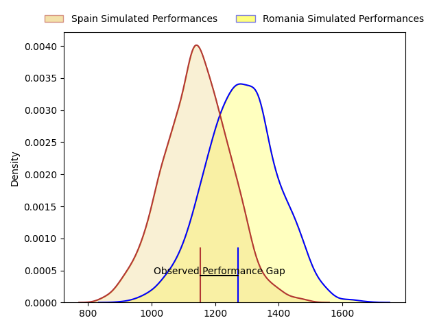
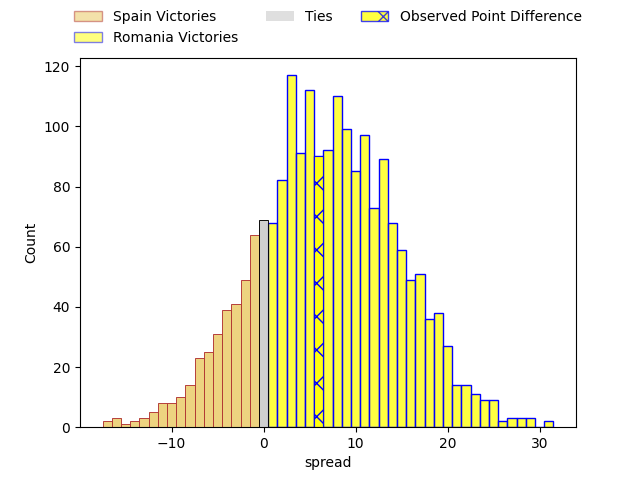
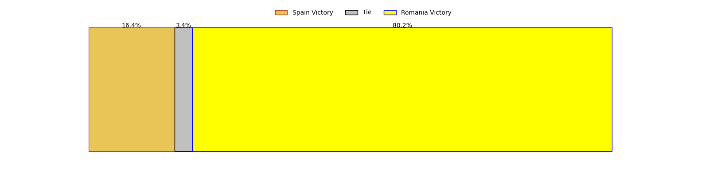

---  
layout: page  
title: Spain at Romania; 25-31  
date: 2023-03-19 17:15:00 18:00:00 -0500  
categories: match review  
---
# Spain at Romania; 25-31

# Club Level Predictions

The first set of predictions treats a club as the smallest object, as the club develops its members, organizes a gameplan, and deploys its players as needed for each match. This club model has a prediction of 0.688, which translates to predicting Romania to win by 7.2.

Each club has a rating and a rating deviation (simiar to a Glicko system), and expected performances can be generated. This allows for simulated matches and spreads like the ones below.
## Projected Performances

## Projected Spreads

## Projected Results

# Player Level Predictions

Treating teams instead as an entity made up of the currently active players, I have ratings for each player in an altogether different system. These can be combined to form team ratings once teamsheets are announced, weighting starters a bit higher than the reserves. After the match is played, players can be weighted by their minutes on the field, allowing for an accurate measure of the team's composition. With these compiled team ratings, we can make predictions, measure inaccuracy, and update the individual player ratings.
## Prediction with Player Minutes: Romania by 4.5

Romania by 0.5 on a neutral field
## Prediction without Player Minutes: Romania by 4.5

Romania by 0.5 on a neutral pitch

|   Away Minutes | Away Player                                                                          |   Away elo |   Away Percentile |   Number |   Home Percentile |   Home elo | Home Player                                                                          |   Home Minutes |
|---------------:|:-------------------------------------------------------------------------------------|-----------:|------------------:|---------:|------------------:|-----------:|:-------------------------------------------------------------------------------------|---------------:|
|             80 | [Thierry Futeu Youtcheu](..//playerfiles//ThierryFuteuYoutcheu_cleaned.md)           |      90.78 |                32 |        1 |                45 |      93.9  | [Alexandru Savin](..//playerfiles//AlexandruSavin_cleaned.md)                        |             80 |
|             80 | [Vicente del Hoyo](..//playerfiles//VicentedelHoyo_cleaned.md)                       |      93.86 |                46 |        2 |                38 |      91.6  | [Ovidiu Cojocaru](..//playerfiles//OvidiuCojocaru_cleaned.md)                        |             80 |
|             80 | [Joaquin Dominguez](..//playerfiles//JoaquinDominguez_cleaned.md)                    |      96.03 |                53 |        3 |                85 |     107.9  | [Gheorge Gajion](..//playerfiles//GheorgeGajion_cleaned.md)                          |             80 |
|             80 | [Alejandro Suarez](..//playerfiles//AlejandroSuarez_cleaned.md)                      |      90.62 |                33 |        4 |                49 |      95.17 | [Mihai Macovei](..//playerfiles//MihaiMacovei_cleaned.md)                            |             80 |
|             80 | [Josh Peters](..//playerfiles//JoshPeters_cleaned.md)                                |     100.99 |                66 |        5 |                26 |      88.01 | [Marius Constantin Antonescu](..//playerfiles//MariusConstantinAntonescu_cleaned.md) |             80 |
|             80 | [Mario Pichardie](..//playerfiles//MarioPichardie_cleaned.md)                        |     100.25 |                63 |        6 |               nan |      95    | [Cristi Boboc](..//playerfiles//CristiBoboc_cleaned.md)                              |             80 |
|             80 | [Brice Ferrer](..//playerfiles//BriceFerrer_cleaned.md)                              |      81.14 |                13 |        7 |                43 |      93.13 | [Christian Marian Chirica](..//playerfiles//ChristianMarianChirica_cleaned.md)       |             80 |
|             80 | [Facundo Nahuel Dominguez](..//playerfiles//FacundoNahuelDominguez_cleaned.md)       |      94.28 |                42 |        8 |                63 |     100.87 | [André Gorin](..//playerfiles//AndréGorin_cleaned.md)                                |             80 |
|             80 | [Tomas Munilla](..//playerfiles//TomasMunilla_cleaned.md)                            |     102.03 |                60 |        9 |                54 |      96.93 | [Gabriel Vasile Rupanu](..//playerfiles//GabrielVasileRupanu_cleaned.md)             |             80 |
|             80 | [Gonzalo Vinuesa](..//playerfiles//GonzaloVinuesa_cleaned.md)                        |      85.96 |                20 |       10 |                11 |      77.88 | [Gabriel Pop](..//playerfiles//GabrielPop_cleaned.md)                                |             80 |
|             80 | [Jordi Jorba](..//playerfiles//JordiJorba_cleaned.md)                                |      90.55 |                34 |       11 |                64 |     101.07 | [Atila Septar](..//playerfiles//AtilaSeptar_cleaned.md)                              |             80 |
|             80 | [Inaki Martin Mateu](..//playerfiles//InakiMartinMateu_cleaned.md)                   |      88.84 |                29 |       12 |               nan |      94.02 | [Fonovai Tangimana](..//playerfiles//FonovaiTangimana_cleaned.md)                    |             80 |
|             80 | [Alejandro Alonso](..//playerfiles//AlejandroAlonso_cleaned.md)                      |      94.64 |                45 |       13 |                31 |      89.55 | [Jason Tomane](..//playerfiles//JasonTomane_cleaned.md)                              |             80 |
|             80 | [Alberto Carmona](..//playerfiles//AlbertoCarmona_cleaned.md)                        |      93.72 |                44 |       14 |                24 |      87.25 | [Marius Simionescu](..//playerfiles//MariusSimionescu_cleaned.md)                    |             80 |
|             80 | [Silvio Federico Castiglioni](..//playerfiles//SilvioFedericoCastiglioni_cleaned.md) |     111.2  |                83 |       15 |                79 |     107.36 | [Paul Popoaia](..//playerfiles//PaulPopoaia_cleaned.md)                              |             80 |

