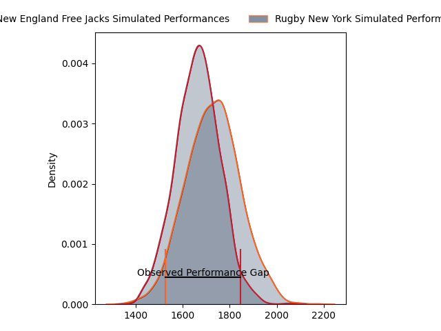
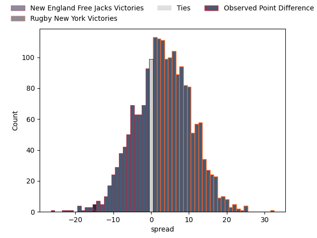

---  
layout: page  
title: New England Free Jacks at Rugby New York; 33-18  
date: 2023-03-19 20:00:00 18:00:00 -0500  
categories: match review  
---
# New England Free Jacks at Rugby New York; 33-18

# Club Level Predictions

The first set of predictions treats a club as the smallest object, as the club develops its members, organizes a gameplan, and deploys its players as needed for each match. This club model has a prediction of 0.593, which translates to predicting Rugby New York to win by 3.4.

Each club has a rating and a rating deviation (simiar to a Glicko system), and expected performances can be generated. This allows for simulated matches and spreads like the ones below.
## Projected Performances

## Projected Spreads

## Projected Results

# Player Level Predictions

Treating teams instead as an entity made up of the currently active players, I have ratings for each player in an altogether different system. These can be combined to form team ratings once teamsheets are announced, weighting starters a bit higher than the reserves. After the match is played, players can be weighted by their minutes on the field, allowing for an accurate measure of the team's composition. With these compiled team ratings, we can make predictions, measure inaccuracy, and update the individual player ratings.
## Prediction with Player Minutes: Rugby New York by 21.0

Rugby New York by 17.0 on a neutral field

There were 17 large changes in win probability in this match
## Prediction without Player Minutes: Rugby New York by 21.5

Rugby New York by 17.5 on a neutral pitch

|   Away Minutes | Away Player                                                         |   Away elo |   Away Percentile |   Number |   Home Percentile |   Home elo | Home Player                                                       |   Home Minutes |
|---------------:|:--------------------------------------------------------------------|-----------:|------------------:|---------:|------------------:|-----------:|:------------------------------------------------------------------|---------------:|
|             48 | [Kyle Ciquera](..//playerfiles//KyleCiquera_cleaned.md)             |      72.95 |                 5 |        1 |                33 |      91.19 | [Chance Wenglewski](..//playerfiles//ChanceWenglewski_cleaned.md) |             63 |
|             48 | [Andrew Quattrin](..//playerfiles//AndrewQuattrin_cleaned.md)       |     105.47 |                81 |        2 |                32 |      90.16 | [Dylan Fawsitt](..//playerfiles//DylanFawsitt_cleaned.md)         |             63 |
|             48 | [Cole Keith](..//playerfiles//ColeKeith_cleaned.md)                 |     112.76 |                90 |        3 |                32 |      90.74 | [Nic Mayhew](..//playerfiles//NicMayhew_cleaned.md)               |             56 |
|             67 | [Semisi Paea](..//playerfiles//SemisiPaea_cleaned.md)               |     108.16 |                76 |        4 |                31 |      89.91 | [Nate Brakeley](..//playerfiles//NateBrakeley_cleaned.md)         |             67 |
|             80 | [Conor Keys](..//playerfiles//ConorKeys_cleaned.md)                 |     108.19 |                73 |        5 |                99 |     152.36 | [Charlie Hewitt](..//playerfiles//CharlieHewitt_cleaned.md)       |             80 |
|             53 | [Cam Davidowicz](..//playerfiles//CamDavidowicz_cleaned.md)         |      22.07 |                 0 |        6 |                37 |      91.41 | [Benjamin Bonasso](..//playerfiles//BenjaminBonasso_cleaned.md)   |             80 |
|             80 | [Joe Johnston](..//playerfiles//JoeJohnston_cleaned.md)             |      21.09 |                 0 |        7 |                61 |     100.5  | [Kara Pryor](..//playerfiles//KaraPryor_cleaned.md)               |             80 |
|             80 | [Wian Conradie](..//playerfiles//WianConradie_cleaned.md)           |     120.34 |                91 |        8 |               nan |     106.18 | [Pago Haini](..//playerfiles//PagoHaini_cleaned.md)               |             60 |
|             62 | [John Poland](..//playerfiles//JohnPoland_cleaned.md)               |      62.34 |                 2 |        9 |                 8 |      76.29 | [Connor Buckley](..//playerfiles//ConnorBuckley_cleaned.md)       |             67 |
|             80 | [Jayson Potroz](..//playerfiles//JaysonPotroz_cleaned.md)           |     118.21 |                89 |       10 |                16 |      83.37 | [Samuel Windsor](..//playerfiles//SamuelWindsor_cleaned.md)       |             80 |
|             80 | [Paul Balekana](..//playerfiles//PaulBalekana_cleaned.md)           |     120.34 |                92 |       11 |                31 |      89.67 | [Teofilo Ed Fidow](..//playerfiles//TeofiloEdFidow_cleaned.md)    |             80 |
|             79 | [Wayne van der Bank](..//playerfiles//WaynevanderBank_cleaned.md)   |      63.06 |                 2 |       12 |                30 |      89.29 | [Teihorangi Walden](..//playerfiles//TeihorangiWalden_cleaned.md) |             60 |
|             80 | [Ben Lesage](..//playerfiles//BenLesage_cleaned.md)                 |     103.4  |                69 |       13 |                41 |      92.7  | [Fa'asiu Fuatai](..//playerfiles//Fa'asiuFuatai_cleaned.md)       |             80 |
|             80 | [Mitchell Wilson](..//playerfiles//MitchellWilson_cleaned.md)       |      24.85 |                 0 |       14 |                30 |      88.52 | [Andrew Coe](..//playerfiles//AndrewCoe_cleaned.md)               |              1 |
|             77 | [Reece MacDonald](..//playerfiles//ReeceMacDonald_cleaned.md)       |     102.92 |                68 |       15 |                78 |     106.63 | [Nick Feakes](..//playerfiles//NickFeakes_cleaned.md)             |             80 |
|             32 | [Foster Dewitt](..//playerfiles//FosterDewitt_cleaned.md)           |      99.63 |                63 |       16 |               nan |      93.39 | [Tevita Langi](..//playerfiles//TevitaLangi_cleaned.md)           |             17 |
|             32 | [Millenium Sanerivi](..//playerfiles//MilleniumSanerivi_cleaned.md) |     108.63 |                86 |       17 |                99 |     155.85 | [Kaleb Geiger](..//playerfiles//KalebGeiger_cleaned.md)           |             17 |
|             32 | [Joel Hintz](..//playerfiles//JoelHintz_cleaned.md)                 |      96.67 |               nan |       18 |                63 |      91.38 | [Sam Davies](..//playerfiles//SamDavies_cleaned.md)               |             24 |
|             13 | [Sam Fischli](..//playerfiles//SamFischli_cleaned.md)               |     108.29 |                79 |       19 |                29 |      89.04 | [Hamish Dalzell](..//playerfiles//HamishDalzell_cleaned.md)       |             13 |
|             27 | [Mitchell Jacobson](..//playerfiles//MitchellJacobson_cleaned.md)   |     107.6  |                78 |       20 |                85 |     108.45 | [Joseph Basser](..//playerfiles//JosephBasser_cleaned.md)         |             20 |
|             18 | [Holden Yungert](..//playerfiles//HoldenYungert_cleaned.md)         |      13.23 |                 0 |       21 |                68 |     100.35 | [Eamonn Matthews](..//playerfiles//EamonnMatthews_cleaned.md)     |             13 |
|              1 | [Spencer Jones](..//playerfiles//SpencerJones_cleaned.md)           |      72.29 |                 6 |       22 |                38 |      91.67 | [Jason Emery](..//playerfiles//JasonEmery_cleaned.md)             |             20 |
|              3 | [Taniela Filimone](..//playerfiles//TanielaFilimone_cleaned.md)     |     114.07 |                87 |       23 |               nan |      90.5  | [Quinn Ngawati](..//playerfiles//QuinnNgawati_cleaned.md)         |             79 |

