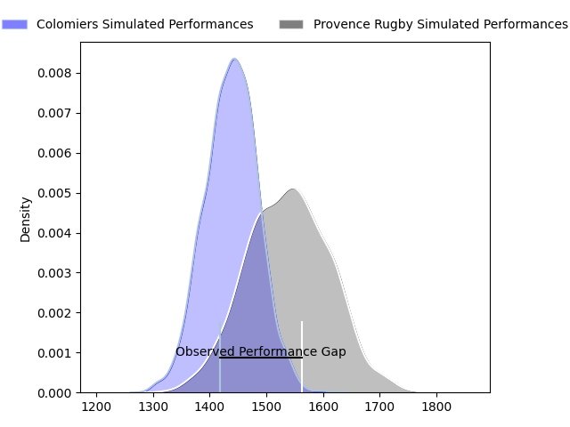
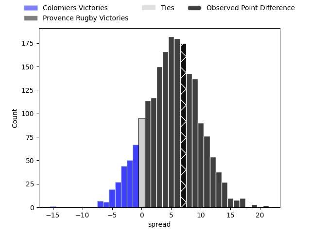
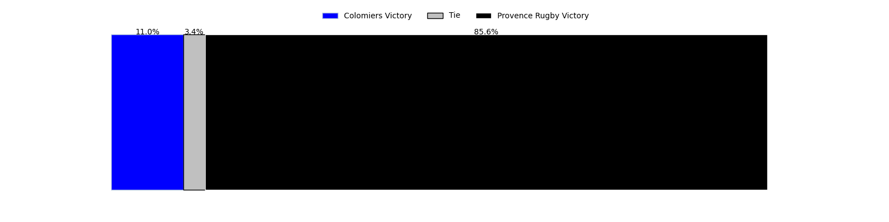

---  
layout: page  
title: Colomiers at Provence Rugby; 18-25  
date: 2023-03-23 21:00:00 18:00:00 -0500  
categories: match review  
---
# Colomiers at Provence Rugby; 18-25

# Club Level Predictions

The first set of predictions treats a club as the smallest object, as the club develops its members, organizes a gameplan, and deploys its players as needed for each match. This club model has a prediction of 0.642, which translates to predicting Provence Rugby to win by 5.1.

Each club has a rating and a rating deviation (simiar to a Glicko system), and expected performances can be generated. This allows for simulated matches and spreads like the ones below.
## Projected Performances

## Projected Spreads

## Projected Results

# Player Level Predictions

Treating teams instead as an entity made up of the currently active players, I have ratings for each player in an altogether different system. These can be combined to form team ratings once teamsheets are announced, weighting starters a bit higher than the reserves. After the match is played, players can be weighted by their minutes on the field, allowing for an accurate measure of the team's composition. With these compiled team ratings, we can make predictions, measure inaccuracy, and update the individual player ratings.
## Prediction with Player Minutes: Colomiers by 0.3

Colomiers by 4.3 on a neutral field

There were 13 large changes in win probability in this match
## Prediction without Player Minutes: Colomiers by 0.0

Colomiers by 4.0 on a neutral pitch

|   Away Minutes | Away Player           |   Away elo |   Away Percentile |   Number |   Home Percentile |   Home elo | Home Player         |   Home Minutes |
|---------------:|:----------------------|-----------:|------------------:|---------:|------------------:|-----------:|:--------------------|---------------:|
|             53 | Guillaume Tartas      |     123.18 |                96 |        1 |                82 |     105.74 | Julius Nostadt      |             15 |
|             51 | Thomas Larrieu        |     125.68 |                97 |        2 |                20 |      86.22 | Loïck Jammes        |             59 |
|             51 | Marco Fepulea'i       |      94.36 |                47 |        3 |                42 |      93.1  | Luke Tagi           |             80 |
|             25 | Alexandre Ricard      |      96.89 |                54 |        4 |                76 |     106.2  | Clément Chartier    |             41 |
|             80 | Jack Whetton          |      87.6  |                22 |        5 |                65 |     100.81 | Alexandre Flanquart |             80 |
|             80 | Pierre-Samuel Pacheco |      95.33 |                37 |        6 |                40 |      94.23 | Carl Axtens         |             80 |
|             80 | Waël Ponpon           |      92.44 |                41 |        7 |                 2 |      66.13 | Nicolas Mousties    |             51 |
|             25 | Jorick Dastugue       |      93.48 |                44 |        8 |                37 |      92.39 | Teimana Harrison    |             39 |
|             63 | Ugo Seguela           |      95.2  |                49 |        9 |               nan |      94.11 | Jeremie Martin      |             51 |
|             59 | Romuald Séguy         |      85.15 |                17 |       10 |                41 |      93.14 | Jonny McPhillips    |             80 |
|             80 | Alexis Palisson       |      98.11 |                57 |       11 |                63 |     100.86 | Adrien Lapègue      |             80 |
|             63 | Paul Pimienta         |     136.91 |                98 |       12 |                68 |     104.8  | Dorian Lavernhe     |             80 |
|             80 | Victor Moro           |      59.53 |                 2 |       13 |                21 |      86.52 | Louis Marrou        |             80 |
|             80 | Valentin Saurs        |     103.6  |                72 |       14 |                90 |     116.94 | Kevin Bly           |             59 |
|             80 | Thomas Girard         |     104.03 |                69 |       15 |                72 |     105.22 | Florent Massip      |             80 |
|             55 | Romain Bezian         |     129.42 |               nan |       16 |               nan |      90.77 | Nicolas Toth        |             36 |
|             55 | Maxime Granouillet    |     113.42 |                88 |       17 |                75 |     106.09 | Guillaume Piazzoli  |             41 |
|             29 | Andrew Ready          |     100.22 |                70 |       18 |                78 |     105.38 | Jérôme Dufour       |             39 |
|             29 | Robin Bellemand       |      78.76 |                10 |       19 |                 6 |      74.81 | David Lolohea       |             29 |
|             27 | Hugo Djehi            |      78.32 |                10 |       20 |                62 |      99.45 | Jessy Jegerlhener   |             29 |
|             21 | Max Auriac            |     112.13 |                83 |       21 |                36 |      91.1  | Simon Tarel         |             29 |
|             17 | Arthur Diaz           |      96.23 |               nan |       22 |                84 |     107.91 | Leonel Oviedo       |             21 |
|             17 | Michele Campagnaro    |      88.22 |                26 |       23 |                86 |     116.65 | Adrian Sanday       |             21 |

