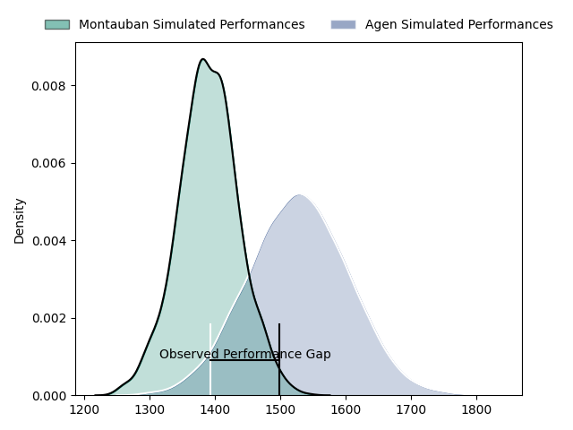
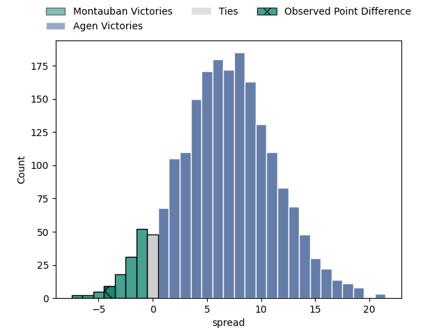

---  
layout: page  
title: Montauban at Agen; 26-22  
date: 2023-03-24 19:30:00 18:00:00 -0500  
categories: match review  
---
# Montauban at Agen; 26-22

# Club Level Predictions

The first set of predictions treats a club as the smallest object, as the club develops its members, organizes a gameplan, and deploys its players as needed for each match. This club model has a prediction of 0.687, which translates to predicting Agen to win by 6.9.

Each club has a rating and a rating deviation (simiar to a Glicko system), and expected performances can be generated. This allows for simulated matches and spreads like the ones below.
## Projected Performances

## Projected Spreads

## Projected Results

# Player Level Predictions

Treating teams instead as an entity made up of the currently active players, I have ratings for each player in an altogether different system. These can be combined to form team ratings once teamsheets are announced, weighting starters a bit higher than the reserves. After the match is played, players can be weighted by their minutes on the field, allowing for an accurate measure of the team's composition. With these compiled team ratings, we can make predictions, measure inaccuracy, and update the individual player ratings.
## Prediction with Player Minutes: Agen by 14.3

Agen by 10.3 on a neutral field

There were 9 large changes in win probability in this match
## Prediction without Player Minutes: Agen by 16.4

Agen by 12.4 on a neutral pitch

|   Away Minutes | Away Player                                                       |   Away elo |   Away Percentile |   Number |   Home Percentile |   Home elo | Home Player                                                         |   Home Minutes |
|---------------:|:------------------------------------------------------------------|-----------:|------------------:|---------:|------------------:|-----------:|:--------------------------------------------------------------------|---------------:|
|             62 | [Lucas Seyrolle](..//playerfiles//LucasSeyrolle_cleaned.md)       |      80.96 |                11 |        1 |                 1 |      61.94 | [Florent Guion](..//playerfiles//FlorentGuion_cleaned.md)           |             52 |
|             52 | [Cyril Deligny](..//playerfiles//CyrilDeligny_cleaned.md)         |      93.41 |                51 |        2 |                57 |      96.87 | [Clément Martinez](..//playerfiles//ClémentMartinez_cleaned.md)     |             52 |
|             52 | [Tietie Tuimauga](..//playerfiles//TietieTuimauga_cleaned.md)     |      87.81 |                33 |        3 |                76 |     103.07 | [Alex Burin](..//playerfiles//AlexBurin_cleaned.md)                 |             53 |
|             52 | [Dimitri Vaotoa](..//playerfiles//DimitriVaotoa_cleaned.md)       |      94.07 |                45 |        4 |                57 |      98.16 | [Joe Maksymiw](..//playerfiles//JoeMaksymiw_cleaned.md)             |             80 |
|             80 | [Kevin Gimeno](..//playerfiles//KevinGimeno_cleaned.md)           |      93.2  |                42 |        5 |                75 |     105.22 | [William Demotte](..//playerfiles//WilliamDemotte_cleaned.md)       |             52 |
|             77 | [Frédéric Quercy](..//playerfiles//FrédéricQuercy_cleaned.md)     |      55.56 |                 1 |        6 |                51 |      97.5  | [Evan Olmstead](..//playerfiles//EvanOlmstead_cleaned.md)           |             80 |
|             44 | [Stéphane Munoz](..//playerfiles//StéphaneMunoz_cleaned.md)       |      90.28 |                34 |        7 |                24 |      87.59 | [Vincent Farré](..//playerfiles//VincentFarré_cleaned.md)           |             80 |
|             80 | [Quentin Witt](..//playerfiles//QuentinWitt_cleaned.md)           |      81.1  |                13 |        8 |                82 |     110.31 | [Martin Devergie](..//playerfiles//MartinDevergie_cleaned.md)       |             23 |
|             76 | [Shaun Venter](..//playerfiles//ShaunVenter_cleaned.md)           |      96.16 |                52 |        9 |                64 |      99.92 | [Sonatane Takulua](..//playerfiles//SonataneTakulua_cleaned.md)     |             52 |
|             80 | [Jérôme Bosviel](..//playerfiles//JérômeBosviel_cleaned.md)       |      94.55 |                45 |       10 |                78 |     107.3  | [Thomas Vincent](..//playerfiles//ThomasVincent_cleaned.md)         |             80 |
|             80 | [Bastien Guillemin](..//playerfiles//BastienGuillemin_cleaned.md) |      86.34 |                22 |       11 |                73 |     104.42 | [Iban Etcheverry](..//playerfiles//IbanEtcheverry_cleaned.md)       |             80 |
|             80 | [Sevenaia Galala](..//playerfiles//SevenaiaGalala_cleaned.md)     |     100.11 |                62 |       12 |                63 |     100.71 | [Kolinio Ramoka](..//playerfiles//KolinioRamoka_cleaned.md)         |             80 |
|             80 | [Josua Vici](..//playerfiles//JosuaVici_cleaned.md)               |      93.78 |               nan |       13 |                60 |      99.69 | [Harry Sloan](..//playerfiles//HarrySloan_cleaned.md)               |             32 |
|             80 | [Semesa Rokoduguni](..//playerfiles//SemesaRokoduguni_cleaned.md) |      82.16 |                14 |       14 |                21 |      86.33 | [Timilai Rokoduru](..//playerfiles//TimilaiRokoduru_cleaned.md)     |             80 |
|             80 | [Segundo Tuculet](..//playerfiles//SegundoTuculet_cleaned.md)     |      97.68 |                53 |       15 |                20 |      84.04 | [Mathieu Lamoulie](..//playerfiles//MathieuLamoulie_cleaned.md)     |             52 |
|             36 | [Otar Giorgadze](..//playerfiles//OtarGiorgadze_cleaned.md)       |     104.34 |                72 |       16 |                51 |      97.6  | [Afa Amosa](..//playerfiles//AfaAmosa_cleaned.md)                   |             57 |
|             28 | [Dan Malafosse](..//playerfiles//DanMalafosse_cleaned.md)         |      84.09 |                22 |       17 |                62 |      99.65 | [Jefferson Joseph](..//playerfiles//JeffersonJoseph_cleaned.md)     |             48 |
|             28 | [Kevin Firmin](..//playerfiles//KevinFirmin_cleaned.md)           |      86.24 |                20 |       18 |                38 |      91.24 | [Zak Farrance](..//playerfiles//ZakFarrance_cleaned.md)             |             28 |
|             28 | [Mirian Burduli](..//playerfiles//MirianBurduli_cleaned.md)       |      95.42 |                52 |       19 |                42 |      93.46 | [Emile Dayral](..//playerfiles//EmileDayral_cleaned.md)             |             28 |
|             18 | [Nicolas Agnesi](..//playerfiles//NicolasAgnesi_cleaned.md)       |     123.63 |                97 |       20 |                74 |     102.24 | [Hans Lombard-Buret](..//playerfiles//HansLombard-Buret_cleaned.md) |             28 |
|              4 | [Alexis Bernadet](..//playerfiles//AlexisBernadet_cleaned.md)     |      99.62 |                63 |       21 |                36 |      92.56 | [Loris Zarantonello](..//playerfiles//LorisZarantonello_cleaned.md) |             28 |
|              3 | [Kyllian Ringuet](..//playerfiles//KyllianRinguet_cleaned.md)     |      86.34 |                21 |       22 |                42 |      93.46 | [Theo Idjellidaine](..//playerfiles//TheoIdjellidaine_cleaned.md)   |             28 |
|            nan | nan                                                               |     nan    |               nan |       23 |                80 |     105.7  | [Théo Sauzaret](..//playerfiles//ThéoSauzaret_cleaned.md)           |             27 |

