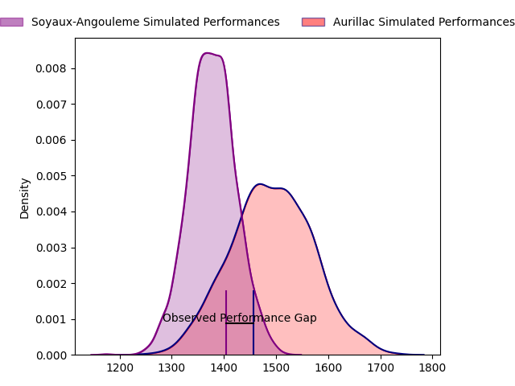
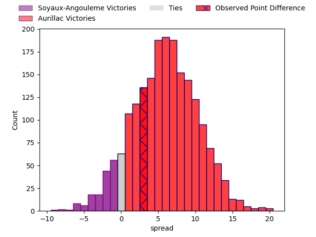
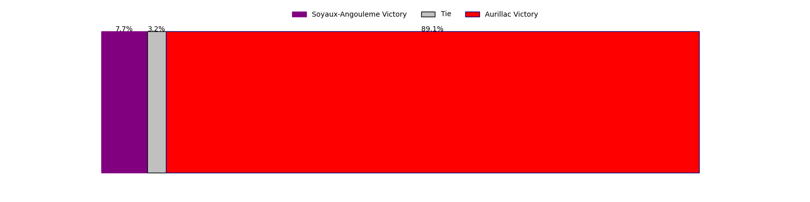

---  
layout: page  
title: Soyaux-Angouleme at Aurillac; 13-16  
date: 2023-03-24 19:30:00 18:00:00 -0500  
categories: match review  
---
# Soyaux-Angouleme at Aurillac; 13-16

# Club Level Predictions

The first set of predictions treats a club as the smallest object, as the club develops its members, organizes a gameplan, and deploys its players as needed for each match. This club model has a prediction of 0.659, which translates to predicting Aurillac to win by 5.8.

Each club has a rating and a rating deviation (simiar to a Glicko system), and expected performances can be generated. This allows for simulated matches and spreads like the ones below.
## Projected Performances

## Projected Spreads

## Projected Results

# Player Level Predictions

Treating teams instead as an entity made up of the currently active players, I have ratings for each player in an altogether different system. These can be combined to form team ratings once teamsheets are announced, weighting starters a bit higher than the reserves. After the match is played, players can be weighted by their minutes on the field, allowing for an accurate measure of the team's composition. With these compiled team ratings, we can make predictions, measure inaccuracy, and update the individual player ratings.
## Prediction with Player Minutes: Soyaux-Angouleme by 0.1

Soyaux-Angouleme by 4.1 on a neutral field

There were 13 large changes in win probability in this match
## Prediction without Player Minutes: Aurillac by 0.0

Soyaux-Angouleme by 4.0 on a neutral pitch

|   Away Minutes | Away Player                      |   Away elo |   Away Percentile |   Number |   Home Percentile |   Home elo | Home Player                           |   Home Minutes |
|---------------:|:---------------------------------|-----------:|------------------:|---------:|------------------:|-----------:|:--------------------------------------|---------------:|
|             32 | Khatchik Vartan                  |      93.16 |                42 |        1 |                46 |      93.89 | Robert Rodgers                        |             52 |
|             42 | Patxi Bidart                     |      89.53 |                30 |        2 |                52 |      95.5  | Adrian Smith                          |             56 |
|             32 | Yassin Boutemani                 |      90.78 |                32 |        3 |                93 |     117.47 | Giorgi Kartvelishvili                 |             68 |
|             80 | Matt Beukeboom                   |      78.97 |                12 |        4 |                30 |      89.71 | Martial Rolland                       |             80 |
|             53 | Ian Kitwanga                     |      91.63 |                30 |        5 |                68 |     102.28 | Cam Dodson                            |             52 |
|             80 | Gautier Gibouin                  |      82.11 |                13 |        6 |                34 |      90.18 | Eoghan Masterson                      |             80 |
|             80 | Germain Burgaud                  |     117.84 |                90 |        7 |                11 |      80.71 | Théo Cambon                           |             52 |
|             41 | Yassine Jarmouni                 |      94.67 |                43 |        8 |                 8 |      78.06 | Latuka Maituku                        |             47 |
|             54 | Adrien Bau                       |      59.09 |                 1 |        9 |                55 |      97.27 | David Delarue                         |             51 |
|             80 | Jacob Botica                     |      97.29 |                46 |       10 |                27 |      88.82 | Antoine Aucagne                       |             80 |
|             80 | Inaki Ayarza Saporta             |      91.43 |                37 |       11 |                50 |      96.05 | Adriaan Jocobus van der Berg Coertzen |             80 |
|             80 | Mathis Lafon                     |      90.57 |                35 |       12 |                13 |      80.78 | Christa Powell                        |             80 |
|             54 | Nasoni Naqiri Kunavore           |     121.08 |                91 |       13 |                39 |      92.16 | Jimmy Yobo                            |             80 |
|             54 | Maxime Laforgue                  |     104.77 |                74 |       14 |                20 |      85.46 | Jordon Janse Van Rensburg             |             80 |
|             80 | Pierre Lafitte                   |      86.37 |                24 |       15 |                 5 |      69.02 | Anderson Neisen                       |             47 |
|             48 | Omar Odishvili                   |      96.68 |                68 |       16 |                59 |     100.01 | Didier Tison                          |             33 |
|             48 | Michael Masimba Tingini Kumbirai |     105.53 |                74 |       17 |                81 |     110.04 | Marc Palmier                          |             33 |
|             39 | Robin Copeland                   |      95.92 |                40 |       18 |                 5 |      68.46 | Hugo Bouyssou                         |             29 |
|             38 | Ole Avei                         |      97.84 |                53 |       19 |                84 |     109.96 | Alexandre Plantier                    |             28 |
|             27 | Sikeli Nabou                     |     105.56 |                76 |       20 |                13 |      77.75 | Maxime Profit                         |             28 |
|             26 | Emmanuel Saubusse                |     102.51 |                70 |       21 |                32 |      90.41 | Jean-Baptiste Singer                  |             28 |
|             26 | Ledua Mau                        |      96.98 |                52 |       22 |                94 |     118.42 | Luka Nioradze                         |             24 |
|             26 | Marvin Lestremau                 |     102.22 |                69 |       23 |                14 |      78.3  | Henzo Kiteau                          |             12 |

