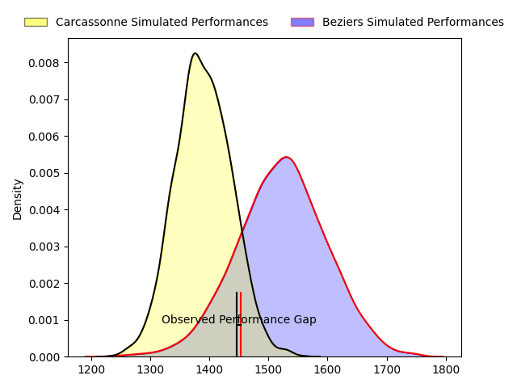
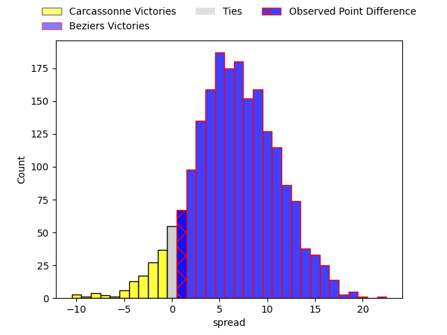
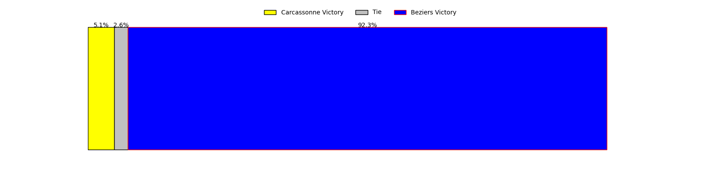

---  
layout: page  
title: Carcassonne at Beziers; 17-18  
date: 2023-03-24 19:30:00 18:00:00 -0500  
categories: match review  
---
# Carcassonne at Beziers; 17-18

# Club Level Predictions

The first set of predictions treats a club as the smallest object, as the club develops its members, organizes a gameplan, and deploys its players as needed for each match. This club model has a prediction of 0.683, which translates to predicting Beziers to win by 6.7.

Each club has a rating and a rating deviation (simiar to a Glicko system), and expected performances can be generated. This allows for simulated matches and spreads like the ones below.
## Projected Performances

## Projected Spreads

## Projected Results

# Player Level Predictions

Treating teams instead as an entity made up of the currently active players, I have ratings for each player in an altogether different system. These can be combined to form team ratings once teamsheets are announced, weighting starters a bit higher than the reserves. After the match is played, players can be weighted by their minutes on the field, allowing for an accurate measure of the team's composition. With these compiled team ratings, we can make predictions, measure inaccuracy, and update the individual player ratings.
## Prediction with Player Minutes: Beziers by 8.1

Beziers by 4.1 on a neutral field

There were 9 large changes in win probability in this match
## Prediction without Player Minutes: Beziers by 6.4

Beziers by 2.4 on a neutral pitch

|   Away Minutes | Away Player                                                                    |   Away elo |   Away Percentile |   Number |   Home Percentile |   Home elo | Home Player                                                               |   Home Minutes |
|---------------:|:-------------------------------------------------------------------------------|-----------:|------------------:|---------:|------------------:|-----------:|:--------------------------------------------------------------------------|---------------:|
|             64 | [Sami Mavinga](..//playerfiles//SamiMavinga_cleaned.md)                        |     102.22 |                60 |        1 |                76 |     103.08 | [Giorgi Akhaladze](..//playerfiles//GiorgiAkhaladze_cleaned.md)           |             56 |
|             50 | [Raphaël Carbou](..//playerfiles//RaphaëlCarbou_cleaned.md)                    |     105.34 |                81 |        2 |               nan |     100.45 | [Yvann Lalevee](..//playerfiles//YvannLalevee_cleaned.md)                 |             56 |
|             50 | [Vakhtangi Akhobadze](..//playerfiles//VakhtangiAkhobadze_cleaned.md)          |      99.34 |                65 |        3 |                73 |     101.98 | [Jon Zabala Arrieta](..//playerfiles//JonZabalaArrieta_cleaned.md)        |             67 |
|             80 | [Romain Manchia](..//playerfiles//RomainManchia_cleaned.md)                    |      66.94 |                 4 |        4 |                82 |     109.81 | [Pierre Gayraud](..//playerfiles//PierreGayraud_cleaned.md)               |             67 |
|             64 | [Rynard Ligtoring Landman](..//playerfiles//RynardLigtoringLandman_cleaned.md) |     100.24 |                63 |        5 |                16 |      82.66 | [John Madigan](..//playerfiles//JohnMadigan_cleaned.md)                   |             80 |
|             67 | [Simon Meka](..//playerfiles//SimonMeka_cleaned.md)                            |      99.29 |               nan |        6 |                 6 |      75.18 | [Jean-Baptiste Barrère](..//playerfiles//Jean-BaptisteBarrère_cleaned.md) |             62 |
|             80 | [Étienne Herjean](..//playerfiles//ÉtienneHerjean_cleaned.md)                  |     103.4  |                70 |        7 |                81 |     108.78 | [Gillian Benoy](..//playerfiles//GillianBenoy_cleaned.md)                 |             80 |
|             50 | [Pierre Reynaud](..//playerfiles//PierreReynaud_cleaned.md)                    |     112.5  |                85 |        8 |                45 |      95.5  | [Thomas Hoarau](..//playerfiles//ThomasHoarau_cleaned.md)                 |             67 |
|             80 | [Samuel Marques](..//playerfiles//SamuelMarques_cleaned.md)                    |      96.83 |                54 |        9 |                56 |      97.37 | [Jean Victor Goillot](..//playerfiles//JeanVictorGoillot_cleaned.md)      |             52 |
|             41 | [Dorian Jones](..//playerfiles//DorianJones_cleaned.md)                        |     101.16 |                64 |       10 |                61 |     100.32 | [Romain Uruty](..//playerfiles//RomainUruty_cleaned.md)                   |             62 |
|             80 | [Clément Clavières](..//playerfiles//ClémentClavières_cleaned.md)              |      96.38 |                51 |       11 |                27 |      88.33 | [Nicolas Plazy](..//playerfiles//NicolasPlazy_cleaned.md)                 |             80 |
|             80 | [Jordan Puletua](..//playerfiles//JordanPuletua_cleaned.md)                    |     106.37 |                75 |       12 |                92 |     120    | [Paul Recor](..//playerfiles//PaulRecor_cleaned.md)                       |             80 |
|             41 | [Joris Dupont](..//playerfiles//JorisDupont_cleaned.md)                        |      98.23 |                56 |       13 |                99 |     140.91 | [Maxime Espeut](..//playerfiles//MaximeEspeut_cleaned.md)                 |             80 |
|             80 | [Léo Darrelatour](..//playerfiles//LéoDarrelatour_cleaned.md)                  |     107.7  |                80 |       14 |                59 |      98.89 | [Watisoni Votu](..//playerfiles//WatisoniVotu_cleaned.md)                 |             80 |
|             80 | [Baptiste Mouchous](..//playerfiles//BaptisteMouchous_cleaned.md)              |      80.8  |                15 |       15 |                34 |      89.68 | [Charly Malié](..//playerfiles//CharlyMalié_cleaned.md)                   |             80 |
|             39 | [Pierre Aguillon](..//playerfiles//PierreAguillon_cleaned.md)                  |      96.94 |                45 |       16 |                19 |      85.76 | [Mitchell Short](..//playerfiles//MitchellShort_cleaned.md)               |             28 |
|             39 | [Damien Añon](..//playerfiles//DamienAñon_cleaned.md)                          |      88.73 |                23 |       17 |                15 |      82.96 | [Marco Pinto Ferrer](..//playerfiles//MarcoPintoFerrer_cleaned.md)        |             24 |
|             30 | [Luka Petriashvili](..//playerfiles//LukaPetriashvili_cleaned.md)              |      96.1  |                46 |       18 |                16 |      84.54 | [Francisco Fernandes](..//playerfiles//FranciscoFernandes_cleaned.md)     |             24 |
|             30 | [Soso Bekoshvili](..//playerfiles//SosoBekoshvili_cleaned.md)                  |      96.02 |                38 |       19 |                51 |      96.31 | [William van Bost](..//playerfiles//WilliamvanBost_cleaned.md)            |             18 |
|             30 | [Aaron Carroll](..//playerfiles//AaronCarroll_cleaned.md)                      |     101.37 |                66 |       20 |                32 |      90.33 | [Victor Dreuille](..//playerfiles//VictorDreuille_cleaned.md)             |             18 |
|             16 | [Jules Martinez](..//playerfiles//JulesMartinez_cleaned.md)                    |      67.2  |                 4 |       21 |               nan |      93.22 | [John-Hubert Meyer](..//playerfiles//John-HubertMeyer_cleaned.md)         |             13 |
|             16 | [George Merrick](..//playerfiles//GeorgeMerrick_cleaned.md)                    |      93.5  |                36 |       22 |                11 |      80.77 | [Éloi Massot](..//playerfiles//ÉloiMassot_cleaned.md)                     |             13 |
|             13 | [Connor Sa](..//playerfiles//ConnorSa_cleaned.md)                              |      84.11 |                18 |       23 |                11 |      78.91 | [Maxence Lemardelet](..//playerfiles//MaxenceLemardelet_cleaned.md)       |             13 |

