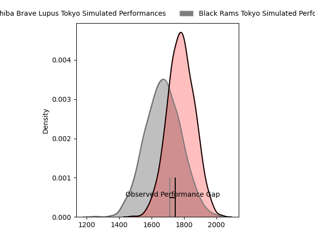
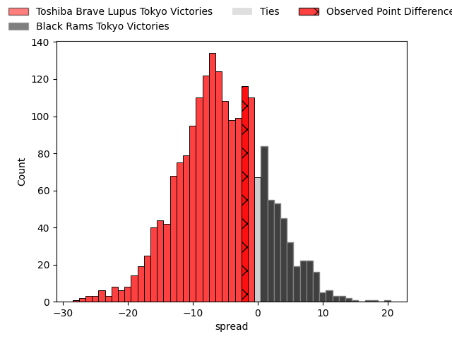

---  
layout: page  
title: Toshiba Brave Lupus Tokyo at Black Rams Tokyo; 12-10  
date: 2023-03-24 11:00:00 18:00:00 -0500  
categories: match review  
---
# Toshiba Brave Lupus Tokyo at Black Rams Tokyo; 12-10

# Club Level Predictions

The first set of predictions treats a club as the smallest object, as the club develops its members, organizes a gameplan, and deploys its players as needed for each match. This club model has a prediction of 0.352, which translates to predicting Toshiba Brave Lupus Tokyo to win by 5.5.

Each club has a rating and a rating deviation (simiar to a Glicko system), and expected performances can be generated. This allows for simulated matches and spreads like the ones below.
## Projected Performances

## Projected Spreads

## Projected Results

# Player Level Predictions

Treating teams instead as an entity made up of the currently active players, I have ratings for each player in an altogether different system. These can be combined to form team ratings once teamsheets are announced, weighting starters a bit higher than the reserves. After the match is played, players can be weighted by their minutes on the field, allowing for an accurate measure of the team's composition. With these compiled team ratings, we can make predictions, measure inaccuracy, and update the individual player ratings.
## Prediction with Player Minutes: Toshiba Brave Lupus Tokyo by 6.6

Toshiba Brave Lupus Tokyo by 10.6 on a neutral field

There were 7 large changes in win probability in this match
## Prediction without Player Minutes: Toshiba Brave Lupus Tokyo by 5.7

Toshiba Brave Lupus Tokyo by 9.7 on a neutral pitch

|   Away Minutes | Away Player        |   Away elo |   Away Percentile |   Number |   Home Percentile |   Home elo | Home Player        |   Home Minutes |
|---------------:|:-------------------|-----------:|------------------:|---------:|------------------:|-----------:|:-------------------|---------------:|
|             62 | Sena Kimura        |     107.09 |                84 |        1 |                40 |      88.19 | Kazuma Nishi       |             55 |
|             51 | Daigo Hashimoto    |      70.47 |                 3 |        2 |                54 |      96.18 | Ko Sato            |             60 |
|             51 | Yuta Kokaji        |     120.91 |                96 |        3 |                52 |      95.81 | Paddy Ryan         |             60 |
|             60 | Warner Dearns      |     101.02 |                66 |        4 |                80 |     111.83 | Michael Stolberg   |             67 |
|             80 | Jacob Pierce       |     111.57 |                85 |        5 |                88 |     113.71 | Pohiva Lotoahea    |             80 |
|             80 | Yoshitaka Tokunaga |     103.03 |                69 |        6 |                 4 |      70.68 | Amato Fakatava     |             80 |
|             75 | Takeshi Sasaki     |     100.92 |                65 |        7 |                87 |     113.4  | Brodi McCurran     |             80 |
|             80 | Michael Leitch     |     101.36 |                65 |        8 |                63 |     100.97 | Nathan Hughes      |             78 |
|             57 | Takahiro Ogawa     |      94.57 |                47 |        9 |                15 |      83.1  | Toshiya Takahashi  |             72 |
|             80 | Tom Taylor         |     103.38 |                71 |       10 |                44 |      94.39 | Kohei Horigome     |             80 |
|             80 | Shohei Toyoshima   |     112.3  |                85 |       11 |                67 |     101.59 | Netani Vakayalia   |             60 |
|             80 | Taichi Mano        |     106.35 |                76 |       12 |                71 |     102.79 | Ryohei Isoda       |             80 |
|             80 | Nicholas McCurran  |      99.58 |                60 |       13 |                 4 |      65.39 | Yuta Kurihara      |             80 |
|             72 | Jone Naikabula     |     125.29 |                94 |       14 |               nan |      97.36 | Amanaki Lotoahea   |             80 |
|             80 | Takuro Matsunaga   |     111.43 |                84 |       15 |                90 |     116.67 | Matt McGahan       |             80 |
|             29 | Mamoru Harada      |     101.43 |                64 |       16 |                73 |     101.74 | Yuichiro Taniguchi |             25 |
|             29 | Teruo Makabe       |     104.81 |               nan |       17 |                60 |      96.36 | Kazuhiro Koike     |             20 |
|             23 | Jack Stratton      |      93.62 |                45 |       18 |                81 |     105.52 | Taichi Chiba       |             20 |
|             20 | Kyosuke Kajikawa   |      92.23 |                44 |       19 |                65 |     108.11 | Isaac Lucas        |             20 |
|             18 | Masataka Mikami    |      95.32 |                52 |       20 |                87 |     110.12 | Josh Goodhue       |             13 |
|              8 | Atsuki Kuwayama    |      90.14 |                33 |       21 |               nan |      91.55 | Takanobu Minami    |              8 |
|              5 | Shin Ito           |     110.69 |                82 |       22 |                58 |      99.46 | Junpei Yukawa      |              2 |

