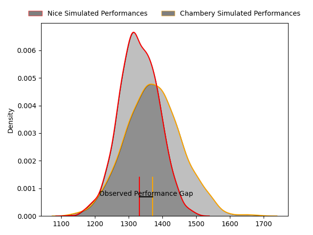
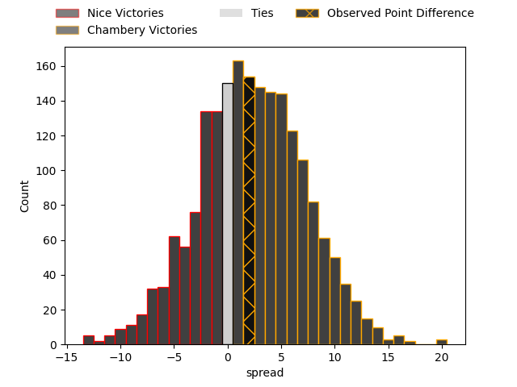

---  
layout: page  
title: Nice at Chambery; 17-19  
date: 2023-03-24 19:00:00 18:00:00 -0500  
categories: match review  
---
# Nice at Chambery; 17-19

# Club Level Predictions

The first set of predictions treats a club as the smallest object, as the club develops its members, organizes a gameplan, and deploys its players as needed for each match. This club model has a prediction of 0.56, which translates to predicting Chambery to win by 2.1.

Each club has a rating and a rating deviation (simiar to a Glicko system), and expected performances can be generated. This allows for simulated matches and spreads like the ones below.
## Projected Performances

## Projected Spreads

## Projected Results

# Player Level Predictions

Treating teams instead as an entity made up of the currently active players, I have ratings for each player in an altogether different system. These can be combined to form team ratings once teamsheets are announced, weighting starters a bit higher than the reserves. After the match is played, players can be weighted by their minutes on the field, allowing for an accurate measure of the team's composition. With these compiled team ratings, we can make predictions, measure inaccuracy, and update the individual player ratings.
## Prediction with Player Minutes: Chambery by 19.3

Chambery by 15.3 on a neutral field

There were 7 large changes in win probability in this match
## Prediction without Player Minutes: Chambery by 18.5

Chambery by 14.5 on a neutral pitch

|   Away Minutes | Away Player                                                             |   Away elo |   Away Percentile |   Number |   Home Percentile |   Home elo | Home Player                                                             |   Home Minutes |
|---------------:|:------------------------------------------------------------------------|-----------:|------------------:|---------:|------------------:|-----------:|:------------------------------------------------------------------------|---------------:|
|             37 | [Sunia Vola](..//playerfiles//SuniaVola_cleaned.md)                     |      97.62 |                59 |        1 |                81 |     105.3  | [Géraud Clermont](..//playerfiles//GéraudClermont_cleaned.md)           |             65 |
|             68 | [Kurt Stanley Haupt](..//playerfiles//KurtStanleyHaupt_cleaned.md)      |      83.19 |                20 |        2 |                55 |      97.22 | [Julien Primault](..//playerfiles//JulienPrimault_cleaned.md)           |             65 |
|             40 | [Nicolas Ciancio](..//playerfiles//NicolasCiancio_cleaned.md)           |      88.47 |                24 |        3 |                84 |     106.87 | [Giorgi Pertaia](..//playerfiles//GiorgiPertaia_cleaned.md)             |             73 |
|             77 | [Thibaud Rey](..//playerfiles//ThibaudRey_cleaned.md)                   |      93.69 |                44 |        4 |                86 |     112.88 | [Jean-Baptiste Grenod](..//playerfiles//Jean-BaptisteGrenod_cleaned.md) |             80 |
|             80 | [Marvin Woki](..//playerfiles//MarvinWoki_cleaned.md)                   |      92.83 |                41 |        5 |                13 |      80.02 | [Romain Guyot](..//playerfiles//RomainGuyot_cleaned.md)                 |             80 |
|             69 | [Louis Suaud](..//playerfiles//LouisSuaud_cleaned.md)                   |      97.39 |                55 |        6 |                72 |     104.15 | [Matheo Triki](..//playerfiles//MatheoTriki_cleaned.md)                 |             58 |
|             58 | [Arthur Vignolles](..//playerfiles//ArthurVignolles_cleaned.md)         |      92.87 |                52 |        7 |                45 |      93.89 | [Colin Lebian](..//playerfiles//ColinLebian_cleaned.md)                 |             73 |
|             80 | [Steffon Armitage](..//playerfiles//SteffonArmitage_cleaned.md)         |     102.09 |                68 |        8 |                89 |     117.05 | [Thomas Coignat](..//playerfiles//ThomasCoignat_cleaned.md)             |             80 |
|             68 | [Agustin Ormaechea](..//playerfiles//AgustinOrmaechea_cleaned.md)       |      94.04 |                60 |        9 |                92 |     116.76 | [Thibault Dufau](..//playerfiles//ThibaultDufau_cleaned.md)             |             71 |
|             80 | [Mathis Viard](..//playerfiles//MathisViard_cleaned.md)                 |     100.85 |                63 |       10 |                38 |      94.29 | [Victor Pisano](..//playerfiles//VictorPisano_cleaned.md)               |             80 |
|             80 | [Hugo Martin](..//playerfiles//HugoMartin_cleaned.md)                   |      75.24 |                 5 |       11 |                50 |      96.09 | [Maewen Sao](..//playerfiles//MaewenSao_cleaned.md)                     |             80 |
|             68 | [Luca Cutayar](..//playerfiles//LucaCutayar_cleaned.md)                 |     104.96 |                73 |       12 |                45 |      94.65 | [Mickael Blanc](..//playerfiles//MickaelBlanc_cleaned.md)               |             80 |
|             80 | [Baptiste Delage](..//playerfiles//BaptisteDelage_cleaned.md)           |      89.07 |                29 |       13 |                85 |     112.76 | [Vereniki Goneva](..//playerfiles//VerenikiGoneva_cleaned.md)           |             80 |
|             80 | [Augustin Slowik](..//playerfiles//AugustinSlowik_cleaned.md)           |      87.61 |                25 |       14 |                88 |     115.07 | [Arthur Nennig](..//playerfiles//ArthurNennig_cleaned.md)               |             58 |
|             80 | [Loic Le Gal](..//playerfiles//LoicLeGal_cleaned.md)                    |      84.12 |                20 |       15 |                39 |      91.67 | [Jules Dorrival](..//playerfiles//JulesDorrival_cleaned.md)             |             59 |
|             43 | [Nika Neparidze](..//playerfiles//NikaNeparidze_cleaned.md)             |      88.01 |                29 |       16 |                92 |     118.49 | [Corentin Astier](..//playerfiles//CorentinAstier_cleaned.md)           |             22 |
|             40 | [Jemal Shatirishvili](..//playerfiles//JemalShatirishvili_cleaned.md)   |      82.08 |                15 |       17 |                47 |      96    | [Thibault Moreno](..//playerfiles//ThibaultMoreno_cleaned.md)           |             22 |
|             22 | [Laijiasa Bolenaivalu](..//playerfiles//LaijiasaBolenaivalu_cleaned.md) |     121.13 |                95 |       18 |                84 |     111.61 | [Thomas Hecquet](..//playerfiles//ThomasHecquet_cleaned.md)             |             21 |
|             12 | [Louis Martin](..//playerfiles//LouisMartin_cleaned.md)                 |     105.16 |                80 |       19 |                25 |      88.4  | [Luka Begic](..//playerfiles//LukaBegic_cleaned.md)                     |             15 |
|             12 | [Mathieu Lorée](..//playerfiles//MathieuLorée_cleaned.md)               |      88.75 |                28 |       20 |                44 |      93.53 | [Fabio Gonzalez](..//playerfiles//FabioGonzalez_cleaned.md)             |             15 |
|             11 | [Martin Freytes](..//playerfiles//MartinFreytes_cleaned.md)             |      75.06 |                 7 |       21 |                27 |      89.3  | [Dylan Nocete](..//playerfiles//DylanNocete_cleaned.md)                 |              9 |
|             12 | [Julien Fritz](..//playerfiles//JulienFritz_cleaned.md)                 |     102.84 |                68 |       22 |                50 |      95.6  | [Steevy Cerqueira](..//playerfiles//SteevyCerqueira_cleaned.md)         |              7 |
|              3 | [Jérôme Mondoulet](..//playerfiles//JérômeMondoulet_cleaned.md)         |      90.47 |                31 |       23 |                69 |     100.5  | [Nail Audoire](..//playerfiles//NailAudoire_cleaned.md)                 |              7 |

