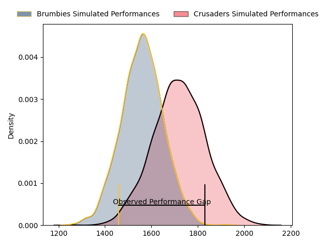
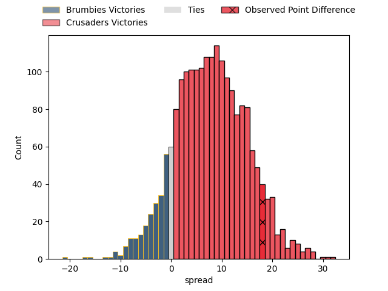
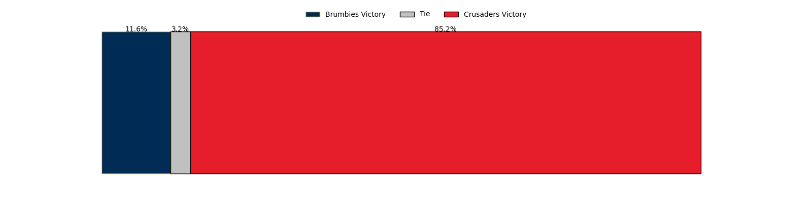

---  
layout: page  
title: Brumbies at Crusaders; 17.0-35.0  
date: 2023-03-24 02:05:00 18:00:00 -0500  
categories: match review  
---
# Brumbies at Crusaders; 17.0-35.0

# Club Level Predictions

The first set of predictions treats a club as the smallest object, as the club develops its members, organizes a gameplan, and deploys its players as needed for each match. This club model has a prediction of 0.707, which translates to predicting Crusaders to win by 8.0.

Each club has a rating and a rating deviation (simiar to a Glicko system), and expected performances can be generated. This allows for simulated matches and spreads like the ones below.
## Projected Performances

## Projected Spreads

## Projected Results

# Player Level Predictions

Treating teams instead as an entity made up of the currently active players, I have ratings for each player in an altogether different system. These can be combined to form team ratings once teamsheets are announced, weighting starters a bit higher than the reserves. After the match is played, players can be weighted by their minutes on the field, allowing for an accurate measure of the team's composition. With these compiled team ratings, we can make predictions, measure inaccuracy, and update the individual player ratings.
## Prediction with Player Minutes: Brumbies by 1.0

Brumbies by 5.0 on a neutral field

There were 9 large changes in win probability in this match
## Prediction without Player Minutes: Brumbies by 0.2

Brumbies by 4.2 on a neutral pitch

|   Away Minutes | Away Player      |   Away elo |   Away Percentile |   Number |   Home Percentile |   Home elo | Home Player            |   Home Minutes |
|---------------:|:-----------------|-----------:|------------------:|---------:|------------------:|-----------:|:-----------------------|---------------:|
|             56 | Blake Schoupp    |      97.05 |                53 |        1 |                23 |      87.83 | Joe Moody              |             57 |
|             32 | Connal McInerney |     124.24 |                96 |        2 |                85 |     107.49 | Codie Taylor           |             60 |
|             46 | Sefo Kautai      |      95    |               nan |        3 |                39 |      92.43 | Tamaiti Williams       |             49 |
|             40 | Jack Wright      |      95.19 |               nan |        4 |                94 |     121.75 | Scott Barrett          |             80 |
|             80 | Cadeyrn Neville  |     128.19 |                96 |        5 |               nan |      95    | Dom Gardiner           |             80 |
|             80 | Rory Scott       |     102.48 |                69 |        6 |                97 |     133.08 | Ethan Blackadder       |             36 |
|             80 | Luke Reimer      |     116.94 |                90 |        7 |                74 |     105.16 | Tom Christie           |             80 |
|             62 | Charlie Cale     |      95.42 |               nan |        8 |                72 |     104.85 | Sione Havili           |             66 |
|             74 | Ryan Lonergan    |     130.54 |                98 |        9 |                35 |      91.02 | Mitchell Drummond      |             50 |
|             56 | Noah Lolesio     |     100.11 |                60 |       10 |                99 |     149.08 | Richie Mo'unga         |             80 |
|             80 | Corey Toole      |     101.89 |                68 |       11 |                50 |      96.13 | Leicester Fainga'anuku |             66 |
|             80 | Tamati Tua       |     119.51 |                92 |       12 |                73 |     104.81 | Dallas McLeod          |             80 |
|             53 | Ollie Sapsford   |     100.39 |                62 |       13 |                87 |     114.25 | Braydon Ennor          |             80 |
|             80 | Ben O'Donnell    |      88.68 |               nan |       14 |                52 |      98.32 | Pepesana Patafilo      |             53 |
|             80 | Andy Muirhead    |     130.85 |                96 |       15 |                26 |      87.27 | Fergus Burke           |             80 |
|             48 | Lachlan Lonergan |      81.98 |                13 |       16 |                84 |     106.95 | Brodie McAlister       |             20 |
|             24 | Fred Kaihea      |      96.54 |               nan |       17 |                11 |      81.29 | George Bower           |             23 |
|             34 | Allan Alaalatoa  |     138.03 |                99 |       18 |               nan |      99.86 | Seb Calder             |             31 |
|             40 | Nick Frost       |      85.71 |                21 |       19 |               nan |      95    | Jamie Hannah           |             14 |
|             18 | Jahrome Brown    |     118.62 |                88 |       20 |                15 |      83.05 | Christian Lio-Willie   |             44 |
|              6 | Pedro Rolando    |      95    |               nan |       21 |                44 |      93.84 | Willi Heinz            |             30 |
|             24 | Jack Debreczeni  |      90.11 |                30 |       22 |               nan |      95    | Willi Gualter          |             27 |
|             27 | Declan Meredith  |      95    |               nan |       23 |                81 |     109.39 | Chay Fihaki            |             14 |

